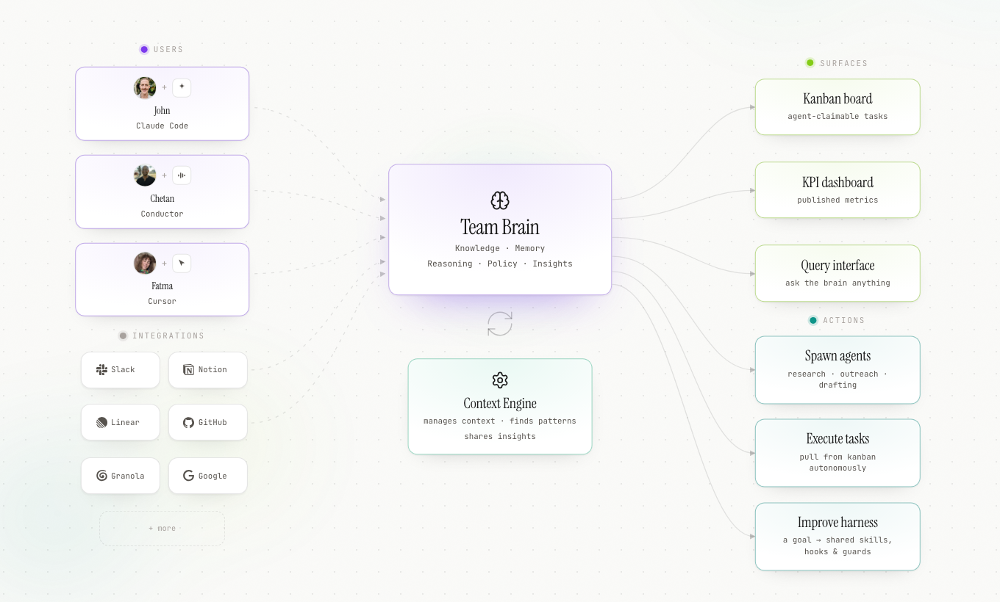

# AIOS Team Brain

**The collective organ of [AIOS](https://aiosbrain.dev) — the operating system for teams of humans and agents.**

Team Brain is **a shared context layer for humans and agents**: one queryable store of what your team
knows, decided, and shipped. It turns the scattered exhaust of a working team — commits, tickets,
docs, Slack threads, meeting transcripts, decisions — into something you can ask questions of like a
colleague, plus a dashboard showing who did what, what it was in service of, and what the team has
learned.

**Content reaches the brain two ways, and you can use either one on its own.** *Ingesters* connect it
directly to the collective knowledge bases your team already lives in — Slack, Notion, Google Drive,
Confluence, GitHub, Linear, Plane, RSS — pulling on a schedule with no
change to how anyone works. Separately, the `aios` CLI *pushes* content up from a person's
[AIOS Workspace](https://github.com/aiosbrain/aios-workspace), the individual organ that lives in
their terminal. **The workspace is optional.** A team can run Team Brain with connectors alone and
never install it; a solo user can push from the CLI with no connectors at all. Most teams end up
doing both.

Whatever the source, it lands in one place — and the ground truth flows back out to every person,
every surface, and every agent.

<picture>
  <source media="(prefers-color-scheme: dark)" srcset="docs/images/team-brain-schematic-dark.png">
  
</picture>

**MIT licensed. Self-hosted. Private by default.** Postgres is the only required backend. Nothing
leaves your instance unless you push it, and it runs fully on-machine at $0 if you want it to.

---

## Is this for you? The short version

Full docs live at **[aiosbrain.dev/guides/team-brain](https://aiosbrain.dev/guides/team-brain)** —
this is the 60-second version so you can decide before reading them.

**What you're standing up:** one Next.js + Postgres service, one instance per team, self-hosted
anywhere. Not a laptop app — connectors poll on a schedule and everyone on the team hits the same
instance.

**What you need** — grouped by what actually breaks without it, because the difference between
"won't boot" and "flagship feature is silently empty" is the difference between a good first run and
concluding the product is broken:

**Required — it will not run without these**

| | |
|---|---|
| **1 · A host** | anything that builds a Next.js app — **Node ≥ 20**. We recommend **Railway**: it detects the app, ships Postgres with pgvector already enabled, and adds Neo4j in one click if you later want the context engine. Nothing in the code depends on it |
| **2 · Postgres 16** | the source of truth — every item, task, decision and attribution |
| **3 · Two secrets** | `AUTH_SECRET` signs sessions, `SECRETS_KEY` encrypts connector tokens at rest. Each is one generated command |

**Needed for the brain to answer anything**

| | |
|---|---|
| **4 · One LLM key — any provider** | The brain is model-agnostic: **Anthropic**, **OpenAI**, **OpenRouter** (one key, hundreds of models from every major lab), or any **OpenAI-compatible endpoint** — including a model on your own hardware for **$0**. Switchable per team from Admin → Integrations with no redeploy, and **answering / reasoning / embeddings are chosen independently**, so a cheap model can do the routine work while a stronger one handles synthesis. Without a key the dashboard works, but the query box can't answer. See [docs/PROVIDERS.md](docs/PROVIDERS.md) |
| **5 · Embeddings + pgvector** | `npm run pg:schema:vector` once, then an embeddings model (Admin → Integrations, or `EMBEDDINGS_*` env). **Skipping this is quiet:** retrieval silently degrades to keyword-only FTS, so a question whose answer never uses the question's words stops being findable |

**Optional — but each one turns something off**

| | |
|---|---|
| **6 · Neo4j + Graphiti** | the **context engine**. Two more services and a **second** LLM key (Graphiti runs its own entity extraction). Powers the **narrative arcs on Pulse**, the learning panel, and graph-grounded answers. Leave it out and timeline, search, tasks and meetings are unaffected — but **Pulse opens without its headline**. §2.8 |
| **7 · Python ≥ 3.11 + `uv`** | **only** for the sidecar connectors — Notion / Google Drive / Confluence / RSS / web / local files. Slack, GitHub, Linear and Plane run inside the app and need none of it |

**What it costs:** every connector API is free. You pay for embeddings and LLM calls — plus a second
LLM key if you run the context engine. Self-host the model and all of it is zero.

**How content gets in — you can use either path alone:**

- **Connectors** — Slack, GitHub, Linear and Plane are configured in the Admin UI and start pulling
  within 30 minutes. Notion, Google Drive, Confluence, RSS, web and local files run through the
  Python sidecar. See [the integrations guide](https://aiosbrain.dev/guides/integrations).
- **The `aios` CLI** — each person pushes tier-tagged content from their own workspace. Optional;
  the connectors feed the brain on their own. See
  [the quickstart](https://aiosbrain.dev/guides/quickstart).

**The order, and roughly what each costs you** (~15 minutes to a first answer, excluding the
optional context engine):

| | | |
|---|---|---|
| 1 | Deploy the app | ~5 min |
| 2 | Set the environment variables | ~3 min |
| 3 | Load the schema (`npm run pg:schema`) | ~1 min |
| 4 | Load the vector schema (`npm run pg:schema:vector`) | ~1 min |
| 5 | Create the first admin | ~1 min |
| 6 | Connect one source | ~4 min |
| + | Add Neo4j + Graphiti | later, or never |

Everything below is that, in dependency order, with the failure modes called out.

> **Joining a team that already runs one?** You don't need any of this — you need an invite. See
> [Onboarding a contributor](https://aiosbrain.dev/guides/quickstart#part-2--connect-to-a-team-brain).

---

## Contents

1. [What you need before you start](#1-what-you-need-before-you-start)
2. [Setup, in dependency order](#2-setup-in-dependency-order)
3. [Environment variable reference](#3-environment-variable-reference)
4. [What happens once it's running](#4-what-happens-once-its-running)
5. [Troubleshooting](#5-troubleshooting)
6. [Architecture and contributing](#6-architecture-and-contributing)

---

## 1. What you need before you start

### 1.1 Runtime and tooling

**To deploy it**, your host needs to build a standard Next.js app — **Node ≥ 20** — and give it a
**Postgres 16** database. Nothing else. Railway and Render detect this automatically.

**On your own machine** you only need tooling if you're going to run the admin CLI, the ingestion
sidecar, or the app itself:

| Tool | Version | Needed for |
|---|---|---|
| **Node** | **≥ 20** (`package.json` engines; CI pins 20) | the admin CLI, and local development |
| **npm** | bundled with Node | no pnpm/yarn lockfile — `package-lock.json` only |
| **psql** | any recent | diagnostics; required by `scripts/e2e.sh` |
| **Docker** | any recent | local Postgres, the test tiers, and the Graphiti stack |
| **Python** | **≥ 3.11** (CI uses 3.12) with [`uv`](https://docs.astral.sh/uv/) | **only** the `ingestion/` sidecar — Notion, Google Drive, Confluence, RSS, web, local files |

There is no `.nvmrc` or `.node-version` in the repo.

### 1.2 Services

| Service | Required? | Notes |
|---|---|---|
| **A host for the app** | **Required** | Railway is what we run and the best-supported path. Render, Fly, a VPS with Docker, or Kubernetes all work — it's a plain Next.js app with no platform-specific APIs. |
| **Postgres 16** | **Required** | Managed (Railway, Neon, RDS…) or your own. Plain SQL schema, no vendor lock-in. |
| **Neo4j 5.26.2** + **Graphiti** | Optional | Powers narrative arcs, the "what the brain is learning" panel, and graph-grounded answers. Everything else works without it. Self-hosted via `graphiti/docker-compose.yml`. **Neo4j Aura is untested** — no code path references `neo4j+s://`, so treat cloud Aura as unverified. |
| **Email (Resend or SMTP)** | Recommended | Magic links and invites. Without it, in non-production the login link is printed to the server console; **in production the mail is dropped** (logged server-side as `[mailer] no provider`, and nowhere else). |

There is no Supabase dependency. It was removed — if you see Supabase env vars anywhere in your
notes or in a stale `.env.local`, they are read by nothing.

### 1.3 API keys, and what each costs

Get **one** text-generation option working. Everything else is optional.

| Key | Needed for | Where to get it | Cost |
|---|---|---|---|
| `ANTHROPIC_API_KEY` | Default answering model | [console.anthropic.com](https://console.anthropic.com) | 💲 **Paid** |
| *or* `LLM_BASE_URL` | Any OpenAI-compatible endpoint (Ollama, llama.cpp, LM Studio, vLLM) instead | your own machine | **Free** |
| *or* an **OpenRouter** key | Set per-team in Admin → Integrations | [openrouter.ai](https://openrouter.ai) | 💲 **Paid** |
| `OPENAI_API_KEY` | Embeddings (if hosted), OpenAI answering, social image generation | [platform.openai.com](https://platform.openai.com) | 💲 **Paid** |
| `RESEND_API_KEY` | Magic-link/invite email | [resend.com](https://resend.com) | 💲 Paid (free tier exists) |
| **Graphiti's own** `OPENAI_API_KEY` | Entity/edge extraction inside the graph service — **separate from the app's key** | as above | 💲 **Paid** |
| `E2B_API_KEY` | Sandboxed action runner | [e2b.dev](https://e2b.dev) | 💲 **Paid** — and `@e2b/code-interpreter` is **not** in `package.json`, so this is opt-in and unshipped |

**Two secrets you generate yourself, not obtain:**

| Secret | Needed for | Generate with |
|---|---|---|
| `AUTH_SECRET` | Signing session cookies. **Hard requirement, ≥ 16 chars** | `node -e "console.log(require('crypto').randomBytes(32).toString('hex'))"` |
| `SECRETS_KEY` | AES-256-GCM encryption of connector tokens at rest. **Must decode to exactly 32 bytes.** Required the moment you save any connector in Admin → Integrations | `node -e "console.log(require('crypto').randomBytes(32).toString('base64'))"` |

> ⚠️ `SECRETS_KEY` **throws only when you first save a connector secret**, not at boot. If saving a
> Slack token 500s, this is why.

### 1.4 Connector credentials

All connector APIs are free. Cost shows up downstream in embeddings and LLM spend.

| Connector | Credential | Where | Configured in |
|---|---|---|---|
| **Slack** | Bot token `xoxb-` | Slack app → OAuth & Permissions | Admin UI (env `SLACK_BOT_TOKEN` as fallback) |
| **GitHub** | PAT — **optional**; public repos work token-free | github.com → Settings → Developer settings | Admin UI → its own **GitHub repos** panel (not the generic "add an integration" dropdown) |
| **Linear** | API key | Linear → Settings → API → Personal API keys | Admin UI **only** |
| **Plane** | API token | Plane → Workspace settings → API tokens | Admin UI **only** |
| **Notion** | Internal integration token | notion.so/my-integrations | **Sidecar** `.env` (`NOTION_TOKEN`) |
| **Confluence** | `CONFLUENCE_USERNAME` (your email) + `CONFLUENCE_PASSWORD` (an API token) for Atlassian Cloud | Atlassian account | **Sidecar** `.env`. The reader takes `CONFLUENCE_API_TOKEN` **alone** OR username+password — never both; with the token set it ignores the username, which on Cloud 401s at request time rather than failing loudly |
| **Google Drive** | Service-account JSON key | Google Cloud Console | **Sidecar** `connections.yaml` (path option) |
| **RSS/Radar**, **Web**, **Local files** | none | — | **Sidecar** `connections.yaml` |

**Maturity, honestly.** Slack, GitHub, Linear and Plane are the proven path — each has a real runner
wired into the scheduler and unit coverage. **Notion, Google Drive and Confluence are wired but
unproven**: the code is real and registered, but none has a test of its `fetch()`, and Confluence
has no `connections.yaml` example either (Notion and Google Drive do — see
`ingestion/connections.yaml.example`). Expect to debug your first run. Google Drive's watch-channel *renewal* advertised in
`ingestion/README.md` is never constructed by `aios-ingest schedule` — Drive is pull-on-a-schedule
only. `gdrive`/`confluence`/`web`/`local`/`radar` cannot be stored as brain integrations at all (the
`integrations.type` CHECK has no such values) — they are `connections.yaml`-only by construction.

Slack scopes the code actually needs: **`channels:history`**, **`channels:read`**, **`users:read`**,
and optionally **`users:read.email`** (enables automatic identity mapping; without it you map members
by hand). A missing `channels:read` is diagnosed by name in the ingest error.

> **Slack ingests public channels only, and fails closed.** A channel it cannot *prove* is public is
> skipped — private content never enters the process. There are exactly two tiers (`team` /
> `external`) and no stricter one, so anything from a private channel would become readable by the
> whole team, which isn't what "private" means to the people in it.

> **A Notion token pasted into the Admin UI is write-only** — and so is its page/database
> selection. The UI encrypts and stores both, but only the Slack/GitHub/Linear/Plane runners read
> stored secrets, and the sidecar's selection merge maps Notion to a no-op, so neither the token nor
> the page IDs reach anything. Configure Notion in the sidecar's own `.env` + `connections.yaml`.

---

## 2. Setup, in dependency order

> **Deploy this to a server, not to your laptop.** It's a *team* brain — everyone on the team needs
> to reach the same instance, connectors poll on a schedule whether or not you're at your desk, and
> the background pollers only run while the process is up. A local install is for **developing the
> brain itself**, not for running your team on. The instructions below are written for a hosted
> deploy; §2.7 covers running it locally if you're contributing code.

We deploy to **Railway** and that's the best-supported path, but nothing here depends on it — it's a
standard Next.js app plus a Postgres database, so Render, Fly, a VPS with Docker, or your own
Kubernetes all work. Only §2.1 is Railway-specific.

Each step explains *why*, so you can tell when something has gone wrong rather than pattern-matching
on green output.

### 2.1 — Create the services

Fork or clone [`aiosbrain/aios-team-brain`](https://github.com/aiosbrain/aios-team-brain) to your own
GitHub account first — deploys happen by pushing to your `main`.

On Railway: **New Project → Deploy from GitHub repo**, pick your fork, then **New → Database →
Postgres** in the same project. That's the whole topology for a base install: one web service, one
Postgres.

> ⚠️ **Name the web service `aios` or `aios-<something>`.** A guard in `scripts/service-guard.mjs`
> aborts the schema load if `RAILWAY_SERVICE_NAME` doesn't match that pattern — it exists because
> this repo once loaded its schema into a different project's database and took it down. On a
> non-Railway host the guard is inert.

Add the graph services (§2.8) later, only if you want narrative arcs.

### 2.2 — Set the environment variables

In your host's variables UI (Railway: service → **Variables**), set at minimum:

```bash
DATABASE_URL=${{Postgres.DATABASE_URL}}   # Railway: reference the Postgres service
PGSSL=require                             # managed Postgres almost always needs this
AUTH_SECRET=<64 hex chars>                # node -e "console.log(require('crypto').randomBytes(32).toString('hex'))"
SECRETS_KEY=<32 bytes base64>             # node -e "console.log(require('crypto').randomBytes(32).toString('base64'))"
APP_URL=https://your-brain.up.railway.app # your real public URL
ANTHROPIC_API_KEY=sk-ant-...              # or configure a provider per-team in Admin later
RESEND_API_KEY=re_...                     # magic links; without a transport, production sends nothing
RESEND_FROM="AIOS <noreply@yourdomain.com>"
```

`APP_URL` matters more than it looks: invite and magic links are built in server actions where there
is no request origin to fall back on, so without it every login link your team receives is broken.

Full reference in §3, including everything optional.

### 2.3 — Deploy, and let the schema load itself

Push to `main`. Your host builds and starts the app. On Railway, the whole of `railway.json` is:

```json
{
  "$schema": "https://railway.com/railway.schema.json",
  "deploy": {
    "preDeployCommand": "npm run pg:schema"
  }
}
```

So **every deploy applies the schema before the new version goes live**, and a schema failure aborts
the release rather than shipping app code ahead of its database. On another host, run
`npm run pg:schema` as a release/pre-deploy command with `DATABASE_URL` in the environment.

**What `pg:schema` actually does** — and it is not what the name suggests. It runs
`postgres/schema.sql` (canonical, every object `create … if not exists`), **then replays every file
in `postgres/migrations/` in filename order, on every run.** There is no `schema_migrations` ledger
and no "applied" tracking; every migration is required to be idempotent. Two consequences:

- **First install and every later upgrade are the same command.** Nothing separate to run when you
  pull a new version.
- **Adding a column takes two edits.** `schema.sql` is `create table if not exists`, so editing the
  table body is a no-op against a database that already has the table. You need an
  `alter table … add column if not exists` file in `postgres/migrations/` *and* the mirrored change
  in `schema.sql` for from-zero installs. See `postgres/migrations/README.md`.

The loader sets a `lock_timeout` (default 15s) before any DDL, so a stuck reader fails the release
fast instead of queueing every query in the database behind it.

**pgvector is deliberately not installed**, so a stock deploy needs no extensions. See §2.5.

### 2.4 — Create your team and your first admin

These run against the production database, so run them through your host's shell. On Railway:

```bash
railway run -s Postgres bash -lc 'DATABASE_URL=$DATABASE_PUBLIC_URL \
  npx tsx --conditions react-server scripts/admin.ts create-team acme --name "Acme Robotics"'

railway run -s Postgres bash -lc 'DATABASE_URL=$DATABASE_PUBLIC_URL \
  npx tsx --conditions react-server scripts/admin.ts create-member you@acme.com \
  --name "Your Name" --handle you --role admin --team acme'
```

Anywhere else, export `DATABASE_URL` and run `npm run admin -- <command>`.

> **`create-member` prints a generated password once and never again.** Copy it — that is how you log
> in. Pass `--password` to choose your own.

Then invite the rest of the team from **Admin → Members** in the UI, or mint links yourself:

```bash
npm run admin -- login-link teammate@acme.com --team acme   # one-time magic link
npm run admin -- issue-key teammate@acme.com --name laptop --team acme
# → aios_<key_id>_<secret>   shown once, sha256 at rest — this is what the `aios` CLI uses
```

`npm run admin -- help` lists the rest.

### 2.5 — Semantic search (optional)

Skip this and retrieval still works — it just uses ranked keyword full-text search plus structured
context. Nothing errors and nothing warns; you get lower recall on paraphrased questions.

Run once against your database, **after** `pg:schema`:

```bash
npm run pg:schema:vector    # loads postgres/optional/pgvector.sql — needs the `vector` extension
```

Railway's Postgres image ships pgvector. Then set an embeddings backend, either per-team in
**Admin → Integrations → Embeddings model** (OpenAI or OpenRouter), or by env:

```bash
EMBEDDINGS_URL=https://api.openai.com/v1
EMBEDDINGS_MODEL=text-embedding-3-small
EMBEDDINGS_API_KEY=sk-...
```

> **The vector column is hardcoded `vector(1536)`.** To use a different-dimension model you must edit
> `postgres/optional/pgvector.sql` *before* first loading it and set `EMBEDDINGS_DIM` to match. A
> model returning the wrong width throws loudly at index time and is surfaced on the retrieval-health
> card — but at *query* time the same error degrades **silently** to zero dense hits.

Backfill existing content with `npm run embed:backfill`.

### 2.6 — Connect your knowledge bases

This is the part that makes it a team brain rather than an empty database. Go to
**Admin → Integrations** and add:

| Connector | What you paste |
|---|---|
| **Slack** | a bot token `xoxb-…` with `channels:history`, `channels:read`, `users:read`, then the channel IDs to follow |
| **GitHub** | optionally a PAT, then `owner/repo` entries — public repos work token-free. GitHub has its **own panel**, not the generic dropdown |
| **Linear** | an API key + the Linear team id |
| **Plane** | an API token + workspace/project |

They start pulling on the next scheduler tick (≤ 30 min) and every 30 min after.

For **Notion, Google Drive, Confluence, RSS, web pages and local files**, run the Python sidecar in
`ingestion/` — it pulls on your infrastructure and pushes over the same API, so those credentials
never touch the brain. It needs `BRAIN_URL`, `AIOS_API_KEY` and `AIOS_TEAM`, and its own
`connections.yaml`. See [`ingestion/README.md`](ingestion/README.md).

And to push from a person's terminal, they install
[AIOS Workspace](https://github.com/aiosbrain/aios-workspace), set `brain_url` and `AIOS_API_KEY`,
and run `aios push`. **Entirely optional** — the connectors above feed the brain on their own.

### 2.7 — Running it locally (contributors only)

If you're changing the brain itself:

```bash
git clone https://github.com/aiosbrain/aios-team-brain.git
cd aios-team-brain
npm install                 # also runs `prepare`, pointing git at .githooks/
cp .env.example .env.local  # then fill in DATABASE_URL, AUTH_SECRET, SECRETS_KEY, APP_URL, a model key
set -a; . ./.env.local; set +a   # required — see the warning below
npm run pg:schema
npm run dev:seed            # optional: demo team, fixtures pushed through the REAL ingest path
npm run dev
```

In development only, `http://localhost:3000/auth/dev-login?email=you@acme.com` signs you straight in;
the route 404s when `NODE_ENV=production`.

> ⚠️ **`.env.local` is only auto-loaded by `next dev`.** This repo has **no `dotenv` dependency**, so
> `npm run pg:schema`, `npm run admin` and `npm run embed:backfill` read the *shell* environment and
> fail with `DATABASE_URL is required` if you only put it in the file. Run this once per terminal:
>
> ```bash
> set -a; . ./.env.local; set +a
> ```

`npm run dev:seed` prints an API key once and also writes it to `.aios-demo-key` (gitignored). It
asserts that ≥ 8 tasks and ≥ 20 decisions materialised, so it doubles as a regression test of the
write path.

### 2.8 — Graph memory: Neo4j + Graphiti (optional)

This is the most involved part of the setup and the easiest to get subtly wrong. Skip it entirely if
you don't need narrative arcs or the learning panel — the app is fully functional without it.

**Topology.** Three processes. The Next.js app talks to Graphiti over REST (writing episodes,
searching facts) *and* to Neo4j directly over bolt, read-only, for the learning panel — the Graphiti
REST API can't answer "recent typed facts by time". Graphiti talks to Neo4j and to an
OpenAI-compatible LLM for extraction.

```
app ──REST──> graphiti ──bolt──> neo4j
 └───────────────bolt (read-only)──┘
```

**Deploy it as two more services** alongside the app — on Railway, **New → Database → Add Neo4j**
(or a Docker service running `neo4j:5.26.2`), plus a service built from this repo's `graphiti/`
directory (Settings → Source → set the root directory to `graphiti/` so it builds the Dockerfile
below). Locally, `cd graphiti && docker compose up -d` brings up both.

**2.8a. Configure the graph service.** Set these on the graphiti service (locally:
`cp graphiti/.env.example graphiti/.env`):

```bash
OPENAI_API_KEY=sk-...          # Graphiti's OWN key, for extraction
MODEL_NAME=gpt-4o
NEO4J_USER=neo4j
NEO4J_PASSWORD=<choose one>
```

> ⚠️ **Never set an optional variable to an empty string.** The image treats `OPENAI_BASE_URL=""` as
> *set*, which breaks every LLM call and hangs the ingest queue with no error. Leave optional vars
> commented out. This is exactly why the compose file uses `env_file:` rather than `${VAR:-}`
> interpolation.

**2.8b. Use the patched image — never the upstream one.**

`graphiti/Dockerfile` builds from a **digest-pinned** `zepai/graphiti` and patches one constant:

```dockerfile
RUN CONFIG=/app/.venv/.../graphiti_core/llm_client/config.py \
 && grep -q 'DEFAULT_MAX_TOKENS = 8192' "$CONFIG" \
 && sed -i 's/DEFAULT_MAX_TOKENS = 8192/DEFAULT_MAX_TOKENS = 16384/' "$CONFIG"
```

**Why this matters.** Graphiti extracts entities and edges with its own LLM, and that call's *output*
is hard-capped at `DEFAULT_MAX_TOKENS`, which is 8192 in every published image. A dense episode whose
extraction overflows raises inside the worker — and getzep's worker loop catches only
`CancelledError`, so **any other exception kills the worker for the whole process.** The HTTP API
keeps returning `202`. Episodes are accepted, nothing is extracted, and narrative arcs quietly go
blank. That failure hit production three times. There is no env var to raise the cap; 16384 exists
only on unreleased upstream `main`.

The `grep -q` before the `sed` is a build gate: if a future base image renames the constant the build
**fails loudly** rather than silently shipping an unpatched image.

The digest pin is also deliberate — it guarantees the Neo4j schema our Cypher depends on and the REST
API our projector uses are byte-identical to what's been running; only the token ceiling moves.

> ⚠️ **If your graphiti service has a Custom Start Command set, leave it alone.** Older docs in this
> repo prescribe one that wraps the ingest worker so it survives a failed extraction instead of dying
> silently. It is complementary to the Dockerfile patch, not a replacement — the `sed` above modifies
> a file *inside the image*, so it applies no matter how the process is launched. To check whether
> yours has one, see §5.
>
> A start command is also the documented fix for a separate trap: the image declares a non-root
> `USER app` but its default CMD launches via `uv` at `/root/.local/bin/uv`, which `app` cannot
> execute once the platform runs the container as the declared user. That broke a production restart.

**2.8c. Point the app at it.** These go in the *brain's* environment, not the graphiti service's:

```bash
GRAPHITI_URL=http://graphiti.railway.internal:8000   # or http://localhost:8000 locally
NEO4J_URL=bolt://neo4j.railway.internal:7687        # or bolt://localhost:7687 locally
NEO4J_USER=neo4j
NEO4J_PASSWORD=<same as above>
```

`GRAPHITI_URL` is the master switch: unset, the projector never starts and every graph read is inert.

**2.8d. Understand the extraction limits.** Items are **chunked**, not truncated:

| Constant | Default | Env override |
|---|---|---|
| `CHUNK_CHARS` | **2500** chars per episode | `GRAPH_CHUNK_CHARS` |
| `MAX_EPISODE_CHUNKS` | **16** episodes per item | `GRAPH_MAX_EPISODE_CHUNKS` |

So 40,000 characters per item maximum; beyond that content is dropped as a runaway backstop (the full
text still lives in `items`, FTS, and pgvector — only the graph projection is bounded). Chunking keeps
each extraction well under the patched 16384-token ceiling.

> If you have seen `MAX_EPISODE_CHARS` (4000, or 6000, or 2000) referenced anywhere — in older notes
> or docs — **it no longer exists.** It was deleted and replaced by chunking. Don't set it.

**2.8e. Know the `group_id` rule.** Tier isolation in the graph is the `group_id` and nothing else —
there is no RLS backstop. The format is `<teamSlug>_<tier>`, and the separator is an underscore
because Graphiti's validator permits only `[A-Za-z0-9_-]`. A `:` raises an error that propagates out
of the ingest worker and **silently kills it for the whole process**. The code validates before
posting and throws rather than sending a bad id.

> `postgres/schema.sql` still documents this column as `'<teamSlug>:<tier>'`. That comment is wrong —
> the colon form is precisely the one Graphiti rejects.

### 2.9 — Verify it worked

```bash
bash scripts/e2e.sh
```

Reset → seed → start the dev server → scaffold a real spoke repo and `aios push` from it → assert a
re-push says "nothing to push" → check tasks materialised → assert an `admin`-tier push is rejected
**422** → pull → optionally run the Python sidecar backfill → optionally run a live NL query that
must ground in a specific seeded decision. Prints `E2E PASSED`.

It needs Docker, a populated `.env.local`, nothing on port 3000, `psql`, and a checkout of
`aios-workspace` at `$OPS_DIR` (default `~/Projects/aios-workspace`). It forces
`DATABASE_URL` to the throwaway test container twice, deliberately, so it can never touch a real
database.

Lighter checks:

```bash
npm test            # unit tier — pure logic, parse boundaries, all drift/contract guards
npm run typecheck
npm run lint
npm run check:docs  # architecture-map drift guard (also runs pre-push)
```

### 2.10 — Shipping changes after the first deploy

Push to `main`. That's it — your host rebuilds, and the pre-deploy hook applies any new migrations
before the new version serves traffic. There is no separate migration step to remember.

If a deploy appears to do nothing, confirm the platform actually started a build (webhooks do get
dropped), and check the pre-deploy logs — a schema failure aborts the release by design rather than
shipping app code ahead of its database.

---

## 3. Environment variable reference

### Required

| Var | Notes |
|---|---|
| `DATABASE_URL` | Postgres connection string. Throws at first query without it. |
| `AUTH_SECRET` | Signs session cookies. **≥ 16 chars enforced.** Without it nobody can log in. |

### Required in practice

| Var | Notes |
|---|---|
| `APP_URL` | Absolute base URL. No throw, but invite/magic links are built in server actions where there is no request origin — without it they come out broken. |
| `SECRETS_KEY` | 32 bytes, base64 or hex. **Throws** the first time you save a connector secret — not at boot. |
| One LLM path | `ANTHROPIC_API_KEY`, or `LLM_BASE_URL` (+ `LLM_MODEL`), or an OpenRouter key set per-team in Admin. |
| One email path | `RESEND_API_KEY` + `RESEND_FROM`, or `SMTP_URL` + `SMTP_FROM`. Dev logs the link to console instead; in production the mail is **dropped**, noted only in the server log. |

### Optional subsystems

| Var | Default | Purpose |
|---|---|---|
| `GRAPHITI_URL` | unset → graph off | Master switch for graph memory |
| `NEO4J_URL` / `NEO4J_USER` / `NEO4J_PASSWORD` | unset / `neo4j` / `""` | Direct bolt reads for the learning panel |
| `GRAPH_PROJECT_ENABLED` | on | `false` disables the projector even with a URL |
| `GRAPH_PROJECT_MINUTES` | `60` | Projector interval |
| `GRAPH_CHUNK_CHARS` / `GRAPH_MAX_EPISODE_CHUNKS` | `2500` / `16` | Episode chunking |
| `EMBEDDINGS_URL` / `EMBEDDINGS_MODEL` / `EMBEDDINGS_DIM` / `EMBEDDINGS_API_KEY` | unset → dense off | Semantic search |
| `RERANK_URL` / `RERANK_MODEL` / `RERANK_TOKEN` | unset → off / `qwen3-reranker-0.6b` | Cross-encoder reranking. **Env only — no per-team setting.** |
| `LLM_BASE_URL` / `LLM_MODEL` | unset → Anthropic | Local OpenAI-compatible endpoint |
| `INGEST_POLL_ENABLED` / `INGEST_POLL_MINUTES` | on / `30` | Connector poller |
| `SLACK_BOT_TOKEN` | unset | Env fallback if no Admin-stored Slack token |
| `SLACK_CLIENT_ID` / `SLACK_CLIENT_SECRET` / `SLACK_OAUTH_REDIRECT` | unset | Per-member Slack OAuth ("act as me"), **not** ingestion |
| `GITHUB_TOKEN` | unset | Member provisioning, profile sync, codebase scans — **not** the ingest runner |
| `PGSSL` / `PGSSLMODE` | unset | Set to `require` for managed Postgres |
| `SENTRY_DSN`, `NEXT_PUBLIC_SENTRY_DSN`, … | unset | Fully inert when unset |
| `DOC_TASK_INFER_INTERVAL_HOURS` | `12` | Cooldown on the paid doc→task inference pass |

Also read but rarely needed: `PG_POOL_MAX`, `PG_STATEMENT_TIMEOUT_MS`, `PG_IDLE_TX_TIMEOUT_MS`,
`PG_CONNECT_TIMEOUT_MS`, `PG_MIGRATION_LOCK_TIMEOUT_MS`, `FTS_CANDIDATE_LIMIT`,
`SOURCE_RECENCY_LIMIT`, `DENSE_MAX_DISTANCE`, `TIMELINE_ITEM_LIMIT`, `BRAIN_DEFAULT_TIMEZONE`,
`CONTEXT_PROVIDER`, `RETRIEVAL_AUGMENT_*`, `ARC_*`, `SOCIAL_*`, `AIOS_GATEWAY_INTERNAL_ENABLED`,
`GATEWAY_REQUEST_ENVELOPE_KEY`, `AIOS_RAILWAY_SERVICES`.

### Not setup variables

`DATABASE_TEST_URL`, `PGVECTOR_TEST`, `NEO4J_TEST`, `HTTP_TEST_PORT` are for the test tiers only.
`NODE_ENV`, `NEXT_RUNTIME`, `CI`, `RAILWAY_SERVICE_NAME` are set by the platform.

### `.env.example`

Covers the required set plus every optional subsystem, with the gotchas inline. It does **not**
enumerate the low-level tuning knobs (retrieval limits, arc timeouts, social jobs, the gateway) —
those are in the table above and you are unlikely to need them.

### Sidecars have their own env files

`ingestion/.env` (needs `BRAIN_URL`, `AIOS_API_KEY`, `AIOS_TEAM` — all three hard-required) and
`graphiti/.env`. Neither is read by the Next.js process.

---

## 4. What happens once it's running

**There is no cron and no worker service.** All background work runs on `setInterval` timers started
once at server boot from `instrumentation.ts`. That means the cadence below assumes **one instance** —
the single-flight guards are in-process only, so a multi-replica or scale-to-zero deploy changes the
effective behaviour.

| Poller | Starts | Interval | Gate |
|---|---|---|---|
| Ingest | +20s after boot | **30 min** | on unless `INGEST_POLL_ENABLED=false` |
| Graph projector | +30s | **60 min** | inert unless `GRAPHITI_URL` set |
| Social jobs | +15s | 30 s | opt-in, `SOCIAL_JOBS_ENABLED=true` |

**Each ingest tick, strictly in this order:** Slack → Plane → Linear → Linear inbound (sequenced
*after* Linear so it sees fresh mirror tasks) → GitHub → auth cleanup (24 h cooldown) → meeting-notes
backfill → deterministic task↔evidence linking → **LLM doc→task inference** (12 h cooldown) → dense
embedding index (100 items per run).

**Everything else is triggered by a page view, not a timer** — deliberately, so LLM calls only happen
for teams someone is actually looking at:

- **Work timeline** — 5 min TTL, serve-stale-while-revalidate. A cold miss builds the ledger inline
  and fast, with **no per-person-day summaries**; those arrive on a later view once the background
  pass writes them.
- **Narrative arcs** — **4 h** TTL. Not time-boxed: they synthesize from a pool of the most recent
  facts by work time (4,000 fetched, 200 fed to the model), so a quiet week doesn't empty them. A
  fact-hash check skips the model entirely when nothing relevant changed. Arcs need graph facts, so
  on a fresh install the panel is legitimately empty until the projector has run.
- **PM projection** — reactive, not scheduled: a task write schedules a projection *after* the
  response. Inbound Linear→brain is opt-in per team (`inboundApply`) and runs on the 30-min tick.

### After your first `aios push`

| When | What lands |
|---|---|
| **Immediately** | The item is stored and keyword-searchable; the response is `201`. Tasks project to Linear/Plane right after the response is sent. |
| **Next page view** | Work timeline — without per-person-day summaries on the very first build. |
| **≤ 30 min** | Connector pulls, meeting notes, deterministic task links, first embeddings batch. |
| **≤ 60 min** | Graph projection — after which arcs become possible. |
| **≤ 4 h** | First narrative arcs. |

### Where to look to confirm it's working

**Admin → Integrations** is the health surface:

- **Pipeline health banner** — the loud verdict.
- **Recent ingestion runs** — the last 30 rows of `ingest_runs`, one per scheduler tick, manual sync,
  and codebase scan, with created/updated/unchanged counts and errors. `slack`/`plane`/`linear`/`github`
  rows record on *every* tick once configured, so their age is a genuine heartbeat; `dense`,
  `graph_project`, `pm_sync` and others record only when they did something, and are never flagged on age.
- **Retrieval health card** — dense (`off`/`healthy`/`building`/`degraded`) and graph
  (`off`/`on`/`degraded`), including explicit quota wording when embeddings start failing.
- **Provider keys** — which are stored and enabled, and the *resolved effective* answering, reasoning
  and embedding backends. Nothing is ever decrypted to display.

**Admin → Usage** shows spend. Note the interactive query caps, which are hardcoded: **20 queries per
member per day** and **$10 per team per day**, plus 10 queries/minute. Background generation (arcs,
summaries, meeting extraction) is metered but **not capped**.

---

## 5. Troubleshooting

### `DATABASE_URL is required` from `pg:schema` / `admin`, but it's in `.env.local`

Expected. Those are plain Node scripts and this repo has no `dotenv` dependency; only `next dev`
auto-loads `.env.local`. Run `set -a; . ./.env.local; set +a` first.

### Saving a Slack/GitHub token 500s

`SECRETS_KEY` is missing or isn't 32 bytes. It ships **empty** in `.env.example`, so a copied file
looks complete while the value is blank. Generate one with
`node -e "console.log(require('crypto').randomBytes(32).toString('base64'))"`.

### Graph accepts everything but no facts appear — arcs blank

**The signature failure of this stack, and it is silent.** Graphiti returns `202` on every episode,
`graph_project` stays green in `ingest_runs`, the health check is fine — and the graph is empty.

**Read the graphiti service logs first — they name the cause directly:**

```bash
railway logs -s graphiti          # or your host's log viewer
```

Causes, in the order they actually occur:

1. **The extraction LLM key is out of quota.** Look for `insufficient_quota` / `RateLimitError:
   Error code: 429`. Graphiti's `OPENAI_API_KEY` is **separate from the app's** and is easy to forget
   when you top one up. Every episode fails extraction while the HTTP API keeps returning `202`.
2. **Unpatched image.** If `DEFAULT_MAX_TOKENS` is still 8192, look for `Output length exceeded max
   tokens`. Rebuild from `graphiti/Dockerfile`; don't deploy `zepai/graphiti` directly.
3. **`OPENAI_BASE_URL=""`.** An empty string reads as *set* and breaks every LLM call, hanging the
   queue with no error at all. Comment it out instead of blanking it.
4. **Invalid `group_id`.** Anything outside `[A-Za-z0-9_-]` raises inside the worker.
5. **Bad timestamp or missing `role`** in a posted episode → `422` on every push, wedging the projector.

The app has a dedicated probe: it compares episode count in Postgres against `RELATES_TO` count in
Neo4j and flags "stalled" at ≥ 25 episodes with 0 facts, surfaced on Admin → Integrations.

**Is your worker surviving these failures?** Count the log lines:

```bash
railway logs -s graphiti | grep -c "Got a job"    # jobs picked up
railway logs -s graphiti | grep -c "Traceback"    # jobs that failed
```

Upstream's worker catches only `CancelledError`, so an **unpatched** worker dies on the first
non-cancelled exception — you'd see one traceback and then silence. If `Got a job` keeps appearing
*after* tracebacks and the queue drains to 0, a Custom Start Command wrapping the worker loop is in
effect and doing its job. That is also how to answer "is a Custom Start Command set on this service?"
without a settings screen — though the definitive check is your host's service settings (Railway:
service → **Settings → Deploy → Custom Start Command**).

**Recovery:** the graph is fully regenerable from Postgres — clear `graph_episodes` and let the
projector re-run.

### Graphiti won't come up after a restart or redeploy

Two known traps. The image declares a non-root `USER app` but its default CMD launches via `uv` at
`/root/.local/bin/uv`, which `app` can't execute once the platform runs the container as the declared
user — this broke a production restart. And a redeploy that rebuilds from the wrong source
reintroduces the unpatched 8192 cap. If it doesn't come healthy, roll back to the last-good deployment
in the dashboard rather than iterating on a live service.

### Semantic search returns nothing / "degraded"

- pgvector schema not loaded → `npm run pg:schema:vector`.
- No embeddings backend resolved → set `EMBEDDINGS_URL` or pick a provider in Admin.
- **Dimension mismatch.** The column is `vector(1536)`. A model of another width throws at index time
  (counted and surfaced) but degrades **silently to zero hits** at query time. `EMBEDDINGS_DIM` is
  *not* validated against the actual column width.
- Provider quota exhausted → the retrieval-health card says so explicitly.

### Slack connects but ingests nothing

Almost always the public-channel gate. A channel it can't *prove* is public is skipped. Confirm the
bot has `channels:read` (a total scope failure is diagnosed by name in the run error) and that the
channel is public in the workspace. Only a *confirmed*-private channel triggers a purge of already-
ingested content; an unverifiable one is skipped without deleting anything.

### Login link never arrives

No email transport configured. In development the link is printed to the server console. In
production, set `RESEND_API_KEY` + `RESEND_FROM` (a verified domain — Resend's `onboarding@resend.dev`
only delivers to the account owner) or `SMTP_URL` + `SMTP_FROM`. Also confirm `APP_URL` is set, or
links are built against nothing.

### My local model is ignored

`LLM_BASE_URL` is only **third** in the auto-precedence: OpenRouter (stored key) → `LLM_BASE_URL` →
Anthropic. If any team has an OpenRouter key saved in Admin, it wins. To force local, set the team's
answering provider to **Local** in Admin → Integrations.

### Deploy succeeded but nothing changed

Confirm Railway actually started a build — webhooks are occasionally dropped. Also remember
`preDeployCommand` runs `npm run pg:schema`; if that fails the release aborts by design.

---

## 6. Architecture and contributing

- **[`docs/ARCHITECTURE.md`](docs/ARCHITECTURE.md)** — the single fast reference for where data lives,
  who writes it, who reads it. Its enumerable surfaces (routes, tables, ingestion sources) are
  machine-guarded against drift.
- **[`DEVELOPMENT.md`](DEVELOPMENT.md)** — local setup and the four test tiers.
- **[`CONTRIBUTING.md`](CONTRIBUTING.md)** — the PR checklist.
- **[`docs/PROVIDERS.md`](docs/PROVIDERS.md)** — every LLM/embeddings/reranker switch.
- **[`docs/OPS.md`](docs/OPS.md)** — deploys, diagnostics, incident history.
- **[`SECURITY.md`](SECURITY.md)** — private vulnerability reporting.

**The API contract is pinned in the other repo:** `aios-workspace/docs/brain-api.md`. This server
implements **v1.14**, asserted by a build guard.

### Security posture

Tier isolation is enforced **entirely in app code — there is no RLS.** Every read path goes through
the `lib/auth/visibility` choke-point, with filters re-applied in `/api/v1/items*` and the retrieval
layer. `admin`-tier content is rejected at the API with **422** and never reaches the database. All
sync writes funnel through one audited module (`lib/ingest`). API keys are `aios_<key_id>_<secret>`,
sha256 at rest, shown once. The audit log is append-only and trigger-backed; rate limits live in
Postgres.

Known accepted risk: machine sync writes have no database-level tier backstop — mitigated by the
narrow single-writer module and the contract-level 422.

---

MIT licensed. See [`LICENSE`](LICENSE).
