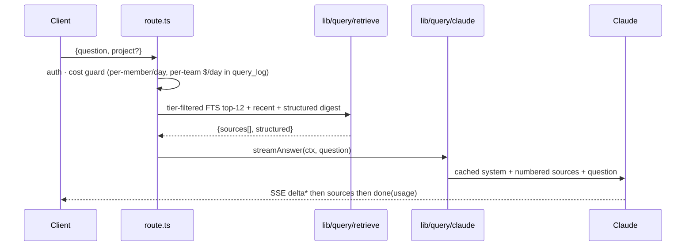
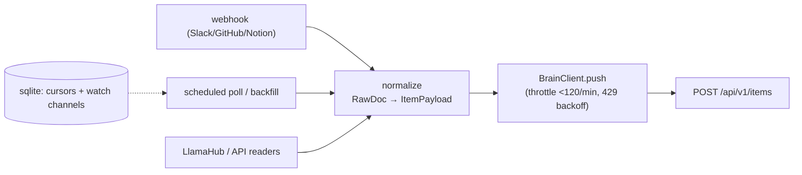
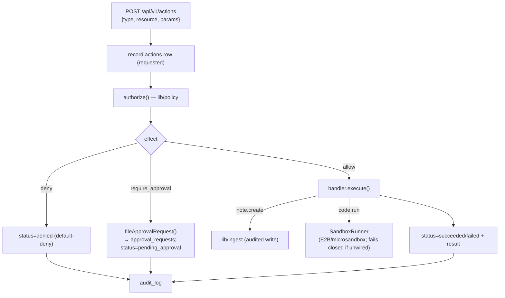
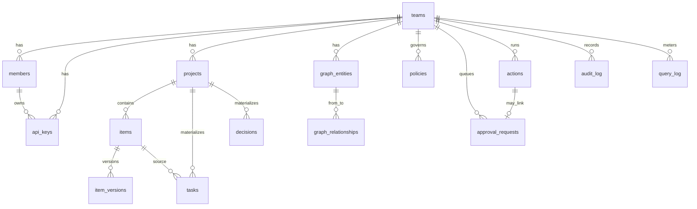

# AIOS Team Brain — Architecture

Mission control for agentic teamwork: a shared, queryable memory + coordination layer.
Contributor repos (and the ingestion sidecar) sync tier-tagged content into the brain;
the dashboard surfaces it and answers grounded natural-language questions. Self-host
portable: plain SQL migrations, Postgres-backed rate limiting, no Vercel-only deps.

> This doc describes **structure**. The enumerable surfaces (API routes, DB tables,
> ingestion sources) are guarded against drift by `scripts/check-docs-drift.mjs` — see
> [Docs drift guard](#docs-drift-guard).

## System context


## The 8 organ systems (deck → status)

| # | Organ | Where | Status |
|---|-------|-------|--------|
| 1 | Knowledge repository | `items` + FTS + `lib/query` | ✅ MVP |
| 2 | Ingestion layer | `lib/ingest` + `ingestion/` sidecar | ✅ MVP (8 sources) |
| 3 | Context management | `lib/query/retrieve.ts` | 🟡 partial |
| 4 | Action layer | `lib/actions` + `actions` table + `POST /api/v1/actions` | 🟡 MVP (policy-gated; sandbox seam, no runner wired) |
| 5 | Identity & membership | `teams`/`members`/`api_keys`, tiers | ✅ |
| 6 | Policy engine | `lib/policy` + `policies`/`approval_requests` | 🟡 engine + schema (no UI/enforcement yet) |
| 7 | Audit log | `audit_log` (append-only, trigger-backed) | ✅ |
| 8 | Feedback loop | — | ❌ not built |

## Auth & access tiers

Two principals, one tier model:

- **Humans** — magic-link / OAuth, invite-only. Dashboard reads go through **RLS**
  (`private.my_*` SECURITY DEFINER helpers anchor every policy to `auth.uid()`).
- **Machines** — per-member API key `aios_<key_id>_<secret>` (sha256 at rest, shown
  once). Sync writes use the **service role** and bypass RLS — confined to `lib/ingest`
  and audited on every write.
- **Tiers** — `team` (sees all) vs `external` (sees only external). `admin`/`private`
  are rejected with **422** at the API and never reach the database.

## Key flows

### Sync ingest — `POST /api/v1/items`

```mermaid
sequenceDiagram
  participant C as CLI / sidecar
  participant R as route.ts
  participant I as lib/ingest
  participant DB as Postgres
  C->>R: Bearer key + X-AIOS-Team + ItemPayload
  R->>R: authenticateApiKey · rateLimit(120/min) · zod · normalizeTier
  Note over R: admin/private → 422
  R->>I: ingestItem(payload, tier)
  I->>DB: upsert project; lookup item by (team,project,path)
  alt identical content_sha256
    I->>DB: bump synced_at → "unchanged"
  else changed
    I->>DB: upsert item + insert item_versions
    opt kind = task / decision
      I->>DB: materialize rows (diff-sync by row_key; UI rows survive)
    end
  end
  I->>DB: append audit_log
  I-->>R: {status, id}
```

### Grounded query — `POST /api/v1/query` (SSE)



### Ingestion sidecar pipeline



### Action layer (Organ 4) — policy-gated execution



A queued (`pending_approval`) action is resolved by `resolveApproval()` (called by the
session-authed dashboard; RLS restricts deciding to admins/leads): **approve** resumes and
executes the handler, **deny** marks the action denied — both audited, and a second
decision is rejected. Code execution uses an **E2B** `SandboxRunner`
(`lib/actions/sandbox/e2b.ts`, opt-in: `npm i @e2b/code-interpreter` + `E2B_API_KEY`);
self-host deployments can wire a microsandbox adapter against the same interface.

## Data model (core)



## Module map

| Path | Responsibility |
|------|----------------|
| `app/api/v1/*` | Machine API (sync, pull, query, okf-bundle) |
| `app/api/dashboard/*` | Session-authenticated dashboard API |
| `app/t/[team]/*` | Dashboard pages (tasks, projects, decisions, library, skills, query, admin) |
| `lib/ingest` | The only audited write path (service role) |
| `lib/query` | Retrieval + Claude streaming |
| `lib/actions` | Policy-gated action execution + sandbox seam (Organ 4) |
| `lib/policy` | Policy evaluation + approval queue (Organ 6) |
| `lib/api` | auth, rate-limit, audit, zod schemas |
| `lib/okf` | OKF link-graph helpers |
| `supabase/migrations` | Schema (RLS default-deny everywhere) |
| `ingestion/` | Python connector sidecar (Organ 2) |

## Repository inventories

These lists are **machine-checked** against the code on every PR. Update them in the same
PR as the code change, or the [drift guard](#docs-drift-guard) fails.

### API surface

<!-- drift:routes -->
- `POST /api/v1/items` — upsert synced content
- `GET /api/v1/items` — tier-filtered, keyset-paginated pull
- `GET /api/v1/items/:id` — single item fetch
- `GET /api/v1/tasks` — dashboard task changes for `aios pull` writeback
- `GET /api/v1/me` — authenticated member identity + role (drives client UI gating)
- `POST /api/v1/query` — SSE grounded query (`delta`/`sources`/`done`)
- `GET /api/v1/okf-bundle` — OKF link graph (tier-filtered, link redaction)
- `POST /api/v1/actions` — request a policy-gated action (Organ 4)
- `POST /api/dashboard/query` — same query pipeline, session-authenticated
<!-- /drift:routes -->

### Database tables

<!-- drift:tables -->
`teams` · `members` · `api_keys` · `audit_log` · `rate_limits` · `projects` · `items` ·
`item_versions` · `tasks` · `decisions` · `graph_entities` · `graph_relationships` ·
`query_log` · `policies` · `approval_requests` · `actions`
<!-- /drift:tables -->

### Ingestion sources

<!-- drift:sources -->
`github` · `slack` · `notion` · `gdrive` · `confluence` · `linear` · `web` · `local`
<!-- /drift:sources -->

## Docs drift guard

`scripts/check-docs-drift.mjs` derives the three inventories above from code
(`app/api/**/route.ts`, `supabase/migrations/*.sql`, `ingestion/.../registry.py`) and
diffs them against the `<!-- drift:* -->` blocks. The `.github/workflows/docs-drift.yml`
workflow runs it on every PR; make it a **required status check** on `main` so PRs cannot
merge while docs and code disagree.

```bash
npm run check:docs   # run locally before pushing
```

When you add/remove a route, table, or source: update the matching block here in the same
PR. The guard verifies structure only — keep the diagrams and prose accurate by review.
