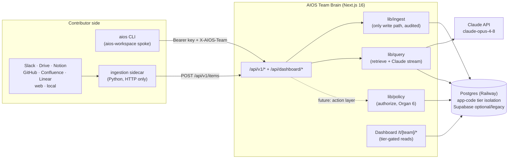
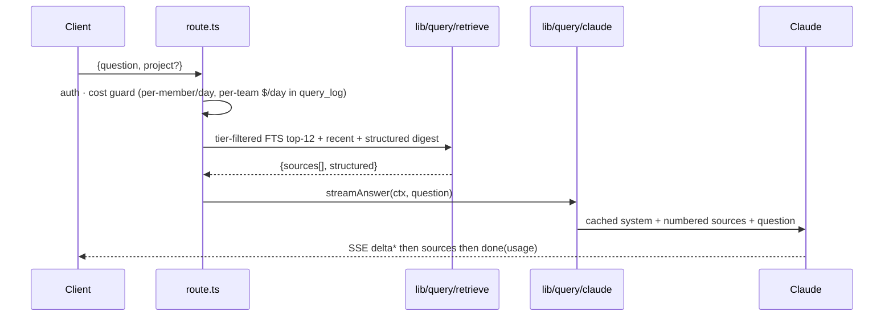
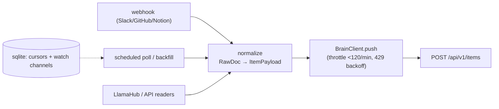
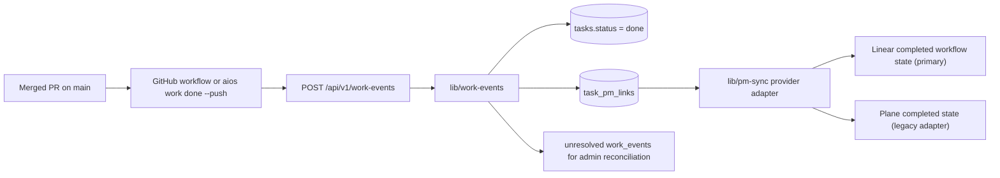
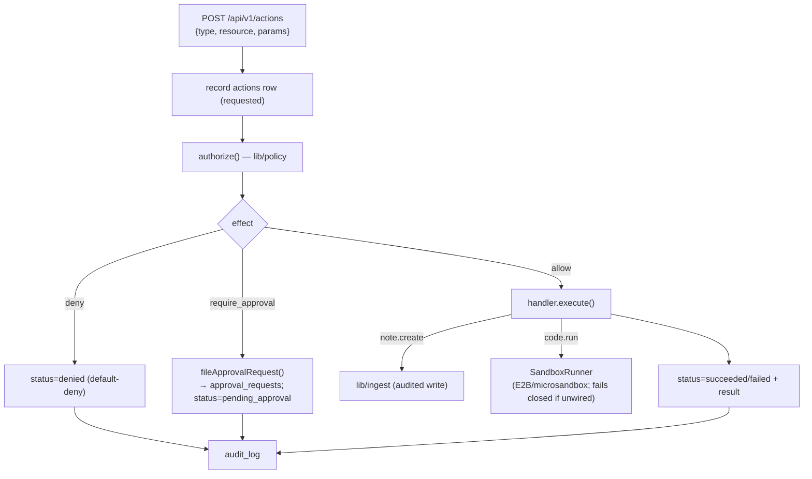
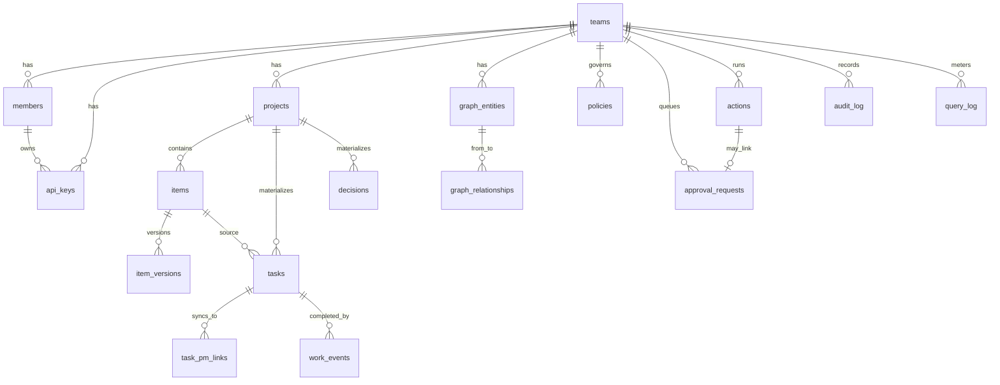

# AIOS Team Brain — Architecture

Mission control for agentic teamwork: a shared, queryable memory + coordination layer.
Contributor repos (and the ingestion sidecar) sync tier-tagged content into the brain;
the dashboard surfaces it and answers grounded natural-language questions. Self-host
portable: plain SQL migrations, Postgres-backed rate limiting, no Vercel-only deps.

> This doc describes **structure**. The enumerable surfaces (API routes, DB tables,
> ingestion sources) are guarded against drift by `scripts/check-docs-drift.mjs` — see
> [Docs drift guard](#docs-drift-guard).
>
> **Last verified against code: 2026-06-22.** If a flow here disagrees with the code, the
> code wins — fix the doc (same PR).

## Sources of truth

Where each piece of state lives, who may write it, who reads it, and how access is enforced.
Reason from this table, not from a random call site.

| State | Store (table) | Writer | Readers | Tier/access enforcement |
|---|---|---|---|---|
| Synced content | `items`, `item_versions` | **`lib/ingest` only** (single-writer guarded) | dashboard pages, `/api/v1/items`, `lib/query/retrieve`, okf-bundle, metrics | supabase: RLS; postgres: app-code — API ✅, dashboard ✅ (`lib/auth/visibility` choke-point, guarded) |
| Tasks | `tasks` | `lib/ingest` (sync rows — incl. inbound Plane import into a dedicated `plane-<id>` project) + `app/actions/tasks.ts` (UI; mints `ui-` row_key) + `lib/work-events` (merged-work completion) | dashboard, `/api/v1/tasks`, PM sync | team-scoped; `origin='ui'` rows survive sync diff; v1.2 hierarchy fields `parent_row_key`/`labels`/`priority` (parent integrity — exists + acyclic — enforced in `lib/ingest`); `body` is dashboard/DB-only (never in the markdown contract) |
| Task PM links | `task_pm_links` | `lib/ingest` (optional task-row PM metadata) + PM backfill | dashboard task badges, `lib/pm-sync` | team-scoped; stores provider IDs/status only, never secrets; v1.2 adds `last_projected_status`/`projection_fingerprint` (skip-detection) + `provider_seen_status` (Phase 5 divergence) |
| Primary PM provider | `teams.primary_pm_provider` | Admin → Integrations (`setPrimaryPmProvider`, admin-gated + audited) | `lib/pm-sync` projection | the single PM tool the brain projects into; null = projection no-ops / sole-enabled fallback |
| Work events | `work_events` | `POST /api/v1/work-events` → `lib/work-events` | Admin → PM sync health | team-tier only; unresolved events are preserved for reconciliation |
| Decisions | `decisions` | `lib/ingest` (sync rows) + `app/actions/decisions.ts` (UI; `source_item_id` NULL) | dashboard, `/api/v1/decisions` | team-scoped; UI rows (`source_item_id` NULL) never diff-deleted; writeback tier-scoped by `audience` |
| Policy rules | `policies` | admin (role-gated) | `lib/policy.authorize` | role-gated (admin/lead) |
| Approvals | `approval_requests` | `lib/policy.fileApprovalRequest`, `lib/actions.resolveApproval` | dashboard | role-gated decide |
| Actions | `actions` | **`lib/actions.runAction` only** (service role) | dashboard | team-scoped |
| Audit | `audit_log` | `lib/api/audit` (append-only, trigger-backed) | admin | append-only; admin read |
| Identity | `teams`, `members`, `api_keys` | admin UI / seed / `lib/admin/*` (CLI: create/disable/delete members, rename teams, issue/revoke keys) | `lib/auth`, guards | role-gated; `key_hash` column-revoked; member disable/delete + team rename are audited (`member.disabled`/`member.deleted`/`team.renamed`); delete refuses the last active admin |
| Git-author aliases | `member_emails` (+ `members.github_login`/`avatar_url`) | `lib/admin/*` + GitHub sync (`lib/codebases/github`) | `lib/codebases/ingest` (author→member), dashboard | team-scoped `unique(team_id,email)`; one alias → one member |
| Sessions (postgres) | `auth_users`, `auth_tokens` | `lib/auth/pg-*` | `getSessionUser` | signed httpOnly cookie |
| Rate limits | `rate_limits` | `rate_limit_hit` rpc | — | service-role only |
| Integrations | `integrations` | **`lib/integrations/manage` only** (single-writer guarded; admin server actions) | Admin → Integrations page (`lib/integrations/read`, **admin-gated** `canManageIntegrations`); `GET /api/v1/integrations` (API-key, NON-secret selections via `manage.listEnabledIntegrationSelections`); in-process Slack + Plane runners (`lib/ingest/run` via `manage.getEnabledIntegrationsWithSecrets`) | `config` is NON-secret (per-type allowlist + secret-key rejection); the connector secret is **encrypted at rest** in `secret_ciphertext` (`lib/secrets`, AES-256-GCM) and decrypted **only in-process** for the runner — it never leaves over HTTP, not even on the API-key read. Admin-tier (no per-row `access` column): both writes (`resolveIntegrationsAdmin`) and the dashboard read (`canManageIntegrations`, in `lib/integrations/read`) are app-code gated on `role==="admin"` — no RLS backstop; guarded by `test/guards/integrations-tier-filter` + the data-mechanics tier test. The page fails closed under `DB_BACKEND=supabase`. postgres-only |
| Codebase analytics | `codebases`, `code_metrics`, `code_contributions`, `github_issues` | **`lib/codebases/ingest` only** (single-writer guarded; via `POST /api/v1/codebases`) | codebases pages incl. Codebases → GitHub (scan freshness via `lib/metrics/codebases.getCodebaseFreshness` + live HEAD compare `lib/codebases/github.fetchRepoHeadSha`), `lib/metrics/codebases` | team-tier only; **app-code gate** (`lib/codebases/visibility` + guard) — no RLS backstop. Brain derives `agentic_score`/`health_score`; AEM `readiness_*` is scored scanner-side (`ingestion/aios_ingest/analyzers/readiness.py`) and persisted verbatim. W1.3 native UI: repo selection persists to `integrations` (type=github, admin); member→GitHub linking via `linkGithub` on Admin → Members (admin); **no server-triggered scan** — the GitHub surface documents the manual `aios-ingest scan` command and the sidecar consumes the selection (F4) |
| Brain spend / usage meter | `query_log` (`cost_usd`, `input/output/cache_tokens`, `member_id`) | the query routes (`/api/v1/query`, `/api/dashboard/query`) — one row per answered question | `lib/metrics/pulse` (usage KPIs), `lib/metrics/members` (per-member cost + throughput-vs-cost, W1.2), Admin → Usage page | **role-scoped in app code** via `scopeQueryLog` (admins → team-wide; everyone else → own rows) — no RLS backstop in postgres; guarded by `test/guards/query-log-visibility`. Brain spend only |
| External AI spend | `usage_costs` | **`lib/costs/ingest` only** (via `POST /api/v1/costs`) | `lib/metrics/external-costs`, Admin → Usage page | team-tier only; workstation pushes from `aios analyze --push` (Cursor dashboard USD + session-log estimates); idempotent on `(team, member, date, provider, source, project)` |
| AEM maturity snapshots | `agentic_maturity_snapshots` | `POST /api/v1/metrics` → `lib/metrics/individual-maturity-ingest` | Maturity → People (`lib/metrics/individual-maturity`) | team-tier only; daily aggregates incl. token/cost totals from session logs; no raw session content |

## System context



## The 8 organ systems (deck → status)

| # | Organ | Where | Status |
|---|-------|-------|--------|
| 1 | Knowledge repository | `items` + FTS + `lib/query` | ✅ MVP |
| 2 | Ingestion layer | `lib/ingest` + `ingestion/` sidecar | ✅ MVP (8 sources) |
| 3 | Context management | `lib/query/retrieve.ts` | 🟡 partial |
| 4 | Action layer | `lib/actions` + `actions` table + `POST /api/v1/actions` | 🟡 MVP (policy-gated; sandbox seam, no runner wired) |
| 5 | Identity & membership | `teams`/`members`/`api_keys`, tiers | ✅ |
| 6 | Policy engine | `lib/policy` + `policies`/`approval_requests` | 🟡 engine + schema (no UI/enforcement yet) |
| 7 | Audit log | `audit_log` (append-only, trigger-backed) | ✅ |
| 8 | Feedback loop | `work_events` + `lib/pm-sync` + codebase analytics | 🟡 PM progression loop + code health |

## Auth & access tiers

Two principals, one tier model:

- **Humans** — invite-only. In the **postgres** target, sign-in is **direct passwordless**:
  POST `/api/auth/login` with a recognized member email → signed session cookie (no email
  round-trip; unknown emails 403). Trusts the email with no ownership proof — acceptable only
  for this self-hosted, small known-member instance (`lib/auth/pg-login.loginByEmail`). In the
  legacy **supabase** mode, magic-link / OAuth via Supabase Auth.
- **Machines** — per-member API key `aios_<key_id>_<secret>` (sha256 at rest, shown
  once). Sync writes use the **service role** and bypass RLS — confined to `lib/ingest`
  and audited on every write.
- **Tiers** — `team` (sees all) vs `external` (sees only external). `admin`/`private`
  are rejected with **422** at the API and never reach the database.

## Key flows

### Sync ingest — `POST /api/v1/items`

```mermaid
sequenceDiagram
  participant C as CLI / sidecar
  participant R as route.ts
  participant I as lib/ingest
  participant DB as Postgres
  C->>R: Bearer key + X-AIOS-Team + ItemPayload
  R->>R: authenticateApiKey · rateLimit(120/min) · zod · normalizeTier
  Note over R: admin/private → 422
  R->>I: ingestItem(payload, tier)
  I->>DB: upsert project; lookup item by (team,project,path)
  alt identical content_sha256
    I->>DB: bump synced_at → "unchanged"
  else changed
    I->>DB: upsert item + insert item_versions
    opt kind = task / decision
      I->>DB: materialize rows (diff-sync by row_key; UI rows survive)
    end
  end
  I->>DB: append audit_log
  I-->>R: {status, id}
```

### Grounded query — `POST /api/v1/query` (SSE)



### Ingestion sidecar pipeline



### PM progression loop — merged work → done in the primary PM tool (Linear)



AIOS task `row_key` is the durable work identity. Optional `PM` / `PM URL`
columns in `tasks.md` materialize into `task_pm_links`; the provider secret still
lives only in `integrations.secret_ciphertext` and is decrypted on the server-side
sync path. Provider failures update `task_pm_links.last_error` and the task remains
done — PM drift is visible, not allowed to roll back completed code work.

**Full projection engine (brain → PM, one-way, brain wins).** As of brain-api v1.2 the
`tasks` table is the source of truth that **projects** a structured board into the team's
single `teams.primary_pm_provider`. `lib/pm-sync/project.ts` owns this:
`projectTask()` upserts one task (resolving its epic parent first, then the work item),
and `projectAllTasks()` projects a whole `(team, project)` in topological order with a
~1 req/s throttle — the server-side replacement for the seed scripts. Each adapter's
`upsertWorkItem()` **adopts-or-creates** (Plane by `external_id` across
`["aios-backlog","aios"]`; Linear by the `aios-ext: <row_key> · source: …` footer marker),
then **brain-wins PATCHes** title/body/state/priority/labels/parent and Plane Wave-module
membership. A `projection_fingerprint` on the link skips a provider round-trip when nothing
changed (a second `projectAllTasks` run does zero writes). The admin **"Project board now"**
button (`projectBoardAction`, admin-gated + audited) on the pm-sync page triggers a full run;
the work-events done path calls `projectTask` (creating the link/item if missing). `moveToDone`
remains as a thin state-only delegate. Assignee projection is deferred.

**Inbound divergence detection (brain-api v1.2 Phase 5, surface-only).** The reconcile pass
(`lib/pm-sync/reconcile.ts: reconcileProviderState`) reads the primary tool's CURRENT workflow
state for every linked task (adapter `fetchSeenStates` — read-only), records it on
`task_pm_links.provider_seen_status`, and surfaces any item whose state has drifted from the brain's
`last_projected_status`. It is **SURFACE-ONLY (brain wins)**: it never mutates the provider and never
changes brain `tasks.status` — the only write is `provider_seen_status`, and only when it changed
(so a second pass does zero writes — idempotent). The admin **"Check for divergence"** button
(`reconcileDivergenceAction`, admin-gated + audited) runs it; the PM-sync page renders the divergence
list read-only from stored state (`isDiverged`). Conflict policy is fixed at brain-wins: drift is
shown for a human to pull, never silently applied. Two-way write-back remains out of scope.

**Inbound Plane import (Plane → brain, in-app runner).** The *opposite* direction from the
projection engine: `lib/ingest/sources/plane.ts` + `plane-normalize.ts` pull a Plane project's
work-items **into** the brain as tasks, run in-process by `lib/ingest/run.ts: runPlaneIngestion`
(scheduler tick + the admin **"Sync now"** button on a Plane integration; actor = the auto-provisioned
`plane-sync` connector member). It shares the low-level HTTP client with the outbound adapter via
`lib/pm-sync/plane-client.ts`. Two invariants keep it from fighting the projection engine:
> • **Dedicated brain project per Plane project** (`plane-<identifier>`). `materializeTasks`'
> diff-delete is **project-wide**, so a Plane import must never share a project with CLI/UI tasks
> or each run would delete the other's rows. Each import emits ONE `kind="task"` item whose `rows[]`
> are the whole project, so a work-item removed in Plane diff-deletes from the brain — within that
> project only.
> • **One-directional, de-dupe over exclude.** Items the brain itself projected OUT (`external_source`
> starting `aios`) are **skipped** on import — the brain already owns that `row_key` in its real
> project, so re-importing would duplicate (this preserves "brain wins"). Plane-native items import
> fresh, keyed by `<IDENTIFIER>-<sequence_id>`. Sub-issue `parent` → `parent_row_key` (resolved only
> within the imported set; a skipped/absent parent is nulled, never dangling), module → `sprint`
> (round-trip-consistent with pm-sync's "Wave" mapping), cycle → a namespaced `cycle:<name>` label
> (iterations have no dedicated task column), labels/state/priority/assignee carried through. Imports
> stay at **team tier**; the runner does not
> populate `task_pm_links`, so an imported task is not re-projected back out.

**Reactive triggers (brain-api v1.2 Phase 2).** Projection is no longer manual-only. Task UI
writes — `createTaskAction` / `moveTaskAction` / the new `updateTaskAction` (title/sprint/due/
parent/labels/priority/body) — schedule a single-row `projectTask` via `next/server`'s `after()`
(`lib/pm-sync/after-write.ts: projectTaskByIdAfterWrite`). Sync **pushes** (`POST /api/v1/items`,
task kind) schedule `projectChangedTasksAfterWrite` for **only the rows whose projected fields
changed this push** — `lib/ingest` computes the changed set by diffing the projectable columns
(title/status/sprint/priority/labels/parent — not assignee/due/body) against a pre-upsert snapshot
(`lib/ingest/projectable-diff.ts`), so an unchanged backlog never re-projects. These callbacks run
**after** the response and **never fail** the originating action/push — on error they only record
`task_pm_links.last_error`; the `projection_fingerprint` skip keeps them from re-writing the board.
The manual `projectBoardAction` and the inline work-events projection remain.

**Dashboard hierarchical CRUD (brain-api v1.2 Phase 4).** The tasks page (`app/t/[team]/tasks`)
is the second authoring surface alongside `aios push`. It **server-renders the hierarchy** —
`components/kanban/task-hierarchy.tsx` groups sub-tasks under their epic (by `parent_row_key`) and
shows each task's primary-provider link + sync status. Editing a task (`components/kanban/
edit-task-dialog.tsx`) calls `updateTaskAction`, which writes the projectable fields and schedules
the same reactive `after()` projection. `updateTaskAction` enforces **parent integrity** —
self-parent, missing parent, and **cycle** (it walks the proposed parent's ancestor chain over the
project's edges) are all rejected before the write. PM-link badges are loaded by a **sibling
`task_pm_links` query grouped in JS**, not a PostgREST embed: the pg adapter only supports to-many
embeds as `(count)`, so an embedded `task_pm_links(...)` select returns no rows on the postgres
backend.

**Seed scripts (retired, Phase 3).** The backlog was originally authored in a `BACKLOG`
constant (`scripts/aios-backlog.mjs`) and one-way-pushed into the boards by
`scripts/{plane,linear}-backlog.mjs` (+ `plane-views.mjs`, `pm-sync-backfill.ts`). The
projection engine above fully supersedes them: the brain `tasks` table is now the source of
truth and projects the board. Once the live backlog was migrated into `tasks`, those scripts
and their npm entries (`plane:backlog` / `linear:backlog` / `plane:views` / `pm:backfill`) were
**deleted** (brain-api v1.2 Phase 3). The board is created/updated only via `lib/pm-sync`.

**PM tool decision (resolved).** The Plane-vs-Linear bake-off (backlog epic W2.4) is settled —
**Linear is the chosen PM tool**, and `teams.primary_pm_provider` is set to `linear`. The Plane
adapter (`lib/pm-sync/plane.ts`) remains in code so the runtime projection path stays
provider-neutral, but Plane is no longer used and the Plane seed/mirror scripts are gone.

### Action layer (Organ 4) — policy-gated execution



A queued (`pending_approval`) action is resolved by `resolveApproval()` (called by the
session-authed dashboard; RLS restricts deciding to admins/leads): **approve** resumes and
executes the handler, **deny** marks the action denied — both audited, and a second
decision is rejected. Code execution uses an **E2B** `SandboxRunner`
(`lib/actions/sandbox/e2b.ts`, opt-in: `npm i @e2b/code-interpreter` + `E2B_API_KEY`);
self-host deployments can wire a microsandbox adapter against the same interface.

## Data model (core)



## Module map

| Path | Responsibility |
|------|----------------|
| `app/api/v1/*` | Machine API (sync, pull, query, okf-bundle) |
| `app/api/dashboard/*` | Session-authenticated dashboard API |
| `app/t/[team]/*` | Dashboard pages (tasks, projects, decisions, library, skills, query, admin) |
| `lib/ingest` | The only audited write path (service role) |
| `lib/query` | Retrieval + Claude streaming |
| `lib/actions` | Policy-gated action execution + sandbox seam (Organ 4) |
| `lib/work-events` | Merged-work event ingestion; idempotently marks matching tasks done |
| `lib/pm-sync` | Provider-neutral Plane/Linear status sync, errors recorded on task links |
| `lib/policy` | Policy evaluation + approval queue (Organ 6) |
| `lib/api` | auth, rate-limit, audit, zod schemas |
| `lib/okf` | OKF link-graph helpers |
| `postgres/schema.sql` | **Canonical schema** (Postgres target; app-code tier isolation). Drift-guarded. |
| `supabase/migrations` | Derived/legacy schema (RLS) — only when `DB_BACKEND=supabase` |
| `ingestion/` | Python connector sidecar (Organ 2) |
| `lib/db`, `lib/auth` | Backend selector + pg adapter; backend-agnostic auth/session/guard |
| `instrumentation.ts` + `sentry.{server,edge}.config.ts` + `instrumentation-client.ts` | Sentry init per runtime (server/edge/browser); `onRequestError` forwards server errors. All DSN/token env-driven and inert when unset. See `docs/OPS.md`. |
| `app/global-error.tsx` | Root error boundary; reports to Sentry and renders fallback UI |

## Invariants & gotchas

Each entry is a real contract or bug, stated as the invariant that must now hold. Where a
guard enforces it, it's named.

- **Single-writer for content.** Only `lib/ingest` writes `items`/`item_versions`.
  *Guard:* `test/guards/single-writer-items.test.ts` (fails the build on any other writer).
- **Ingest is idempotent by `content_sha256`.** Identical re-push → `unchanged`, no new
  `item_versions` row. *Verified:* `test/datamechanics/ingest.datamechanics.test.ts` (real PG).
- **Tier isolation.** An `external`-tier principal never reads `team`/`admin` content. Enforced
  by RLS in supabase mode, by app code in postgres mode (no DB backstop). Enforced in three
  places, all verified on real PG: the retrieval path (`retrieve.ts`), the API routes (they
  re-apply the filter), and the dashboard reads (`app/t/[team]/*`) — which now route every
  `items` read through the **`lib/auth/visibility` choke-point** (`visibleItems`/`canSeeAccess`).
  *Guard:* `test/guards/dashboard-tier-filter.test.ts` fails the build if a dashboard page reads
  `items` without the choke-point. *Verified:* `access-isolation` + `dashboard-visibility`
  data-mechanics tests.
  🟡 **Not yet built — within-team privacy.** The tier model is binary (`team`/`external`); a
  `team` member sees *all* `team` content. "Private to a subset of the team" (e.g. an ingested
  private Slack thread hidden from other team members) needs a finer-grained ACL (per-member or
  per-channel) and a new tier/scope — a product feature, not covered by the current filter.
- **`admin`/`private` tiers never reach the DB** — rejected with 422 at the API.
- **Append-only audit.** `audit_log` has a trigger that blocks UPDATE/DELETE.
- **The brain is the source of truth; the PM board is a one-way projection.** The `tasks` table is
  canonical (v1.2: hierarchy + `body`). The brain projects task create/update/state into the single
  `teams.primary_pm_provider` board (Plane/Linear) — never the reverse in v1. Projection fires both
  **manually** (admin "Project board now") and **reactively** (v1.2 Phase 2): task UI writes
  (`create`/`move`/`updateTaskAction`) and changed-row pushes (`POST /api/v1/items`) schedule it via
  `after()` — bounded to the rows whose projected fields changed, run after the response, and never
  failing the user action (errors → `task_pm_links.last_error` only; `projection_fingerprint` skips
  redundant writes). A merged-work event still marks the matching task done first; provider failures
  are surfaced in Admin → PM sync, never rolling the task back. Inbound PM→brain divergence is
  **detected and surfaced** (Phase 5, `reconcileProviderState`): drift between the tool's state and
  `last_projected_status` is recorded on `provider_seen_status` and shown on the PM-sync page —
  surface-only, brain wins, never written back. Two-way write-back remains out of scope.
  (Rows removed from a push are diff-deleted in `tasks` but **not** deleted from the PM board in
  Phase 2 — PM deletion-on-diff is a later phase.)
- **`key_hash` is column-revoked** from client roles; API secrets are sha256-at-rest, shown once.
- **Migration replay.** 14-digit timestamp prefixes, unique, lexical == chronological.
  *Guards:* `test/guards/migrations-numbering.test.ts` + `npm run db:test:up` (migrates from zero).

## Changing X? read this

- **Add/remove an API route, DB table, or ingestion source** → update the `<!-- drift:* -->`
  inventories below (machine-guarded; CI + pre-push will fail otherwise).
- **Write to `items`/`item_versions`** → it must live in `lib/ingest` (single-writer guard).
- **Read tiered content on the dashboard** → apply the `access`/tier filter explicitly; there is
  no RLS backstop in postgres mode.
- **Add a migration** → 14-digit timestamp prefix; run `npm run db:test:up` to prove replay.
- **Change access control** → treat it as dual-backend; add/extend a data-mechanics parity test.

## Keeping this doc honest

The drift inventories (routes/tables/sources) are machine-checked. The sources-of-truth table,
the Mermaid flows, and the invariants are **hand-maintained** — update them in the same PR as the
change and bump the "Last verified" date when you reconcile against code.

## Repository inventories

These lists are **machine-checked** against the code on every PR. Update them in the same
PR as the code change, or the [drift guard](#docs-drift-guard) fails.

### API surface

<!-- drift:routes -->
- `POST /api/v1/items` — upsert synced content
- `GET /api/v1/items` — tier-filtered, keyset-paginated pull
- `GET /api/v1/items/:id` — single item fetch
- `GET /api/v1/tasks` — dashboard task changes for `aios pull` writeback
- `GET /api/v1/decisions` — dashboard decision changes for `aios pull` writeback (tier-scoped)
- `GET /api/v1/projects` — team project list for `aios pull` brain-project registration (team-tier only)
- `GET /api/v1/me` — authenticated member identity + role (drives client UI gating)
- `POST /api/v1/query` — SSE grounded query (`delta`/`sources`/`done`)
- `GET /api/v1/okf-bundle` — OKF link graph (tier-filtered, link redaction)
- `POST /api/v1/actions` — request a policy-gated action (Organ 4)
- `POST /api/v1/codebases` — ingest a codebase scan (raw metrics + scanner-scored AEM agent-readiness, persisted verbatim; team-tier key only, audited)
- `GET /api/v1/integrations` — API-key read of a team's enabled integration selections; NON-SECRET only (no secret/secret_ciphertext), team-scoped, audited
- `POST /api/v1/metrics` — ingest an AEM individual maturity daily snapshot (team-tier key only; brain recomputes canonical scores; audited)
- `POST /api/v1/costs` — ingest external AI provider daily spend (Cursor dashboard + session-log estimates; team-tier key only; audited)
- `POST /api/v1/work-events` — merged-work completion event; marks matching tasks done and triggers PM sync
- `POST /api/dashboard/query` — same query pipeline, session-authenticated
- `POST /api/auth/login` — postgres-mode direct passwordless sign-in (invite-only; 403 if unknown)
<!-- /drift:routes -->

### Database tables

<!-- drift:tables -->
`auth_users` · `auth_tokens` · `teams` · `members` · `api_keys` · `audit_log` · `rate_limits` ·
`projects` · `items` · `item_versions` · `tasks` · `decisions` · `graph_entities` ·
`graph_relationships` · `query_log` · `policies` · `approval_requests` · `actions` ·
`codebases` · `code_metrics` · `code_contributions` · `github_issues` · `member_emails` ·
`integrations` · `agentic_maturity_snapshots` · `task_pm_links` · `work_events` · `usage_costs`
<!-- /drift:tables -->

### Ingestion sources

<!-- drift:sources -->
`github` · `slack` · `notion` · `gdrive` · `confluence` · `linear` · `web` · `local` · `radar` · `granola`
<!-- /drift:sources -->

> **`granola` privacy invariant:** Granola is the one source that must **never** sync
> verbatim transcript team-tier. Its `fetch()` team-push path emits metadata-only meeting
> *markers* (`kind=artifact`, `transcript_synced:false`), behind an allowlist + per-note
> consent gate; full transcripts are written to the local workspace at **admin tier only**
> and decisions reach the `decisions` table solely through the human-reviewed
> decision-log.md → `aios push` → `materializeDecisions` flow. See `docs/GRANOLA.md`.

## Docs drift guard

`scripts/check-docs-drift.mjs` derives the three inventories above from code
(`app/api/**/route.ts`, `supabase/migrations/*.sql`, `ingestion/.../registry.py`) and
diffs them against the `<!-- drift:* -->` blocks. It runs in three places:

- **CI** (`.github/workflows/ci.yml`, job *Docs drift guard*) — on every PR. Advisory until
  the repo's plan allows a required status check; then make it required on `main`.
- **Local pre-push hook** (`.githooks/pre-push`) — blocks a push that would drift the docs.
  Auto-enabled by `npm install` (the `prepare` script sets `core.hooksPath=.githooks`);
  bypass in an emergency with `git push --no-verify`.

```bash
npm run check:docs   # run locally before pushing
```

When you add/remove a route, table, or source: update the matching block here in the same
PR. The guard verifies structure only — keep the diagrams and prose accurate by review.
