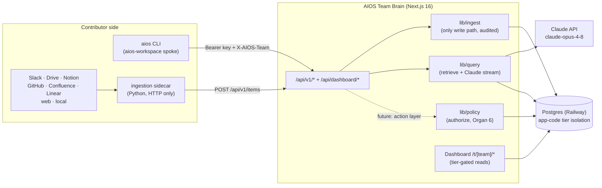
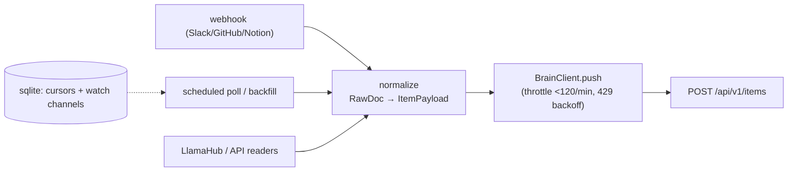
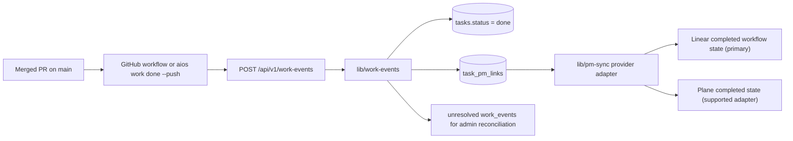
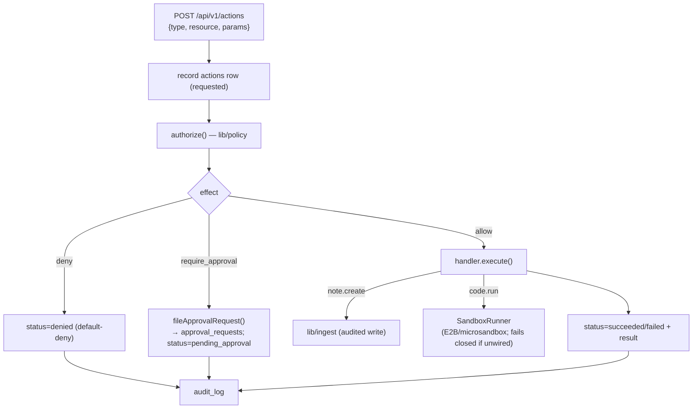
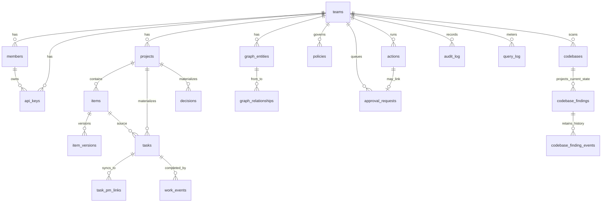

# AIOS Team Brain — Architecture

Mission control for agentic teamwork: a shared, queryable memory + coordination layer.
Contributor repos (and the ingestion sidecar) sync tier-tagged content into the brain;
the dashboard surfaces it and answers grounded natural-language questions. Self-host
portable: plain SQL migrations, Postgres-backed rate limiting, no Vercel-only deps.

> This doc describes **structure**. The enumerable surfaces (API routes, DB tables,
> ingestion sources) are guarded against drift by `scripts/check-docs-drift.mjs` — see
> [Docs drift guard](#docs-drift-guard).
>
> **Last verified against code: 2026-08-03.** If a flow here disagrees with the code, the
> code wins — fix the doc (same PR).

## First-install deployment flow

The canonical hosted-install entry point is `https://aiosbrain.dev/deploy/team-brain/`. It resolves
to the official Railway template described in [`RAILWAY-TEMPLATE.md`](RAILWAY-TEMPLATE.md): Team
Brain, Postgres, Graphiti, and Neo4j. Railway reference variables keep Graphiti and Neo4j on the
private network, wire the graph LLM proxy, and share the generated Neo4j credentials; template
secret functions generate `AUTH_SECRET`, `SECRETS_KEY`, and `GRAPH_LLM_PROXY_SECRET`. The operator
supplies team and first-admin identity in Railway's form, including an `ADMIN_PASSWORD` of at least
10 characters.

On first start, `railway.json` runs the idempotent schema loader before release. The opt-in Railway
startup wrapper then runs the shared bootstrap to ensure the real team and first admin from
`TEAM_*` / `ADMIN_*`. Bootstrap runs on
every restart but checks for an existing credential before calling the admin writer, so later
password changes are preserved. A user-supplied `ADMIN_PASSWORD` is never rendered into logs.

Two guards sit on that flow because it is driven by a form with no input validation
(`scripts/setup/deploy-policy.mjs`, called from `docker/bootstrap.mjs`):

- **`TEAM_SLUG` is normalised before `create-team`** — `Acme Corp` becomes `acme-corp`, and the
  substitution is printed, because the slug is the team's permanent address (`/t/<slug>`). Without
  it, `createTeam`'s slug regex rejected the value, `scripts/admin.ts` called `die()`, and Railway
  restarted the container until the release failed over a half-provisioned database. An input with
  no letters or digits at all still fails, loudly, rather than being guessed at.
- **Demo seeding is opt-in on a public URL** — a deploy without `TEAM_SLUG` used to fall through to
  the Northwind demo and its documented admin login (`admin@demo.local`, credentials printed to the
  deploy log), which is correct on a laptop and a published account anywhere else. When
  `NODE_ENV=production` and `APP_URL` is not a local address, the demo seeds only for an explicit
  `SEED_DEMO=true`, and generates its password instead of using the documented one. `docker compose
  up` (localhost `APP_URL`) is unaffected.

The schema loader itself carries the service-identity guard (`scripts/service-guard.mjs`), which
enforces only on deploys carrying an AIOS marker — see [`OPS.md` §4](OPS.md) for why a public,
self-hosted repo cannot make that check unconditional.

The local curl installer remains the Docker/self-host path. Selecting Railway in that wizard opens
the canonical deploy page; it does not provision through an ambient Railway CLI link and does not
pause for a GitHub fork or a post-deploy `--resume` command.

## Agent skill publication

Repository-local agent skills are authored once under `.claude/skills/`. The explicit
publication manifest `.skill-runtimes.json` selects which canonical skills are projected
to `.agents/skills/`, `.opencode/skills/`, and `.cursor/rules/`; merely finding a generated
copy never publishes a skill. `scripts/sync-skill-runtimes.sh` performs deterministic
generation and rejects unlisted or stale projections. CI runs `npm run check:skills` so a
missing runtime, an orphaned generated copy, or an invalid manifest fails closed. These
files are contributor tooling only and are not loaded by the Team Brain application.

## Sources of truth

Where each piece of state lives, who may write it, who reads it, and how access is enforced.
Reason from this table, not from a random call site.

| State                                               | Store (table)                                                                                                                                                                                                                                                                                                 | Writer                                                                                                                                                                                                                                                                                                                                                                                                                                                                                                                                                                                                                                                                                                                                                                                                                                                                                                                                                                                                                                                                                                                                                                                                                                                                                                                                                                                                                                                                           | Readers                                                                                                                                                                                                                                                                                                                                                                                                                                                                                     | Tier/access enforcement                                                                                                                                                                                                                                                                                                                                                                                                                                                                                                                                                                                                                                                                                                                                                                                                                                                                                                                                                                                                                                                                                                                                                                                                                                                                                                                                                                                                                                                                                                                                                                                                                                                                                                                                                                                                                                                                                                                                                                                                                                                                          |
| --------------------------------------------------- | ------------------------------------------------------------------------------------------------------------------------------------------------------------------------------------------------------------------------------------------------------------------------------------------------------------- | -------------------------------------------------------------------------------------------------------------------------------------------------------------------------------------------------------------------------------------------------------------------------------------------------------------------------------------------------------------------------------------------------------------------------------------------------------------------------------------------------------------------------------------------------------------------------------------------------------------------------------------------------------------------------------------------------------------------------------------------------------------------------------------------------------------------------------------------------------------------------------------------------------------------------------------------------------------------------------------------------------------------------------------------------------------------------------------------------------------------------------------------------------------------------------------------------------------------------------------------------------------------------------------------------------------------------------------------------------------------------------------------------------------------------------------------------------------------------------- | ------------------------------------------------------------------------------------------------------------------------------------------------------------------------------------------------------------------------------------------------------------------------------------------------------------------------------------------------------------------------------------------------------------------------------------------------------------------------------------------- | ------------------------------------------------------------------------------------------------------------------------------------------------------------------------------------------------------------------------------------------------------------------------------------------------------------------------------------------------------------------------------------------------------------------------------------------------------------------------------------------------------------------------------------------------------------------------------------------------------------------------------------------------------------------------------------------------------------------------------------------------------------------------------------------------------------------------------------------------------------------------------------------------------------------------------------------------------------------------------------------------------------------------------------------------------------------------------------------------------------------------------------------------------------------------------------------------------------------------------------------------------------------------------------------------------------------------------------------------------------------------------------------------------------------------------------------------------------------------------------------------------------------------------------------------------------------------------------------------------------------------------------------------------------------------------------------------------------------------------------------------------------------------------------------------------------------------------------------------------------------------------------------------------------------------------------------------------------------------------------------------------------------------------------------------------------------------------------------------ |
| Context substrate + §11 backfill (Phase A slice 4 — spec §context-units/§11.2) | `project_context_units` (item grain: one `unit_kind='item'` unit per item, `audience` mirrored verbatim from `items.access` — NEVER classifier-set) + `project_context_memberships` (the content→project edge the oracle reads for `canSee`; ≤1 current row per (team,project,unit) via a partial unique on `valid_to is null`) | **`lib/projects/context/units.ts`** + **`lib/projects/context/memberships.ts`** (single writers, guarded); the reconciler re-mirrors audience on `items.access` change; `lib/projects/context/backfill.ts` is the §11 migration (resumable, batched, through the writers): every team item → membership into General, every external item → external-shared | membership is what the enforced reads join against — **LIVE since Phase B, the ONLY read model since PRET-6** (items route, retrieval, timeline, arcs; the by-id/dashboard-list surfaces in the enforcement backlog are the named exceptions) — the backfill's membership SHAPE (team→general only, external→external-shared only, nothing crosses) is proven exact by `test/datamechanics/context-backfill.datamechanics.test.ts`; the §11 "byte-identical visibility" acceptance is discharged by the recall eval when reads wire in Phase B | task/decision/meeting-segment grains + events/suggestions/rules = Phase D |
| Access enforcement — membership is the ONLY model (Phase B slices 1–6; program PRET-1..6 complete — `docs/design/retire-permissive-model.md`, slice spec `docs/design/pret6-retirement.md`) | RETIRED COLUMNS: `teams.access_enforcement` + `teams.autoflip_hold`, dropped by migration `20260818210000_pret6_retire_access_enforcement.sql` behind a REFUSING precondition (a teams-holding fleet without the `pret4_builtin_materialize` marker aborts UNCONDITIONALLY — covering the pre-flag-era fleet whose column never existed; a fleet with any permissive team aborts inside the schema-qualified column-existence gate — H-VANISH made mechanical; the two creator migrations are neutered to comment-only history so the ledger-less replay cannot re-create the column, and a replay after the drop is a proven no-op — `test/datamechanics/pret6-precondition.datamechanics.test.ts` executes the migration's own text twice). The FLIP SUBSYSTEM IS DELETED — `lib/admin/access-enforcement.ts`, `lib/admin/auto-flip-pass.ts`, the CLI `set-access-enforcement`/`auto-flip` commands, the scheduler's auto-flip slot, and `docker/bootstrap.mjs`'s post-seed flip spawn (replaced by a direct `drainTeamContext` call, so the demo team is born enforcing with its seed rows partitioned). What SURVIVES: the readiness scan, re-homed as the STANDING health check **`lib/admin/access-health.assessAccessHealth`** (CLI `scripts/admin.ts access-health <team-slug>`: a blind human or an unpartitioned item is a BLOCKER an operator must fix, an unplaced agent or active connector is a WARNING; dm-pinned in `test/datamechanics/access-health.datamechanics.test.ts`), and `materializeBuiltinMembershipOnce` with BOTH its trigger slots (the `instrumentation.ts` boot run + the scheduler retry block) as the self-heal for a restored-from-backup DB. Self-host upgrade path: `docs/RELEASE-NOTES-pret6.md` (ordered; the migration enforces it) | **`lib/access/enforce.ts`** (`visibleItemIds`) — the enforced-read primitive, now UNCONDITIONAL: the ORACLE alone decides for every team (PRET-4 ruling 2 — an external member granted a project sees its `access='team'` rows; placement is the sharing act). Posture = membership in the `everyone` built-in (`lib/access/posture.resolveViewerPosture`, resolved at the auth boundaries; the PRET-4 marker-keyed legacy window is retired — the builtin row alone decides; `members.tier` is never a read input and survives only as the invite-default record, guard: `test/guards/tier-no-access-reads.test.ts`). Wired into `GET /api/v1/items` for member AND agent keys: both intersect with the membership-visible item set (the agent supplies its attenuated effective project set, so a delegated token can't exceed its launcher; empty set → zero rows, never unfiltered; the Phase-A `project_id` proxy is deleted) | visibility gates on the §11 memberships everywhere — the migration's precondition guarantees every deployed team passed the readiness gate BEFORE this code can run; proven by `test/datamechanics/access-enforced-read.datamechanics.test.ts` (restricted project gated; no-groups = fail closed) + the PRET-5 leak suite (incl. the invite-default FLOOR: an external-invited member with no grants sees exactly the external-shared corpus). **What enforcement does NOT buy, stated because it is the thing most likely to be misread:** the §11 day-one topology is `general↔everyone`, so on a stock team every team-posture member still sees every other member's content — separation comes from CURATION (an initiative project granted to a group, with the item's membership moved into it). Anti-zombie pin: `test/guards/enforce-retrieve-callsites.test.ts` is INVERTED post-PRET-6 — it pins that enforcement is CONSTRUCTED UNCONDITIONALLY with no flag read (a renamed mode source passes a grep; a call-site pin catches it) | RETRIEVAL enforced identically (Phase B slice 2): `lib/query/retrieve.ts`'s `enforce` arg — item legs (FTS/recency/dense) + source-linked decisions/tasks filter to the principal's membership-visible set; the ITEM-GRAINED aggregate legs stay OMITTED (external augmentation, git/people activity digests, the full-corpus task-count aggregate, the commitments mirror leg — fail closed, not leak; §5.8b: every leg named). Graphiti facts are PARTITION-served via `graphProjectIds` (PCCC-6a), and the ORG-STRUCTURAL mirror legs (actor entities + `REPORTS_TO` edges) serve EVERY member principal with a FLAT `["REPORTS_TO"]` allowlist (PRET-4 opened the external closure per the triad — structure → every member; PRET-6 deleted the permissive triple WITH its guard pin, per the guard-lifecycle note) — omitted absolutely for `aiosd_*` tokens; wired into both query routes (v1 + dashboard). RLS backstop and per-project graphs (Phase C) remain; `visibleItemIds` materializes the id set app-side (adapter has no EXISTS) — moves into SQL when corpus size bites |
| Context partition triggers (Phase A slice 5 — spec §11.2) | drives the slice-4 substrate: no new tables | **`lib/projects/context/reconcile-item.ts`** (`reconcileItemContext` — the per-item reconcile+route+move core, shared so the sweep and the on-push path can't diverge) wired at THREE sites: the items push route (`after()`, best-effort — partitions new content on push, never blocks it), the scheduler tick (`runContextBackfill` → `backfillAllTeams` with a tick-start cutoff, traced `ingest_runs source='context_backfill'` — backstop for non-push ingest + hook failures), and an admin action (`app/t/[team]/admin/access/actions.ts`, drains to completion — **exported, UI wiring pending a later slice**), and the demo bootstrap (`docker/bootstrap.mjs` post-seed → `scripts/admin.ts drain-context` → `drainTeamContext`, the single-team drain helper — PRET-6 re-homed this call when the enforcement flip retired; NO candidate-predicate shortcut: a caller about to decide what a whole team can see needs the per-item answer, which is the read-only `lib/projects/context/coverage.ts`) | **LOAD-BEARING since Phase B (and the only model since PRET-6)** — the enforced reads consume exactly these memberships, so the triggers keep the substrate the oracle serves from; call sites pinned by `test/guards/context-hook-callsites.test.ts`, core proven by `test/datamechanics/context-reconcile-item.datamechanics.test.ts` | the scheduler leg used to short-circuit on a `memberships >= items` count — **removed by TICKSTALL-2 slice A**, because those global counts carry no `decision`, target project or per-item grain and could report converged while a real candidate existed; the candidate predicate is the exact check now; a NON-push tier change reconverging via the reclassify path is a Phase-B wiring item; Phase B wires the enforced read that finally consumes these memberships |
| Access bootstrap (Phase A slice 3 — spec §11) | `projects.kind` (`source` default / `system` / `initiative`) + the built-in topology: General + external-shared (`kind='system'`, adopt-with-audit if an ingestion row already holds the slug — the §11 fail-open-to-today ruling) and exactly three grants (general↔everyone, external-shared↔external, external-shared↔everyone; NO general↔external) | **`lib/access/bootstrap.ts`** (`ensureAccessBootstrap`, idempotent; grants via the groups single writer — SQL cannot seed the edge tables, the guard forbids it, so app code is the only legal §11 "migration") — triggered on team creation (`lib/admin/teams`), every scheduler tick (`runAccessBootstrap`, instance-wide `ingest_runs` trace `source='access_bootstrap'` — this is how pre-existing teams bootstrap on first deploy), — **PRET-4 retired the lifecycle re-sync**: `createMember` writes the invite-default builtin row explicitly at creation (every kind, per tier; upsert reconciles only on a stated tier change), activation/disable hooks are gone, and the one-time fleet materialization (`materializeBuiltinMembershipOnce`, reconcile-first/marker-last, boot + tick-retry slots) froze the recompute-era state as explicit rows — call sites + the recompute's ABSENCE pinned by `test/guards/access-bootstrap-callsites.test.ts` | oracle reads the resulting topology; §11 day-one shape proven by `test/datamechanics/access-bootstrap.datamechanics.test.ts` (team sees both; external sees external-shared only) | the ONLY tier-write site today is `createMember(upsert:true)` (`lib/admin/members.ts` — `tier: input.tier ?? "team"`, so an upsert that omits tier silently resets external→team, a pre-existing trap), and that site writes the builtin row itself; the deliberate posture moves (`addMemberToGroup`/`removeMemberFromGroup` on built-ins — humans only) MIRROR `members.tier` to the resulting posture, so the token/provisioning layers reading the record can never diverge |
| Delegated agent tokens (Phase A slice 2 — spec §10, the QM unblock) | `agent_tokens` (`aiosd_<token_id>_<secret>` wire format, hashed secret; `project_scope` NULL = unattenuated spawn default, `'{}'` = sees nothing; composite same-team FKs; `on_behalf_of` deletion cascades the token so it can never widen into a self token) | **`lib/access/agent-tokens.ts` only** (single-writer guarded) — mint refuses non-principal legs; verify re-checks BOTH legs' principal-hood per request (deactivation kills live tokens); admin mint/revoke actions in `app/t/[team]/admin/agents/actions.ts` (call-site-pinned) | `lib/api/auth.authenticateAgentToken` → `GET /api/v1/items` (Phase A) and `POST /api/v1/query` (Phase B slice 3, brain-api 1.19) honor these, filtered by `lib/access/oracle.effectiveVisibleProjects` (triple intersection, live per request) — query retrieves ALWAYS-attenuated via `lib/access/enforce.delegatedVisibleItemIds`, stateless, launcher-attributed; every other route rejects the prefix as malformed (fail closed) | token string returned exactly once at mint, never stored/logged; proven by `test/datamechanics/access-agent-tokens.datamechanics.test.ts` |
| Access chain (partitioning/permissioning Phase A slice 1 — spec `docs/specs/project-context-classification-v1.md` §4/§5.1) | `groups` + `group_members` + `project_groups` (+ `members.kind`: `human`/`agent`/`offroster`) | **`lib/access/groups.ts` only** (single-writer, guarded by `test/guards/access-single-writer.test.ts`) — built-ins `everyone`/`external` hold EXPLICIT state since PRET-4 (written at member creation from the invite default; edited only by deliberate membership actions — builtin adds require `isBuiltinEligible`, humans only; non-human rows are posture-only and grant-inert via the oracle's unchanged eligibility), write-side eligibility refusals, hidden person-singleton groups for direct adds (membership = exactly the person) | `lib/access/oracle.visibleProjects` (read-side eligibility re-applied; the builtin-tier equality conjunct is RETIRED behind the PRET-4 materialization marker — rows are authoritative once `pret4_builtin_materialize` is confirmed, legacy tier semantics until then, fail-closed; attenuation `∩ (scope ?? U)`, `[]` = nothing). **Not yet wired to any route/read path — enforcement lands in later Phase A/B slices**; today's tier isolation is unchanged | composite same-team FKs make cross-team edges unrepresentable; proven by `test/datamechanics/access-groups.datamechanics.test.ts` |
| Synced content                                      | `items`, `item_versions`                                                                                                                                                                                                                                                                                      | **`lib/ingest` only** (single-writer guarded)                                                                                                                                                                                                                                                                                                                                                                                                                                                                                                                                                                                                                                                                                                                                                                                                                                                                                                                                                                                                                                                                                                                                                                                                                                                                                                                                                                                                                                    | dashboard pages, `/api/v1/items`, `lib/query/retrieve`, okf-bundle, metrics                                                                                                                                                                                                                                                                                                                                                                                                                 | app-code isolation (no RLS) — the MEMBERSHIP oracle is the model (PRET-6), and **ENFB-1 oracle-gated the BODY-serving surfaces**: items-by-id (`canSeeItem`, §5.7 404), the okf-bundle pager (visible-set intersect + three-state link redaction + the composite `updated_at|id` cursor), the library item/skills/team-tools/tasks-board/decisions pages and the admin data browser (the shared provenance rule `lib/access/provenance` for structured rows — `decisions.created_by` is the new provenance column, dashboard-action-only writer), graph-query (stored-pointer partitions with the loud missing-pointer arm), and the grounding statistic (visible-corpus counts — the existence oracle closed); guard: the `dashboard-tier-filter` oracle layer. STILL posture-only (ENFB-2, the named next slice): the title/metadata/count surfaces — tasks API list, project page + the UNGATED projects-list inventory, Pulse decision titles/KPIs, social, codebases/maturity/people; ENFB-3: meetings (needs an audience column). Restricted-initiative curation remains UNSUPPORTED until ENFB-2 lands (the ENFB-1 operational rule) — API ✅, dashboard ✅ (`lib/auth/visibility` choke-point, guarded; Pulse metrics `getPulseMetrics` route their items/tasks reads through `visibleItems`/`visibleTasks` too — an external member with an API key lands on the dashboard). `items.access` is **healed on an UNCHANGED re-push** (same `content_sha256`), not just on a content edit — a source that reclassifies an item's tier without touching its prose would otherwise keep the first-ingest `access` forever and silently keep serving the old tier (no RLS backstop); the heal cascades to `tasks.audience` and audits `item.access_healed`. `items.created_at` = **first-seen** (set on insert, never bumped) — the honest "new knowledge / day" signal for Pulse **Knowledge growth**; `synced_at` bumps every sync tick so it's churn, NOT growth (same trap the Timeline flags with "NEVER `synced_at`"). **WORK-TIME is stored, not re-derived (Pass-1 R1):** `items.work_at` + `work_at_from_source` are resolved once at ingest by the one resolver (`lib/ingest/work-time.resolvePersistedWorkTime`) and written down, so SQL windows/ORDER BY read the same answer a TS caller gets. Falling back to `synced_at` was the bug — every 30-min tick bumps it, so undated work was re-dated "today" forever (H4/H5/M3). The fallback is `created_at` (set once on insert, never bumped); `work_at_from_source` says which, because the timeline drops an undated item while the graph projector accepts it. Healed on an unchanged re-push (frontmatter-only date corrections), which is also what converges the migration's `created_at` backfill within one sync cycle — **except where the source's rule says its timestamp isn't evidence of work** (`lib/ingest/source-rules`): `local` emits mtime, which a `touch`/`rsync`/`chmod` moves with no author and no edit, so its stored work-time is authoritative on an unchanged body. Not a global rule, because Linear/Plane emit the issue's last STATE TRANSITION here and a ticket reaching `completed` is real work with a byte-identical doc body. |
| Dense index (OPTIONAL)                              | `item_chunks` (embeddings; **not** in `schema.sql` — `postgres/optional/pgvector.sql`, load via `pg:schema:vector`)                                                                                                                                                                                           | **`lib/query/dense-index` only** (single-writer guarded; chunk+embed, idempotent on `items.content_sha256`) — incremental in the ingest scheduler + `npm run embed:backfill`                                                                                                                                                                                                                                                                                                                                                                                                                                                                                                                                                                                                                                                                                                                                                                                                                                                                                                                                                                                                                                                                                                                                                                                                                                                                                                     | `lib/query/dense-search` (HNSW cosine → RRF-fused into `retrieve`)                                                                                                                                                                                                                                                                                                                                                                                                                          | opt-in (pgvector present AND a resolvable embeddings backend — a team's Admin "Embeddings model" pick OR env `EMBEDDINGS_URL`, else a complete no-op); the QUERY embedding uses the SAME resolved backend that indexed the chunks (`resolveEmbeddingBackend`); dense hits tier-filtered on **live `items.access`** — no `external` leak (guarded by the dense data-mechanics test)                                                                                                                                                                                                                                                                                                                                                                                                                                                                                                                                                                                                                                                                                                                                                                                                                                                                                                                                                                                                                                                                                                                                                                                                                                                                                                                                                                                                                                                                                                                                                                                                                                                                                                                                                                                                                                                                                                         |
| Tasks                                               | `tasks`                                                                                                                                                                                                                                                                                                       | `lib/ingest` (sync rows — incl. inbound Plane/Linear/GitHub import, each into a dedicated `plane-<id>`/`linear-<team>`/`github-<owner>-<repo>` project) + `lib/meetings/extract-todos` (explicit todos/action-items from meeting notes into the dedicated `extracted-from-meetings` project) + `app/actions/tasks.ts` (UI; mints `ui-` row_key) + `lib/work-events` (merged-work completion)                                                                                                                                                                                                                                                                                                                                                                                                                                                                                                                                                                                                                                                                                                                                                                                                                                                                                                                                                                                                                                                                                     | dashboard, `/api/v1/tasks`, PM sync                                                                                                                                                                                                                                                                                                                                                                                                                                                         | app-code tier isolation via `tasks.audience` (inherits the materializing item's `access`; external reads filter `audience='external'` through the `visibleTasks` choke-point — retrieval, `/api/v1/tasks`, dashboard box + page; no RLS backstop); `origin='ui'` rows survive sync diff; v1.2 hierarchy fields `parent_row_key`/`labels`/`priority` (parent integrity — exists + acyclic — enforced in `lib/ingest`); `body` is dashboard/DB-only (never in the markdown contract); **work-timeline signal columns** (work-timeline context layer) — `updated_at` is now bumped ONLY on a real persisted change (`persistedChanged` = projected set ∪ `due_date`, so a routine re-sync that re-materializes every row no longer re-stamps unchanged siblings — the "worked on today" bug); `worked_at` = the provider's last state-transition time (Linear `startedAt`/`completedAt`/`canceledAt`; Plane `completed_at`; falls back to provider `updatedAt`; partial-write, brain-api v1.12 `taskRowSchema.worked_at`); `assigned_at` = stamped only when the assignee changes (powers the timeline "newly assigned" bucket). Consumed by `lib/dashboard/work-timeline` (task work-time = `worked_at ?? updated_at`; dormant assigned tickets with no in-window signal are dropped) **ACTIVITY POLICY (H6):** "is this task active" has ONE definition — `lib/tasks/activity-policy` (`ACTIVE_STATUSES` = {in_progress, blocked}; `OPEN_STATUSES` = + ready), over the brain-normalized `tasks.status`, never a provider's own state names. It was previously answered in five places three different ways, and arc eligibility answered it from LINEAR's vocabulary — so Plane was never gated and Done/Backlog Plane tickets shaped arcs. Both connectors now emit the normalized `status` on the per-issue doc and `lib/graph/arc-eligibility` gates every PM source on that one field; it also FAILS CLOSED (throws) rather than returning "nothing is ineligible" on a lookup error. Guarded by `test/guards/activity-policy-single-source.test.ts`, which build-fails if a surface re-declares its own status set. |
| Task PM links                                       | `task_pm_links`                                                                                                                                                                                                                                                                                               | `lib/ingest` (optional task-row PM metadata) + PM backfill                                                                                                                                                                                                                                                                                                                                                                                                                                                                                                                                                                                                                                                                                                                                                                                                                                                                                                                                                                                                                                                                                                                                                                                                                                                                                                                                                                                                                       | dashboard task badges, `lib/pm-sync`                                                                                                                                                                                                                                                                                                                                                                                                                                                        | team-scoped; stores provider IDs/status only, never secrets; v1.2 adds `last_projected_status`/`projection_fingerprint` (skip-detection) + `provider_seen_status` (Phase 5 divergence)                                                                                                                                                                                                                                                                                                                                                                                                                                                                                                                                                                                                                                                                                                                                                                                                                                                                                                                                                                                                                                                                                                                                                                                                                                                                                                                                                                                                                                                                                                                                                                                                                                                                                                                                                                                                                                                                                                           |
| Primary PM provider                                 | `teams.primary_pm_provider`                                                                                                                                                                                                                                                                                   | Admin → Integrations (`setPrimaryPmProvider`, admin-gated + audited)                                                                                                                                                                                                                                                                                                                                                                                                                                                                                                                                                                                                                                                                                                                                                                                                                                                                                                                                                                                                                                                                                                                                                                                                                                                                                                                                                                                                             | `lib/pm-sync` projection                                                                                                                                                                                                                                                                                                                                                                                                                                                                    | the single PM tool the brain projects into; null = projection no-ops / sole-enabled fallback                                                                                                                                                                                                                                                                                                                                                                                                                                                                                                                                                                                                                                                                                                                                                                                                                                                                                                                                                                                                                                                                                                                                                                                                                                                                                                                                                                                                                                                                                                                                                                                                                                                                                                                                                                                                                                                                                                                                                                                                     |
| Answering + reasoning + extraction model            | `teams.answering_provider` + `reasoning_provider`/`reasoning_model` + `extraction_provider`/`extraction_model`                                                                                                                                                                                                                                            | Admin → Integrations "Answering, reasoning & extraction models" — a provider+model picker PER ROLE: `setAnsweringModel` (answering provider+model), `setReasoningModel` (reasoning provider+model) and `setExtractionModel` (extraction provider+model); admin-gated + audited. The answering/reasoning/embedding columns are also NULLED by `lib/integrations/manage.deleteIntegration` when the last enabled key of the referenced provider is deleted (dangling-pointer cascade → AUTO); the **extraction** columns are deliberately NOT in that cascade — they need no dangling-pointer sweep because an unconfigurable extraction provider already falls back WHOLE to the answering backend (visible as `usedFallback` on the card), and keeping the admin's model choice means it resumes if the key is re-added                                                                                                                                                                                                                                                                                                                                                                                                                                                                                                                                                                                                                                                                                                                                                                                                                                                                                                                                                                                                                                                                                                                                                                                                                                                                                                                               | `lib/query/answering.resolveAnsweringKeys` → `selectLlmBackend` (both query routes)                                                                                                                                                                                                                                                                                                                                                                                                         | which LLM backend answers the Query box: `anthropic`/`openai`/`openrouter`/`local`, or null = AUTO precedence (OpenRouter → `LLM_BASE_URL` → Anthropic). A forced-but-unconfigured backend falls back to AUTO. Governs EVERY non-streaming LLM generation task — the Query answer box, title generator, Social content generation, meeting extraction, and narrative-arc synthesis — all via `resolveAnsweringKeys` → `selectLlmBackend` → the shared `lib/llm/complete` primitive (guarded by `test/guards/llm-single-caller`). The **reasoning role** (`role:"reasoning"`, arc synthesis) can run on its OWN provider+model — `teams.reasoning_provider`/`reasoning_model` — so a team can answer on one backend and reason on another; unset provider ⇒ reasoning reuses the answering backend with just the reasoning model (`selectLlmBackend`/`describeReasoning`). The **extraction role** (`role:"extraction"`) is the third: `teams.extraction_provider`/`extraction_model`, read by the graph LLM proxy, and it is where ~99% of the LLM bill is decided (extraction was $51.01 of $51.70 lifetime, because the proxy had to reuse the ANSWERING model — a reasoning model whose completion tokens were ~87% chain-of-thought on a mechanical schema-constrained transformation). The MODEL is the activation switch (both columns null ⇒ extraction resolves the answering backend, i.e. the pre-role behaviour); an unset provider with a model ⇒ the answering backend with just the extraction model. Its fallback is WHOLE, unlike reasoning's: a requested-but-unconfigurable extraction provider yields the answering backend AND model, never the extraction model against a backend that cannot serve it — that half-swap fails every call while Graphiti keeps returning 202, so the graph stops growing silently. `anthropic` is unrepresentable for this role (CHECK + `setExtractionModel` + the picker's option list) because Graphiti extracts via OpenAI structured outputs. See `describeExtraction` and `docs/design/graph-extraction-model.md`. Embeddings/image/rerank are a different model class with their own config                                                                                                                                                                                                                                                                                                                                                                                                                                                                                                                                                                                                                                                                                                                                                                                                                                                                                                                                                                                                                                                                                                                                                                                                                                                                                                                                                                                                                                                                                                                                                                                                                    |
| Work events                                         | `work_events`                                                                                                                                                                                                                                                                                                 | `POST /api/v1/work-events` → `lib/work-events` — the PR→task resolution is `lib/work-events/resolve-task.resolveWorkEventTask`: a hit in the PUSHED project → **`applied`** (completes the task + projects it back to the PM tool, legacy behavior); else a TEAM-WIDE `row_key` match → **`linked`** (records `task_id` ONLY — deliberately NOT completed and NOT written back). The team-wide fallback FIXES the project-scope bug (Linear-mirrored tasks live in `linear-<teamKey>`, not the repo project, so a PR citing `AIO-494` could never resolve); it is restricted to ISSUE-SHAPED keys (the extractor emits junk like `V1`/`GPT-5`), prefers the canonical `linear-<prefix>` mirror when ambiguous, and DROPS if still ambiguous. Link-only is a deliberate blast-radius guarantee — completing on a widened match would `issueCreate` DUPLICATE Linear issues for mirror tasks with no `task_pm_links` row, clobber Linear-native edits via the brain-wins projection, and auto-complete issues merely MENTIONED in a PR body; a `work_event.would_complete` audit records what completion WOULD have done. `lib/work-events/relink.relinkUnresolvedWorkEvents` back-fills historical rows LINK-ONLY (zero Linear writes). See `docs/design/pr-task-link-propagation.md`                                                                                                                                                                                                                                                                                                                                                                                                                                                                                                                                                                                                                                                                                                                                                                                                                                                                                                                                                                                                                                                                                                                                                                                                                                                                                                                                                                                                                                   | Admin → PM sync health                                                                                                                                                                                                                                                                                                                                                                                                                                                                      | team-tier only; unresolved events are preserved for reconciliation                                                                                                                                                                                                                                                                                                                                                                                                                                                                                                                                                                                                                                                                                                                                                                                                                                                                                                                                                                                                                                                                                                                                                                                                                                                                                                                                                                                                                                                                                                                                                                                                                                                                                                                                                                                                                                                                                                                                                                                                                               |
| Decisions                                           | `decisions`                                                                                                                                                                                                                                                                                                   | `lib/ingest` (sync rows) + `app/actions/decisions.ts` (UI; `source_item_id` NULL)                                                                                                                                                                                                                                                                                                                                                                                                                                                                                                                                                                                                                                                                                                                                                                                                                                                                                                                                                                                                                                                                                                                                                                                                                                                                                                                                                                                                | dashboard, `/api/v1/decisions`                                                                                                                                                                                                                                                                                                                                                                                                                                                              | team-scoped; UI rows (`source_item_id` NULL) never diff-deleted; writeback tier-scoped by `audience`                                                                                                                                                                                                                                                                                                                                                                                                                                                                                                                                                                                                                                                                                                                                                                                                                                                                                                                                                                                                                                                                                                                                                                                                                                                                                                                                                                                                                                                                                                                                                                                                                                                                                                                                                                                                                                                                                                                                                                                             |
| Meeting notes                                       | `meeting_notes` + `meeting_note_attendees` (rich metadata layer; the full transcript itself is a normal `items` row, `kind='transcript'`, written through the existing `lib/ingest.ingestItem` single writer — so a meeting note is searchable/queryable through the standard FTS/retrieve pipeline for free) | **`lib/meetings/notes.ts` only** (single-writer guarded) — TWO entry points: (1) `createMeetingNote`, called from the Meetings upload form (`app/t/[team]/meetings/actions.ts`), ingests a new transcript item + note; (2) `createMeetingNoteFromItem`, the **bridge** for meetings that arrived via the CLI/ingest (`aios push`) as transcript `items` — it attaches a note to the EXISTING item (idempotent on the unique `source_item_id`), so pushed meetings show up on the Meetings page, not only button-uploaded ones. The bridge is driven by `lib/meetings/from-items.backfillMeetingNotesFromItems` (scans meeting-source transcripts — `granola`/`zoom`/… but **never `slack`** — that lack a note), run **immediately after a meeting is pushed** (`app/api/v1/items` → `lib/meetings/schedule-backfill`, post-response via `after()`, coalesced to at most one running + one queued run per team so a burst of pushes costs one scan, errors swallowed, and traced to `ingest_runs` with `trigger='api'` so the push path is as diagnosable as the tick), by the ingest scheduler each tick as the backstop, and on demand via **Meetings → "Import pushed meetings"**. **Duplicate-merge** (`lib/meetings/merge.ts`) runs AUTOMATICALLY on BOTH entry points — live-upload (`findDuplicateMeeting`) and the CLI/ingest backfill (`backfillMeetingNotesFromItems` → `backfillMergeDuplicateMeetings`, each scheduler tick + "Import pushed meetings"; the manual "Merge duplicates" button was removed): a same-meeting re-record/re-upload is folded into the existing note — it writes the merged transcript to a **merge-owned item** (`meetings/<noteId>.md`), re-points the note's `source_item_id` at it (so a connector re-sync of the original file can NEVER clobber the merge), remaps extracted action items onto the new item, floors `access` to the most-restrictive source, and retires the old connector item behind a hidden `merged_into` tombstone note (so the backfill can't resurrect it). `findDuplicateMeeting` never matches a `merged_into` note. Attendees + a short summary are inferred by a best-effort LLM pass (`lib/meetings/llm-extract`, through the shared settings-aware `lib/llm/complete` primitive — honors the team's answering-provider incl. OpenRouter; never blocks). Action items are extracted into the `extracted-from-meetings` project by `lib/meetings/action-items` (LLM-first, with the `lib/meetings/extract-todos` markdown scanner as fallback) via the shared `extractAndStoreActionItems` — pre-computed on upload AND on import (the `from-items` backfill materializes them per created note, so pushed meetings open with todos already filled), plus **on demand** via the **Tasks → Extract** page (`MeetingTodoReview` → `scanMeetingTodosAction`/`createMeetingTodosAction` → `projectAllTasks`), which scans a meeting's transcript for todos and pushes them into the team's primary PM tool (Linear/Plane) via the projection engine (`lib/pm-sync`), tracked in `task_pm_links`. (The per-meeting **Re-extract** + selective push that used to live on the meeting detail page — `extractMeetingActionItemsAction`/`pushMeetingTasksAction` — were removed with that section and currently have no UI caller.) Meeting-todo `row_key` is **content-keyed** (`meet-<hash(item)>-<hash(normalized title)>`, NOT ordinal), so **Re-extract** maps each todo to the SAME task regardless of the LLM's order/count (preserving its PM push link). **Pruning is OPT-IN** (`extractAndStoreActionItems(…, {reconcile:true})`): ONLY the deliberate on-demand **Re-extract** prunes todos that genuinely disappeared — the additive paths (upload, `from-items` import/backfill, `refresh`, `merge`) never prune, so one path reworking a title can't delete another's todo. Pruning preserves any todo already pushed to a PM tool (`task_pm_links`, matched by **row_key** — its stable identity), so a re-extract never orphans a live Linear/Plane issue; a **0-item result never prunes** (an empty extraction is indistinguishable from a failed one). `status` is **insert-only** — a re-extract keeps a task's current status (a progressed todo isn't reset to the default category). Tasks written under the pre-switch **ordinal** scheme are converged to the content key (task + its `task_pm_links` row) by a one-time backfill (`backfillMeetingTodoRowKeys`, `scripts/backfill-meeting-todo-rowkeys.ts`) so a re-extract upserts over an already-pushed pre-switch task instead of minting a duplicate issue. See `pruneStaleMeetingTodos` + `createMeetingTodoTasks` + `extractAndStoreActionItems`. **Target category:** extracted todos take `teams.meeting_task_status` (a brain status → PM category via `desiredStateForStatus`; `lib/meetings/target-status` + `-db`), an admin radio in **Admin → Integrations** (`setMeetingTaskStatus`), applied when extracted todos are created/projected | Meetings pages (`app/t/[team]/meetings` shared **two-pane layout** — list rail + detail; `app/t/[team]/meetings/[id]` right pane = **Summary/Transcript tabs** — the action-items/push-to-PM section was removed from the meeting detail view; extraction + push now live on the **Tasks → Extract** page (`app/t/[team]/tasks/extract`, `MeetingTodoReview`))                                                                                                                                                                                                                                                                                                                             | team-tier only by design — `canSeeMeetingNotes` gate returns `[]`/`null` for `external` (sole enforcement, no RLS backstop); guarded by `test/guards/single-writer-meeting-notes` + the meeting-notes data-mechanics tests                                                                                                                                                                                                                                                                                                                                                                                                                                                                                                                                                                                                                                                                                                                                                                                                                                                                                                                                                                                                                                                                                                                                                                                                                                                                                                                                                                                                                                                                                                                                                                                                                                                                                                                                                                                                                                                                       | **ATTENDANCE is resolved by PRECEDENCE, not inference (MTGATT-1/AIO-962, `lib/meetings/attendance.ts`): calendar attendee EMAILS → the producer's asserted `frontmatter.participants` names → an LLM, and only when neither exists.** The model used to be the default, and it has no representation of PRESENT vs DISCUSSED: on 2026-08-11 it recorded two teammates named only in the third person and explicitly as absent, while the item's own `participants: "[John Ellison]"` was correct and ignored. A structured list that resolves to NOBODY does **not** fall through to the model — that would re-open the bug precisely on meetings full of outside names. Unresolved asserted names are COUNTED (`BackfillSummary.unresolvedAttendees`) because `meeting_note_attendees.member_id` is a NOT NULL FK to `members`, so an external guest cannot be recorded at all — the reason real attendees appear to vanish. **A calendar event still creates its OWN note beside the transcript's** — the calendar↔transcript merge is NOT wired. `findDuplicateMeeting` gained a title comparator for the bodyless case (`titleSimilarity`), but its only caller does not pass a title, and the path a pushed calendar event actually takes (`backfillMergeDuplicateMeetings`) excludes bodyless notes twice and never calls it. The comparator is DORMANT and its wiring is the next slice (MTGATT-2), which must also resolve two hazards the review found: two different same-day meetings whose titles are only a person's name score 1.0, and the survivor is whichever note arrived first, so a transcript arriving second would fold into the calendar note and lose its body. _Guards:_ `test/meetings-attendance-source.test.ts` (precedence, the prod `participants` shapes incl. Slack's id-only objects, and the no-fallthrough rule), `test/meetings-title-similarity.test.ts` (merges real prod title pairs, refuses stopword-only overlap). _Repair:_ `scripts/backfill-meeting-attendance.mjs`, dry-run by default.
| Policy rules                                        | `policies`                                                                                                                                                                                                                                                                                                    | **`lib/policy/manage` only** (validated + audited) via the **Admin → Policies** editor (`savePolicy`/`togglePolicy`/`removePolicy`, admin-gated)                                                                                                                                                                                                                                                                                                                                                                                                                                                                                                                                                                                                                                                                                                                                                                                                                                                                                                                                                                                                                                                                                                                                                                                                                                                                                                                                 | `lib/policy.authorize` (enabled-only) + the editor (`listAllPolicies`, incl. disabled)                                                                                                                                                                                                                                                                                                                                                                                                      | admin-gated (the whole `/admin` area is)                                                                                                                                                                                                                                                                                                                                                                                                                                                                                                                                                                                                                                                                                                                                                                                                                                                                                                                                                                                                                                                                                                                                                                                                                                                                                                                                                                                                                                                                                                                                                                                                                                                                                                                                                                                                                                                                                                                                                                                                                                                         |
| Approvals                                           | `approval_requests`                                                                                                                                                                                                                                                                                           | `lib/policy.fileApprovalRequest` (queue) + `lib/actions.resolveApproval` (decide) — decided from the **Admin → Approvals** queue (`decideApproval`, admin-gated; approve resumes the action with the E2B sandbox)                                                                                                                                                                                                                                                                                                                                                                                                                                                                                                                                                                                                                                                                                                                                                                                                                                                                                                                                                                                                                                                                                                                                                                                                                                                                | Admin → Approvals page                                                                                                                                                                                                                                                                                                                                                                                                                                                                      | admin-gated decide; audited                                                                                                                                                                                                                                                                                                                                                                                                                                                                                                                                                                                                                                                                                                                                                                                                                                                                                                                                                                                                                                                                                                                                                                                                                                                                                                                                                                                                                                                                                                                                                                                                                                                                                                                                                                                                                                                                                                                                                                                                                                                                      |
| Actions                                             | `actions`                                                                                                                                                                                                                                                                                                     | **`lib/actions.runAction` only** (service role)                                                                                                                                                                                                                                                                                                                                                                                                                                                                                                                                                                                                                                                                                                                                                                                                                                                                                                                                                                                                                                                                                                                                                                                                                                                                                                                                                                                                                                  | dashboard                                                                                                                                                                                                                                                                                                                                                                                                                                                                                   | team-scoped                                                                                                                                                                                                                                                                                                                                                                                                                                                                                                                                                                                                                                                                                                                                                                                                                                                                                                                                                                                                                                                                                                                                                                                                                                                                                                                                                                                                                                                                                                                                                                                                                                                                                                                                                                                                                                                                                                                                                                                                                                                                                      |
| Audit                                               | `audit_log`                                                                                                                                                                                                                                                                                                   | `lib/api/audit` (append-only, trigger-backed)                                                                                                                                                                                                                                                                                                                                                                                                                                                                                                                                                                                                                                                                                                                                                                                                                                                                                                                                                                                                                                                                                                                                                                                                                                                                                                                                                                                                                                    | admin                                                                                                                                                                                                                                                                                                                                                                                                                                                                                       | append-only; admin read                                                                                                                                                                                                                                                                                                                                                                                                                                                                                                                                                                                                                                                                                                                                                                                                                                                                                                                                                                                                                                                                                                                                                                                                                                                                                                                                                                                                                                                                                                                                                                                                                                                                                                                                                                                                                                                                                                                                                                                                                                                                          |
| Social Brain content (opportunity → plan → variant) | `social_opportunities`, `content_plans`, `content_variants`                                                                                                                                                                                                                                                   | **`lib/social/store` only** (single-writer guarded) — create/status transitions; **tier propagates down the chain**: a plan inherits its opportunity's `access`, a variant inherits its plan's — the caller never sets tier, so a team-sourced opportunity can't spawn an `external` plan/variant                                                                                                                                                                                                                                                                                                                                                                                                                                                                                                                                                                                                                                                                                                                                                                                                                                                                                                                                                                                                                                                                                                                                                                                | `lib/social/store` readers (tier-scoped via `visibleByAccess`); the content pipeline + a future Social dashboard                                                                                                                                                                                                                                                                                                                                                                            | app-code tier isolation on the per-row `access` column (external → only `access='external'`), SOLE enforcement, no RLS backstop (CLAUDE.md §5). **evidence→tier-leak invariant**: `createOpportunity` derives the ceiling from the actual `items.access` of its evidence and rejects (TierLeakError) an `external` opportunity built on any `team` (or unresolved) item — so internal knowledge can't be laundered into a public post (`lib/social/tier`, fail-closed). That ceiling is also RE-APPLIED on reclassification: `narrowSocialChainForItem` (called from `lib/ingest/reclassify`) drops every `external` opportunity whose evidence item is narrowed external→team, and walks the whole derived chain down with it — plans, variants, and via each table's own single-writer module `content_approvals`, `media_assets`, `social_publications`, `publication_analytics`. The walk is anchored on the EVIDENCE MATCH, not on the rows' current tier, which is what makes it idempotent: these statements autocommit, so a crash partway through would otherwise leave the descendants `external` with the retry unable to find them. Without it the ceiling held only at CREATE, and unlike the arc/timeline caches nothing here has a TTL, so the over-exposure was permanent. Narrowing only — widening never auto-publishes. M2 ships the SCHEMA + lifecycle + this invariant — discovery scoring + brand-aware planning are a later product-steered milestone. Guarded by `test/guards/single-writer-social-content.test.ts` + the `social-content` data-mechanics tier test                                                                                                                                                                                                                                                                                                                                                                                                                                                                                                                                                                                                                                                                                                                                                                                                                                                                                                                                                                                                                                                                                                                                                                                                                                                                                                                                                                         |
| Brand Brain (per-team config)                       | `brand_profiles`                                                                                                                                                                                                                                                                                              | **`lib/brand/manage` only** (single-writer guarded) — `saveBrandProfile` validates the config (allowlist `.strict()` + byte cap, `lib/brand/schema`) and upserts one row per team; audits section KEYS only, never values                                                                                                                                                                                                                                                                                                                                                                                                                                                                                                                                                                                                                                                                                                                                                                                                                                                                                                                                                                                                                                                                                                                                                                                                                                                        | the **Admin → Brand** editor (`getBrandProfile`); the Social Brain content pipeline (M2+) reads it to generate in-voice + validate governance before approval/publish                                                                                                                                                                                                                                                                                                                       | admin-tier config (non-secret; credentials stay in `integrations`); app-code admin gate (the whole /admin area), no per-row tier column, no RLS backstop. Guarded by `test/guards/single-writer-brand.test.ts` + the `brand-profile` data-mechanics tier test                                                                                                                                                                                                                                                                                                                                                                                                                                                                                                                                                                                                                                                                                                                                                                                                                                                                                                                                                                                                                                                                                                                                                                                                                                                                                                                                                                                                                                                                                                                                                                                                                                                                                                                                                                                                                                    |
| Social Brain jobs (durable async)                   | `social_jobs`                                                                                                                                                                                                                                                                                                 | **`lib/jobs/store` only** (single-writer guarded) — `enqueueJob` + the claim/terminal transitions (done/requeue-with-backoff/dead) + **`reclaimStaleJobs`** (audit #4: a `running` row whose `locked_at` is older than `STALE_JOB_MS` is returned to `queued`, or dead-lettered if attempts are exhausted — so a deploy/crash mid-job can't strand it; safe because handlers are idempotent). Enqueued by the Social Brain services (M2+); drained by the in-process poller `lib/jobs/scheduler` → `runDueJobs` (single-flight, reclaims then claims, opt-in via `SOCIAL_JOBS_ENABLED`)                                                                                                                                                                                                                                                                                                                                                                                                                                                                                                                                                                                                                                                                                                                                                                                                                                                                                                                                                                                                                                                                                                                                                                          | the poller; a future Admin → Social panel (reads only)                                                                                                                                                                                                                                                                                                                                                                                                                                      | team-scoped in app code (no RLS). The one durable async primitive: survives redeploys, retries failures with exponential backoff (`lib/jobs/backoff`) until `max_attempts` → `dead`; `run_after` doubles as the scheduled-publish time; abandoned `running` jobs are reclaimed each tick (audit #4). Guarded by `test/guards/single-writer-social-jobs.test.ts` + the `social-jobs` data-mechanics tier test                                                                                                                                                                                                                                                                                                                                                                                                                                                                                                                                                                                                                                                                                                                                                                                                                                                                                                                                                                                                                                                                                                                                                                                                                                                                                                                                                                                                                                                                                                                                                                                                                                                                                                                                                  |
| Ingestion runs                                      | `ingest_runs`                                                                                                                                                                                                                                                                                                 | **`lib/ingest/runs.recordIngestRun` only** (single writer, best-effort) — called by the scheduler (per source tick, `team_id` null = instance-wide), manual `/sync` (`lib/ingest/manual-sync`), and the codebase scan route (`POST /api/v1/codebases`). AIO-357 reuses the same table + writer for outbound PM projection runs (`source: "pm_sync"`) via the thin wrapper `lib/pm-sync/runs.recordProjectionRun` — called from `projectBoardAction` (manual), `lib/pm-sync/after-write.ts` (reactive, `trigger: "api"`), and `scripts/brain-tasks.ts project` (`cli`)                                                                                                                                                                                                                                                                                                                                                                                                                                                                                                                                                                                                                                                                                                                                                                                                                                                                                                            | `listRecentIngestRuns` → Admin → Integrations "Recent ingestion runs" panel; `lib/ingest/pipeline-health.getPipelineHealth` → the loud "N ingestion legs are broken" banner (Home + Integrations) — which SUPPRESSES a connector leg (slack/plane/linear/github) whose integration was deleted/disabled, since its frozen last-failure row is a fossil the scheduler can no longer overwrite (ingested data is untouched). **A leg goes LOUD only on a CONFIRMED failure (BANNERFLAP-1)**: the current unbroken failure streak must reach `FAILURES_TO_CONFIRM` (2). A lone failure is `unconfirmed` — still `ok:false` and still listed in Recent ingestion runs (only `llm` also has a retrieval-card leg), but not in the banner — because one row is a sample of size one: measured over 60d of prod, `arcs` healed on the very next run 3 times out of 3 and `llm` 6 times out of 10, and one such blip on 2026-08-11 held the banner red for ~5h48m. There is deliberately NO time-based escalation of a lone failure: the healing gap on those legs reaches ~20h, so no grace both stops the flap and still announces anything, and for a leg with a scheduler heartbeat `stale` already covers a failure that is never superseded. `stale` is INDEPENDENT of the classification and still loud on its own (including on a leg whose newest run succeeded), and — unlike a failure — it has **NO debounce**: it is derived from one timestamp per page load, so a single late tick goes straight to the loud banner, which makes a mis-fitted per-leg threshold directly user-visible. **TICKSTALL-1** then found what the widened bars were fitting AROUND: `runContextBackfill` was measured at **57-60 minutes** against a 30-minute tick, and because the tick is one sequential `await` chain with no re-entrancy guard, every stage after it (`auto_flip`, meeting-notes, task-evidence, doc-task inference, **dense indexing**, graph-health) recorded NOTHING for 2-5h at a stretch — six outages in 14 days, all after the bootstrap/backfill stages joined the chain on 2026-08-11. The stage is now BOUNDED: `lib/ingest/single-flight` stops the tick overlapping itself, `CONTEXT_BACKFILL_BUDGET_MS` (default 5m, one parse site in `lib/projects/context/backfill-budget`) caps it, and a durable resume cursor in `ingest_runs.meta` (`lib/projects/context/backfill-cursor`, reset on drain) means a truncated pass CONTINUES next tick instead of re-sweeping the same first batch. Teams are served least-recently-first so a stage-wide budget cannot starve a team behind one that never converges. Truncation is `ok:true` + `meta.truncated`, never a failure — routing it through the failure path would redden the banner that BANNERFLAP-2 just fixed. The leg's `created`/`meta` now report real counts; they were hardcoded `created: 0`, which is why a 59-minute stage ran six days unnoticed. **TICKSTALL-2 slice A** then made the sweep O(BACKLOG): `lib/projects/context/backfill-candidates` selects only items that need work — no item-grain unit, no current `include` in the TARGET system project, or still a current membership in the OPPOSITE one (every unit reference is scoped `unit_kind='item'`, matching `reconcileItemUnit`'s own lookup) — instead of re-walking every item and relying on reconcile being idempotent (~1.3 s each, 2,678 items to fix 6). The audience is keyed on the item's CURRENT `items.access`, NEVER `project_context_units.audience`, which is a mirror that stays stale until reconcile re-mirrors it: keyed on the mirror, a tier flip whose best-effort `settleReclassification` fan-out failed reads 'already correct' and is never selected — team content served through `external-shared` permanently. The EXCLUDE-SHADOW (a current `decision='exclude'` in the target project, which makes `ensureIncludeMembership` a silent no-op) is deliberately NOT a candidate — selecting a state reconcile cannot repair would burn a tick forever and keep `scanned` off zero — but IS counted. A RETRACTED unit is the same class and gets the same treatment: enforced reads require `state='active'` while `reconcileItemUnit` never writes `state`, so it is invisible AND unfixable. Both land in `meta.excludeShadows`/`meta.retractedUnits`, which are **null when the count could not be taken** — 'unreadable' must not read as 'none' for a metric whose only job is making an invisible hole visible. Repair for both is EXCLSHADOW-1. The convergence short-circuit is REMOVED: it compared global item and membership counts with no `decision`/target-project/grain, so it could report converged while a real candidate existed, silently skipping work. STILL OPEN: the tick's total work (~42 min average, `github` alone 18.6) still exceeds its 30-minute interval — slice B.

**BANNERFLAP-2** therefore fits `STALE_MS_BY_SOURCE` from MEASURED scheduler cadence rather than guesses: `meeting_notes`, `context_backfill` and `context_backfill_all` all move to **6h** — uniformly, because measurement shows their large gaps are the SAME event (they go quiet and resume together to the second), and fitting them per-leg is what produced an earlier 5h bar with 7 minutes of grace over the real worst case. The tail is **not** corpus growth or chain congestion (that story was refuted: inside the worst gap, `slack`/`linear` recorded 13 times and `github`/`access_bootstrap` 7 while every leg from `context_backfill` down recorded ZERO) — the tick is being TRUNCATED partway down the chain, so the tail tracks restart churn. Widening costs no dead-scheduler detection, since the upstream legs catch that at 3h; **the truncation defect itself is deferred** — *superseded by TICKSTALL-1 above, which bounds the stage; this sentence records what was true when BANNERFLAP-2 shipped* to its own slice. `auto_flip` is a DOCUMENTED HISTORICAL SOURCE (`null` threshold): the subsystem retired with PRET-6, but prod's `ingest_runs` history holds its rows forever, and deleting the ledger entry would re-inherit the 3h default and pin the banner red on a dead leg. The recurrence is attacked with two guards: the pure `lib/ingest/threshold-fit.detectMisfitThresholds` (fed the measured cadences, so narrowing any bar below a real gap reddens the build) and `test/guards/ingest-leg-ledger`, which SCANS `recordIngestRun` call sites against the declared `lib/ingest/leg-ledger` so a NEW leg cannot silently inherit the 3h default. Neither auto-derives a threshold: a degrading leg would raise its own bar and go silent. The synthetic `graph_extract` leg is EXEMPT — it has no `ingest_runs` rows to streak, so classifying it uniformly would silence it forever; it is already debounced by its own lag budget and sample floors. The streak partitions by `(source, team_id)`, because `access_bootstrap` writes a per-team failure row (only when that team fails) plus an unconditional instance-wide heartbeat each tick and a source-level streak would be broken by global heartbeats. `failingSince` is the OLDEST failure of the streak (the banner used to label the NEWEST run "failing since", so a three-day outage read as "20 minutes"). Accepted cost, recorded: a leg with an `api`-only failure and no scheduler heartbeat yet is quiet until its next run. **`llm` is NO LONGER a leg here (LLMOBS-1)** — the banner's sentence is false for a generation failure (ingestion is fine, a model stopped), and keeping it DOUBLE-COUNTED every arcs failure, since a failed synthesis writes both a `source='arcs'` row and, via `record:`, a `source='llm'` row: that is the "2 ingestion legs are broken" of the 2026-08-11 incident. Generation now has its own truthful Pulse banner (`components/admin/generation-health-banner`) fed by `getLlmHealth`. **`source='llm'` is OPT-IN per call site** (`lib/llm/complete`'s `record:` — distinct from `meter:`, which bills to `llm_usage`), and for a long time exactly ONE file opted in, so the answering-model leg observed only arc synthesis while its copy named meeting summaries it had never seen. Recording now: `arcs`, `arc-coherence`, `meeting-summary`, `meeting-actions`, `meeting-merge`, `attribution`, `timeline-summary`, `doc-task-infer` (vocabulary in `lib/query/llm-task`). **Fan-out tasks write ONE row per PASS, not per call (LLMOBS-2)** — `timeline-summary` calls the model once per (person, day) on every rebuild (measured 37.9/day against a 50-row Recent-runs panel), so `withLlmPass` accumulates and writes a single row carrying `meta.calls`/`meta.failures` plus `meta.model` and the first failure's error (the health card reads all four). `ok` means NOT EVERY CALL FAILED — deliberately not a threshold, because the per-call rate of the failure mode this leg exists for is invisible in both ledgers (`llm_usage` meters an empty-output failure BEFORE throwing, which also suppresses the `llm_failures` row), so any threshold would be invented. The honest bound: one success in forty clears a pass, and confirming needs two consecutive all-fail passes, so a sustained 95% outage may not reach even `unstable`; the counts are recorded so a measured threshold can replace this later. A QUIET pass (nothing to summarise) writes NO row, but a pass that FAILED BEFORE ITS FIRST CALL (key resolution threw — 'a failure, not a configuration choice') writes `ok:false, calls:0`, because otherwise it is silent forever: `llm` has no staleness clock and ages to `unknown` at `TASK_RECENCY_MS`. `doc-task-infer` is NOT a fan-out (one call per worker, 2-3 per 12h tick) and takes an ordinary per-call `record:`; its hyphenated `meta.task` is distinct from the `source='doc_task_infer'` pipeline leg that same function writes. `test/guards/llm-record-coverage` fails the build if a new generation call site neither records nor declares why not. The leg's state is the WORST across tasks whose newest run is inside `TASK_RECENCY_MS` (14d) — the window exists because a per-task streak has no healing path, so a task that failed twice and never ran again would pin the leg red forever; `lib/pm-sync/runs.{listRecentProjectionRuns,getProjectionHealth}` → Admin → PM sync "Last projection run" card + "Recent projection runs" panel                                                                                                                                                                                                                                                                | team-tier (admin area gated); records counts + the actual error messages so import/scan (and now projection) failures are diagnosable (the fix for silent breakage). Projection has no fixed schedule (it's reactive), so "staleness" there is a heuristic age-since-last-successful-run check (`PROJECTION_STALE_AFTER_HOURS`), not a poll-interval SLA                                                                                                                                                                                                                                                                                                                                                                                                                                                                                                                                                                                                                                                                                                                                                                                                                                                                                                                                                                                                                                                                                                                                                                                                                                                                                                                                                                                                                                                                                                                                                                                                                                                                                                                                         |
| Identity                                            | `teams`, `members`, `api_keys`                                                                                                                                                                                                                                                                                | admin UI / seed / `lib/admin/*` (CLI: create/disable/delete/change-role members, rename teams, issue/revoke keys)                                                                                                                                                                                                                                                                                                                                                                                                                                                                                                                                                                                                                                                                                                                                                                                                                                                                                                                                                                                                                                                                                                                                                                                                                                                                                                                                                                | `lib/auth`, guards                                                                                                                                                                                                                                                                                                                                                                                                                                                                          | role-gated; `key_hash` column-revoked; member disable/delete/role-change + team rename are audited (`member.disabled`/`member.deleted`/`member.role_changed`/`team.renamed`); an existing member's role is editable and a member is removable (soft-disable) from **Admin → Members** (`updateMemberRole` → `setMemberRole`; `deleteMember` → `removeMember`); a permanent hard delete stays CLI-only (`scripts/admin.ts delete-member <email> --hard`); role-change and remove both refuse to touch the last active admin (no lockout)                                                                                                                                                                                                                                                                                                                                                                                                                                                                                                                                                                                                                                                                                                                                                                                                                                                                                                                                                                                                                                                                                                                                                                                                                                                                                                                                                                                                                                                                                                                                                          |
| Identities (author→member)                          | `member_emails` (email/git aliases) + `member_identities` (provider user ids: slack/linear/plane/… ) (+ `members.github_login`/`avatar_url`)                                                                                                                                                                  | `lib/admin/*` + GitHub sync (`lib/codebases/github`) for emails; **`lib/identity/member-identities` only** (`setMemberIdentity`/`removeMemberIdentity`) for provider ids — auto-mapped by email via the shared **`lib/identity/provider-sync.syncProviderIdentities`** (Slack/Linear/Plane connectors call it in `lib/ingest/run`); admins view + correct every link in the **Admin → Members "Identities" panel** (`lib/identity/list.listMemberIdentities` reader; `linkMemberIdentity`/`unlinkMemberIdentity`/`addMemberEmail`/`removeMemberEmail` actions) — the fix for "different email per platform"; changing a mapping (or applying a correction) now AUTO-percolates: the identity/email/github actions fire **`lib/ingest/reconcile-attribution.reconcileAttribution`** in `after()` (re-attribute + mark the team's `arc_cache` stale so arcs recompute without waiting out the 4h TTL — coalesced per team); the **"Re-attribute content"** button (`reattributeIdentitiesNow` → `lib/ingest/reattribute.reattributeItems`) stays the manual/recovery path and re-applies current mappings to already-ingested items — AND heals the **`item_versions` work ledger** (`reattributeVersions`) by re-resolving each version from its OWN stored frontmatter (so a version whose author was unmapped-at-push heals, while a genuinely-authored version stays put — a real handoff's per-version history is preserved; feeds the evidence-gated arc credit in `lib/attribution/contributor-credit`) (which were attributed at ingest time — the generic `POST /api/v1/items` push now resolves the author from the item's frontmatter at ingest via **`lib/attribution/resolve-authors.attributeIncomingItem`**, the SAME resolver the batch uses, so a document source attributes to the real human and never silently to the connector; unresolved ⇒ `member_id = null`, never the ingesting actor; an author signal that changes in FRONTMATTER is applied even on an UNCHANGED re-push (`content_sha256` covers only body+title) via **`lib/ingest/reattribution-decision.decideReattribution`**: a `null`→member fill is a heal (`item.attribution_healed`), and a member A→member B change is a genuine **SOURCE REASSIGNMENT** (a Linear/Plane assignee moved without touching the prose) that RE-POINTS + logs **`item.reassigned`** `{from,to,source,via}` (`via` = `author_signal` for a true source reassignment vs `pusher_default` for a collaborative pusher-takeover) — so a reassignment propagates on sync instead of waiting for the manual batch; NEVER when `member_id_locked` (the lock is what makes source re-pointing safe — it protects corrections + self-pushes) and never auto-clears a set owner to `null`); admins can also correct attribution in plain language on **Admin → Attribution** — the LLM parses the instruction into a closed, scoped plan and **`lib/ingest/attribution-correction.applyAttributionCorrection`** re-points the matched items' `member_id` through the single-writer, **LOCKS them** (`items.member_id_locked` — so auto re-attribution + the unchanged-repush heal never revert a deliberate correction), previewed + audited (`attribution.corrected`)                                                                                                                                                                                                                                                                                                                                                                                                                                                                                                                                                                                                                                                         | **`lib/identity/resolve`** (the one resolver: `byEmail` + `byProviderId`) → `lib/codebases/ingest`, `lib/ingest` Slack/Linear/Plane per-author attribution (each issue's assignee, each thread's author), costs/maturity, dashboard; **`lib/attribution/health`** reads `items`+`members` for per-source & per-person attribution health (admin-only observability — how much of each stream lands on a real human vs a connector/nobody; backs the attribution banner + per-person dashboard visual, now a **drill-down**: `getMemberItems` expands a person — or the `null`=unattributed bucket — to the actual items, each linking to its library page, filterable by source chip, with a per-item "correct" affordance that builds an `itemId`-scoped plan through the SAME preview→apply correction path; each item also carries **resolution provenance** (`deriveItemProvenance` reuses the shared `resolveAuthors`: how the signal resolves NOW + a `mismatch` drift flag when it points to a member other than the current attribution — suppressed for locked + `external`-access rows); each drill-down item ALSO carries its **credited contributors** from the shared oracle (`resolveItemCredit` — what the Timeline + arcs actually show) next to the raw owner/provenance, so the admin sees both what they're correcting (owner) and what users see (credit); a correction (member_id + lock) collapses that credit everywhere. The page also reports a **divergence count** (`countCreditDivergence` — items whose credit ≠ owner: reassignment/co-authorship) as the scale monitor for when the full multi-contributor timeline UI is worth building; totals reconcile via the shared `SOURCE_EXPR`; see `docs/design/attribution-architecture.md` + `docs/design/attribution-drilldown.md`)                                                                                                                                                                                                                                                         | team-scoped one-to-one (`unique(team_id,email)` / `unique(team_id,provider,external_id)`); cross-member remap blocked unless forced. **Slack auto-map needs `users:read.email`** (Linear/Plane carry emails via their API); else map manually                                                                                                                                                                                                                                                                                                                                                                                                                                                                                                                                                                                                                                                                                                                                                                                                                                                                                                                                                                                                                                                                                                                                                                                                                                                                                                                                                                                                                                                                                                                                                                                                                                                                                                                                                                                                                                                    |
| Identity context (per-member)                       | `member_profiles` (1:1: timezone, `working_hours`, `preferred_channels`, location, bio, self-uploaded `avatar_data_url`) + `member_time_off` (PTO/holiday ranges) + `member_goals` (OKRs/goals, `source`-tagged)                                                                                              | **`lib/identity/profile` only** (single-writer guarded; validates tz/working-hours/channel-allowlist/dates + audits) — manual self-service profile + admin edit; `setMemberAvatar` validates the data: URL (type + a size cap) before storing it; `member_goals.source` ≠ `manual` reserved for a future JIRA/Plane-initiative importer (idempotent on `(team,source,external_id)` via a partial unique index)                                                                                                                                                                                                                                                                                                                                                                                                                                                                                                                                                                                                                                                                                                                                                                                                                                                                                                                                                                                                                                                                   | **`lib/identity/context.getMemberContext`** (folds profile + time-off + goals + projects DERIVED from `tasks.assignee`) → People page (`app/t/[team]/people/[handle]`, self/admin-editable via `AvatarUpload` — client-side `<canvas>` resize, no blob storage); the shared **`<MemberAvatar>`** component (uploaded photo → GitHub avatar → initials fallback) is the one place a person is rendered — also used by contributor pages, usage/cost tables, and Meeting notes attendee chips | team-tier only — `canSeeMemberContext` gate returns null for `external` (sole enforcement, no RLS backstop); guarded by `test/guards/member-context-tier-filter`                                                                                                                                                                                                                                                                                                                                                                                                                                                                                                                                                                                                                                                                                                                                                                                                                                                                                                                                                                                                                                                                                                                                                                                                                                                                                                                                                                                                                                                                                                                                                                                                                                                                                                                                                                                                                                                                                                                                 |
| Member provisioning                                 | `member_provisioning`                                                                                                                                                                                                                                                                                         | **`lib/provisioning/run` only** (single writer; `runProvisioning`) — the tool-invite cascade upserts one row per (member, tool). Driven by both invite triggers via the shared `lib/admin/invite` core (admin action `inviteMember` + `POST /api/v1/members/invite`) and by the members-table per-tool retry (`retryProvisioning`)                                                                                                                                                                                                                                                                                                                                                                                                                                                                                                                                                                                                                                                                                                                                                                                                                                                                                                                                                                                                                                                                                                                                               | Admin → Members provisioning-status badges via `getMemberProvisioning`; the invite success card renders the just-run results                                                                                                                                                                                                                                                                                                                                                                | team-tier (admin area); no per-row tier column, no RLS backstop; audited (`member.provisioned`, tool + status only — never emails/links). Adapters (`lib/provisioning/{linear,slack,github}`) read the team's enabled `integrations` config/secret to send/surface invites; Slack is link-only (no invite API), GitHub uses `POST /orgs/{org}/invitations`, Linear uses the `organizationInviteCreate` GraphQL mutation                                                                                                                                                                                                                                                                                                                                                                                                                                                                                                                                                                                                                                                                                                                                                                                                                                                                                                                                                                                                                                                                                                                                                                                                                                                                                                                                                                                                                                                                                                                                                                                                                                                                          |
| Sessions (postgres)                                 | `auth_users`, `auth_tokens`                                                                                                                                                                                                                                                                                   | `lib/auth/pg-*`                                                                                                                                                                                                                                                                                                                                                                                                                                                                                                                                                                                                                                                                                                                                                                                                                                                                                                                                                                                                                                                                                                                                                                                                                                                                                                                                                                                                                                                                  | `getSessionUser`                                                                                                                                                                                                                                                                                                                                                                                                                                                                            | signed httpOnly cookie                                                                                                                                                                                                                                                                                                                                                                                                                                                                                                                                                                                                                                                                                                                                                                                                                                                                                                                                                                                                                                                                                                                                                                                                                                                                                                                                                                                                                                                                                                                                                                                                                                                                                                                                                                                                                                                                                                                                                                                                                                                                           |
| Personal Slack token + OAuth state                  | `member_secrets` (per-member encrypted `xoxp` "act as me" token) + `oauth_states` (single-use OAuth nonces)                                                                                                                                                                                                   | **`lib/member-secrets/manage` only** (`setMemberSecret`/`deleteMemberSecret`) for the token; **`lib/auth/slack-oauth-state` only** for nonces (mint at `GET /api/auth/slack/start`, atomically consume at `/callback`)                                                                                                                                                                                                                                                                                                                                                                                                                                                                                                                                                                                                                                                                                                                                                                                                                                                                                                                                                                                                                                                                                                                                                                                                                                                           | `getMemberSecret` → owner-only `GET /api/v1/me/slack-token` (paste path) + `GET /api/auth/slack/status` (connected/identity, never the token); nonces are consume-once, read nowhere else                                                                                                                                                                                                                                                                                                   | token encrypted at rest (AES-256-GCM, `lib/secrets`), returned only over the owner-authed token endpoint, never logged. The start route requests the exact user-scope set declared by aios-workspace's `slack-personal` descriptor, including matched conversation read/history scopes and `files:write`; the data-mechanics OAuth test pins that cross-repo contract. OAuth state = signed short-TTL JWT (HS256, `AUTH_SECRET`) bound to the single-use `oauth_states` nonce → CSRF + replay guard; **residual v1 risk:** first-use code-injection if an _unused_ signed state leaks within its 10-min TTL (v2: PKCE/browser-binding)                                                                                                                                                                                                                                                                                                                                                                                                                                                                                                                                                                                                                                                                                                                                                                                                                                                                                                                                                                                                                                                                                                                                                                                                                                                                                                                                                                                                                                                                                             |
| Rate limits                                         | `rate_limits`                                                                                                                                                                                                                                                                                                 | `rate_limit_hit` rpc                                                                                                                                                                                                                                                                                                                                                                                                                                                                                                                                                                                                                                                                                                                                                                                                                                                                                                                                                                                                                                                                                                                                                                                                                                                                                                                                                                                                                                                             | —                                                                                                                                                                                                                                                                                                                                                                                                                                                                                           | service-role only                                                                                                                                                                                                                                                                                                                                                                                                                                                                                                                                                                                                                                                                                                                                                                                                                                                                                                                                                                                                                                                                                                                                                                                                                                                                                                                                                                                                                                                                                                                                                                                                                                                                                                                                                                                                                                                                                                                                                                                                                                                                                |
| Embeddings model                                    | `teams.embedding_provider` + `embedding_model`                                                                                                                                                                                                                                                                | Admin → Integrations "Embeddings model" picker — `setEmbeddingModel` (provider + curated 1536-dim model; admin-gated + audited `team.embedding_provider_set`). Only `openai`/`openrouter` (the `item_chunks.embedding vector(1536)` column is fixed, and both serve `text-embedding-3-small`); a save-time canonical-vector-SPACE guard refuses a model that would silently corrupt the existing index. Null = auto (env `EMBEDDINGS_URL`, else off). Also NULLED by `deleteIntegration`'s dangling-pointer cascade.                                                                                                                                                                                                                                                                                                                                                                                                                                                                                                                                                                                                                                                                                                                                                                                                                                                                                                                                                                                                                                                                                                                                                                                                                       | `lib/query/embedding-key.resolveEmbeddingBackend` → `selectEmbeddingBackend` → `lib/query/embeddings.embed` (dense index + query embedding); `describeEmbedding` drives the picker's effective/fallback indicator                                                                                                                                                                                                                                                                              | The semantic index is a DIFFERENT model class from the answer/reasoning LLMs (its own key/provider) — a dead OpenAI quota can kill dense search while OpenRouter answers fine (the incident this closed). Precedence: team pick (provider key set) → env `EMBEDDINGS_URL` (self-host, keyless-tolerant → "local") → off. Curated to a SINGLE model per provider so the UI can't introduce a second vector space; `retrieval-health` reports the dense leg "configured" from the resolved backend, not env alone. |
| Integrations                                        | `integrations`                                                                                                                                                                                                                                                                                                | **`lib/integrations/manage` only** (single-writer guarded; admin server actions). `deleteIntegration` also CASCADES: deleting the last enabled provider key of a type resets any dangling `teams.answering_provider`/`reasoning_provider`/`embedding_provider` pointer back to AUTO (audited) so the stored override stops lying after its key is gone                                                                                                                                                                                                                                                                                                                                                                                                                                                                                                                                                                                                                                                                                                                                                                                                                                                                                                                                                                                                                                                                                                                                                                                                                                                                                                                                                                                                 | Admin → Integrations page (`lib/integrations/read`, **admin-gated** `canManageIntegrations`); `GET /api/v1/integrations` (API-key, NON-secret selections via `manage.listEnabledIntegrationSelections`); in-process Slack + Plane + Linear + GitHub runners (`lib/ingest/run` via `manage.getEnabledIntegrationsWithSecrets`). **`clickup` is CONNECTABLE but does NOT ingest yet** — the type, its `.strict()` config allowlist (`workspaceId`/`listIds`/`statusMaps`/`docIds`/`docParent*`), the `integrations_type_check` value and the Admin form all exist, and the read client + normalizers (`lib/ingest/sources/clickup*.ts`, AIO-819) exist, but there is no `runClickUpIngestion`, no scheduler leg and no Sync-now action, so a saved token is stored and never read. The Admin form says so on the row rather than implying a working connector                                                                                                                                                               | `config` is NON-secret (per-type allowlist + secret-key rejection); the connector secret is **encrypted at rest** in `secret_ciphertext` (`lib/secrets`, AES-256-GCM) and decrypted **only in-process** for the runner — it never leaves over HTTP, not even on the API-key read. Admin-tier (no per-row `access` column): both writes (`resolveIntegrationsAdmin` — the single write-side admin gate for six admin `actions.ts` files) and the dashboard read (`canManageIntegrations`, in `lib/integrations/read`) are app-code gated — no RLS backstop; guarded by `test/guards/integrations-tier-filter` + the data-mechanics tier test. The write gate requires admin-role **AND** team-tier via **`lib/auth/admin-access.canAccessAdmin`** (role and tier are independent columns, so an `external`-tier admin is representable — it must not reach the internal admin surface); the same `canAccessAdmin` gates the `/admin` layout + the Social page. **LLM provider keys** (`openai`/`anthropic`/`google`/`openrouter`) are managed in the Admin → Integrations "AI provider keys" panel. Each key (except `google`, not wired) also carries a NON-secret answer-model slug in `config.model` (`saveProviderModel` action → `manage.saveProviderModel`; default per provider when unset). The answer path assembles ALL of them — decrypted keys + models + the override — in one place: **`lib/query/answering.resolveAnsweringKeys`**, used by BOTH `/api/dashboard/query` and `/api/v1/query` (previously v1 silently ignored OpenRouter). **`lib/query/llm-backend.selectLlmBackend`** then picks the backend, tagging each with its `provider` + `model` so the answer stream, title generator, and admin indicator agree. **Which backend answers** is an explicit admin override — `teams.answering_provider` (`anthropic`/`openai`/`openrouter`/`local`, or null = AUTO precedence OpenRouter → `LLM_BASE_URL` → Anthropic); a forced-but-unconfigured backend falls back to AUTO (surfaced in the "Active answering model" panel via `describeAnswering`). Note AUTO never routes to OpenAI-cloud on the strength of an OpenAI key alone (that key is used for embeddings/compat) — switching answers onto OpenAI is an explicit choice. `manage.getProviderKey` now serves only the non-generation consumers (embeddings, image generation — different model classes); ALL text-generation tasks (Query, titles, Social, meetings, arcs) route through `resolveAnsweringKeys` → `selectLlmBackend` → the shared `lib/llm/complete` primitive, so the answering-provider override (incl. OpenRouter) applies everywhere — enforced by `test/guards/llm-single-caller`. |
| Codebase analytics                                  | `codebases`, `code_metrics`, `code_contributions`, `github_issues`                                                                                                                                                                                                                                            | **`lib/codebases/*` only** (single-writer guarded): `lib/codebases/ingest` (full scan → all four tables; via `POST /api/v1/codebases`, pushed by the CLI `aios-ingest scan`) **+** `lib/codebases/github-api-scan` (GitHub-API contribution sync — writes `codebases` + `code_contributions` **only**, run in-process by `lib/ingest/run` on every GitHub sync). The API-sync path fills the per-person + commit-volume graphs for a **linked-but-unscanned** repo without a checkout; it **never writes `code_metrics`** (readiness/coverage/agentic need the file tree → CLI scanner) and **no-ops** once a repo has any `code_metrics` row, so it can't clobber richer scanner data                                                                                                                                                                                                                                                                                                                                                                                                                                                                                                                                                                                                                                                                                                                                                                                           | codebases pages incl. Codebases → GitHub (scan freshness via `lib/metrics/codebases.getCodebaseFreshness` + live HEAD compare `lib/codebases/github.fetchRepoHeadSha`), `lib/metrics/codebases` (headline reflects the last scan regardless of range; a repo with contributions but no `code_metrics` reads as `scanned:false`)                                                                                                                                                             | team-tier only; **app-code gate** (`lib/codebases/visibility` + guard) — no RLS backstop. Brain derives `agentic_score`/`health_score`; AEM `readiness_*` is scored scanner-side (`ingestion/aios_ingest/analyzers/readiness.py`) and persisted verbatim. `code_metrics.codebase_health` (jsonb, brain-api 1.15/AIO-609) is the optional workspace-governance health snapshot — scored scanner-side, closed scalar object (zod `codebaseHealthSchema`, vendored contract `test/fixtures/contract/codebase-payload-1.15.schema.json`), persisted verbatim/never recomputed; sparse (health-without-raw-metrics) pushes are 422 because the metrics upsert REPLACES the (codebase_id, head_sha) row; read back on `getCodebaseDetail().breakdown.codebase_health` (latest scan, incl. `measured_at`). W1.3 native UI: repo selection persists to `integrations` (type=github, admin) via the dedicated **Admin → Integrations "GitHub repositories" panel** (`components/admin/github-repos-panel` → `addGithubRepo`/`removeGithubRepo` actions → single-writer `lib/integrations/github-link`, writing one canonical github row's `config.repos`; the panel also offers already-scanned `codebases.full_name` as one-click link suggestions; **private repos**: `connectGithubToken` validates a PAT via GitHub `/user` before storing it encrypted (`lib/integrations/github-validate` + `ensureGithubIntegration`), and `checkGithubAccess` probes per-repo access — public / private-reachable / no-access — so a private repo's syncability is knowable before a sync; the importer sends the decrypted token as `Authorization: Bearer` (`lib/ingest/sources/github`)); member→GitHub linking via `linkGithub` on Admin → Members (admin); the repo selection (`config.repos`) is consumed by the in-process native GitHub importer (`lib/ingest/run`), which now **also auto-syncs contributions** on each tick (readiness/coverage still require the CLI/CI `aios-ingest scan`). **Linking is a two-step, PRICED flow (AIO-798):** both link paths (typed input + suggestion chips) first call `estimateGithubImportAction` → `lib/integrations/github-estimate` (~3 GitHub metadata calls: tree → md corpus sized with the projector's own `CHUNK_CHARS`/`MAX_EPISODE_CHUNKS`, Search-API issue count — PRs excluded — and a Link-header commit count, never priced since the contribution path creates no episodes), priced by the Costs page's own `getGraphEfficiency.costPerEpisode` (null/`truncated` ⇒ episodes shown, dollars withheld); the admin then picks a **history window** (none/2w/30d/90d) stored per-repo as `config.repoHistory: [{repo, days, sinceIso}]` — `sinceIso` is the **anchor resolved once at link** (a recomputed/sliding window would diff-DELETE issues as they age out of the diff-synced issues item; guarded by `test/guards/repo-history-threading.test.ts`); the importer threads it into `fetchGithubRepoIssues` (`since=` alongside `state=all`) and `ingestGithubApiScan` (`sinceIso`, resolved by `github-link.commitSinceIso` — **AIO-807**: the commit leg used to take `windowDays` and re-derive `now − days` per tick, so `days: 0` meant `since = now` every tick and a commit pushed between two runs was fetched by neither, forever; the cutoff is now the stored anchor, floored at `max(days, 90)` days and falling back to that floor for a future/unparseable anchor); **no entry = pre-window behaviour** (unbounded issues, 90d commits — legacy repos are labelled "full history" in the panel). Also projects each scan's `recent_commits` → searchable `items` (kind `artifact`, `frontmatter.source=git`, in the `commits` project) via `lib/codebases/commits-to-items` → `ingestItem` (author-attributed via the identity map, `team` tier) so git history is answerable in NL queries                                                                                                                                                                                                                                                                                                                                                          |
| Brain query meter | `query_log` (`cost_usd`, tokens, `member_id`) — one row per answered question | the query routes (`/api/v1/query`, `/api/dashboard/query`) | `lib/metrics/pulse` (Queries KPI + usage chart — **count** of interactive queries), `lib/metrics/members` (per-member cost/throughput, W1.2), Admin → Usage page | **role-scoped** via `scopeQueryLog` (admins → team-wide; else → own rows) — no RLS backstop; guarded by `test/guards/query-log-visibility`. Per-query detail (question, citations, latency). The Pulse **Spend KPI now sums `llm_usage`** (all inference), not this; `query_log` remains the interactive-query adoption meter. |
| Brain LLM spend (all inference) | `llm_usage` (per-call: `source`, `provider`, `model`, `cost_usd`, tokens, `estimated`, nullable `member_id`) | **`lib/costs/llm-usage` only** (single-writer guarded) — EVERY generation: the query routes (`source=query`), the shared `lib/llm/complete` primitive via `opts.meter` (arcs, meeting extract/merge, timeline, social, attribution), `lib/chat/title` (chat titles), the **graph LLM proxy** (`lib/llm/graph-proxy.forwardUpstream` → `source=graph` for Graphiti extraction, `source=embeddings` for the graph's embedding half), and **app-side embeddings** (`lib/query/embeddings.embed` → `source=embeddings`, for item indexing + query vectors). `member_id` null for system/background calls | `lib/metrics/pulse` (**Spend KPI**), `lib/metrics/llm-costs` (`getLlmCostBreakdown`) → the **Costs breakdown page** `/t/[team]/costs` (drilled into from the Spend KPI) | **role-scoped** via `scopeLlmUsage` (admin → team-wide incl. null-member system rows; else → own spend) — no RLS backstop; guarded by `test/guards/single-writer-llm-usage`. OpenRouter cost is metered (`usage.cost`, `estimated=false`); Anthropic + priced OpenAI embeddings are list-price estimates (`estimated=true`); local/self-host reports $0. Graph extraction was previously UNMETERED (the largest consumer, invisible on the costs page); now metered. Cost helpers (`resolveOpenAiCost`/price tables) live in `lib/llm/cost`. `getLlmCostBreakdown` also returns `trackingSince`/`partialWindow` so the page flags a window that predates metering rather than reading pre-ledger days as $0. The page also shows **graph efficiency** (`lib/metrics/graph-efficiency.getGraphEfficiency`): LLM **calls per episode**, the ratio that catches a bad extraction model when cost-per-call cannot. On 2026-07-30 a model 10x cheaper per call sent calls/episode 18.9 → 49.4 over three days (dedupe degrading, so each episode resolves against a larger node set — it compounds) while total spend FELL, because episode volume dropped faster than the ratio climbed. Its denominator is **`ingest_runs.meta.episodes` where `source='graph_project'`** (`summary.episodes`, accumulated per item as `episodes.length`) — append-only, and the count actually pushed to Graphiti. NOT `graph_episodes` (rows are one ITEM, and `projected_at` is LAST-TOUCHED so a ratio built on it changes retroactively) and NOT `ingest_runs.created`, which is `summary.projected` and also counts ITEMS. All three wrong answers were tried during the diagnosis; the unit matters because a per-item ratio moves with the corpus's chunk mix, so a week of long transcripts reads as a model regression. Runs predating the counter carry no `meta.episodes` and are EXCLUDED rather than back-filled with items. Its numerator is grouped in Postgres by `lib/metrics/llm-spend.getGraphUsageDaily` (`count(*)` + `sum(cost_usd)`), so it stays exact at any ledger size instead of hiding the panel or understating the ratio after a raw-row cap. Admin-gated INSIDE the function (`llm-usage-scope-ok`), because graph work is `member_id`-null so a member-scoped read would render a flattering 0 rather than nothing. Best-effort — never breaks the generation.  Each graph call also records **`call_kind`** — WHICH GRAPHITI PROMPT made it (`lib/llm/graph-call-kind.classifyGraphCall`, from the first system message; read by `getGraphSpendByCallKind`). Without it, ~99% of the bill was one undifferentiated number and no lever could be sized — a version-upgrade estimate was out by an order of magnitude for exactly this reason, because the smallest 32% of calls turn out to be 6% of spend. The table is derived from the deployed image's **runtime call graph**, not its prompt files: each file holds 2-6 variants and only one is on the `add_episode` path, so a file-derived table gets most rows wrong while every line still appears verbatim in the image. Three-valued and the distinction is load-bearing: `''` = recorded before this shipped (history), `'unknown'` = classified but unmatched (**a rising share is the drift alarm** that the deployed prompts have moved), else one of the five labels. `getGraphSpendByCallKind` therefore does NOT reuse `getSpendSlices`, whose `coalesce(nullif(col,''),'unknown')` fold would merge history into the alarm. Distinct from `usage_costs` (external dev-tool spend). |
| Billed-but-unmeterable LLM attempts | `llm_failures` (`source`, `provider`, `model`, `failure_reason`, `duration_ms`, nullable `member_id`) | **`lib/costs/llm-usage` only** (`recordLlmFailure`, single-writer guarded alongside `llm_usage`) — the graph proxy's transport catch + its no-usage return (`lib/llm/graph-proxy`), and the shared completion primitive's catch + empty-content path (`lib/llm/complete`) | `lib/metrics/llm-costs.getLlmCostBreakdown` → `failed_attempts` on the **Costs page**, top-level and per feature | A provider bills for tokens it generated even when the call then dies (our timeout fires, the connection drops, a non-2xx carries no `usage`), so there is nothing to meter and `llm_usage` records NOTHING — which is why the Costs page could only report the shortfall as an anonymous remainder (45% on 2026-07-30). This keeps the FACT of the attempt: which feature, which model, why. **A SIBLING TABLE, deliberately:** every money read caps its fetch (`llm-costs` 100k unordered, `pulse` newest-50k, the lifetime reconciler 500k) and failures arrive in retry-amplified STORMS, so sharing `llm_usage` would let $0 attempt rows evict real spend rows inside those caps — the Spend KPI would FALL during a paid-failure storm. Separate tables make the dollar figures safe by construction, not by remembering a filter. **No cost column:** an aborted call returns no usage, and a chars/4 guess would become a total; the provider-reconciliation banner owns the dollars. The unit is one **attempt** (SDKs above us retry; each retry is billed separately) — `complete.ts` files once per logical call, so it under-counts by at most its single token-limit re-ask. `timeout` means OUR deadline was too short (the 2026-07-29 outage), everything else is the provider's. Pre-flight refusals (rate limit, Anthropic backend, bad dimension, stream) are NEVER filed — they spend nothing, and counting them would inflate a ledger whose only job is explaining money. NOT instrumented: streaming Q&A (`lib/query/claude`), chat titles, app-side embeddings — stated in the page's help text so a zero is not read as proof. Role-scoped like spend (admin → team-wide; background work is `member_id` null so a member sees ~none). |
| In-flight answer turn (survives its client)         | `chat_turn_runs`                                                                                                                                                                                                                                                                                                              | **`lib/query/turn-runs` only** (single writer, owner-scoped) — created by `POST /api/dashboard/query`, heartbeat-flushed with the partial answer by `lib/query/stream-persist.runAnswerTurn`, finalized to `done` (pointing at the persisted assistant message via `final_message_id`) or `error` (carrying the SANITIZED client message, never the raw provider error)                                                                                                                                                                                                                                                                                                                                                                                                                                                                                                                                                                                                                                                                                                                                                                                                                                                                                                                                                                                                                                                                                                                                                                        | `GET /api/dashboard/conversations/:id/run` (the reattach poll) + `GET /api/dashboard/conversations?active_run=1` (which thread `/query` should re-open on mount)                                                                                                                                                                                                                                                                                                                            | **owner-scoped per member** (`team_id, member_id`; no RLS backstop — the module IS the gate). Exists because the answer used to die with its client: `send("done")` ran BEFORE persistence, so a disconnect made `controller.enqueue` throw and skipped EVERY write — losing the message and the `query_log` row for an answer the provider had already billed. `send` is now a no-op after cancel and persistence is outside its blast radius. A run orphaned by a deploy restart is aged out by `isRunStale` (readers report it as `error`), so a dead run never renders as an eternal spinner. Partials live here and NOT in `chat_messages` — that table's `content` has a stored generated tsvector (FTS churn) and a partial row there would be read as a completed turn by `recentTurns` (poisoning the LLM memory window) and rendered as done by the UI. See `docs/design/query-background-stream.md`.                                                                                                                                                                                                                                                                                                                                                                                                                                                                                        |
| Chat history                                        | `conversations` + `chat_messages`                                                                                                                                                                                                                                                                             | **`lib/chat/store` only** (single-writer guarded) — both `POST /api/dashboard/query` (web) and `POST /api/v1/query` (machine API: CLI / Telegram-via-Hermes) create/continue a thread and persist each user+assistant turn; the conversation routes rename/archive                                                                                                                                                                                                                                                                                                                                                                                                                                                                                                                                                                                                                                                                                                                                                                                                                                                                                                                                                                                                                                                                                                                                                                                                               | the `/query` sidebar + `GET /api/dashboard/conversations[/:id]`; `POST /api/dashboard/query` loads the windowed history (`recentTurns`) so follow-ups/pronouns resolve                                                                                                                                                                                                                                                                                                                      | **owner-scoped per member** — every store call filters `(team_id, member_id)`; a member sees only their own threads (no RLS backstop; the store IS the gate, guarded by `test/guards/single-writer-chat` + the chat-store data-mechanics owner-isolation test). Persists across sessions/interfaces keyed by `conversation_id`; soft-delete via `archived_at`. Distinct from `query_log` (the spend meter).                                                                                                                                                                                                                                                                                                                                                                                                                                                                                                                                                                                                                                                                                                                                                                                                                                                                                                                                                                                                                                                                                                                                                                                                                                                                                                                                                                                                                                                                                                                                                                                                                                                                                      |
| External AI spend                                   | `usage_costs`                                                                                                                                                                                                                                                                                                 | **`lib/costs/ingest` only** (via `POST /api/v1/costs`)                                                                                                                                                                                                                                                                                                                                                                                                                                                                                                                                                                                                                                                                                                                                                                                                                                                                                                                                                                                                                                                                                                                                                                                                                                                                                                                                                                                                                           | `lib/metrics/external-costs` (`getExternalCosts` tables + `getExternalCostSeries` charts), Admin → Usage page                                                                                                                                                                                                                                                                                                                                                                               | team-tier only; workstation pushes from `aios analyze --push` across all four providers (Cursor billing USD; Claude/Codex session-log estimates; Opencode session-API cost); reads split **billed** (real metered, `source ≠ session-logs`) from **API-equivalent value** (estimates, `source = session-logs`) via `isEstimatedSource`; both read paths role-scope via `scopeUsageCosts` (admin=team-wide, else own rows); idempotent on `(team, member, date, provider, source, project)`                                                                                                                                                                                                                                                                                                                                                                                                                                                                                                                                                                                                                                                                                                                                                                                                                                                                                                                                                                                                                                                                                                                                                                                                                                                                                                                                                                                                                                                                                                                                                                                                       |
| AI subscriptions                                    | `subscriptions`                                                                                                                                                                                                                                                                                               | **`lib/subscriptions/ingest` only** (via `POST /api/v1/subscriptions`, v1.8)                                                                                                                                                                                                                                                                                                                                                                                                                                                                                                                                                                                                                                                                                                                                                                                                                                                                                                                                                                                                                                                                                                                                                                                                                                                                                                                                                                                                     | `lib/metrics/subscriptions.getSubscriptions`, Admin → Usage page                                                                                                                                                                                                                                                                                                                                                                                                                            | team-tier only; a member's flat monthly plan (Claude Max/Pro etc.) — the real recurring spend, distinct from per-token `usage_costs`; pushed from `aios analyze --push` (detected plan or `.aios/cost-config.json` override); role-scoped (admin=team-wide, else own); idempotent on `(team, member, provider)`                                                                                                                                                                                                                                                                                                                                                                                                                                                                                                                                                                                                                                                                                                                                                                                                                                                                                                                                                                                                                                                                                                                                                                                                                                                                                                                                                                                                                                                                                                                                                                                                                                                                                                                                                                                  |
| AEM maturity snapshots                              | `agentic_maturity_snapshots`                                                                                                                                                                                                                                                                                  | `POST /api/v1/metrics` → `lib/metrics/individual-maturity-ingest`                                                                                                                                                                                                                                                                                                                                                                                                                                                                                                                                                                                                                                                                                                                                                                                                                                                                                                                                                                                                                                                                                                                                                                                                                                                                                                                                                                                                                | Maturity → People (`lib/metrics/individual-maturity`)                                                                                                                                                                                                                                                                                                                                                                                                                                       | team-tier only; daily aggregates incl. token/cost totals from session logs; no raw session content. Two provenance-only client-derived columns are persisted VERBATIM and never recomputed (neither feeds `placement()`): `ce_band` (brain-api 1.3 shadow cognitive-ergonomics band) and `context_health_score` + `context_health` jsonb (brain-api 1.11 Context Engineering Health scan summary — scalars only: score/mode/drift_count/versions_behind/coverage_pct/broken_link_count/checked_at, never file paths or check detail strings). Both are omitted-≠-null: an absent key leaves the column untouched on the idempotent upsert, so an older client's re-push can't clear a stored value. `getTeamMaturity` rolls the score up as `averageContextHealth`, skipping members who haven't scanned (no scan ≠ score 0). Context health is carried only on the day the scan ran (it is not a per-day fact, and the producer degrades to "no scan" without failing the push), so both readers surface each member's most recent NON-NULL score rather than the newest row's column — otherwise a card would flip to "—" the day after a good scan                                                                                                                                                                                                                                                                                                                                                                                                                                                                                                                                                                                                                                                                                                                                                                                                                                                                                                                                                                                                                                                                                                                                                                                                                                                                                                                                                                                                                                                                                                                                                                                                                                                                                                                                                                                                                                                                                                                                                                                               |
| Graph memory (Graphiti)                             | `graph_episodes` (projection state, incl. `episode_uuid` once resolved) + **Graphiti/Neo4j** (the graph itself, self-hosted, `graphiti/`)                                                                                                                                                                     | **`lib/graph/project` only** (single-writer guarded) — projects brain `items` → Graphiti episodes, paging a `synced_at` cursor through the whole backlog (audit H2) and single-flight guarded against a concurrent run (`lib/graph/run`); driven by `runGraphProjection` via the admin **"Project to graph"** action (`projectToGraphNow`, admin-gated) + the `lib/graph/scheduler` interval poller (registered in `instrumentation.ts`, self-gated to inert unless `GRAPHITI_URL` set). Each run also calls `lib/graph/reconcile.reconcileProjectedEpisodes` (audit H3): since `/messages` is async and never returns a uuid, a recorded episode's actual presence is confirmed via `GET /episodes/{group}` (matched by our stable `name`); one that never landed (a worker crash mid-extraction) is cleared so the next run re-pushes it — off the hot push path. That "never landed" verdict waits `LANDED_GRACE_MS` = **max(5min, one projection cycle)**, not a flat 5 minutes (Pass-1 review H7): Graphiti's queue drains at LLM speed, so a backlog deeper than the grace made reconcile read every still-queued episode as never-landed, re-push it, and deepen the very backlog causing the misjudgement — a self-amplifying loop that a large backfill trips deterministically, burning extraction spend and creating duplicate episodes. A full cycle costs almost no healing latency (a re-queued row cannot be re-pushed before the projector's next run anyway); the two accepted exceptions are phase offset (a crashed episode can take ~2 cycles) and the admin "Project to graph" action no longer doubling as a 5-minute manual heal. The cadence has ONE owner — `lib/graph/project.PROJECTION_INTERVAL_MS`, read by both the scheduler's timer and this grace, build-guarded by `test/guards/graph-interval-single-source` so a second `GRAPH_PROJECT_MINUTES` parse cannot silently reopen the loop. Blast radius is additionally capped at `GRAPH_REQUEUE_MAX_PER_PASS` (default 20) re-queues per team per pass — many rows absent at once is evidence about the SERVICE, not about N independent rows — with the remainder surfaced as `requeueThrottled` in the `graph_project` `ingest_runs` meta rather than silently dropped. A tier reclassification on re-sync (audit M6) deletes the stale episode from the OLD group (`lib/graph/project.deleteItemEpisodes`, resolves name→uuid via `listEpisodes` — scanned `GROUP_SCAN_DEPTH` deep so a >1000-episode group can't hide it — then `DELETE /episode/{uuid}`) before projecting into the new one. That inline delete is best-effort, so the row also records the old group in **`graph_episodes.pending_delete_group_id`** (Pass-1 review B2): if the delete silently fails or the async worker creates a straggler chunk after it runs, `reconcile` retries the purge each pass until the old group is verified empty and only then clears the flag (that straggler grace anchors on **`pending_delete_at`**, not `projected_at`, so an ordinary content re-push can't restart the clock) — the ledger's `group_id` is authoritative immediately while cleanup finishes durably, so a reclassified item's old tier can't stay searchable forever. The same cleanup covers the two doors that used to bypass it: the ledger is read BEFORE the "nothing to extract" skip (so a **redacted/blanked body** doesn't strand its pre-redaction episodes) and the default run scans **every kind** (so an item re-pushed as a non-projectable `kind` doesn't drop out of the projector's view with its episodes still in the graph). Cleanups still outstanding are reported as `pendingCleanups` in the `graph_project` `ingest_runs` meta. A re-projection pushes only the chunks whose content actually changed, not the whole item (**`graph_episodes.chunk_shas`** + **`chunk_config`**, GRAPHCOST-1): `content_sha256` hashes the WHOLE body, so any byte moving anywhere re-extracted every chunk — and because `chunkContent` only ever extracts the first `CHUNK_CHARS * MAX_EPISODE_CHUNKS` (40k) characters, an edit past that cap re-pushed 16 episodes of byte-identical text (measured: 5 of the 7 most recent `docs/ARCHITECTURE.md` revisions). The per-chunk diff is entered ONLY for a retaining source, same group, no `pending_delete_group_id` on any group, a non-sentinel `content_sha256`, and a matching `chunk_config` — every other state takes the full-push path verbatim, which is what keeps it clear of the cleanup/retraction branches above. The sentinel term is load-bearing: `reconcile` re-queues a never-landed row by setting `content_sha256 = ''` and nothing else, so without it the diff would find every hash already recorded and silently withhold the re-push forever. A pass that sends nothing does NOT bump `projected_at` (it is `extraction-health`'s "when did we last actually POST" signal). Existing rows are backfilled at zero cost on the projector's next pass over an unchanged item, so the change causes no re-extraction event. **`chunk_config` now records which ALGORITHM produced those hashes** (`"2500x40"` = legacy byte-offset, `"cdc1-2500-1250-4000-80"` = content-defined; derived from the effective env values by construction, never a literal), because PIPEFF-3 rolls CDC out **LAZILY** and the corpus is therefore permanently mixed: an item whose body has not changed keeps its existing chunking indefinitely, and only items that actually change get re-chunked. That is expressed as a THIRD case in the unchanged-content skip (`lib/graph/project.storedChunkingComplete`) — "boundaries stale, but the item is provably complete ⇒ leave it alone" — a **widening** of the existing composite skip, not a new site, so `!tierChanged`, `!purgeBeforeRepush` and the `''` reconcile sentinel are all inherited. "Complete" is four conditions and must NOT be loosened to "`content_sha256` matches" (the body sha is invariant to chunking, and that is the bug this codebase shipped twice in review): re-chunk under the **stored** config, require **element-wise** hash equality, require the re-chunk to have **consumed the whole body** (chunk count < the stored cap, or lengths summing to `body.length`), and treat an empty/unparseable config as never complete. The third condition is what stops CDC permanently re-stranding items clipped at their old cap — the CHUNKCAP-1 population — which instead un-strand as a priced day-one burst (~170 episodes / ~$2.50 for the 3 items over the old cap). Cap-SHRINK is decided explicitly: leave it alone, since the orphan tails a shrink creates are not fixed by re-extracting the head either. The alternative — eager invalidation — was ~5,166 episodes ≈ $76 to re-extract text already in the graph under different boundaries. The gate for all of this is a projector-level acceptance in `test/datamechanics/graph-chunk-delta.datamechanics.test.ts` (a 33-char insertion into a CDC-stored item must send ≤3 episodes); a pure-function churn test stays green while the projector re-pushes everything.                                                                                                                                                                                                                                                                                                                                                                | `POST /api/v1/graph-query` via `lib/graph/graphiti-client`                                                                                                                                                                                                                                                                                                                                                                                                                                  | **experiment alongside** `graph_entities`/`/api/v1/query` (not a replacement). Graphiti has no tier awareness → tier is encoded in `group_id` (`<slug>_<tier>` — Graphiti rejects `:`; `lib/graph/group`) and the query scopes to `visibleGroupIds(viewerTier)` — SOLE isolation, no RLS backstop. `/messages` requires a (nullable) `role` field. **Phase C (§6, foundation landed PCCC-1):** `lib/graph/group` is also the single authority for the coming PER-PROJECT partition scheme — `projectGroupId(teamId, projectId)` = `g_<teamId-hex>_p_<projectId-hex>` (hyphen-stripped UUIDs; each input asserted a CANONICAL UUID before stripping so the `_p_` boundary is injective and a team *slug* — even a 32-hex-shaped one — throws instead of silently minting a wrong key that disjoins the projector's writes from the read leg's searches) and `graphGroupIdsForVisibleProjects(teamId, projectIds)` (the oracle's visible project set → searchable graphs, fail-closed on empty). The tier scheme above is unchanged and still drives today's graph; the projector fan-out, read-leg migration, and pointer adoption are later Phase C slices, governed by the reviewed design `docs/design/phase-c-per-project-graphs.md`. **PCCC-3 (Deploy A) is landed:** `graph_episodes` identity is per-`(item, group)` — the wide arbiter `graph_episodes_item_group_key` (identically named in `schema.sql` + migration `20260815120000`) backs both projector upserts' 4-column `ON CONFLICT`, while the NARROW inline unique deliberately STANDS until Deploy B/PCCC-4 (dropping both in one deploy breaks the old release's 3-column conflict target during Railway's preDeploy window — silently, because both upsert errors used to be discarded; they now destructure and THROW). While the narrow stands, a tier flip relocates the row by explicit UPDATE on its old key, not upsert. The ledger row is **reserved (`''` sentinel) BEFORE the irreversible `addEpisodes` push** — the single-flight is process-local, so a deploy-overlap race used to be able to push episodes into a group and then fail its first ledger write, orphaning them with no purge pointer; a CROSS-GROUP loser now fails on the reservation, before anything lands (two same-group racers both proceed — the pre-existing duplicate-push residual, unchanged). The projection summary + `graph_project` `ingest_runs.meta` carry **`episodesByGroup`** (episodes pushed per partition, append-only) — the Phase C cost gate's denominator, since `graph_episodes` rows count ITEMS (`countProjectedEpisodes` accordingly counts distinct items). **PCCC-4 (Deploy B) is landed:** the narrow one-row-per-item unique is DROPPED (migration `20260815150000`) — an item may hold one ledger row per group (fan-out's substrate), with the tier-flip move-UPDATE deliberately surviving (a plain upsert would leave the old-group row live in an ownerless mixed multi-row state — nothing owns multi-row life cycles until PCCC-5's set-diff — its vacated-tier content lingering searchable). And **`projects.graph_group_id`** (migration `20260815140000`) stores every project's partition pointer — the §11 built-ins grandfather the legacy tier ids (`<teamSlug>_team`/`<teamSlug>_external`; spec-ruled, stored not inferred, nothing re-extracted), everything else mints `projectGroupId`; injective via a partial unique index; sole writer `lib/graph/project-pointer.ensureProjectGraphPointer` (guard: `test/guards/graph-pointer-single-writer`), called by every creation path (access bootstrap incl. the one sanctioned minted→legacy adoption rewrite, dashboard initiatives, ingest source projects, the meetings project). **PCCC-5 (fan-out, deferral-gated) is landed:** the projector resolves the HOME group from the built-ins' STORED pointers (`episodeGroupId` only as the unbootstrapped-team fallback — this is what dissolves the rename divergence: post-rename items keep landing where the graph lives), and each item's ACTIVE initiative include memberships (resolved read-only via `lib/projects/context/fanout-targets` — the single-writer guard's coarse net rightly refuses substrate literals in the write-heavy projector) fan out as **`deferred` ledger rows: bookkeeping, zero LLM** — a cold initiative never extracts. Reconcile is exempt from deferred rows (its never-landed delete would churn them). Arming (PCCC-6) flips `deferred=false`; the projector then pushes under a NEW per-pass budget `GRAPH_FANOUT_PUSH_MAX_PER_PASS` (default 25, distinct from reconcile's re-queue budget), with the withheld remainder surfaced as `fanoutThrottled` in the run summary + `ingest_runs.meta` (no silent caps). The removed side in this slice is ONLY the never-pushed deferred row (untag deletes it — touches no graph content); purging armed/pushed content on untag is PCCC-6's machinery. **Cost gate: measured 2026-08-15** — quiet-window $0.0057/episode (~6 calls/ep, 27× below the superseded §6 figure), zero initiatives in prod, $0 backfill, ~$34 full-corpus ceiling; GO recorded in the design §3. **PCCC-6a (the retrieve cutover) is landed:** an enforcing TEAM-TIER member's graph leg searches their K-capped (`GRAPH_EXPANSION_K`, default 8, General always included, recency router, covered/total DISCLOSED — the spec's own-scope §5.7 exception), read-READY (`graph_project_arming` — arm-on-read flips deferred rows; the ready latch is monotone over the arm-time obligation snapshot), UNSUPPRESSED (self-purge rows suppress their partition — restriction/redaction/untag — while CROSS-purges, tier-flip hygiene, deliberately never suppress) stored-pointer partitions via `lib/graph/partition-read` + `lib/graph/arming`; external principals' graph scope is their granted projects (PRET-4) and delegated tokens KEEP the §5.8b omit (the permissive tier-union path retired with the model, PRET-6). **Restriction-purge is ACTIVE, landed-gated** (spec rule 2): closing an item's General membership moves its home row out only once a landed initiative copy exists (copy-then-delete — content is never lost, incl. teams whose initiatives never arm), with the parked-sentinel hold preventing hourly re-push; untag of PUSHED fan-out rows tombstones them; items with NO substrate rows default to in-General (only explicit membership state restricts). The ARCS synthesis cutover + per-group corrections landed as PCCC-6b/PPARC. **PRET-3 (the arcs unification) is landed:** the fused per-project panel is the ONLY arcs read for EVERY reader class — `lib/graph/partition-read.resolveArcScope` is the ONE resolution (PRET-6: the member's uncapped oracle scope, arm:true, for every reader — the permissive built-in-pointer arm retired with the model; read failure THROWS → 500, structurally-empty → empty panel + loud log, never a union), consumed by the arcs route, the recompute route, and social discovery (guard: `test/guards/arcs-single-read-path.test.ts` + the cutover-callsites guard). `getArcs`/`recomputeArcs` REQUIRE a `g:` scope key (the tier-key entry is structurally retired); the corrections legacy arm is dead (`includeLegacy: true` has no production caller) and tier-set-keyed correction rows were re-keyed to the General partition by migration `20260817150000` ('' rows stay kept-unread, the PPARC-3 disposition). The EXTERNAL-SHARED partition's synthesis is CORRECTIONS-FREE (H1: external members are served from that row now; the recompute route 422s a correction targeting it — internal editorial prose never reaches client-visible arcs), and `purgeExternalTierCaches` hard-deletes `g:<slug>_external` alongside the tier key (H3: the SWR leak stays closed for the row's new readers). The recompute route requires `sourceGroup` from every caller (422 otherwise — fused panels annotate each arc with it). LLM extraction via OpenAI-compatible endpoint (`GRAPHITI_URL`/`graphiti/.env`)                                                                                                                                                                                                                                                                                                                                                                                                                                                                                                                                                                                                                                                                                                                                                                                                                                                                                                                                                                                                                                                                                                                                                                                                                                                                                                                                                                                                                                                                                                                                                                                                                                                                |
| Narrative-arc cache (Layer 3)                       | `arc_cache` (regenerable LLM-synthesis cache, keyed `(team_id, group_key)` — group_key is the SYNTHESIS SCOPE: the sorted tier group set, or PCCC6B-1's `p:<slug>:<groups>` namespace for an ENFORCED team member's partition-scoped arcs, resolved per read via `selectEnforcedGraphPartitions`; corrections in `arc_corrections` carry the same scope key and feed ONLY same-scope synthesis, legacy `''` rows feeding the tier path alone; PCCC-7: the `p:` namespace keys on the IMMUTABLE team id, reconcile hard-purges scoped rows before any self-purge flag clears — a pre-restriction row's summary prose is invisible to the evidence filter — and age-sweeps oracle-churn orphans, never touching the human-authored corrections store; PPARC-2/3: the partition-native `g:<group_id>` namespace — one row per partition, shared across principals, purged PER-PARTITION at both self-clear doors; PPARC-3 CUTS THE ENFORCED READ OVER: the panel is `lib/graph/arc-fusion.getFusedArcs` — prose-free fusion of the reader's partitions' rows (at most ONE inline synthesis, rest SWR-warmed, covered/total disclosed, fused envelope = oldest-row as_of + any-row stale/degraded), the recompute route takes ONE partition per POST (`sourceGroup` validated against the freshly-resolved scope), and the migration re-keys single-group `p:` corrections to `g:` + wipes pre-cutover `g:` rows (marker-bounded), its stranded count visible via the pg-load-schema notice listener; PPARC-4: the `p:` namespace is fully RETIRED — no writer mints it (guarded), the g: per-partition purge doors stand alone, and reconcile sweeps both pre-cutover `p:` stragglers and orphaned `g:` rows whose partition no longer exists) **Day-to-day stability:** an arc's `id` used to be `sha(title)`, so any rewording made it a NEW arc; `lib/graph/arc-continuity.reconcileArcIdentity` now matches each synthesized arc to the PRIOR set on the brain item ids its evidence cites and inherits that id (title kept while ≥50% of the prior's items are still cited). Merge/split are first-class — the strongest match continues the id; absorbed priors are recorded in `supersedes` and a split sibling in `splitFrom` (different claims, named apart), and any non-inheriting arc whose id collides is re-keyed so a split can't emit one id twice. **No two arcs share a TITLE (ARCDUP-1):** prod rendered two cards both called "PR Review Attestation Gate Enforcement" (one high, one medium). Two paths produced it — the id was hashed from the RAW model title while the card renders the `stripTaskKeys`-normalized one, so "… (AIO-123)" and "…" minted two ids for one display string; and two *identical* titles minted one id that the re-keying above then split apart, fixing the React key while leaving the duplicate title on screen. Enforced in TWO layers, because one is provably not enough: (i) `stableId` is fed the NORMALIZED title and `parseArcsJson` runs `mergeDuplicateTitles`, collapsing duplicates the model emits in one response; (ii) `reconcileArcIdentity` enforces it again TITLE-keyed at the end, because that function is the last thing that writes a title and is itself a source of duplicates — a continuation inheriting its prior's name can collide with a sibling the model named differently, and by then the two carry DIFFERENT ids so the id-keyed pass sees nothing. Left unguarded the prod pair REGENERATES itself, since both duplicates sit in `prior`. The survivor of a title collapse is the arc that INHERITED a prior id, so `arc_corrections` and the lineage fields stay bound to it; the loser is folded in via `mergeArcPair` (strongest confidence, union of participants/sources/evidence, both summaries) and, when it too carried an inherited id, that id is recorded in `supersedes` so the absorbed identity stays inspectable. This REPLACES the older contract in which a split's children could both carry the parent's title and be told apart by id alone. The prompt additionally requires distinct titles: the nudge is the primary fix, the two merges are the guarantee. NOTE `continuity.nextCount`/`ratio` are computed BEFORE this dedupe, so on a collapse they describe the synthesized set, not the persisted one. The requested arc count is held steady by `stableArcTarget` (hysteresis, clamped to the `arcsRequested` band so a short model reply can't ratchet it down), and the prompt shows the model the standing arc titles — a nudge only; identity is settled deterministically. Carry-over is recorded to `ingest_runs` (`source='arcs'`, `trigger='api'`, `meta.group_key`/`continuity_pct`; a failed synthesis records `synthesis_failed` instead) because arc stability was previously unmeasurable.                                                                                                                                                                                                                                   | **`lib/graph/arc-cache` only** (via `lib/graph/arcs` — `getArcs`/`recomputeArcs`) — persists the fully-attributed `NarrativeArc[]` so it survives restarts/deploys and is shared across instances. Read is serve-stale-while-revalidate: a fresh row (< 4h) returns as-is; a stale row returns immediately while a fire-and-forget recompute (in-flight-deduped) refreshes it; a cold miss computes inline. **Stability (fact-set-hash skip):** the row stores `facts_hash` = a hash of everything that determines the arcs' displayed content — the **system prompt** (so a prompt/arc-count deploy resynthesizes), the **attributed fact texts** (so a re-attribution resynthesizes), and the per-item **contributor set** (so a contributor-only correction resynthesizes). The background refresh SKIPS the non-deterministic LLM re-synthesis when the hash is unchanged (`canReuseArcs`) — so arcs change only when the underlying work does, not on every recompute. Determinism holds because the fact fetch is uuid-tiebroken (`recentFacts` `ORDER BY … , r.uuid`) and contributor sets are version-work order; a human correction always resynthesizes. **TRUSTWORTHINESS (H11/H12):** `commitArcs` refuses to stamp a result FRESH unless it can be trusted, because fresh-and-wrong is the one state SWR can never heal (it only re-fires on a stale row). Two untrustworthy shapes: `arcs=[] && factsHash!=null` means the window HAD facts and synthesis produced none — the model failed, not the truth (a genuinely quiet window carries `factsHash=null`); and `degraded`, meaning a leg synthesis depends on (episode→item resolution, credit — now STRICT, the eligibility gate) failed, which yields a plausible but unattributed/unfiltered set that is NON-empty and so sailed past the empty-clobber guard. Either shape keeps a healthy recent prior; with no prior the result is persisted with a deliberately SHORT life (`retryAfterMs` backdates `computed_at` to `TTL − 5min`) so the next view retries in minutes instead of pinning a failure for 4h — and not *already* stale, which would fire a rebuild per viewer for as long as the failure lasted. A degraded synthesis also returns BEFORE the model runs: the result was going to be refused, so paying for a reasoning-model call once per retry buys nothing.                                                                                                                                                                                                                                                                                                                                                                                                                                                                                                                                                                                                                                                                                                                                                                                                                                                                                                                                                                                                                                                                  | the Pulse home arcs hero (`POST /api/brain/arcs`, `getArcs`). (The "Working on" card no longer reads arcs — it renders the work-timeline, each person's most recent day.) **Access enforcement (Phase B slice 5, §5.8/§5.8b; PRET-6: the only behavior): BOTH arc routes drop any arc with an evidence entry the member can't see** — a READ-TIME `filterArcsByVisibleItems` over the tier `arc_cache` (an arc is a synthesized narrative over its evidence, so the gate is all-or-nothing: EVERY evidence entry must resolve to a VISIBLE item — a no-`itemId` entry carries raw fact text with no verifiable partition and fails the arc closed too, so a mixed visible+unresolved arc is dropped, not served). `POST /api/brain/arcs` AND `POST /api/brain/arcs/recompute` both filter — the recompute route returns the same tier arc set and is **team-tier-gated, not admin-gated**, so without the filter it is an unfiltered bypass of the enforced read. No per-principal re-synthesis and no cache variant — arc synthesis is LLM-expensive and the spec plans `arc_cache` to go **per-project in Phase C**, not per-hash in B. The enforcement resolution fails closed (a substrate error → 500, never the unfiltered set). **RESIDUAL (deferred to Phase C):** an arc's title/summary and its LLM-name participant fallback are synthesized from the full tier fact pool, so a KEPT arc's prose can still reference restricted work not among its cited evidence (the coherence prune can even remove a restricted citation after the prose is written) — read-time filtering is a substantial reduction, not a complete guarantee; per-project synthesis (Phase C) is the structural fix. NOT enforced here: the social `discover-arcs` pipeline (background content-gen, admin-only + already tier-gated by `evidenceCeiling`).                                                                                                                                                                                                                                                                                                                                                                     | tier-scoped by construction: `group_key` is the caller's `visibleGroupIds(tier)` set, so an `external` viewer only ever reads/writes the external-group cache row (no cross-tier bleed). **A tier RECLASSIFICATION is the one case where stale isn't enough:** the external row holds prose synthesized from the item, and the read is serve-stale-while-revalidate (a stale row is still SERVED), so narrowing external→team **purges** that row (`lib/cache/tier-invalidation.purgeExternalTierCaches`) while widening only stale-marks it. That purge fires **TWICE**, and both are load-bearing: once when `lib/ingest` heals `items.access`, and again from `lib/graph/run` once the projector has actually moved the item's episodes out of the external group — because arcs are synthesized FROM that group, so a rebuild in between re-synthesizes over still-dirty facts and `commitArcs` stamps the result FRESH, turning the first purge into a 4h extension of the exposure rather than the end of it. Regenerable — safe to truncate. **HUMAN CORRECTIONS (H13) live in `arc_corrections`, not the graph** (sole writer `lib/graph/arc-corrections`): they used to exist ONLY as `correction:<arc_id>` Graphiti episodes written inside a swallowed catch, so a graph rollback destroyed the one human-authored input in the learning layer, and a failed write silently reverted the user's edit within a TTL. The recompute route now persists to Postgres FIRST and lets a failure surface (a cache can be recomputed; a person's edit cannot), then projects the episode best-effort as a derived copy. Stored corrections feed EVERY synthesis — previously they reached later synthesis only by having become a graph fact, so a wipe lost not just the record but the influence. `arc_title` is stored beside `arc_id` because the id is sha(title) and churns each recompute (M7). |
| Work-timeline layer                                 | `work_timeline_cache` (regenerable day→person→work ledger, keyed `(team_id, group_key)`; `group_key` = a §5.8 visibility variant `vis:<tier>:<hash>` keyed by the member's sorted effective-project-set hash — PRET-6: the plain viewer-tier row shape is retired; old tier rows are unreachable dead rows, never read)                                                                                                                                                                                            | **`lib/dashboard/timeline-cache` only** — persists the `TimelineDay[]` assembled by the builder `lib/dashboard/work-timeline.getWorkTimeline` (reads `items` + `tasks`), serve-stale-while-revalidate (5-min TTL). NO 48h empty-clobber (factual ledger — a quiet week reads empty). Busted on re-attribution via `bustTeamLearningCaches`.                                                                                                                                                                                                                                                                                                                                                                                                                                                                                                                                                                                                                                                                                                            | the Pulse home **Working on** card + its **Timeline** disclosure + **`GET /api/v1/timeline`** (CLI/machines) — all via `getCachedWorkTimeline`                                                                                                                                                                                                                                                                                                                                                                              | tier-scoped by construction: `group_key` = the viewer tier, and the `(team_id, group_key)` PK scopes by team, so a team viewer's (team+external) ledger and an external viewer's (external-only) ledger are separate rows; the builder's `visibleItems`/`visibleTasks` do the row-level filtering (no RLS backstop). A tier reclassification **purges** the external row when narrowing (`purgeTimelineCacheTier`, which also sweeps that tier's `vis:` variants) — the payload carries item/task titles + the LLM day-summaries built from the old tier-filtered set — and stale-marks it when widening. **Phase B slice 4 (§5.8): on an enforcing team every member read passes its principal (`getCachedWorkTimeline`'s required `memberId`) and is served a `vis:<tier>:<hash>` variant built through `memberEnforcement` — item legs filter in-query, tasks/decisions/meetings gate on their source item, salvage is same-key only, and a read with no principal THROWS (fail closed, never the tier row). PRET-5/6: the builder's walls are the vis-set alone (ruling 2 reaches timeline evidence — the permissive posture-wall arms deleted with the model); the null-source hand-typed-task arm KEEPS the posture conjunct (no membership axis exists for it), meeting notes keep `canSeeMeetingNotes(posture)`, `PAYLOAD_VERSION` is 14 (the meaning narrowed — any old tier-row payload is a MISS → inline rebuild, never a 500 or a served-empty window), and the key's posture segment stays load-bearing for the meeting carve-out.** Regenerable — safe to truncate.                                                                                                                                                                                                                                                                                                                                                                                                                                                                                                                                                                                                                                                                                                                                                                                                                                                                                                                                                                                                                                                                                                                                                                       |
| Company graph                                       | `graph_entities`, `graph_relationships`                                                                                                                                                                                                                                                                       | **`lib/graph/company-actors` only** for member-derived rows (single-writer guarded; `scripts/seed-demo.ts`'s fictional fixture data is the sole exemption) — `syncMemberActor` upserts one `actor` entity per real (`is_connector=false`) member, keyed `entity_id = member:<uuid>`; `syncReportsTo` keeps a `REPORTS_TO` edge in lock-step with `attrs.reports_to` on the entity (both written together — `retrieve.ts`'s prompt reads the edge, `/api/v1/company-graph` reads the attr). Hooked into member create (`inviteMember`, CLI `create-member`), role change (`setMemberRole`), manager change (`setMemberManager`), and soft-disable (`removeMember`) — all best-effort (never fails the parent mutation). A hard delete (`removeMemberActor`) removes the entity + every relationship touching it and re-syncs any direct reports. Backfilled once for pre-existing members via a migration (`postgres/migrations/20260707120100_backfill_graph_actors.sql`).                                                                                                                                                                                                                                                                                                                                                                                                                                                                                                       | `lib/query/retrieve.ts` (chat/query context — actors, commitments, REPORTS_TO/OWNS/BLOCKS), `GET /api/v1/company-graph` (brain-api v1.5 stakeholder-map API)                                                                                                                                                                                                                                                                                                                                | team-scoped, no per-row tier column and no RLS backstop — both readers gate app-code-side. STRUCTURE-classed since PRET-4 (the QMIR-1 external closure deliberately INVERTED per the triad): the org chart serves EVERY member — the query-context legs for every member principal, `/api/v1/company-graph` for every authenticated key (payload unchanged) — while delegated tokens and the default-deny principal arms stay omitted. An ENFORCING member is served the org-structural allowlist in query context — `actor` entities + `REPORTS_TO` edges only (`principal === "member"` discriminant; commitments/OWNS/BLOCKS stay omitted under enforcing — no production writer, and a future item-derived writer must partition-class at write, obligation recorded in spec §5.8b covering `/api/v1/company-graph` too). A disabled member's entity is kept for history but filtered out of both readers' output (`attrs.status !== "disabled"`), so a departed person is never cited as current staff. `role`/`job_family` (job title) stay `null` for member-synced actors — no job-title source exists yet; the permission level lives under the distinct `attrs.member_role` key so it's never confused with the job-title semantics the brain-api v1.5 contract defines for `role`                                                                                                                                                                                                                                                                                                                                                                                                                                                                                                                                                                                                                                                                                                                                                                                                                                                                                                                                                                                                                                                                                                                                                                                                                                                                                                                                                                                                                                                                                               |

### Managed GitHub gateway sources of truth (contract v1.10; feature disabled)

| State                                                                                | Store                                                                                    | Sole writer                                                                                           | Readers                                          | Access/retention                                                                                                                                                                                                                                                 |
| ------------------------------------------------------------------------------------ | ---------------------------------------------------------------------------------------- | ----------------------------------------------------------------------------------------------------- | ------------------------------------------------ | ---------------------------------------------------------------------------------------------------------------------------------------------------------------------------------------------------------------------------------------------------------------- |
| Gateway service identity, independently rotatable credentials, and Executor subjects | `gateway_service_identities`, `gateway_service_credentials`, `executor_subject_bindings` | `lib/gateway/persistence.ts`; admin mutations in `lib/gateway/admin-persistence.ts`                   | internal gateway and strict admin-session routes | stable identity remains the binding authority; authentication reads only active credential rows; legacy identity digests are immutable compatibility data; exact team + service + tenant + subject binding; revoke rather than delete                            |
| Member GitHub connection, one-use lease, and limiter                                 | `gateway_connections`, `gateway_resolution_leases`, `gateway_rate_limits`                | `lib/gateway/persistence.ts`                                                                          | internal resolver/authorization routes           | exact team + member + subject; GitHub-only; opaque refs; lease hashes only; 30-second maximum TTL; single transactional consumption; fail-closed DB-time buckets                                                                                                 |
| Durable request, approval, and claim state                                           | `gateway_executions`, `gateway_approvals`                                                | `lib/gateway/persistence.ts`; decisions in `lib/gateway/admin-persistence.ts`                         | resume route and managed Approvals admin section | encrypted request envelope plus immutable hash/principal/resource snapshots; 15-minute maximum approval TTL; database-time expiry; credential-scoped advisory lock remains held from committed winning claim through the one request-local decrypt/seal callback |
| Strict gateway compliance audit                                                      | `gateway_audit_log`                                                                      | `lib/gateway/persistence.ts` and `lib/gateway/admin-persistence.ts`, in the same transaction as state | managed admin routes and compliance review       | append-only trigger; partial uniqueness for decision/claim/expiry/rotation/revocation/settlement; fixed non-secret columns only; no JSON escape hatch; team deletion is restricted while retained records exist                                                  |

The gateway writer guard is `node scripts/check-gateway-writers.mjs`. Its only approved owners are
`lib/gateway/persistence.ts` and the narrowly scoped `lib/gateway/admin-persistence.ts`. They use a
dedicated pooled transaction for every lease/decision/approval/claim transition. A failed audit
insert rolls back the state transition. Cross-team, cross-member, and cross-subject lookups return
the same typed not-found/denied class before any credential lookup. Request envelopes use
AES-256-GCM with execution/service identity as authenticated additional data; wrong keys, tampering,
or binding changes produce the same typed fail-closed error and never fall back to plaintext.
Credential rotation accepts client-generated material, stores only its digest, never returns the
secret, and leaves both versions independently active until expiry or explicit revocation. Claim
and revocation take the same credential-scoped PostgreSQL advisory lock.

Operational rows are revoked, not deleted. `gateway_audit_log`, `gateway_executions`, and
`gateway_approvals` are retained compliance history; UPDATE/DELETE triggers protect their immutable
fields and their `ON DELETE RESTRICT` references intentionally block team/member deletion until a
future explicit compliance-retention process is designed. No destructive down-migration exists.

### Approved transcript evidence (Brain API 1.12)

`fact` and `stakeholder_mention` items are structured projections of locally reviewed
transcript candidates. The raw transcript is not part of this flow. `lib/ingest` is the
only writer: it validates the complete item payload before any item/version write, stores
the approved item, and materializes rows into `extracted_facts` or
`stakeholder_mentions`. Each row inherits the containing item's normalized
`team`/`external` audience. Upserts key on `(team_id, project_id, row_key)`, while
diff-deletion is limited to rows whose `source_item_id` is the item currently syncing.

Stakeholder mentions are evidence, not verified identities. Ingestion never writes
`members`, `graph_entities`, or `graph_relationships`; the company-graph single-writer
guard remains unchanged. The existing meeting-note action-item extractor is a separate
server-side producer. It does not authorize this local approval flow to upload raw
transcripts.

## System context


```mermaid
flowchart LR
  subgraph Spokes["Contributor side"]
    CLI["aios CLI<br/>(aios-workspace spoke)"]
    SIDE["ingestion sidecar<br/>(Python, HTTP only)"]
    SRC["Slack · Drive · Notion<br/>GitHub · Confluence · Linear<br/>web · local"]
  end
  subgraph Brain["AIOS Team Brain (Next.js 16)"]
    API["/api/v1/* + /api/dashboard/*"]
    INGEST["lib/ingest<br/>(only write path, audited)"]
    QUERY["lib/query<br/>(retrieve + Claude stream)"]
    POLICY["lib/policy<br/>(authorize, Organ 6)"]
    UI["Dashboard /t/[team]/*<br/>(tier-gated reads)"]
  end
  DB[("Postgres (Railway)<br/>app-code tier isolation")]
  LLM["Claude API<br/>claude-opus-4-8"]

  SRC --> SIDE
  CLI -- "Bearer key + X-AIOS-Team" --> API
  SIDE -- "POST /api/v1/items" --> API
  API --> INGEST --> DB
  API --> QUERY --> LLM
  QUERY --> DB
  UI --> DB
  API -. "future: action layer" .-> POLICY --> DB
```

## The 8 organ systems (deck → status)

| #   | Organ                 | Where                                                    | Status                                               |
| --- | --------------------- | -------------------------------------------------------- | ---------------------------------------------------- |
| 1   | Knowledge repository  | `items` + FTS + `lib/query`                              | ✅ MVP                                               |
| 2   | Ingestion layer       | `lib/ingest` + `ingestion/` sidecar                      | ✅ MVP (8 sources)                                   |
| 3   | Context management    | `lib/query/retrieve.ts`                                  | 🟡 partial                                           |
| 4   | Action layer          | `lib/actions` + `actions` table + `POST /api/v1/actions` | 🟡 MVP (policy-gated; sandbox seam, no runner wired) |
| 5   | Identity & membership | `teams`/`members`/`api_keys`, tiers                      | ✅                                                   |
| 6   | Policy engine         | `lib/policy` + `policies`/`approval_requests`            | 🟡 engine + schema (no UI/enforcement yet)           |
| 7   | Audit log             | `audit_log` (append-only, trigger-backed)                | ✅                                                   |
| 8   | Feedback loop         | `work_events` + `lib/pm-sync` + codebase analytics       | 🟡 PM progression loop + code health                 |

## Auth & access tiers

**Freshness contract (R2/M6).** Any surface served out of a cache table reports `{ as_of, stale, degraded }`
built by **`lib/freshness.ts`** — `as_of` is the cache row's real `computed_at`, `stale` means past TTL and
served anyway (SWR), `degraded` means a leg the payload's computation depended on failed, and is
**persisted** on the cache row (`arc_cache.degraded` / `work_timeline_cache.degraded`), so a later reader
inherits the verdict instead of being handed a partial payload as healthy. That column also ended
`computed_at`'s double life: `writeArcCache` used to BACKDATE the timestamp by `TTL − 5min` purely to
shorten an untrusted row's life, so a degraded row claimed a computation time ~4h before it happened. The
short retry window is now derived from the flag instead (**`arcTtlMs(degraded)`** — the single expression
of that rule), which reproduces the old window exactly while leaving the timestamp honest. Guarded by
`test/guards/computed-at-not-a-trust-dial.test.ts`, whose exemption for the legitimate invalidators
(`staleArcCache`, `bustTeamTimeline`) is scoped per-FUNCTION — a file-level one would have exempted
`writeArcCache`, which lives in the same file as `staleArcCache` and is where the bug was. For the
timeline, `degraded` deliberately does NOT fire when a team has no answering model configured (that's a
setup choice, not a failure) — only when the synopsis pass was expected to produce prose and fell short. It is produced by the DATA layer
(`getArcs`, `getCachedWorkTimeline`, `commitArcs` all return it beside their payload) and only rendered by
routes, because only the data layer knows the answer. Before this, four routes answered "how old is this?"
with `as_of: new Date()` over a cache with a **4-hour** TTL that deliberately serves rows older still — a
false contract, not a missing one, which also destroyed the deliberate backdating H11/H12 use to mark an
untrustworthy synthesis. `computedAt` may UNDER-claim freshness (an untrustworthy arc set is pre-aged on
purpose) but never over-claims it. Guarded by `test/guards/freshness-no-fabricated-as-of.test.ts`, which
fails the build if a route stamps its own freshness; genuinely live reads are allowlisted there with a
reason. Envelope fields carry no diagnostic prose, so adding one can't leak internal detail to an
`external`-tier caller — that redaction stays per-route on the free-text `note`. Currently on the
unversioned `/api/brain/*` + `/api/dashboard/*` surfaces; `GET /api/v1/timeline` still drops `computed_at`
and `GET /api/v1/tasks` still discards its computed `truncated` (both need a brain-api bump, so they are
deliberately not in this change).

This server **implements brain-api v1.20** (the shipped member-facing wire contract; source of truth:
`aios-workspace/docs/brain-api.md`; see the v1.14 by-key lookup on
`GET /api/v1/tasks` below; v1.8 added the subscriptions endpoint,
`POST /api/v1/subscriptions`; the optional `context_health` object on `POST /api/v1/metrics`,
documented at 1.11, is implemented as of AIO-672 — the brain shipped 1.12–1.15 while that one
field stayed producer-only, so catching up needed no version bump). That version is pinned in code as `BRAIN_API_VERSION`
(`lib/api/version.ts`), asserted against this sentence by
`test/guards/contract-version.test.ts`, and mirrored by the vendored
`test/fixtures/contract/brain-contract.json` (regenerated in lockstep with the canonical
copy in `aios-workspace/docs/contract/`) — bump all of them together on a contract change.

Brain API 1.19 opens `POST /api/v1/query` to delegated `aiosd_*` tokens (Phase B slice 3, spec
§10/§17-B), retiring 1.18's 403 `delegation_not_supported` on that route. A delegated query is
ALWAYS attenuated — retrieval filters to the token's live triple-intersection effective set and
the graph legs are omitted (§5.8b) unconditionally (PRET-6: the mode-keyed member rollout is
history; enforcement is the only behavior) — and stateless: `conversation_id` answers 422, no conversation is read or written,
and rate limits/query_log/cost metering attribute to the launching member. Everything else still
rejects the prefix; `aios_*` member keys are byte-for-byte unchanged.

Brain API 1.18 was ADDITIVE: delegated agent tokens (`aiosd_*`, spec §10) on the Phase A surface
only — `GET /api/v1/items` accepts them oracle-filtered, everything else rejects the prefix;
`aios_*` member keys unchanged, so an old server needs no negotiation (it 401s the unknown prefix).

Brain API 1.17 keeps the original closed `codebase_health` v1 object valid and additionally
accepts v2 maintenance snapshots. V2 persists repository capability-profile identity, explicit
evidence completeness, fail-closed quality/automation admission, per-dimension evidence state,
and redacted stable findings in the existing provenance-only `code_metrics.codebase_health`
JSONB column. It does not grant Team Brain repository-write or remediation authority.

AIO-785 materializes those redacted v2 findings into `codebase_findings` (one current row per
team/codebase/fingerprint) and append-only `codebase_finding_events`. The only writer remains
`lib/codebases/ingest`, which calls the atomic `reconcile_codebase_findings` Postgres function
after the metrics point is persisted. Replaying one metrics point is idempotent; reconciliation
is serialized per codebase; an older analysis cannot replace active state (a previously unseen
historical fingerprint is retained as `stale_analysis`); and only a complete, current v2 snapshot
may resolve an absent open finding.
`lib/metrics/codebases.getCodebaseDetail` is the sole team-tier read and returns current state
plus lifecycle history. The ledger stores no path, symbol, source text, or diagnostic prose.

Two principals, one tier model:

- **Humans** — invite-only, two sign-in mechanisms:
  - **Admin invite (`inviteMember`, Admin → Members) + REST (`POST /api/v1/members/invite`).** Both
    triggers create/resolve the member row and then run the SAME shared core (`lib/admin/invite`
    `issueMemberInvite`), which grants sign-in access one of two ways and then runs the best-effort
    tool-provisioning cascade (`lib/provisioning/run` — see the Member-provisioning row above):
    - **Magic-link invite** (default when `magicLinkAvailable()` — `APP_URL` + mail provider):
      `issueLoginLink` mints a single-use 7-day token and `sendInviteEmail` delivers a one-click
      link; no password is set upfront. Provisioning runs BEFORE the email so a Slack join link /
      Linear+GitHub "invite on its way" note rides along in a "Your team tools" section. The admin
      UI reports whether delivery was confirmed.
    - **Manual invite** (when mail isn't configured, or — UI only — the admin chooses a password;
      the API has no admin-choice and picks manual purely on `!magicLinkAvailable()`): sets the
      initial password via `adminSetPassword` (shown once to the admin as a ready-to-paste message
      from `buildManualInviteMessage` — URL, email, password — for Slack/DM/etc; never emailed).
    - A provisioning failure NEVER fails the invite; per-tool outcomes are returned to the caller
      (the UI success card + the members-table retry badge; the API `provisioning[]` array). The
      REST route is idempotent on (team_id, email) — an existing non-disabled member re-issues access
      - re-provisions (`created:false`), a disabled member is a hard 422.

    **Adding a provisioning tool** (say, `notion`) — not every integration gets one: only services
    where "invite this person" is meaningful (a per-key AI provider or a data connector like
    notion doesn't qualify). The checklist, in order:

    1. `lib/provisioning/types.ts` — add the tool to the `ProvisioningTool` union. From here the
       compiler forces step 2–3 (`ADAPTERS` is `Record<ProvisioningTool, ProvisioningAdapter>`).
    2. `lib/provisioning/<tool>.ts` — the adapter: `isConfigured` + `invite`, **non-throwing**;
       map the service's "already a member/invited" to `skipped` and permission errors to a
       `failed` with an actionable detail.
    3. `lib/provisioning/run.ts` — register it in `ADAPTERS` + `ALL_TOOLS`. The invite-form
       checkbox, results card, members-table retry badge, upserts, and audit all light up from the
       registry with no further wiring.
    4. `lib/api/schemas.ts` — TWO spots: `PROVISIONING_TOOLS` (the invite request-schema enum) and
       the tool's integration-type config allowlist (its invite-config keys).
    5. Settings — `lib/provisioning/settings.ts` + the Member-onboarding panel: its config fields.
    6. ⚠️ **Check constraints need a migration**: `member_provisioning.tool` (and, for a brand-new
       integration type, `integrations.type`) are check-constrained and the tables already exist in
       prod — widen via `postgres/migrations/` AND mirror in `schema.sql` (see §schema rules).
    7. **Cross-repo, guard-enforced**: regenerate `brain-contract.json`'s `provisioningTools` (+
       contentHash) in `aios-workspace/docs/contract/`, re-vendor the copy here, add a revision
       bullet to `docs/brain-api.md`, and extend the `aios member` CLI's `TOOLS` set. The
       conformance guards (`test/guards/contract-conformance.test.ts` here; the mirror in
       aios-workspace) fail whichever side is missing the tool, so none of this relies on memory.

  - **Email+password sign-in (always available — audit M1/M2b).** Members sign in with the
    password an admin set (or one they chose on first login — see welcome screen below) and can
    change it anytime (`/t/:team/account`). `POST /api/auth/login` verifies against the scrypt hash
    in `auth_users.password_hash` (`lib/auth/password`, `lib/auth/pg-login.loginWithPassword`) →
    signed session cookie; the failure response is the SAME (401 `invalid_credentials`) whether the
    email is unknown, has no password set, or the password is wrong, so login can't be used to
    enumerate members. Needs no email infrastructure.
  - **Magic link sign-in (OPTIONAL secondary path, needs a domain).** `POST /api/auth/request-magic-link`
    returns the same 200 `{ ok: true }` response for every syntactically valid email (per-IP
    rate-limited, `magic-link:<ip>`, 5/min → 429). After the response finishes, recognized emails get
    a single-use token issued and emailed (`issueMagicToken`/`sendMagicLink`); unknown emails stop
    after the member lookup. Moving the lookup, token insertion, and provider I/O off the response
    path removes the response-shape enumeration oracle (and any first-order timing difference). The
    emailed link is always built against the trusted `APP_URL` (`appBaseUrl()`), never the spoofable
    request `Host`; with no `APP_URL` set the after-job no-ops (nothing safe to send). The route never
    sets a session cookie itself; only `GET /auth/confirm` (`redeemMagicToken`) does that, once the
    link is clicked. The login form only offers this option when `magicLinkAvailable()`
    (`lib/auth/mailer`) is true — `APP_URL` set AND a mail provider configured — since a link can't
    work without a stable domain to build it against or anything to deliver it with; the route itself
    stays reachable regardless. `issueMagicToken`/`redeemMagicToken` also back the admin-CLI
    one-time-login-link tool (`scripts/admin.ts login-link`).
  - Either mechanism's **first** successful login (an invite's first activation) routes through
    `/auth/welcome` — name, team, and inviter (resolved from the append-only `audit_log`, no
    `invited_by` column needed) — before landing on the dashboard; magic-link-only accounts can
    optionally set a first password there (`setPasswordIfUnset`, skippable). Later logins go straight
    through (`loginWithPassword`'s and `redeemMagicToken`'s `firstLogin`). The session is a
    `jose`-signed httpOnly cookie (`lib/auth/pg-session`) either way.

- **Machines** — per-member API key `aios_<key_id>_<secret>` (sha256 at rest, shown
  once). Sync writes use the **service role** — confined to `lib/ingest`
  and audited on every write.
- **Tiers** — `team` (sees all) vs `external` (sees only external). `admin`/`private`
  are rejected with **422** at the API and never reach the database.

**Workstation onboarding state.** Pulse chooses its onboarding treatment through the pure
`lib/dashboard/home-state.pickHomeState` decision. A generated key is not completion:
an active own key needs a non-null `api_keys.last_used_at`. `/api/v1/me` persists that
marker before returning success and reports a server failure—not a false invalid-key
response—if persistence fails; ordinary API usage records the same telemetry without
making an otherwise valid request depend on it. Until connected, active teams show
`WorkstationSetup` above the normal, still-usable Pulse; Personal and Create remain valid
outcomes and never trap a member away from team context. Admins on an empty team see the
team bootstrap checklist first, with the same workstation guide alongside it until
connected. The prompt is built only by
`lib/onboarding/agent-prompt` from authenticated team context; it is inspect-first,
requires human approval for updates and canonical-origin trust, and never pushes during
onboarding. The member's own profile keeps a persistent “Reopen workstation setup”
disclosure after Pulse transitions to the dashboard.

**Uniform magic-link response.** `POST /api/auth/request-magic-link` returns 200 `{ ok: true }` for
every syntactically valid email (invalid payloads still return 422; per-IP flooding returns 429). It
schedules member lookup, token issuance, and delivery with Next.js `after()`, so recognized and
unknown emails share the same response **shape** — verified over a real socket in
`test/http/auth.http.test.ts` (both the unknown- and known-email cases return the identical 200 body
and set no cookie). Because all DB/provider I/O runs off the response path, there is no first-order
timing difference either; note that timing uniformity is a property of `after()` deferral, not
something a test asserts on wall-clock latency, and an attacker with mail-provider-side visibility can
still observe that a send happens only for recognized emails (inherent to any email-delivery flow).
The emailed link is built only from the trusted `APP_URL`, never the request `Host`. `POST
/api/auth/login` likewise keeps a uniform 401 `invalid_credentials` response for every credential
failure.

## Key flows

### Sync ingest — `POST /api/v1/items`

```mermaid
sequenceDiagram
  participant C as CLI / sidecar
  participant R as route.ts
  participant I as lib/ingest
  participant DB as Postgres
  C->>R: Bearer key + X-AIOS-Team + ItemPayload
  R->>R: authenticateApiKey · rateLimit(120/min) · zod · normalizeTier
  Note over R: admin/private → 422
  R->>I: ingestItem(payload, tier)
  I->>DB: upsert project; lookup item by (team,project,path)
  alt identical content_sha256
    I->>DB: bump synced_at → "unchanged"
  else changed
    I->>DB: upsert item + insert item_versions
    opt kind = task / decision
      I->>DB: materialize rows (diff-sync by row_key; UI rows survive)
    end
  end
  I->>DB: append audit_log
  I-->>R: {status, id}
```

**Payload limits (brain-api 1.20, AIO-923).** Three DIFFERENT bounds, deliberately not one:

| Bound | Value | Where | Failure |
|---|---|---|---|
| `body` (one item's prose) | 1 MB | `commonItemFields.body` in `lib/api/item-payload-schema.ts`, re-checked in the route | `422 invalid_payload` (schema) |
| `rows` (a `task`/`decision`/`fact`/`stakeholder_mention` payload's row count) | 5,000 — `MAX_PAYLOAD_ROWS`, **wire only** | `wireItemPayloadSchema`, parsed by the route; `itemPayloadSchema` (what `ingestItem` re-parses) is UNCAPPED | `422 invalid_payload`, message names `rows` and the limit |
| whole request | `MAX_REQUEST_BYTES` = 5,400,000 B (5.4 MB) — `(1 MB + 5,000 × 700 B) × 1.2` | `content-length` gate in the route | `413 payload_too_large` |

The transport gate was `1 MB × 1.2` and `rows` was UNBOUNDED, so the only thing that stopped a large
workspace was the 413 — firing at roughly **1,100 rows** with a message naming no field (measured:
1,000 rows = 1,089,970 B accepted, 3,500 = 1,918,564 B rejected). A 35-List ClickUp workspace failed
atomically at ~32 tasks per List.

**For `task`, the client cannot fix this by chunking** — which is why the bound had to move
server-side. `lib/ingest/tasks.ts` sweeps **PROJECT-wide** (`project_id` + `origin='sync'`, no item
filter), so a second `task` item in the same project deletes the first one's rows: splitting one
project's tasks across pushes silently destroys data. A task source above 5,000 rows must be split
into separate **projects** (fewer Lists per integration), never into two pushes of the same project.

**`task` is the exception, not the rule.** The other three row-bearing kinds sweep **per-ITEM**:
`lib/ingest/decisions.ts` scopes its diff-delete to `source_item_id = itemId` (so a UI-created
decision and other items' rows are never touched), and `lib/ingest/evidence.ts` does the same for
`fact`/`stakeholder_mention`. For those, splitting across distinct paths **is** safe. The shared
`rows` error message stays conservative — "narrow the selection" is true for every kind, where
"never split across pushes" would be true only for tasks.

**The cap is WIRE-ONLY, and that distinction is load-bearing.** `ingestItem` re-parses every payload
through `itemPayloadSchema`, including the ones the in-process mirror legs build — and those have no
transport step and legitimately exceed 5,000 (`fetchLinearTeam` paginates 200 × 100 = up to 20,000
issues into ONE `task` item; GitHub and Plane are shaped the same). So the route parses with
`wireItemPayloadSchema` (capped) and `ingestItem` with `itemPayloadSchema` (uncapped); collapsing the
two would turn a working Linear import into an `IngestValidationError` on every scheduler tick.
Guarded by `test/guards/wire-vs-storage-payload-schema.test.ts`, which pins both the ceilings and the
two call sites.

The transport gate is sized to fit the row ceiling **for average rows** — 700 B is the measured
ClickUp figure; 5,000 rows of schema-legal maximums still 413, so neither limit implies the other.
DoS: worst case per key rises from ~144 MB/min to ~648 MB/min (120 × 5.4 MB), mitigated by the
existing **120 pushes/min per key** rate limit on an already-authenticated principal in a self-hosted,
single-org deployment — a real but small increase in blast radius, taken so legitimate imports stop
failing.

### Grounded query — `POST /api/v1/query` (SSE)

```mermaid
sequenceDiagram
  participant U as Client
  participant Q as route.ts
  participant RET as lib/query/retrieve
  participant CL as lib/query/claude
  participant LLM as Claude
  U->>Q: {question, project?, tz?}  %% tz = browser IANA timezone (dashboard)
  Q->>Q: auth · cost guard (per-member/day, per-team $/day in query_log) · resolve timezone (browser tz → member profile → BRAIN_DEFAULT_TIMEZONE → UTC)
  Q->>RET: tier-filtered FTS top-12 + recent + Graphiti semantic expansion + structured digest (git + per-person activity digests included only for activity questions — context shaping)
  RET-->>Q: {sources[], structured}
  Q->>CL: streamAnswer(ctx, question, keys, history, caller, timeZone)  %% caller = signed-in member (name/email/handle) so first-person "how about me?" resolves; timeZone anchors relative dates ("today" = last 24h in the user's tz); ctx.grounded=false → abstain note (stay-quiet)
  CL->>LLM: cached system + date/tz anchor + caller anchor + numbered sources + question
  LLM-->>U: SSE delta* then sources then done(usage)
```

> **Retrieval recall is benchmarked.** `test/datamechanics/retrieval-eval.datamechanics.test.ts` is a
> deterministic eval: a fixed corpus + question→expected-source cases scoring recall@sources through the
> real `retrieve()`. It pins the keyword-FTS floor (6/9; 3 paraphrase/"semantic" gaps) so retrieval
> upgrades are _provable_ and regressions fail CI. **Semantic expansion** (`graphExpansionQuery`): when
> Graphiti is configured, its hybrid search returns the relevant entities/facts for a question; those
> terms expand a second FTS pass to surface items a literal search missed. The live eval
> (`retrieval-semantic.datamechanics.test.ts`, self-skips unless `GRAPHITI_URL` is set) proves it
> closes all 3 gaps (6/9 → 9/9 on the gap set).

### Ingestion sidecar pipeline


```mermaid
flowchart LR
  T1["webhook (Slack/GitHub/Notion)"] --> N
  T2["scheduled poll / backfill"] --> N
  R["LlamaHub / API readers"] --> N["normalize<br/>RawDoc → ItemPayload"]
  N --> BC["BrainClient.push<br/>(throttle <120/min, 429 backoff)"]
  BC --> API["POST /api/v1/items"]
  ST[("sqlite: cursors + watch channels")] -.-> T2
```

### PM progression loop — merged work → done in the primary PM tool (Linear)


```mermaid
flowchart LR
  PR["Merged PR on main"] --> WF["GitHub workflow or aios work done --push"]
  WF --> API["POST /api/v1/work-events"]
  API --> EVT["lib/work-events"]
  EVT --> TASKS[("tasks.status = done")]
  EVT --> LINKS[("task_pm_links")]
  LINKS --> PMS["lib/pm-sync provider adapter"]
  PMS --> LINEAR["Linear completed workflow state (primary)"]
  PMS --> PLANE["Plane completed state (supported adapter)"]
  EVT --> UNRES["unresolved work_events for admin reconciliation"]
```

AIOS task `row_key` is the durable work identity. Optional `PM` / `PM URL`
columns in `tasks.md` materialize into `task_pm_links`; the provider secret still
lives only in `integrations.secret_ciphertext` and is decrypted on the server-side
sync path. Provider failures update `task_pm_links.last_error` and the task remains
done — PM drift is visible, not allowed to roll back completed code work.

**Full projection engine (brain → PM, one-way, brain wins).** As of brain-api v1.2 the
`tasks` table is the source of truth that **projects** a structured board into the team's
single `teams.primary_pm_provider`. `lib/pm-sync/project.ts` owns this:
`projectTask()` upserts one task (resolving its epic parent first, then the work item),
and `projectAllTasks()` projects a whole `(team, project)` in topological order with a
~1 req/s throttle — the server-side replacement for the seed scripts. Each adapter's
`upsertWorkItem()` **adopts-or-creates** (Plane by `external_id` across
`["aios-backlog","aios"]`; Linear by the `aios-ext: <row_key> · source: …` footer marker),
then **brain-wins PATCHes** title/body/state/priority/labels/parent and Plane Wave-module
membership. A `projection_fingerprint` on the link skips a provider round-trip when nothing
changed (a second `projectAllTasks` run does zero writes). The admin **"Project board now"**
button (`projectBoardAction`, admin-gated + audited) on the pm-sync page triggers a full run;
the work-events done path calls `projectTask` (creating the link/item if missing). `moveToDone`
remains as a thin state-only delegate. Assignee projection is deferred.

**Run observability (AIO-357).** Because projection is reactive (no fixed poll like
`lib/ingest/scheduler.ts`), there was no way to tell whether it had run recently or at all — an
edited task not showing up in Linear was undiagnosable. Every entry point now records a run via
`lib/pm-sync/runs.recordProjectionRun` (reusing `ingest_runs`, `source: "pm_sync"`): the manual
button, `lib/pm-sync/after-write.ts`'s reactive single-task and changed-rows paths, and the
`brain-tasks.ts project`/`extract-meeting-todos --project-to-linear` CLI paths. Admin → PM sync
reads it back via `getProjectionHealth`/`listRecentProjectionRuns` — a "Last projection run" card
(ok / stale / failed / never run, using a 24h-since-last-success heuristic since there's no fixed
schedule to compare against) plus a "Recent projection runs" table (the existing
`IngestRunsPanel`, reused as-is).

**Inbound divergence detection (brain-api v1.2 Phase 5).** The reconcile pass
(`lib/pm-sync/reconcile.ts: reconcileProviderState`) reads the primary tool's CURRENT workflow
state for every linked task (adapter `fetchSeenStates` — read-only), records it on
`task_pm_links.provider_seen_status`, and surfaces any item whose state has drifted from the brain's
`last_projected_status`. On its own it never mutates the provider and never changes brain
`tasks.status` — the only write is `provider_seen_status`, and only when it changed (so a second pass
does zero writes — idempotent). The admin **"Check for divergence"** button
(`reconcileDivergenceAction`, admin-gated + audited) runs it; the PM-sync page renders the divergence
list read-only from stored state (`isDiverged`).

**Inbound apply — status write-back (brain-api v1.4, AIO-145).** `lib/pm-sync/inbound.ts` turns
detected divergence into an actual write: `applyStatusTx()` atomically updates `tasks.status` in
Postgres when Linear's seen state disagrees with `last_projected_status`, using a
**"pm-wins-if-brain-unchanged"** conflict policy — the provider's state only wins if the brain row
hasn't been edited since the last projection; otherwise the brain's status stands and gets
re-projected outward instead. Every other field (title/body/priority/labels) is still
surface-only/brain-wins. This is **opt-in per team** (`config.inboundApply` on the Linear
integration, default off, toggled in Admin) and runs automatically after each ingestion cycle via
the scheduler (`lib/ingest/scheduler.ts`), plus on manual sync (`lib/ingest/manual-sync.ts`). Full
two-way write-back for fields beyond status, and PM-triggered agent actions, remain out of scope.

**Return leg to the workspace markdown (brain-api v1.13, AIO-537).** An applied inbound status only
reached Postgres/Linear — `GET /api/v1/tasks` emitted dashboard-origin rows only, so the workspace
file that PUSHED the row never learned it moved (field audit: rows reading `todo` while Linear said
Done). `app/api/v1/tasks/route.ts` now takes an explicit `mode`: `writeback` (default, unchanged),
`table` (`?all=1`), and **`sync-origin`** — `origin='sync'` rows for ONE `project` slug, tier-filtered
through `visibleTasks` exactly as before, carrying `raw_status` so the client can tell a real change
from a normalization echo of its own push. Because that guard depends on `raw_status` describing the
CURRENT status, **every authoritative status writer now clears `raw_status`** — the inbound apply +
adopt (`lib/pm-sync/inbound.ts`), the dashboard board move (`app/actions/tasks.ts`), work-event
completion (`lib/work-events/ingest.ts`) and the meetings bulk apply — leaving `lib/ingest/tasks.ts`
(the push path) as the ONLY writer of a non-null `raw_status`. Build-enforced by
`test/guards/task-status-raw-status.test.ts`: miss one and a real change looks like an echo, so the
workspace markdown sits on `todo` forever. The feed pages at 500 rows ordered by `updated_at`, and a
full page returns a `next_cursor` (the last row's `updated_at`) so the client drains the backlog
instead of advancing past it. Old clients are byte-unaffected (they never send `mode`); new clients
feature-detect on the echoed `mode` and tolerate 400/404.

**Inbound Plane import (Plane → brain, in-app runner).** The _opposite_ direction from the
projection engine: `lib/ingest/sources/plane.ts` + `plane-normalize.ts` pull a Plane project's
work-items **into** the brain as tasks, run in-process by `lib/ingest/run.ts: runPlaneIngestion`
(scheduler tick + the admin **"Sync now"** button on a Plane integration; actor = the auto-provisioned
`plane-sync` connector member, `members.is_connector = true` — excluded from Admin → Members and
`/api/v1/members` so it never renders as a human). It shares the low-level HTTP client with the outbound adapter via
`lib/pm-sync/plane-client.ts`. Two invariants keep it from fighting the projection engine:

> • **Dedicated brain project per Plane project** (`plane-<identifier>`). `materializeTasks`'
> diff-delete is **project-wide**, so a Plane import must never share a project with CLI/UI tasks
> or each run would delete the other's rows. Each import emits ONE `kind="task"` item whose `rows[]`
> are the whole project, so a work-item removed in Plane diff-deletes from the brain — within that
> project only.
> • **One-directional, de-dupe over exclude.** Items the brain itself projected OUT (`external_source`
> starting `aios`) are **skipped** on import — the brain already owns that `row_key` in its real
> project, so re-importing would duplicate (this preserves "brain wins"). Plane-native items import
> fresh, keyed by `<IDENTIFIER>-<sequence_id>`. Sub-issue `parent` → `parent_row_key` (resolved only
> within the imported set; a skipped/absent parent is nulled, never dangling), module → `sprint`
> (round-trip-consistent with pm-sync's "Wave" mapping), cycle → a namespaced `cycle:<name>` label
> (iterations have no dedicated task column), labels/state/priority/assignee carried through. Imports
> stay at **team tier**; the runner does not
> populate `task_pm_links`, so an imported task is not re-projected back out.
> • **Searchable issue text.** Alongside the task item, the runner also writes ONE `kind="deliverable"`
> item **per work-item** (`normalizePlaneDocs` → `plane/<slug>/<id>.md`) carrying the title +
> HTML→text description, so Plane prose is full-text searchable via the `items.search` column — not
> just the terse task table. Round-trippers are skipped here too; this is the content pattern
> (keyed by path, idempotent by sha, not diff-deleted).

**Inbound Linear & GitHub import (same pattern as Plane).** Two more in-app task importers, each
mirroring the Plane design (dedicated project, one `kind="task"` item, project-wide diff-delete, team
tier, `run<X>Ingestion` + scheduler tick + admin "Sync now"):

> • **Linear** — `lib/ingest/sources/linear.ts` + `linear-normalize.ts`, sharing the GraphQL client
> `lib/pm-sync/linear-client.ts` with the outbound adapter. Project `linear-<teamKey>`, row_key = the
> Linear identifier (`ENG-123`). Linear **is** the pm-sync provider, so it has the same round-trip risk:
> issues carrying the `aios-ext: <row_key>` footer (the projection's idempotency marker, now shared in
> `linear-client`) are **de-duped/skipped**. `state.type` → status, priority int → word, sub-issue
> `parent` → `parent_row_key`, project → `sprint`, cycle → `cycle:<name>` label. Like Plane, it also
> writes a searchable `kind="deliverable"` item per issue (`normalizeLinearDocs` →
> `linear/<teamKey>/<identifier>.md`, title + description).
> • **GitHub** — two complementary native sources per repo in `config.repos`, both into project
> `github-<owner>-<repo>`:
>
> - **Issues → tasks** (`github.ts` + `github-normalize.ts`, REST, public repos token-free): one
>   `kind="task"` item, row_key = `GH-<n>`. PRs dropped; `open` → backlog (or a workflow label like
>   "in progress"/"blocked"), `closed` → done; milestone → `sprint`, labels/assignees carried.
>   GitHub is **not** a pm-sync provider, so no round-trip loop — idempotency is row_key + sha.
> - **Repo files → deliverables** (`github-files.ts` + `github-files-normalize.ts`): the native port
>   of the Python sidecar's GitHub source — walks the default branch's tree, keeps files matching
>   `config.fileGlobs` (default `*.md`/`*.mdx`), and writes ONE `kind="deliverable"` item **per file**
>   (path `github/<owner>-<repo>/<filepath>`, idempotent by path+sha, content pattern like Slack — not
>   diff-deleted). This is content/knowledge ingestion, distinct from the task importer.
>
> Together these replace the Python sidecar's `linear`/`github` inbound sources — **both have been
> removed** from the sidecar (dropped from the registry, `_SELECTION_TRANSLATORS`, and the
> `drift:sources` list). The GitHub _codebase analytics_ scanner (`analyzers/codebase.py`,
> `lib/codebases/*`) is independent and remains.

**Reactive triggers (brain-api v1.2 Phase 2).** Projection is no longer manual-only. Task UI
writes — `createTaskAction` / `moveTaskAction` / the new `updateTaskAction` (title/sprint/due/
parent/labels/priority/body) — schedule a single-row `projectTask` via `next/server`'s `after()`
(`lib/pm-sync/after-write.ts: projectTaskByIdAfterWrite`). Sync **pushes** (`POST /api/v1/items`,
task kind) schedule `projectChangedTasksAfterWrite` for **only the rows whose projected fields
changed this push** — `lib/ingest` computes the changed set by diffing the projectable columns
(title/status/sprint/priority/labels/parent — not assignee/due/body) against a pre-upsert snapshot
(`lib/ingest/projectable-diff.ts`), so an unchanged backlog never re-projects. These callbacks run
**after** the response and **never fail** the originating action/push — on error they only record
`task_pm_links.last_error`; the `projection_fingerprint` skip keeps them from re-writing the board.
The manual `projectBoardAction` and the inline work-events projection remain.

**Dashboard hierarchical CRUD (brain-api v1.2 Phase 4).** The tasks page (`app/t/[team]/tasks`)
is the second authoring surface alongside `aios push`. It **server-renders the hierarchy** —
`components/kanban/task-hierarchy.tsx` groups sub-tasks under their epic (by `parent_row_key`) and
shows each task's primary-provider link + sync status. Editing a task (`components/kanban/
edit-task-dialog.tsx`) calls `updateTaskAction`, which writes the projectable fields and schedules
the same reactive `after()` projection. `updateTaskAction` enforces **parent integrity** —
self-parent, missing parent, and **cycle** (it walks the proposed parent's ancestor chain over the
project's edges) are all rejected before the write. PM-link badges are loaded by a **sibling
`task_pm_links` query grouped in JS**, not a PostgREST embed: the pg adapter only supports to-many
embeds as `(count)`, so an embedded `task_pm_links(...)` select returns no rows on the postgres
backend.

**Seed scripts (retired, Phase 3).** The backlog was originally authored in a `BACKLOG`
constant (`scripts/aios-backlog.mjs`) and one-way-pushed into the boards by
`scripts/{plane,linear}-backlog.mjs` (+ `plane-views.mjs`, `pm-sync-backfill.ts`). The
projection engine above fully supersedes them: the brain `tasks` table is now the source of
truth and projects the board. Once the live backlog was migrated into `tasks`, those scripts
and their npm entries (`plane:backlog` / `linear:backlog` / `plane:views` / `pm:backfill`) were
**deleted** (brain-api v1.2 Phase 3). The board is created/updated only via `lib/pm-sync`.

**PM tool decision (resolved).** The Plane-vs-Linear bake-off (backlog epic W2.4) is settled —
**Linear is AIOS's default PM tool**, and this team's `teams.primary_pm_provider` is set to
`linear`. **Plane is not retired — it remains a fully supported provider:** the adapter
(`lib/pm-sync/plane.ts`), the inbound ingestion runner (`runPlaneIngestion`), and the admin
Primary-PM-tool selector all stay live for teams that prefer Plane. AIOS itself just runs Linear;
only the internal Plane seed/mirror dev scripts were removed.

### Action layer (Organ 4) — policy-gated execution


```mermaid
flowchart TD
  REQ["POST /api/v1/actions<br/>{type, resource, params}"] --> REC["record actions row (requested)"]
  REC --> AUTH["authorize() — lib/policy"]
  AUTH --> D{effect}
  D -- deny --> DEN["status=denied (default-deny)"]
  D -- require_approval --> Q["fileApprovalRequest()<br/>→ approval_requests; status=pending_approval"]
  D -- allow --> H["handler.execute()"]
  H -- "note.create" --> ING["lib/ingest (audited write)"]
  H -- "code.run" --> SBX["SandboxRunner<br/>(E2B/microsandbox; fails closed if unwired)"]
  H --> RES["status=succeeded/failed + result"]
  DEN & Q & RES --> AUD["audit_log"]
```

A queued (`pending_approval`) action is resolved by `resolveApproval()` (called by the
session-authed dashboard; app-code role checks restrict deciding to admins/leads): **approve** resumes and
executes the handler, **deny** marks the action denied — both audited, and a second
decision is rejected. Code execution uses an **E2B** `SandboxRunner`
(`lib/actions/sandbox/e2b.ts`, opt-in: `npm i @e2b/code-interpreter` + `E2B_API_KEY`);
self-host deployments can wire a microsandbox adapter against the same interface.

## Data model (core)


```mermaid
erDiagram
  teams ||--o{ members : has
  teams ||--o{ api_keys : has
  members ||--o{ api_keys : owns
  teams ||--o{ projects : has
  projects ||--o{ items : contains
  items ||--o{ item_versions : versions
  projects ||--o{ tasks : materializes
  tasks ||--o{ task_pm_links : syncs_to
  tasks ||--o{ work_events : completed_by
  projects ||--o{ decisions : materializes
  items ||--o{ tasks : source
  teams ||--o{ graph_entities : has
  graph_entities ||--o{ graph_relationships : from_to
  teams ||--o{ policies : governs
  teams ||--o{ approval_requests : queues
  teams ||--o{ actions : runs
  actions ||--o| approval_requests : may_link
  teams ||--o{ audit_log : records
  teams ||--o{ query_log : meters
  teams ||--o{ codebases : scans
  codebases ||--o{ codebase_findings : projects_current_state
  codebase_findings ||--o{ codebase_finding_events : retains_history
```

### Durable-debt patrol

`code_metrics.codebase_health` remains the authoritative, versioned scanner snapshot.
`reconcile_codebase_findings` projects admitted v2 findings into team/codebase/fingerprint-scoped
current state plus append-only `codebase_finding_events`; it does not persist source paths,
symbols, diagnostic prose, or source text. `lib/metrics/codebases.getCodebaseDetail` is the only
read path and builds the report-only patrol with `lib/codebases/debt-ranking`.

Ranking method v1 is deterministic. Principal (severity plus explicitly unknown reachability) is
reported separately from interest (recurrence, age, repository change pressure, and explicitly
unknown agent friction). Evidence confidence and remediation affordability are disclosed as
separate factors. The score normalizes over known factor weight and always publishes admission
coverage; unknown reachability, friction, or review cost is never converted to a measured zero.
North Star rollups are labelled `proxy` or `unknown`. The independently verified efficacy/cost
report stays in the engineering harness and is not redefined by this dashboard.

Active team leads/admins may call `decide_codebase_finding` through the codebase server action.
The database re-checks actor role, tenant/codebase/finding identity, active same-team ownership,
reason length, and a bounded future expiry before atomically updating current status and appending
an operator event. `accepted`, `risk_accepted`, and `false_positive` decisions require reason,
owner, actor, and expiry. An expired decision re-enters the report through an effective
`open`/`reopened` status while the stored decision and history remain intact. The action also emits
a best-effort `audit_log` entry; the finding event is the atomic audit record.

## Module map

| Path                                                                                  | Responsibility                                                                                                                                                                                                                                                                                                                                                                                                                                                                                                                                                                                                                                                                                                                                                                                                                                                                                                                                                                                                                                                                                                                                                                                                                                                                                                                                                                                                                                                                                                                                                                                                                                                                                                                                                                                                                                                                                                                                                                                                                               |
| ------------------------------------------------------------------------------------- | -------------------------------------------------------------------------------------------------------------------------------------------------------------------------------------------------------------------------------------------------------------------------------------------------------------------------------------------------------------------------------------------------------------------------------------------------------------------------------------------------------------------------------------------------------------------------------------------------------------------------------------------------------------------------------------------------------------------------------------------------------------------------------------------------------------------------------------------------------------------------------------------------------------------------------------------------------------------------------------------------------------------------------------------------------------------------------------------------------------------------------------------------------------------------------------------------------------------------------------------------------------------------------------------------------------------------------------------------------------------------------------------------------------------------------------------------------------------------------------------------------------------------------------------------------------------------------------------------------------------------------------------------------------------------------------------------------------------------------------------------------------------------------------------------------------------------------------------------------------------------------------------------------------------------------------------------------------------------------------------------------------------------------------------- |
| `app/api/v1/*`                                                                        | Machine API (sync, pull, query, okf-bundle)                                                                                                                                                                                                                                                                                                                                                                                                                                                                                                                                                                                                                                                                                                                                                                                                                                                                                                                                                                                                                                                                                                                                                                                                                                                                                                                                                                                                                                                                                                                                                                                                                                                                                                                                                                                                                                                                                                                                                                                                  |
| `app/api/dashboard/*`                                                                 | Session-authenticated dashboard API                                                                                                                                                                                                                                                                                                                                                                                                                                                                                                                                                                                                                                                                                                                                                                                                                                                                                                                                                                                                                                                                                                                                                                                                                                                                                                                                                                                                                                                                                                                                                                                                                                                                                                                                                                                                                                                                                                                                                                                                          |
| `app/t/[team]/*`                                                                      | Dashboard pages (tasks, projects, decisions, library, skills, query, admin)                                                                                                                                                                                                                                                                                                                                                                                                                                                                                                                                                                                                                                                                                                                                                                                                                                                                                                                                                                                                                                                                                                                                                                                                                                                                                                                                                                                                                                                                                                                                                                                                                                                                                                                                                                                                                                                                                                                                                                  |
| `lib/ingest`                                                                          | The only audited write path (service role)                                                                                                                                                                                                                                                                                                                                                                                                                                                                                                                                                                                                                                                                                                                                                                                                                                                                                                                                                                                                                                                                                                                                                                                                                                                                                                                                                                                                                                                                                                                                                                                                                                                                                                                                                                                                                                                                                                                                                                                                   |
| `lib/query`                                                                           | Retrieval + Claude streaming                                                                                                                                                                                                                                                                                                                                                                                                                                                                                                                                                                                                                                                                                                                                                                                                                                                                                                                                                                                                                                                                                                                                                                                                                                                                                                                                                                                                                                                                                                                                                                                                                                                                                                                                                                                                                                                                                                                                                                                                                 |
| `lib/actions`                                                                         | Policy-gated action execution + sandbox seam (Organ 4)                                                                                                                                                                                                                                                                                                                                                                                                                                                                                                                                                                                                                                                                                                                                                                                                                                                                                                                                                                                                                                                                                                                                                                                                                                                                                                                                                                                                                                                                                                                                                                                                                                                                                                                                                                                                                                                                                                                                                                                       |
| `lib/work-events`                                                                     | Merged-work event ingestion; idempotently marks matching tasks done                                                                                                                                                                                                                                                                                                                                                                                                                                                                                                                                                                                                                                                                                                                                                                                                                                                                                                                                                                                                                                                                                                                                                                                                                                                                                                                                                                                                                                                                                                                                                                                                                                                                                                                                                                                                                                                                                                                                                                          |
| `lib/pm-sync`                                                                         | Provider-neutral Plane/Linear status sync, errors recorded on task links                                                                                                                                                                                                                                                                                                                                                                                                                                                                                                                                                                                                                                                                                                                                                                                                                                                                                                                                                                                                                                                                                                                                                                                                                                                                                                                                                                                                                                                                                                                                                                                                                                                                                                                                                                                                                                                                                                                                                                     |
| `lib/jobs`                                                                            | Durable job/outbox (Social Brain M0): single-writer store + backoff + registry + in-process poller. The one primitive for async work that must survive redeploys/retries                                                                                                                                                                                                                                                                                                                                                                                                                                                                                                                                                                                                                                                                                                                                                                                                                                                                                                                                                                                                                                                                                                                                                                                                                                                                                                                                                                                                                                                                                                                                                                                                                                                                                                                                                                                                                                                                     |
| `lib/brand`                                                                           | Brand Brain: per-team voice/knowledge/governance config (`manage`) + reference **assets** library — URLs/logos/examples (`assets`, single-writer). `.strict()` validation. Read by the content pipeline to generate in-voice, layer in assets, and enforce governance                                                                                                                                                                                                                                                                                                                                                                                                                                                                                                                                                                                                                                                                                                                                                                                                                                                                                                                                                                                                                                                                                                                                                                                                                                                                                                                                                                                                                                                                                                                                                                                                                                                                                                                                                                        |
| `lib/social`                                                                          | Social Brain content domain: opportunity → plan → variant single-writer store + lifecycle; the evidence→tier-leak invariant (`tier.ts`); **discovery** from two sources — `discover.ts` + `discover-score.ts` (deterministic scan of recent decision/deliverable/artifact `items` → ranked opportunities, per-item tier) and **`discover-arcs.ts`** (Layer-3 narrative arcs → opportunities, `access` = most-restrictive tier across the arc's evidence via `evidenceCeiling`, idempotent by `arc:<id>`); **planning** (`plan.ts`) — brand-aware, deterministic first-cut opportunity → plan + platform variants (idempotent, tier-inherited); and **generation** — `llm` (reuse the answer-backend), `generate` (in-brand, evidence-grounded drafts), and the `validate` governance gate (block prohibited/confidential, warn unverified) → variant `generated`/`rejected`. Exposed via **Admin → Social** (`discoverNow` / `discoverFromArcsNow` / `planNow` / `generateDrafts`). Tier inherited from evidence, propagated down the chain (no RLS backstop) **Approval workflow (M4)**: `autonomy` (pure routing rule), `settings` (per-team autonomy, single-writer `social_settings`), `approvals` (single-writer `content_approvals` queue — submit routes to blocked/pending/auto-approved by autonomy; deciding advances the variant approved/rejected). **Publishing (M5)**: `publish` (schedule an approved variant → publication + a durable M0 `publish` job; dry-run by default, never auto-publishes), `publications` (single-writer `social_publications` ledger + `cancelPublication`), `providers/*` (neutral `SocialPublishingProvider` + Typefully v2 adapter). **The publish door is FAIL-CLOSED (audit #1/#3/#6)**: `publishRefusalReason` re-verifies at FIRE time (not just schedule time) that the variant is `external` (internal never posts), still in the publish lifecycle (a regenerate/reject aborts it), and passes the governance gate on its CURRENT body; `runPublication` also re-reads the LIVE `publish_dry_run` (flipping it back on stops a pending post) and honors `cancelled`; a door refusal cancels the publication (terminal, never requeued). Autonomy (`autonomy.ts`) only ever auto-approves `external` variants — internal is never auto-approved for publish. **Runner-safe (audit #2/#5)**: the live post carries a stable `Idempotency-Key` (`publish:<pubId>`) and `runPublication` persists the provider's `external_id` BEFORE marking `published` + short-circuits on re-entry if it's already set — so a crash/retry between accept and finalize can't create a SECOND live post; and a **partial unique index** (`social_publications_active_variant_idx`, one active publication per variant) is the DB backstop against a double-submit race. Credential via the `typefully` integration (`lib/integrations/typefully`). **Analytics (M6)**: `analytics` (single-writer `publication_analytics`, normalized metrics + team summary) + `collect-analytics` (a delayed M0 `collect_analytics` job fetches X-only metrics via the provider; dry-run records an empty snapshot; store-and-display only, no auto strategy changes). |
| `lib/media`                                                                           | Social Brain media: OpenAI image adapter (`providers/openai-image`), the opt-in + daily-capped `generate-image` (tier inherited from the variant), and the single-writer `store` (`media_assets` + `social_image_usage`). The daily cost cap is enforced by an ATOMIC reservation (`reserveImageSlot` conditional-increments the per-team-per-UTC-day `social_image_usage` counter BEFORE any spend; released on failure) — not a racy `count()` check-then-act (audit #8). Bytes served out-of-band by `/api/dashboard/social/media/:id`                                                                                                                                                                                                                                                                                                                                                                                                                                                                                                                                                                                                                                                                                                                                                                                                                                                                                                                                                                                                                                                                                                                                                                                                                                                                                                                                                                                                                                                                                                                                                                                                                                                                                                                                                                             |
| `lib/policy`                                                                          | Policy evaluation + approval queue (Organ 6)                                                                                                                                                                                                                                                                                                                                                                                                                                                                                                                                                                                                                                                                                                                                                                                                                                                                                                                                                                                                                                                                                                                                                                                                                                                                                                                                                                                                                                                                                                                                                                                                                                                                                                                                                                                                                                                                                                                                                                                                 |
| `lib/api`                                                                             | auth, rate-limit, audit, zod schemas                                                                                                                                                                                                                                                                                                                                                                                                                                                                                                                                                                                                                                                                                                                                                                                                                                                                                                                                                                                                                                                                                                                                                                                                                                                                                                                                                                                                                                                                                                                                                                                                                                                                                                                                                                                                                                                                                                                                                                                                         |
| `lib/admin` + `scripts/admin.ts`                                                      | Operator surfaces (teams, members, keys, aliases/identities), the standing `access-health` scan (PRET-6 re-home of the retired flip subsystem's readiness check: blind humans/unpartitioned items are blockers, unplaced agents/connectors are warnings), and the ONE-WAY command `purge-items` (explicit ids, dry-run by default). The latter exists because its absence forced raw SQL against production. See `docs/OPS.md` §9–§10 |
| `lib/okf`                                                                             | OKF link-graph helpers                                                                                                                                                                                                                                                                                                                                                                                                                                                                                                                                                                                                                                                                                                                                                                                                                                                                                                                                                                                                                                                                                                                                                                                                                                                                                                                                                                                                                                                                                                                                                                                                                                                                                                                                                                                                                                                                                                                                                                                                                       |
| `postgres/schema.sql`                                                                 | **Canonical schema** (Postgres; app-code tier isolation). Drift-guarded.                                                                                                                                                                                                                                                                                                                                                                                                                                                                                                                                                                                                                                                                                                                                                                                                                                                                                                                                                                                                                                                                                                                                                                                                                                                                                                                                                                                                                                                                                                                                                                                                                                                                                                                                                                                                                                                                                                                                                                     |
| `ingestion/`                                                                          | Python connector sidecar (Organ 2)                                                                                                                                                                                                                                                                                                                                                                                                                                                                                                                                                                                                                                                                                                                                                                                                                                                                                                                                                                                                                                                                                                                                                                                                                                                                                                                                                                                                                                                                                                                                                                                                                                                                                                                                                                                                                                                                                                                                                                                                           |
| `lib/db`, `lib/auth`                                                                  | pg adapter (`DbClient`) + factories (`lib/db/{server,admin}`); signed-cookie auth/session/guard                                                                                                                                                                                                                                                                                                                                                                                                                                                                                                                                                                                                                                                                                                                                                                                                                                                                                                                                                                                                                                                                                                                                                                                                                                                                                                                                                                                                                                                                                                                                                                                                                                                                                                                                                                                                                                                                                                                                              |
| `instrumentation.ts` + `sentry.{server,edge}.config.ts` + `instrumentation-client.ts` | Sentry init per runtime (server/edge/browser); `onRequestError` forwards server errors. All DSN/token env-driven and inert when unset. See `docs/OPS.md`.                                                                                                                                                                                                                                                                                                                                                                                                                                                                                                                                                                                                                                                                                                                                                                                                                                                                                                                                                                                                                                                                                                                                                                                                                                                                                                                                                                                                                                                                                                                                                                                                                                                                                                                                                                                                                                                                                    |
| `app/global-error.tsx`                                                                | Root error boundary; reports to Sentry and renders fallback UI                                                                                                                                                                                                                                                                                                                                                                                                                                                                                                                                                                                                                                                                                                                                                                                                                                                                                                                                                                                                                                                                                                                                                                                                                                                                                                                                                                                                                                                                                                                                                                                                                                                                                                                                                                                                                                                                                                                                                                               |

## Invariants & gotchas

Each entry is a real contract or bug, stated as the invariant that must now hold. Where a
guard enforces it, it's named.

- **No confidential identifier reaches this PUBLIC repo, and the gate does not depend on whose
  laptop pushed.** A client's name landed on `main` in #586 and sat there until an unrelated push
  from a different machine tripped a local hook days later. The gate was working as designed; the
  design was the hole. The forbidden-term list is deliberately PRIVATE (it names the clients it
  protects, so committing it leaks exactly what it defends) and lives per-machine outside every
  repo; the hook reading it is installed in the untracked `.git/hooks/`; and `.githooks/pre-push`
  **skips it silently when absent** — deliberate, so contributors without the list are not blocked.
  Net effect: one laptop had a gate, nothing else did, and CI had no equivalent at all.
  **CI is now the gate** (`nda-gate` in `.github/workflows/ci.yml` → `scripts/nda-scan.mjs`), with
  the term list arriving as the `NDA_TERMS` secret so it still never enters the repo. Matching is
  deliberately IDENTICAL to the local gate (same ERE alternation, `git grep -nEiI`, same path
  excludes) — two gates that disagree about what counts as a leak are worse than one, because the
  disagreement surfaces only when something gets through the weaker. Output is **redacted to
  `file:line`**: these logs are world-readable, so a gate that printed its match would publish the
  thing it defends (the adjacent gitleaks job runs `--redact` for the same reason). It **fails
  closed** on a missing secret (exit 2, distinct from a real leak's exit 1), and on a fork PR — where
  GitHub withholds secrets by design — it ANNOUNCES that it could not run rather than passing, because
  an unrunnable gate is not a passing grade.
  _Guard:_ `test/guards/nda-gate.test.ts` (fails-closed, redaction, term-parse parity, and that the
  job is actually wired into CI — a scanner nothing invokes is the same defect with a nicer
  implementation).
- **Single-writer for content.** Only `lib/ingest` writes `items`/`item_versions`.
  _Guard:_ `test/guards/single-writer-items.test.ts` (fails the build on any other writer).
- **Ingest is idempotent by `content_sha256`.** Identical re-push → `unchanged`, no new
  `item_versions` row. _Verified:_ `test/datamechanics/ingest.datamechanics.test.ts` (real PG).
- **Tier isolation.** An `external`-tier principal never reads `team`/`admin` content. Enforced
  in app code (no RLS, no DB backstop). Enforced in three
  places, all verified on real PG: the retrieval path (`retrieve.ts`), the API routes (they
  re-apply the filter), and the dashboard reads (`app/t/[team]/*`) — which now route every
  `items` read through the **`lib/auth/visibility` choke-point** (`visibleItems`/`canSeeAccess`).
  That choke-point grants an unfiltered query only to the exact runtime tier `team`; malformed,
  missing, or future tier strings fail closed to external-only rows rather than inheriting team
  visibility.
  _Guard:_ `test/guards/dashboard-tier-filter.test.ts` fails the build if a dashboard page reads
  `items` without the choke-point. _Verified:_ `lib/auth/visibility.test.ts` plus the
  `access-isolation` + `dashboard-visibility` data-mechanics tests.
  🟡 **Not yet built — within-team privacy.** The tier model is binary (`team`/`external`); a
  `team` member sees _all_ `team` content. "Private to a subset of the team" (e.g. an ingested
  private Slack thread hidden from other team members) needs a finer-grained ACL (per-member or
  per-channel) and a new tier/scope — a product feature, not covered by the current filter.
- **`admin`/`private` tiers never reach the DB** — rejected with 422 at the API.
- **Append-only audit.** `audit_log` has a trigger that blocks UPDATE/DELETE.
- **Durable jobs are single-writer + at-least-once.** Only `lib/jobs/store` writes `social_jobs`; a job is claimed by a conditional `UPDATE … WHERE status='queued'` (exactly one worker wins it), and a handler may run more than once (crash after side effect, before `done`) — so **handlers must be idempotent**. Failures never throw out of the runner: they requeue with exponential backoff or dead-letter, surfaced on `social_jobs.last_error`. Claim safety today rests on the poller's in-process single-flight guard (one instance); the documented multi-instance upgrade is `FOR UPDATE SKIP LOCKED`. _Guards:_ `test/guards/single-writer-social-jobs.test.ts` + the `social-jobs` data-mechanics tier test.
- **Social content can't out-publish its evidence (§5).** `lib/social/store.createOpportunity` enforces the evidence→tier-leak invariant: an opportunity's `access` may be at most as public as its most-restrictive cited `items` row — an `external` opportunity citing any `team` (or unresolved) item is rejected with `TierLeakError`. Tier then propagates opportunity→plan→variant in the store (the caller never sets a child's tier). The ceiling is **re-asserted at generation** (`generate.loadEvidenceBodies` reads evidence through `visibleByAccess`, so an item narrowed `external→team` after creation can't leak into an `external` draft — audit #7). No RLS backstop. _Guards:_ `test/social-tier.test.ts` (pure rule) + the `social-tier-leak` / `social-generate` data-mechanics tier tests.
- **Team content can't become a public post — the publish DOOR is fail-closed (audit #1/#3/#6).** `runPublication` trusts nothing on the row at fire time: `publishRefusalReason` re-checks tier (`external` only), lifecycle status (a regenerated/rejected/unapproved variant can't fire), and re-runs the governance gate on the CURRENT body; it re-reads the LIVE `publish_dry_run` so the brakes work, honors `cancelled`, and a refusal cancels (terminal) rather than requeuing. `generatePlanDrafts` only (re)generates `planned`/`failed`/`rejected` variants (never overwrites an approved, fireable body), and `approvalOutcome` auto-approves `external` only. No RLS backstop. _Guards:_ `test/social-autonomy.test.ts` + the `social-publish-door` / `social-generate` data-mechanics tier tests.
- **The brain is the source of truth for task content; status can now sync both ways.** The `tasks`
  table is canonical (v1.2: hierarchy + `body`). The brain projects task create/update/state into the
  single `teams.primary_pm_provider` board (Plane/Linear). Projection fires both **manually** (admin
  "Project board now") and **reactively** (v1.2 Phase 2): task UI writes (`create`/`move`/
  `updateTaskAction`) and changed-row pushes (`POST /api/v1/items`) schedule it via `after()` —
  bounded to the rows whose projected fields changed, run after the response, and never failing the
  user action (errors → `task_pm_links.last_error` only; `projection_fingerprint` skips redundant
  writes). A merged-work event still marks the matching task done first; provider failures are
  surfaced in Admin → PM sync, never rolling the task back. Inbound PM→brain divergence is
  **detected** (Phase 5, `reconcileProviderState`): drift between the tool's state and
  `last_projected_status` is recorded on `provider_seen_status` and shown on the PM-sync page.
  **Since brain-api v1.4 (AIO-145, `lib/pm-sync/inbound.ts`), that divergence can also be applied
  back into the brain**, not just surfaced: `status` writes back from Linear using a
  "pm-wins-if-brain-unchanged" policy (Linear only wins if the brain row hasn't been edited since the
  last projection — otherwise brain wins and re-projects). Every other field (title/body/labels/
  priority) stays brain-wins/surface-only. This is opt-in per team via `config.inboundApply` on the
  Linear integration (default off, toggled in Admin), and runs after each ingestion cycle via the
  scheduler. Full two-way write-back for fields beyond status, and PM-triggered agent actions, remain
  out of scope.
  (Rows removed from a push are diff-deleted in `tasks` but **not** deleted from the PM board in
  Phase 2 — PM deletion-on-diff is a later phase.)
- **`key_hash` is column-revoked** from client roles; API secrets are sha256-at-rest, shown once.
- **Migration replay.** 14-digit timestamp prefixes, unique, lexical == chronological.
  _Guards:_ `test/guards/migrations-numbering.test.ts` + `npm run db:test:up` (migrates from zero).
- **timestamptz/date columns are exposed as strings, never Date objects.** node-postgres parses
  `timestamptz`/`timestamp`/`date` into JavaScript `Date` objects by default, but the application
  types them all as `string`. The type parsers set in `lib/db/pg/pool.ts` (OIDs 1082/1114/1184)
  are the single normalization point; every PgQuery consumer gets the raw wire-format string.
  _Guard:_ `test/datamechanics/timestamptz-string.datamechanics.test.ts` (real PG).
- **DB connections have liveness timeouts — a wedged one can't hold locks forever** (2026-07-13
  outage). A pooled backend got stuck holding `tasks` ACCESS SHARE with a transaction open; with no
  server/pool timeout it held that lock indefinitely, the next deploy's schema `ALTER` queued behind
  it, and every query then queued behind the ALTER → full outage. The pool
  (`lib/db/pg/pool.buildPoolConfig`) now sets `idle_in_transaction_session_timeout` (reaps a
  leaked/zombie open transaction — the healthy `withTransaction` never idles, so only a stuck one is
  killed), `statement_timeout`, `connectionTimeoutMillis` (fail-fast checkout when the pool is
  exhausted — blast-radius containment), and TCP `keepAlive`; all env-overridable, `0` disables. The
  schema loader (`scripts/pg-load-schema.mjs`, the Railway `preDeployCommand`) sets `lock_timeout`
  so a migration fails fast instead of wedging the lock queue behind a stuck reader.
  _Guards:_ `test/pg-pool-config.test.ts` + `test/pg-load-schema.test.ts`.
- **A graph group id is READ FROM THE POINTER, never re-derived from the live team slug.**
  `projects.graph_group_id` is immutable for the §11 built-ins (General → the team graph,
  external-shared → the external graph), and `lib/graph/project-pointer.ts` deliberately tolerates
  "a frozen legacy id (possibly under an old slug — the rename doctrine)". The projector honours
  that; every read leg used to recompute `<live-slug>_team` instead. So a team slug rename made the
  writer and the readers name **different groups**, and the failure is invisible: no error, no
  empty-graph banner (`graphHasFacts` counts episodes team-wide and correctly reports facts exist),
  the panel blaming the model for a "usually transient" synthesis miss that never recovers. A
  renamed team's graph was gone forever. Observed 2026-08-18 on a real rename.
  **`lib/graph/tier-groups.visibleTierGroupIds` is now the one tier-visible read authority**
  (pointer-first; the slug-derived mint survives only as the unbootstrapped fallback, which is the
  same fallback `lib/graph/project.ts` takes, so writer and reader agree in both states). The arcs
  legs already resolved through `resolveArcScope`; `lib/query/retrieve`, `/api/brain/facts`,
  `/api/brain/events`, `/api/v1/graph-query`, the arc-correction write-back and the external
  cache-purge key did not, and do now. `visibleGroupIds` is **deleted**, so tsc — not a convention —
  refuses the next slug-deriving reader. Tier-safety note: the fence moves from a string suffix to
  **project identity** (the read is scoped `team_id` + selects the built-in by slug), which a
  renamed slug cannot spell wrong; `project-pointer.ts`'s foreign-history refusal is unchanged. The
  slug-derived **fallback** (an unbootstrapped team) mirrors that refusal on the read side — a team
  created on a slug freed by a rename would otherwise inherit the previous occupant's graph, because
  the write-side refusal leaves its pointers permanently null.
  _Guard:_ `test/guards/graph-group-slug-derivation.test.ts` (allowlists every `episodeGroupId`
  caller). _Verified:_ `test/datamechanics/graph-rename-read-pointer.datamechanics.test.ts` (real
  PG — renames a projected team and asserts the read set still addresses its episodes; red against
  the pre-fix reader).
- **A 202 from Graphiti does NOT mean facts were extracted.** The projector POSTs episodes and
  records `graph_project`=OK on a `202 Accepted`, but 202 only means "queued" — Graphiti then runs
  its own LLM to extract entities/`RELATES_TO` facts asynchronously. When that step fails on every
  job (prod 2026-07: `Output length exceeded max tokens 8192` in `resolve_extracted_nodes`, ~800 jobs
  backed up), episodes are accepted while zero facts are created, and `graph_project`=OK,
  `/healthcheck`=green, and projector-freshness all stay green — a fully silent failure that blanks
  narrative arcs. `lib/graph/extraction-health.getGraphExtractionHealth` closes the blind spot by
  comparing projected episodes (Postgres ledger) vs extracted facts (Neo4j `count(RELATES_TO)`): many
  projected + zero extracted ⇒ **degraded**, surfaced on the Admin retrieval-health card (Graph memory
  leg) **and** the loud pipeline-health banner (synthetic `graph_extract` leg) on Home + Integrations.
  **LIVENESS IS THE EPISODE NODE, NOT THE FACTS (STALLPROBE-1).** The recency half used to accuse on fact-lag (`newestEpisode − max(RELATES_TO.created_at) > 6h`), which asks "when did the graph last learn something NEW?" and was read as "when did a job last FINISH?". On a mature graph those diverge: prod runs 6.6 `dedupe_edges` per `extract_edges` (measured 2026-08-12: 8,919/1,340 over 30d), so most extracted edges resolve onto an existing edge and create no `RELATES_TO` — the clock freezes while extraction works. On 2026-08-12 that produced "accepting episodes but extracting 0 facts" one minute after a clean pipeline run, beside the same card's census reporting 2,928 NEW entities, and (because the same boolean feeds the synthetic leg) rendered as two independent-looking failures. The accuser is now `newestEpisodicAtMs` = `max(Episodic.created_at)`: graphiti persists the episode node in `add_nodes_and_edges_bulk`, the single Neo4j write on the path we run (`/messages` → `add_episode`, no saga, communities off), so it covers the whole pipeline including that write — and because the bulk write is one managed transaction, a failure part-way through rolls the episode node back with it; a new episode can never deduplicate onto an existing node (the property whose absence caused the false positive); and it is wall-clock, not the backdated `reference_time`. Read the value precisely: the node's EXISTENCE proves the job completed, while its `created_at` is the job's START instant (`utc_now()` at the top of `add_episode`) — an overstatement of the lag by at most one job's duration, i.e. in the accusing direction, against a 6h budget. Known limitation, stated because nothing here can detect it: this holds for `add_episode` (the path our fire-and-forget `/messages` projector takes); graphiti's `add_episode_bulk` saves episode nodes BEFORE extraction, so a graph-service switch to that path would decay the signal back to "202 accepted". Fact-lag is now observational and is RENDERED as such (a quiet line on the card, never a leg state) rather than silently dropped. Both halves of the lag must count the SAME episodes, and getting that right took two review rounds: `newestEpisodicAtMs` is scoped by the team's ledger `group_id`s AND filtered to ledger-backed `items:` episodes (`ITEM_EPISODE_PREFIX`), because `lib/graph/arcs.ts` POSTs `correction:<arc_id>` writebacks into the same group with no ledger row — so an admin recomputing an arc mid-outage would otherwise have refreshed the clock and silenced the alarm. the first draft read `Episodic` globally, so on a multi-team instance any other team's completed job refreshed this team's clock (denser masking than the fact asymmetry it replaced, since that needed a genuinely NOVEL fact). (`countGraphFacts` stayed global at that point — "has the extractor ever produced anything" is an install-level question — and STALLSCOPE-1 below scopes it, because the global reading is what made the never-extracted half undetectable per team.) The knowingly-accepted blind spot: a job that COMPLETES while extracting nothing reads green, and edge-yield death (`extract_edges` returning `[]` every time) has no backstop at all, where the retired fact-lag did fire on it — indistinguishably from the healthy dedup freeze, which is the whole reason it was retired. **Two LLM-ledger designs were tried and killed in review, recorded so they are not re-proposed:** (i) "any `source='graph'` `llm_usage` row" — false, because `meterGraphCall` meters whatever `usage` arrives at ANY HTTP status (so billed non-2xx generations aren't invisible spend) and a truncated extraction is a 200 carrying usage; (ii) "a late-stage `call_kind` row" — false for the outage it cited, since on graphiti-core 0.13.2 `extract_edges` ran CONCURRENTLY with the stage that failed, it left everything after that call (including the Neo4j write) uncovered, and `call_kind` is prompt-prefix-matched so a graph-service upgrade would fall to `unknown` and re-manufacture the alarm. The liveness signal is REQUIRED, not optional (it is `ExtractionSignals.liveness` since STALLSCOPE-1): the optional version left `lib/query/retrieval-health` (the card that reported the bug) unwired while every test passed, so omission is a typecheck failure in `lib/` plus `test/guards/extraction-stall-callsites`. An unreadable Neo4j yields `null`, which is
  deliberately NOT the same as a proven-silent extractor — ignorance never accuses — and `facts === 0`
  still outranks liveness, so a busy-but-useless extractor stays loud.
  **TEAM-SCOPED, DISCRIMINATED, AND CORROBORATED BEFORE IT GOES LOUD (STALLSCOPE-1).** Three follow-on
  defects, all the same shape — a value that could not tell an ABSENCE OF EVIDENCE from EVIDENCE OF
  ABSENCE. (1) The liveness read returned `number | null` where `null` meant five things, including "the
  read succeeded and these groups hold no episode node"; it is now a discriminated
  `{unreadable} | {none} | {at}` (`ExtractionLiveness`), and only `none` may accuse. (2) The fact count
  was GLOBAL (`countGraphFacts`), so on any install holding facts from anywhere else `facts === 0` was
  false forever for the team that was actually broken; facts and the newest-fact stamp now come from ONE
  group-scoped read over the team's ledger `group_id`s (index-supported by graphiti's `relation_group_id`;
  no performance claim is made). Facts include `correction:<arc_id>`-derived edges, which have no ledger
  row — so `facts > 0` does not imply item extraction ever ran, and that state has its own cause rather
  than falling through to a false sentence. (3) The 25-item floor was a COUNT standing in for a question
  about TIME and does not answer it: measured on prod, the 25th real push landed **17 seconds** after the
  first (175 rows in hour one), while extraction completes ~1 episode/minute — so a healthy fresh install
  was accused within a minute of its first ingest, on the loud banner. (Transient, and no mail: the
  mailer reads only the census.) The gate is now a SET-ONCE clock, **`graph_episodes.first_seen_at`**
  (migration `20260816090000`, written by the row-creating reservation INSERT and by no update path —
  `projected_at` is last-touched and every re-push bumps it, which broke the first design in both
  directions), with the grace IMPORTED from `reconcile.LANDED_GRACE_MS` rather than restated. A timer
  alone still cannot bound a cold start — the worker is serial, so a cold team queues behind another
  team's backlog — so a zero-evidence state goes LOUD only when the GLOBAL episodic clock shows no
  completion anywhere inside the lag budget; while the worker is provably busy the same state renders as
  a card OBSERVATION (`graphExtractionNote`) that never reaches the banner. The corroborator is
  `max(Episodic.created_at)` over OTHER groups' `items:` episodes, and both exclusions are load-bearing:
  review killed a first version that read it un-scoped, because a global max is a SUPERSET of the team's
  own liveness (so "busy" was true by construction whenever the team had a completion, silently turning
  a live zero-yield extractor — which `origin/main` kept loud — into a note), and because one
  `correction:<arc_id>` episode would otherwise have muted the alarm, the same bug STALLPROBE-1 fixed on
  the team clock. It therefore applies ONLY where the team has no evidence of its own; on a single-team
  install it can suppress nothing, which is correct. Causes are
  `no-facts | no-completion-visible | stopped` (renamed so every consumer breaks at compile time; BOTH
  the short leg text and the long reason are composed server-side over a
  `Record<ExtractionStallCause, …>`, with the enumeration also exported as an array so a test can
  iterate it — a mutation showed the annotation alone is swappable), and the copy may claim only what
  its cell proves: `no-completion-visible` says the graph holds no completed episode *now* rather than
  "never", names a graph-store wipe/restore, and states that a wipe self-heals only at reconcile's
  re-queue drip rate (the earlier "PERMANENT, the content hashes suppress re-pushing" was false, and a
  test was build-enforcing it). No cause prints a fact count it does not have. Both surfaces now read ONE producer,
  `readExtractionSignals` — the card used to assemble the same six reads itself, which is how it missed
  the liveness signal entirely, and how PCCC-3's `count(distinct …)` change left its own count on
  `count(*)`; the ledger is now a single statement (items/groups/both clocks, one snapshot) and
  `test/guards/extraction-stall-callsites` pins that no other production file re-derives those signals.
  **Root fix — raise the cap (not shrink episodes).** The extractor's output cap is graphiti_core's
  `DEFAULT_MAX_TOKENS`, **8192 in every published `zepai/graphiti` image** (verified 2026-07-17 through
  v0.22.0) and **not** settable by env (getzep's `graph_service/config.py` exposes only
  api_key/base_url/model_name/embedding). It was raised by a `sed` in `graphiti/Dockerfile` until
  **#490 (AIO-755)** replaced that with a version jump: the image now installs **`graphiti-core==0.29.3`**
  into the venv (transitively pinned by `constraints.txt`), which ships **16384 natively** — so the sed is
  gone and the build **asserts** the constant instead. The same jump is what removed the per-entity
  summary fan-out (`extract_attributes_from_node`, one LLM call per resolved entity, 65.6% of graph
  spend). Rollback is a **dashboard rollback to the last-good deployment**, recorded before the
  deploy — never `railway up`/`redeploy`; it is data-safe (same labels/relationships/embedder) but
  Graphiti's queue is in-memory, so 202-accepted-but-unprocessed episodes are lost and must come back
  via reconcile. ⚠️ **The service's Custom Start Command must be EMPTY** — it overrides the image `CMD`,
  and any `uv run` variant re-syncs the venv back to 0.13.2 at boot, silently restoring both the 8192
  ceiling and the fan-out (README §2.8b). Large items are **chunked** into one episode per chunk, so each chunk's extraction output
  stays under the 16384 ceiling without truncating/losing content (chunking replaced the old
  single-episode `MAX_EPISODE_CHARS` cap; a malformed size/cap env falls back to the default rather than
  emitting empty/garbage episodes). Chunking is **content-defined** since PIPEFF-3/AIO-826 (`lib/graph/cdc.ts`,
  algorithm id `cdc1`): a FastCDC-normalized gear hash over **UTF-16 code units**, target average
  `GRAPH_CHUNK_CHARS` 2500, floor `GRAPH_CHUNK_MIN_CHARS` 1250, ceiling `GRAPH_CHUNK_MAX_CHARS` 4000,
  cap `GRAPH_MAX_EPISODE_CHUNKS` **80**. The cap raise is a content-safety REQUIREMENT of the floor, not a
  tuning choice — `min × cap` = 100,000 is exactly the guarantee the byte-offset era's `2500 × 40` gave.
  Why: byte-offset boundaries sit a fixed distance from the start of the body, so **an insertion anywhere
  shifted every boundary after it** and re-extracted the whole document (measured: 21 of 20 chunks for a
  33-char insertion; ~167 of 427 episodes on 2026-08-05). Content-defined boundaries perturb the chunk the
  edit lands in and usually nothing else (measured ≤3, median 1). `cdc1` pins the gear tables, the window,
  the mask derivation and the unit — changing ANY of them is `cdc2` — and `test/graph-cdc.test.ts` checks in
  an expected boundary list, so a silent algorithm drift is a build failure rather than a silent
  full-corpus re-push. _Guards:_ `test/graph-extraction-health.test.ts` + the
  `deriveGraphState` extraction-stall case in `test/retrieval-health.test.ts`.
- **The graph pollution alarm judges the NAME-COLLISION CENSUS, not `IS_DUPLICATE_OF` edges**
  (AIO-693, re-armed by ALARMFIX-1). graphiti_core **0.29.3** (deployed by #490) never writes
  `IS_DUPLICATE_OF` on the server path, so the original edge-share predicate read a literal zero
  forever and the alarm sat silently unjudgeable — the exact silent-death shape it was built
  against. The replacement signal (`lib/graph/extraction-health.nameCollisionSignals` +
  `deriveNameCollisionPollution`) is the **per-group same-name split share**: of normalised `Entity`
  names (lowercase/trim/collapse-whitespace, mirroring the wheel's `_normalize_string_exact`;
  normalised TS-side because two raw names that collapse to one cannot be re-merged after a
  Cypher-side aggregation) whose newest node landed in the recent window (`CENSUS_RECENT_MS`, 7d;
  baseline scales ~1:14 via `CENSUS_BASELINE_MS`), the fraction carried by >1 node. **Zero splits is
  a healthy, judged reading** on 0.29.3 (exact-name dedup is deterministic); a **zero-NAME** census
  is cross-checked against the `graph_episodes` ledger — **at least
  `MIN_EPISODES_FOR_CENSUS_SUSPICION` (25) windowed** episodes flowing but no names ⇒
  `predicate-suspect` (a graphiti rename OR a stalled extractor; the alert mail names both), fewer
  than that ⇒ ledger-confirmed young/quiet. **The floor is load-bearing** (CENSUSFLOOR-1): it
  originally accused on ONE episode, and prod's `aios_external` — a single 196-char boilerplate index
  stub in the window — was rendered on the card as "stalled extractor" while that group held 16
  entities. `predicate-suspect` RUNS the blindness clock and `small-sample` PARKS it, so the floor is
  also what stops a low-volume group paging a healthy install. The alarm ships **UNARMED** (`CENSUS_ALARM_ARMED=false`;
  margin/floor are placeholders) until the admin card's per-group census has been measured on prod —
  flipping it is the rollout's step-3 commit. Delivery (`lib/graph/extraction-alert`, driven from the
  ingest scheduler tick) runs **two machines over the `graph_health` `ingest_runs` ledger**,
  discriminated by `meta.alarm: "pollution" | "blindness"` (kindless legacy rows read as pollution):
  the **pollution** machine's combined verdict is judgeable-if-any-group-judged /
  polluted-if-any-judged-group-polluted, its alert row records the polluted group ids, and recovery
  requires each of them judged-and-healthy **or ledger-quiet across the full recent+baseline span**
  (the release valve; evaluated at read time) — otherwise the combined verdict stays UNJUDGEABLE.
  The **blindness meta-alarm** pages when the pollution alarm has been UNABLE to judge: a persisted
  `anchor` row (ok:true — a running clock is not a failure) starts a wall-clock on the first
  clock-running refusal; ≥24h (`UNJUDGEABLE_ALERT_HOURS`) with no `fired`/`cleared` since ⇒ one
  admin mail (`fired`), recovery mail on the first judged tick after a fire (`cleared`, edge-only).
  Clock taxonomy: `predicate-suspect` runs; `no-baseline` runs only when the ledger shows
  baseline-window episode flow (young installs park); `small-sample`/`graph-unconfigured` park;
  `graph-unreadable` parks a 6h grace (`UNREADABLE_GRACE_MS`, in-memory — ledger hygiene, not mail
  latency) then runs with unreadable-specific copy, so worst-case time-to-page for a rotted
  credential is ≈30h. Surfaces: the Admin retrieval-health card shows the per-group census (names /
  split / share / refusal cause); the pipeline banner + graph leg degrade on a polluted verdict.
  _Guards:_ `test/guards/dedupe-predicate-pinned.test.ts` (census Cypher + TS normalisation + the
  ledger tripwire), `test/guards/extraction-alert-wired.test.ts` (scheduler wiring); machines
  mutation-tested in `test/extraction-alert.test.ts` + `test/name-collision-pollution.test.ts`.
- **The deployed graphiti image carries a SAME-ITEM predecessor filter, so what reaches the
  extractor is this document's own chunks and nothing else** (PIPEFF-2 / AIO-821, `graphiti/Dockerfile`
  PATCH 3 + `graphiti/patch-same-item.py`). Stock `add_episode` fetches the group's last
  `RELEVANT_SCHEMA_LIMIT` (10) episodes as `previous_episodes` and attaches them to **every**
  extraction/dedupe/edge prompt. Because the projector interleaves chunks of many items into one
  group, those ten were usually ten **unrelated documents** — pure billed context. The patched image
  filters `previous_episodes` to episodes sharing the pre-`#` prefix of the current episode's name
  (`items:<id>` / `items:<id>#k`), so: a multi-chunk item keeps **all** of its own prior chunks; a
  single-chunk item and a **non-`items:` episode (`correction:<arc_id>` arc writeback) get ZERO
  predecessors** — intended (a correction is not a chunk of a document) and pinned, not discovered.
  Nothing about what is READ or STORED changes; the one loss channel is cross-**item** dedupe
  judgement (the context that would help the extractor decide "John" here is "John Smith" there).
  Measured on the Phase-B battery: input tokens/episode −25.5%, entity yield −3%, continuity +4%, zero
  people lost, zero same-name splits — every difference inside the incumbent's own ~7% noise, so this
  shipped as a **stated product call on a threshold judgement**, not as a battery pass
  (docs/design/graph-episode-window-phase-c.md). On prod's **mature** graph the cut is the same
  ~7,200 absolute tokens against a 40,070 baseline ⇒ **expect ~−18%, not −25.5%**. The script is
  committed **byte-for-byte as the measured arm ran it** (no header comment — it would change the sha)
  and the merge precondition is a **checksum**: the script applied to the pinned wheel reproduces
  `graphiti_core/graphiti.py` at sha256 `49ee534a…`. Build gates are all fail-loud (pre-state anchor
  count, the script's own asserts + `ast.parse`, post-state marker, and an untouched-elsewhere pin on
  `RELEVANT_SCHEMA_LIMIT`'s 15 occurrences in `search_utils.py` so the patch can never widen into the
  retrieval-quality change the parent spec rejected) — a vendored-library edit's real hazard is the
  silent no-op. The sensor for its one plausible failure mode is **`entitiesPerEpisode`**
  (`lib/graph/extraction-health.recentEntityCount` + `deriveEntitiesPerEpisode`): entity nodes
  **created** in the recent window ÷ episodes **projected** in the **same** window (one span helper,
  `censusRecentSince`, feeds both legs), per group, shown on the Admin retrieval-health card. It
  exists because the split-share census above counts SAME-name splits and is blind by construction to
  **variant-name** fragmentation ("John" beside "John Smith"), which is what this lever could cause —
  and variant fragmentation raises node count. It is **observational and wired to no alert path**
  (not `deriveNameCollisionPollution`, not `extraction-alert`, not the graph leg's state): its band is
  deliberately underived until two weeks of prod week-over-week variation exist, because prod's
  content mix moves yield legitimately by more than the battery's noise. Zero episodes in the window
  ⇒ `null`, never `Infinity`/`NaN`/`0`. _Guards:_
  `test/guards/graphiti-patch-same-item.test.ts` (script sha + Dockerfile gates + the inserted Python
  **executed**, incl. the `correction:` zero-predecessor pin),
  `test/guards/entities-per-episode.test.ts` (shared span, null-on-zero, not-in-the-alarm-path).

- **The same image ALSO merges the two extraction reads into one** (PIPEFF-5 / AIO-868,
  `graphiti/Dockerfile` PATCH 4 + `graphiti/patch-combined-extraction.py`). Stock `add_episode` reads
  every episode **twice** — `extract_nodes` for entities, then `extract_edges` for the relations —
  each carrying the same body, the same PATCH-3-filtered predecessors and the same entity-type block.
  Measured on prod's ledger over the four days after PATCH 3 shipped, those two kinds are **47.6% of
  graph spend**. 0.29.3 ships `utils/maintenance/combined_extraction.py` doing both in one call, but
  it is reachable only from the BULK path (`bulk_utils.py:271`, default `False`, and its sole caller
  omits it), so the REST server can never take it — hence the patch. Three anchored edits:
  `_extract_and_resolve_edges` gains `pre_extracted_edges=None` (None ⇒ today's behaviour, byte for
  byte), its `extract_edges` call moves under `else:`, and `add_episode` calls
  `extract_nodes_and_edges` and threads the edges through. Everything after extraction is untouched.
  **PATCH 4 runs after PATCH 3 and depends on it** — the predecessor filter sits at the *retrieval*
  site, upstream of both extractors, so the combined call inherits it — enforced by the Dockerfile
  applying PATCH 3 first against the same file, and pinned compositionally across the two patch
  guards rather than by any single test. **Merged DORMANT behind `ARG PIPEFF5_COMBINED_EXTRACTION=0`**: the off branch **asserts the served file's
  sha256 at build time** (`49ee534a…`, the file PIPEFF-2 measured and ships), so the merge is a
  **no-op for production** as a build-time fact rather than a claim. Projected ~12–14% of graph cost, **NOT shipped on evidence** — unlike PATCH 3 this
  changes the *prompt*, so mechanism cannot carry the quality argument and the gate is a 2-arm ×
  8-rep battery that has **not run** — paused after one rep, because at the measured
  **$5–7.50/week** of graph spend the saving is ~$3–4/month against ~$15 to finish measuring it.
  Three conditions govern turning it on, two of them mechanical: **on only after a passing
  battery** (guarded — the default must be off AND the off-branch asserts the shipped file is
  unpatched), **run the battery only at ~3× today's spend or when a customer is heading there**,
  and **delete by 2027-02-16 if neither** — enforced by an expiry guard that reddens on that date
  rather than a comment nobody reads. One trap recorded because it nearly fooled the measurement:
  upstream's "reduces orphaned nodes" claim is **post-processing, not model quality** —
  `combined_extraction.py:295` deletes every node with no incident edge, so raw entity yield falls
  **~7% mechanically** (prod's orphan share: 1,356 of 19,051) and the battery counts **connected**
  entities instead. Its spend is metered under its own call kind, `extract_nodes_and_edges`
  (`lib/llm/graph-call-kind.ts`): reusing `extract_nodes`'s label would hide whether the lever worked,
  and shipping no row at all would land it in `unknown` and report a ~45% saving that is pure
  misclassification. _Guards:_ `test/guards/graphiti-patch-combined.test.ts` (the committed script
  RUN against a synthetic host and the patched Python **executed** — idempotency, loud failure on a
  missing anchor, `ast` parse, both `pre_extracted_edges` directions),
  `test/graph-call-kind.test.ts` (the combined prompt as **rendered from the deployed image**, and
  that it is neither `unknown` nor either replaced label).

## Changing X? read this

- **Add/remove an API route, DB table, or ingestion source** → update the `<!-- drift:* -->`
  inventories below (machine-guarded; CI + pre-push will fail otherwise).
- **Write to `items`/`item_versions`** → it must live in `lib/ingest` (single-writer guard).
- **Read tiered content on the dashboard** → apply the `access`/tier filter explicitly; there is
  no RLS backstop.
- **Add a migration** → 14-digit timestamp prefix; run `npm run db:test:up` to prove replay.
- **Change access control** → add/extend a data-mechanics test that proves tier isolation on real PG.
- **Change the brain-api wire contract** → the contract is pinned in
  `aios-workspace/docs/brain-api.md`; bump `BRAIN_API_VERSION` (`lib/api/version.ts`) and this
  doc's `v<version>` references together (guard: `test/guards/contract-version.test.ts`).
- **Cross the module boundary** → `lib/` is the backend domain layer (never imports `app/`), and
  `app/` reaches the DB only through the data-client factories (`lib/db/server|admin`), never
  `lib/db/pg` internals. Both directions are enforced by `import/no-restricted-paths` in
  `eslint.config.mjs`.

## Keeping this doc honest

The drift inventories (routes/tables/sources) are machine-checked. The sources-of-truth table,
the Mermaid flows, and the invariants are **hand-maintained** — update them in the same PR as the
change and bump the "Last verified" date when you reconcile against code.

## Repository inventories

These lists are **machine-checked** against the code on every PR. Update them in the same
PR as the code change, or the [drift guard](#docs-drift-guard) fails.

### API surface

<!-- drift:routes -->

- `POST /api/internal/executor-gateway/v1/resolve-lease` — service-authenticated, version-pinned, one-use 30-second credential-resolution lease
- `POST /api/internal/executor-gateway/v1/authorize-and-redeem` — exact-call policy decision and post-audit request-local PAT sealing
- `POST /api/internal/executor-gateway/v1/record-outcome` — idempotent execution settlement with one immutable outcome audit
- `POST /api/internal/executor-gateway/v1/executions/:executionId/resume-claim` — service-authenticated, idempotent approved-execution claim; only the committed winner receives normalized arguments and a credential sealed to the authenticating credential row
- `GET /api/internal/executor-gateway/v1/admin/:teamSlug/approvals` — strict same-team admin-session managed gateway queue
- `POST /api/internal/executor-gateway/v1/admin/:teamSlug/approvals/:approvalId/decision` — database-time approve/deny transition with strict audit
- `GET /api/internal/executor-gateway/v1/admin/:teamSlug/policies` — list gateway-prefixed policy rules
- `POST /api/internal/executor-gateway/v1/admin/:teamSlug/policies` — create a tagged-subject gateway policy
- `PATCH /api/internal/executor-gateway/v1/admin/:teamSlug/policies/:policyId` — update a same-team gateway policy
- `DELETE /api/internal/executor-gateway/v1/admin/:teamSlug/policies/:policyId` — delete a same-team gateway policy
- `GET /api/internal/executor-gateway/v1/admin/:teamSlug/service-identities/:serviceIdentityId/credentials` — list non-secret credential metadata
- `POST /api/internal/executor-gateway/v1/admin/:teamSlug/service-identities/:serviceIdentityId/credentials` — add a client-generated overlapping credential without returning its secret
- `POST /api/internal/executor-gateway/v1/admin/:teamSlug/service-identities/:serviceIdentityId/credentials/:credentialId/revoke` — advisory-lock-linearized credential revocation
- `POST /api/v1/items` — upsert synced content
- `GET /api/v1/items` — tier-filtered, keyset-paginated pull
- `GET /api/v1/items/:id` — single item fetch
- `GET /api/v1/tasks` — dashboard task changes for `aios pull` writeback; `?all=1` selects the tier-filtered full tasks-table read (bounded at 500 rows, `updated_at` ASC, no cursor — a full page is the STALEST prefix, so it can confirm a key but can never prove one absent); `?mode=table&keys=A,B` (brain-api 1.14) is the by-key lookup that can — bounded by the keys asked for, answering `unknown_keys` outright (`null` = couldn't determine, never a wrong list). Refused outside table mode, since the other modes filter rows and a real key would look missing
- `GET /api/v1/timeline` — the work-timeline context layer (v1.12): last 7d day→person→work ledger, the same payload the dashboard panel reads (SWR `work_timeline_cache`); API-key access through the member's §5.8 vis-variant, the only path (PRET-6 — an external member granted a project receives its team-access evidence; the permissive posture-wall arm retired with the model)
- `GET /api/v1/attribution` — attribution health (brain-api v1.13): the SAME derived read as Admin → Attribution (`lib/attribution/health`), so the CLI/LLM read it too — summary (`bySource`/`byMember`/`lowAttributionSources`), or `?member=<uuid>|unattributed` [+ `?source=`/`?limit=`] for the per-item provenance drill-down. **Team-tier ADMIN only** (all-tier read, member names + admin-content counts, no RLS backstop) — external/non-admin → 403
- `GET /api/v1/pm-sync/health` — team-tier projection health and recent runs for CLI/agent observability
- `GET /api/v1/decisions` — dashboard decision changes for `aios pull` writeback (tier-scoped)
- `GET /api/v1/projects` — team project list for `aios pull` brain-project registration (team-tier only)
- `GET /api/v1/company-graph` — structured stakeholder map for `aios stakeholders` / MCP `brain_stakeholders` (brain-api v1.5): `people[]` (actor entities with attrs-projected `role`/`job_family`/`reports_to`) + `ownership[]` (server-resolved `OWNS`/`TOUCHES`/`PRODUCES` edges → target workflow name/kind/job_family); team-tier only, app-code gate (no RLS backstop); unseeded team → `200` empty arrays
- `GET /api/v1/me` — authenticated member identity + role (drives client UI gating)
- `GET /api/v1/members` — team roster + cross-tool identities for external resolution, incl. `github_login`/`avatar_url` for contributor-avatar consumers like `aios timeline` (team-tier only; `?email`/`?handle`/`?provider` filters)
- `POST /api/v1/members/invite` — invite a member + run the tool-provisioning cascade (brain-api v1.7): team-tier **admin** key only (else 403 `forbidden_role`), 10/min; idempotent on (team_id, email) — existing non-disabled member → `created:false` + re-issue access + re-provision, disabled member → 422; magic-link vs manual decided by `magicLinkAvailable()`; provisioning is best-effort and never changes status; shares the `lib/admin/invite` core with the admin UI action
- `GET /api/v1/identities/resolve` — resolve a provider external_id (or email/handle) to a member + canonical contacts incl. `slack_id` (team-tier only; 404 on miss)
- `GET /api/v1/me/slack-token` — the caller's OWN Slack user token for "act as me" (owner-only: member from the API key, never a param; 404 if not connected; `no-store`)
- `POST /api/v1/me/slack-token` — connect the caller's Slack via manual paste: validate (`auth.test`) + store encrypted (`member_secrets`) + capture identity
- `DELETE /api/v1/me/slack-token` — disconnect the caller's Slack
- `GET /api/auth/slack/start` — member-authed: mint single-use state nonce + return Slack OAuth authorize_url with the full `slack-personal` user-scope set (including matched conversation read/history scopes and `files:write`; signed short-TTL state JWT; CSRF/replay guard)
- `GET /api/auth/slack/callback` — browser (no API key): verify+consume state nonce, exchange `code` (`oauth.v2.access`), re-validate via `auth.test`, store the user token encrypted (`member_secrets`) + capture identity; renders HTML (never the token)
- `GET /api/auth/slack/status` — member-authed: `{ connected, slack_user_id, workspace }` (never returns the token; `no-store`)
- `POST /api/v1/query` — SSE grounded query (`delta`/`sources`/`done`); persists the thread (`conversation_id`)
- `GET /api/v1/conversations` — API-key list of the key member's own chat threads (owner-scoped)
- `GET /api/v1/conversations/:id` — API-key read of a thread's messages (owner-only)
- `GET /api/v1/okf-bundle` — OKF link graph (tier-filtered, link redaction)
- `POST /api/v1/actions` — request a policy-gated action (Organ 4)
- `POST /api/v1/codebases` — ingest a codebase scan (raw metrics + scanner-scored AEM agent-readiness, persisted verbatim; team-tier key only, audited)
- `GET /api/v1/integrations` — API-key read of a team's enabled integration selections; NON-SECRET only (no secret/secret_ciphertext), team-scoped, audited
- `POST /api/v1/metrics` — ingest an AEM individual maturity daily snapshot (team-tier key only; brain recomputes canonical scores; audited)
- `POST /api/v1/costs` — ingest external AI provider daily spend (Cursor dashboard + session-log estimates; team-tier key only; audited)
- `POST /api/v1/subscriptions` — ingest a member's flat AI-tool subscription (Claude Max/Pro etc.; real recurring spend, distinct from per-token costs; team-tier key only; audited)
- `POST /api/v1/work-events` — merged-work completion event; marks matching tasks done and triggers PM sync
- `POST /api/v1/graph-query` — NL query over Graphiti graph memory; tier-scoped group_ids; citable facts
- `POST /api/internal/llm/v1/chat/completions` — **graph LLM proxy** (machine-to-machine, NOT member-facing). The Graphiti container cannot read this DB, so before this it ran on a SECOND provider key that no setting here governed — and that key silently hit `insufficient_quota` (2026-07-28), killing extraction for hours while the admin card stayed green. Graphiti now points `OPENAI_BASE_URL` at this route and authenticates with `GRAPH_LLM_PROXY_SECRET`; the real key is resolved from Admin → Integrations via `selectLlmBackend`, so the console is the one place a key is configured. The client's `model` is **replaced** by the console's — specifically the **extraction role**'s (`teams.extraction_model`, falling back to answering when unset), so the graph can run a cheap structured-output model while the Query box keeps a strong one; Graphiti's `MODEL_NAME` is deliberately inert. `response_format` passes through untouched because it IS the extraction contract. **`reasoning:{enabled:false}` is added on OpenRouter** (the line this transport had missed — `lib/llm/complete.ts` is the only other transport that sends it; the streaming answer path deliberately keeps reasoning and buys headroom instead): extraction is schema-constrained, so chain-of-thought buys nothing and is billed at the OUTPUT rate — measured through the deployed proxy on Graphiti's real schemas, ~4.2x cheaper per extract-nodes call and ~3.5x per dedupe call, with identical dedupe resolutions. Overridable with `LLM_DISABLE_REASONING=0` (global, shared with `lib/llm/complete`).  **The client's `model` is read for exactly ONE BIT (GRAPHCOST-7):** whether Graphiti asked for `ModelSize.small`, which `graphiti_core` signals by sending `gpt-4.1-nano` (`_get_model_for_size`). That bit selects between two CONSOLE-configured models (`teams.extraction_small_model`, riding the extraction backend's provider/key) — it can never name a model itself — and it is honoured ONLY when `wantsSmallModel` also recognises the request's own prompt as `node_attributes` or `dedupe_edges`, the two calls Graphiti marks small. The AND is load-bearing: normal calls resolve to `self.model or DEFAULT_MODEL`, so `MODEL_NAME=gpt-4.1-nano` on the graph service would make EVERY call wear the marker and route entity extraction to the weak model. Every drift state — marker on a strong kind, prompt reworded to `unknown`, small model unset, extraction role off, extraction target fell back — routes STRONG, i.e. today's behaviour and today's bill. The small path is its own `ProxyTarget`, never a swapped model string, because the meter tags `llm_usage.model` from the target; `getGraphSpendByCallKindAndModel` is the read that verifies routing actually happened, and `describeSmallExtraction` reports a configured-but-inert setting so a reverted cost control can't become a surprise bill.  **Graph service on graphiti_core 0.29.3 (GRAPHCOST-8).** The upgrade exists to kill a 198x amplification: on 0.13.2, putting 2,500 chars into the graph cost 27.2 LLM calls and 123,809 billed input tokens, because `extract_attributes_from_node` fired ONCE PER RESOLVED ENTITY (~18/episode, 65.6% of graph spend). 0.29.3 short-circuits that to zero LLM calls when no custom entity types are declared (our case) and BATCHES summaries at MAX_NODES=30 with a no-LLM fact-append shortcut. Two traps are recorded in `graphiti/Dockerfile` because each cost a build cycle to find: (1) bumping the image TAG does nothing — every published `zepai/graphiti` image, including `0.22.0`, serves 0.13.2 from `/app/.venv` with a newer copy unused at `/usr/local`; (2) `uv run` RE-SYNCS that venv against `/app/uv.lock` at boot, so a build-time install is undone at startup — the image builds green and then serves 0.13.2 anyway, which is very likely why the published images are the way they are. The Dockerfile therefore starts uvicorn from the venv directly. A third trap is why the client is patched at all: 0.29.3's DEFAULT `OpenAIClient` calls the OpenAI **Responses** API (`client.responses.parse`), which this proxy does not serve — every extraction call would 404 with NO `llm_failures` row, so the ledger would go quiet rather than red. The image constructs `OpenAIGenericClient` (chat/completions) with `temperature=0` (0.29.3's default is 1, 0.13.2's was 0) and `small_model='gpt-4.1-nano'` so the small-model marker still reaches the wire. `lib/llm/graph-call-kind` carries BOTH versions' prompt prefixes as a union, so the image deploy and that merge are order-independent. Refuses Anthropic (not OpenAI-compatible) and streaming. Transport lives in `lib/llm/graph-proxy.ts` — the one addition to the `llm-single-caller` allowlist, admitted for the opposite reason to a bypass. **Meters** each successful extraction into `llm_usage` (`source=graph`) from the upstream `usage` — best-effort, never affects the response; before this the largest LLM consumer was entirely invisible to the costs page. A call that dies before anything meterable arrives (our timeout, a dropped connection, a non-2xx with no `usage`) is filed to **`llm_failures`** instead — one row per attempt, so the spend gap carries a feature and a reason rather than vanishing
- `POST /api/internal/llm/v1/embeddings` — the other half of that base URL (Graphiti embeds as well as extracts, so proxying only chat would leave the second key in place). **Pinned to `EMBEDDING_DIM` (1536)**: Graphiti built its Neo4j vector index at one width and has no migration path, so a different-dimension model is refused rather than silently making every stored vector incomparable. Also **meters** into `llm_usage` (`source=embeddings`), same best-effort path
- `GET /api/brain/facts` — Brain-Learning panel Layer 1: recent Graphiti facts (last 24h) read directly from Neo4j; session-authed; tier-scoped via `visibleTierGroupIds` (sole enforcement, no RLS backstop)
- `GET /api/brain/events` — Brain-Learning Layer 2: recent events (source episodes) with participants + extracted facts; session-authed; tier-scoped via `visibleTierGroupIds`. A recognized AI-agent/tool name in `participants` is tagged with the human behind that event's item (`resolveHumanActorsByItem` in `lib/graph/human-actors.ts` + `attributeEventParticipants` in `lib/graph/arc-attribution.ts`), same as narrative-arc participants
- **Timeline** — a human-readable **day → person → task → evidence** ledger of the last 7 days. **Calendar events count too.** A person's workspace pushes the events they CHOOSE to
share (selection happens at the source — personal events never leave the machine), and an item whose
`frontmatter.source` is a calendar source (`calendar`/`gcal`/`google_calendar`) becomes a meeting note
like a transcript does. Two differences, both because a calendar event is structurally better data:
attendance is resolved **EXACTLY by email** against `members` (`buildIdentityMap().byEmail`) with no LLM
and no name-matching — versus the transcript path's ~1.4 attendees/meeting — and it needs **no body**,
since an invite has no transcript. Recognised by SOURCE, not `kind`: a producer may reasonably send
`artifact` or `transcript` for an event, and keying on kind would drop it over a vocabulary choice. The
accepted attendee shapes are deliberately liberal (`["a@x.com"]`, `[{email,display}]`,
`[{id,display,role}]` — the workspace gog puller's own shape — and a comma-separated string); an entry
with no parseable email is DROPPED rather than guessed at, and a non-member guest (a client) is not
credited but never sinks the event for the members who were there. See `lib/meetings/from-calendar.ts`.
**Meetings
count as WORK, per ATTENDEE**: one evidence row per `(meeting, attendee)` from `meeting_note_attendees`
(`source:"meetings"`), so a meeting lands on the card of everyone who was in it — not only whoever ran
`aios push`. It reverses the older "meetings are team signal" exclusion, whose blocker was attribution
(*"a granola item's member_id is the recorder, not the participants"*); that table resolves attendance to
real member FKs. The transcript `items` row stays excluded so a meeting counts ONCE. Dated by
`meeting_notes.occurred_at` as a bare `YYYY-MM-DD` (a `date` column has no clock time). **Team-tier only,
sole enforcement**: `meeting_notes` has no access/audience column, so no visibility helper can gate it —
the leg is skipped unless `canSeeMeetingNotes(tier)`, mutation-checked in the data-mechanics tier. Meetings
do NOT increment `unlinked` (that is the doc→task coverage metric). Deliberate asymmetry:
`classifyWork` still calls a meeting transcript "signal" because it answers a different question — "is
this a scoreable authored document?" for `doc_task_infer` — and unifying the two re-opens an LLM cost
leak. See `docs/specs/meeting-participation-as-work-v1.md`. A person's evidence (GitHub commits, dated docs) **nests UNDER the task it contributes to** — linked deterministically by the task's issue key appearing in the item's text (`lib/dashboard/issue-ref.computeTaskLinks`, computed inline so it's always fresh) — **Evidence that belongs to no task renders BELOW the tasks** (`PersonDay.other[]`, with `unlinked` as its count). Omitting it entirely is the intended end state and shipped one deploy too early (v8, reverted in v9): measured on prod the day it went out, the team had **220 timeline-eligible items in 7 days and NINE linked**, so the omission hid ~96% of two people's week. A lane that competes with the tasks for attention is a real problem; hiding almost all the work is a much bigger one. `unlinked` is the coverage metric that says when omission becomes safe. A person-day (or a day) with nothing at all is still dropped rather than rendered empty. A persisted **context layer** (`work_timeline_cache`, sole writer `lib/dashboard/timeline-cache`): the builder `lib/dashboard/work-timeline.getWorkTimeline` (→ pure `lib/dashboard/timeline-group`) assembles it from **Postgres `items` + `tasks`** (NOT the graph — one item = one row, no chunk spam), and `getCachedWorkTimeline` serves it serve-stale-while-revalidate (a **versioned** payload so a stale old-shape row is treated as a miss post-deploy) so **every surface reads the same payload**: the Pulse home's **Working on** card (`components/dashboard/working-on` → `/api/dashboard/team-work` → `mostRecentPerPerson`, each person's most recent day) AND its **Timeline** disclosure (`components/learning/timeline-panel.tsx`, the full day-by-day view, with a **"Show earlier days"** control — `components/dashboard/timeline-load-more.tsx` → `GET /api/dashboard/timeline` with `?days=N` — that expands the lookback past the default 7-day window up to `MAX_WINDOW_DAYS`, rendering only days beyond those already shown) — both on `/t/[team]` — AND the CLI/machines via **`GET /api/v1/timeline`**. No 48h empty-clobber (unlike arcs) — the ledger is factual, so a quiet week reads as empty. Tier-gated through the `visibleItems`/`visibleTasks` §5 choke-points inside the builder UNDER PERMISSIVE (posture as the input since PRET-4; `group_key` = viewer posture keeps the two postures' payloads in separate cache rows; safe with `adminClient()`) — under ENFORCING the walls are MODE-keyed out (PRET-5): the §5.8 vis-set alone gates the item legs and the source-item gates the structured rows, under the member's own `vis:<posture>:<hash>` variant, with meeting notes keeping the posture gate both modes. A task is **EVIDENCE-GATED**: it appears iff ≥1 of the person's in-window evidence references its issue key — so the timeline lists the work someone actually touched, never the whole backlog and never empty headers. It heads its group **whatever its status** (the header carries the status, so a ticket that shipped today reads `done`). The former **ACTIVE-only** restriction was removed: redundant with evidence-gating, and it produced a visible contradiction — a commit for a just-shipped ticket landed under "Other · not linked to a task" while carrying a chip naming the very task it was linked to. **"Other" means exactly what it says: evidence referencing no task at all** — shown, but subordinate to the tasks. The #373 `linkedTask` chip is consequently **unreachable and no longer populated** — every id the matcher can yield belongs to a task that is now a header; the field is retained in the payload type only so rows cached by the previous build still render during their TTL. Link targets are the UNION of the active fetch and the all-status fetch, deduped, so an active task pushed past `TASK_LIMIT` by a busy backlog is still a link target. A task is placed under the **evidence author** (who did the work), not its assignee — and when the assignee is SOMEONE ELSE the card marks it with the owner's miniature avatar (`TaskGroup.assignee`, v10). Credit and ownership are different facts: you keep the credit for work you did on a teammate's ticket, and the face says whose ticket it was. Without that marker a teammate's ticket was indistinguishable from your own, which is what made a timeline full of other people's tickets read as misattribution. Evidence is credited to its worker via the **shared attribution oracle** (`lib/attribution/contributor-credit.resolveItemCreditIds` → `primaryId`, STRICT mode so a versions-read failure throws rather than caching an empty ledger), NOT the raw `member_id` owner — so a reassigned item shows under who actually worked it, identical to arcs + the admin Attribution page (all read the ONE oracle → they can't drift; guarded by `test/guards/attribution-single-source`). Slack is exempt (its per-participant `participants[]` ledger is its own credit). Evidence referencing no visible task → "Other". **PR-INHERITED links:** the issue key usually lives on the PULL REQUEST, not each commit message — so a commit whose own text cites nothing inherits the task its PR resolved to, joined via `work_events.merged_sha` (40 chars) ↔ `items.frontmatter.sha` (10-char prefix; squash-merge makes it 1 commit ↔ 1 PR). Precedence: the commit's OWN cited key always wins; the PR link is a fallback, tagged `linkVia:"pr"` vs `"commit-text"` for provenance; a PR resolving to several tasks links the commit to all. TIER: an inherited `task_id` is resolved ONLY against the maps already fetched through `visibleTasks` (every referenced task, any status, for nesting) — an id outside them links nothing, so an inherited link can never surface a task the viewer can't see. The work_events read is enrichment → WARN, never throw. Items work-dated by the PERSISTED `items.work_at` (R1) — resolved once at ingest from the first present of `WORK_TIME_KEYS` (git `committed_at` → Slack/generic `source_ts` → a doc's own edit/create time) and read here, never re-derived. The fetch now WINDOWS and ORDERS on it in SQL (`work_at >= since ORDER BY work_at, id`, gated on `work_at_from_source` — except the Slack leg, which keeps a `synced_at` bound because a thread is dated PER PARTICIPANT and its own `work_at` is the root's timestamp, which replies never bump), which is what fixes H5: bounded by `synced_at` the query really returned "the N most recently PUSHED rows" — after one sync tick the whole corpus is inside a `synced_at` window — so a re-scan of an old corpus could fill the page with out-of-window docs and silently evict the week's real work, differently on each rebuild (no secondary sort). NEVER `synced_at` — so **attributed docs (Notion/Google Docs/deliverables)** that carry an edit time but no git-style timestamp are included, not dropped; an item with no source work-time at all is dropped; the granola/transcript ITEM stays excluded here because meetings enter through their own per-attendee leg (above), so each is counted once. **WORK vs SIGNAL:** the rollup separates a person's OUTPUT (code/docs — `item_kind ∈ {deliverable,artifact,skill,blueprint}`, the WORK lane, counted + ordering) from data ABOUT work (a **decision** — the **Context** lane, shown but NEVER counted as work; **meetings are NOT in this lane** — they are per-person work, see above), via the shared `lib/dashboard/work-classification.classifyWork` (lifts `isSignalSource`; carves Slack OUT — a Slack thread is `kind:"transcript"` but is WORK). **Decisions** populate the Context lane now (from the `decisions` table, attributed via `decided_by`→**`decisionActors`**, which credits EVERY roster member named — a joint or qualified `decided_by` ("John Ellison & Chetan", "Chetan (agreed by John)") used to be dropped outright, hiding 48% of prod's decision log and specifically the calls two people made together; a fragment matching no member or two members still contributes nothing, tier-gated via `visibleDecisions`, dated by `decided_at`) — a distinct `SignalItem` type (not evidence), so signals structurally never enter `total`/ordering/the LLM synopsis, and a signals-only day never becomes a person's Home "Working on" card (`mostRecentPerPerson` skips `total===0` days). Team-level decisions are a follow-up. Meetings-as-signal was SUPERSEDED (2026-08-06): meetings are per-attendee WORK. Note `classifyWork` still returns `signal` for a meeting transcript ON PURPOSE — it answers "is this a scoreable authored document?" for `doc_task_infer`, not "is this work"; unifying the two re-opens an LLM cost leak. **Slack** is included **per-participant**: `lib/ingest/sources/slack-normalize` writes each thread's `participants[]` (distinct authors + first/last contribution time) and a topic `title` into frontmatter — structured, kept OUT of `authors[]` so a replier can't steal thread ownership, and backfilled onto existing items by the ingest frontmatter-heal (no new version) — and the builder queries slack items **separately (no `member_id` filter)** so a thread whose root is unmapped still surfaces for its mapped repliers; each contributor sees the thread in their day (dated by their last message), nested under a task if the title cites its issue key else → "Other", and unmapped participants drop. **AUTHORSHIP (v11):** that topic `title` is a snippet of the thread's ROOT message, i.e. the root author's words — so only the participant whose id matches `frontmatter.author_id` renders it as their own; everyone else's row is prefixed **"Replied in …"**. Reported on prod 2026-08-05: John opened a thread with "Hey Chetan! …" and Chetan replied, so Chetan's card showed John's sentence as if Chetan wrote it (7 of 26 participant rows were repliers). Participation was never wrong — the LABEL claimed authorship. An unprovable root (a pre-`author_id` row) is labelled a reply too: understating authorship is the safe direction. The `text` used for issue-key linking stays the FULL thread title, because a thread ABOUT a ticket is work on that ticket for everyone in it — a topical association, not a claim about who wrote it. Each person-day carries a **1–2 sentence plain-English LLM synopsis** ("Removed unused data connectors and refreshed the README to match") — generated by `lib/dashboard/timeline-summary` in the cache-build path (once per rebuild, best-effort, settings-aware via the team's answering model; skipped when no LLM is configured, and never in the raw builder the tests call). The `SYSTEM` prompt is tuned for a SKIMMING teammate: lead with the headline, plain effect over mechanics, and NO machine tokens (the input carries commit prefixes / PR numbers / version strings / bare filenames, which the model is instructed to translate away rather than echo). Persisted `task_evidence` edges (populated off the scheduler by `lib/dashboard/timeline-evidence.linkTaskEvidence`) make these links queryable by other surfaces — that writer links ALL tasks (a query surface must answer for a ticket that later went Done), matching the timeline display now that it is no longer active-only. A re-attribution busts it via `bustTeamLearningCaches` (alongside arcs). **INFERRED links (LLM doc→task assignment):** a design doc rarely cites `AIO-494` anywhere in its title or path, so the deterministic matcher can never link it. `lib/dashboard/doc-task-infer-run.runDocTaskInference` (ingest scheduler, sequenced AFTER the deterministic pass) sends the UNLINKED in-window WORK docs plus candidate tasks to the model, ONE batched call PER WORKER (the ranking is per-person — the worker's OWN tasks first, then everyone else's, so a single team-wide call would rank everyone against one person's backlog) and persists confident answers as `task_evidence` rows with `method='llm'` + `confidence` + `detail` (the model's rationale). The pure decision core + trust boundary is `lib/dashboard/doc-task-infer` (the model never sees a real id: docs/tasks are relabelled to synthetic `D1`/`T1` refs and WE map them back, so a hallucinated ref resolves to nothing). This is `task_evidence`'s FIRST reader: the builder merges those rows as the LOWEST precedence tier — `own cited key > PR-inherited > inferred` — tagged `linkVia:"inferred"`. The confidence gate is re-applied on READ, not just in the writer (below-threshold answers are persisted deliberately as an audit trail of what the model thought, so a reader that trusted every row would promote a guess the writer rejected). Cost discipline mirrors the arcs coherence pass: background only, `llmConfigured` short-circuit, capped docs/candidates/body, and a **per-item** skip (`doc_task_inference`, keyed on the doc's `content_sha256` + an inputs hash over the prompt and the candidate task set) so an already-answered doc is not re-asked while the question is unchanged, and an edited doc, an edited prompt or a NEW task all re-score. Per-item and not one hash per team, because a team-level hash over a CAPPED batch cannot drain a backlog: the batch is a fixed slice of the scoreable set and a declined doc never leaves that set, so once the model rejects a whole batch the hash is invariant and the pass skips forever. Taking the batch newest-first only hides that (new arrivals keep changing the slice while older docs stay unscored); taking it **oldest**-first makes it total — nothing older ever arrives, so nothing is ever scored again. Recording what was scored is what lets the batch advance; the ordering is then just fairness. An unscored doc is not invisible — it renders in the "Other" lane — but it is unattributed to any task, which is the whole point of the pass. **TWO triggers, ONE clock:** the scheduler tick AND the timeline's background rebuild (i.e. a page view, so an unread team spends nothing) both offer the pass, and both are gated by a per-team **cooldown** (`DOC_TASK_INFER_INTERVAL_HOURS`, default 12h) measured from the last recorded run's `finished_at` — whichever trigger fires first resets the timer for the other, so they cannot double-charge. The cooldown is checked FIRST (one indexed query, before key resolution or any item scan) and counts a FAILED run too, so a team whose provider is erroring is not re-attempted every tick. TWO writers now share the table. They stay off each other because each prunes exclusively its own `method` (guarded by `test/guards/single-writer-task-evidence`) — and the `llm` writer additionally scopes its prune to the ITEM IDS of the batch it just scored, which is what makes it additive: batches rotate through the backlog, so a team-wide delete would wipe every earlier batch's links on each run (and, since those docs are recorded as scored, they would never be re-asked). That half is covered by outcome, in `test/datamechanics/doc-task-backlog.datamechanics.test.ts`, rather than by a grep guard. See `docs/design/doc-task-assignment.md`. _Verified:_ `test/datamechanics/work-timeline.datamechanics.test.ts` (nesting + external-tier isolation + Slack per-participant attribution: unmapped root still surfaces for a mapped replier, task-key nesting, tier isolation), `test/ingest-slack-normalize.test.ts` (participant extraction + the ownership-steal guard), `timeline-cache` (SWR + tier rows), `task-evidence` (writer idempotency + prune).- `POST /api/brain/arcs` — Brain-Learning Layer 3: LLM-synthesized narrative arcs from the last 7d of the graph (cached 4h); session-authed; tier-scoped. Arc `participants` are **EVIDENCE-GROUNDED** (`lib/graph/arc-attribution.groundParticipants`): the humans who AUTHORED the arc's cited evidence — NOT names the model merely echoed from a fact's prose. A person mentioned in a fact ("align with Chetan on X") but who authored none of the arc's cited evidence is DROPPED (the misattribution fix — previously the model's free-text names were unioned in, so Chetan landed on Fatma's Linear-issue arc). Only when no evidence human resolves does it fall back to the model's names (with the AI-agent tag: "Claude Code" → the human behind the evidence, or "(unattributed AI agent)"). A post-synthesis **evidence-coherence** pass (`pruneIncoherentEvidence`) runs BEFORE attribution: to give every contributor representation the prompt injects everyone's facts, so the model sometimes cites a **cross-topic outlier** (a different person's unrelated fact) as arc support — which would drag that author onto the arc as a participant. One batched LLM call flags the off-topic citations; they're dropped from the arc's evidence, so `attributeArcs` re-derives participants from what's left (a lone off-topic citation no longer adds a spurious participant). Conservative + best-effort — never drops an arc's sole evidence, never prunes on LLM/parse failure. Both `participants` AND fact **balancing** are **evidence-gated** off `item_versions` (each body change = a unit of work) via `lib/attribution/contributor-credit.resolveItemCredit`, which returns per evidence item a `contributors` SET + a single `primary` worker: **participants** = the version-author SET of the CITED evidence (so a prior contributor whose item was later **reassigned** away is still on the chip, the `narrative-arcs-representation` fix); **balancing + the fact prompt** attribute each fact to the `primary` — the current owner when they actually worked (unchanged normal case), else the **latest actual worker** when the owner did NO work (a pure reassignment), so a reassigned-away contributor gets their own balanced arc share, not the non-working new owner. The correction **lock** (`member_id_locked`) collapses both to the corrected owner; connectors excluded; an unattributed item stays unattributed for balancing. (`resolveHumanActorsByItem`/`items.member_id` remains the current-owner map for Layer-2 events.)- `POST /api/brain/arcs/recompute` — re-derive arcs with human corrections + write each correction back to Graphiti as a `correction:<arc_id>` episode (team-tier only)- `POST /api/dashboard/query` — same query pipeline, session-authenticated; persists the thread (`conversation_id`)- `GET /api/dashboard/conversations` — the signed-in member's own chat threads (owner-scoped)
- `GET /api/dashboard/conversations/:id` — a thread's full messages (owner-only)
- `GET /api/dashboard/conversations/:id/run` — the thread's most recent answer turn's in-flight state (status + partial text; owner-only). The reattach poll: a tab that navigated away mid-answer resumes showing the turn on return instead of a blank composer. Deliberately light (not the whole thread) because it is polled ~1/s while a turn runs; a run orphaned by a deploy reports `error`, never an eternal spinner
- `PATCH /api/dashboard/conversations/:id` — rename a thread (owner-only)
- `DELETE /api/dashboard/conversations/:id` — soft-archive a thread (owner-only)
- `GET /api/dashboard/team-work` — Pulse home "Working on": each person's MOST RECENT day of work, collapsed from the work-timeline (`getCachedWorkTimeline` → `mostRecentPerPerson`) so it's identical to a day in the Pulse Timeline disclosure; session-authed; tier-scoped
- `GET /api/dashboard/timeline` — the Pulse Timeline "Show earlier days" expansion (`?days=N`): the day→person→work ledger for an on-demand lookback (`days` clamped to `[WINDOW_DAYS, MAX_WINDOW_DAYS]`); the default window serves the cached summary-attached payload, a wider one is built FRESH + uncached (counts, no LLM synopsis) via `getWorkTimeline`; session-authed; tier-scoped
- `POST /api/auth/login` — email+password sign-in, the DEFAULT path (invite-only; uniform 401 on any failure)
- `POST /api/auth/request-magic-link` — OPTIONAL secondary sign-in: uniform 200 for every syntactically valid email (per-IP rate-limited, 429 on flood); recognized emails get a single-use magic link issued + emailed after the response, built against the trusted `APP_URL`; never sets a session cookie itself; the login form only offers it when `magicLinkAvailable()` (a domain + mail provider are configured)
- `GET /api/dashboard/social/media/:id` — serve a generated image's bytes (session-authed, admin-only; team resolved from the asset)
- `GET /api/dashboard/access/inspect` — the permission inspector (§15.6, PCCB-6): `?item=&member=` → `explainItemVisibility` (the person→group→project→unit-membership WHY chain with per-edge provenance). The `visible` verdict reflects the FULL enforced read — the ORACLE alone (PRET-6: one mode; the `mode` wire field retired with the permissive model, and the tier conjunct retired with PRET-4's ruling 2) — so it never diverges from what enforcement actually does. A not-visible answer is coarse and never names the restricted project (§5.7). **ADMIN-ONLY** (`canAccessAdmin` — renders another principal's access topology); the target `member`/`itemIds` are team-validated (no cross-org resolution); read-only
- `POST /api/dashboard/access/inspect` — the runtime cache-leak check (§5.8): `{ member, itemIds }` → the subset of ids the principal must NOT see under the ACTIVE enforcement (tier ∧ (enforcing ? oracle : allow)). It sees the **tier-isolation leak class** too (external reading team content) — which the oracle set alone would miss — so a reported leak is a real one; same admin gate

<!-- /drift:routes -->

### Database tables

<!-- drift:tables -->

`auth_users` · `auth_tokens` · `oauth_states` · `teams` · `members` · `api_keys` · `audit_log` ·
`gateway_service_identities` · `gateway_service_credentials` · `executor_subject_bindings` · `gateway_connections` · `gateway_resolution_leases` ·
`gateway_executions` · `gateway_approvals` · `gateway_audit_log` · `gateway_rate_limits` · `rate_limits` ·
`projects` · `items` · `item_versions` · `tasks` · `decisions` · `extracted_facts` · `stakeholder_mentions` · `graph_entities` ·
`graph_relationships` · `query_log` · `policies` · `approval_requests` · `actions` ·
`codebases` · `code_metrics` · `codebase_findings` · `codebase_finding_events` · `code_contributions` · `github_issues` · `member_emails` ·
`member_identities` · `member_secrets` · `member_profiles` · `member_time_off` · `member_goals` · `member_provisioning` · `integrations` ·
`agentic_maturity_snapshots` · `migration_markers` · `task_pm_links` · `task_evidence` · `work_events` · `usage_costs` · `llm_usage` · `llm_failures` · `subscriptions` · `graph_episodes` · `graph_project_arming` · `arc_cache` · `arc_corrections` · `work_timeline_cache` · `doc_task_inference` ·
`conversations` · `chat_messages` · `chat_turn_runs` · `ingest_runs` · `social_jobs` · `brand_profiles` · `brand_assets` · `social_opportunities` · `content_plans` · `content_variants` · `media_assets` · `social_image_usage` · `social_settings` · `content_approvals` · `social_publications` · `publication_analytics` ·
`meeting_notes` · `meeting_note_attendees` · `meeting_note_submitters` ·
`groups` · `group_members` · `project_groups` · `agent_tokens` ·
`project_context_units` · `project_context_memberships`

<!-- /drift:tables -->

### Ingestion sources

<!-- drift:sources -->

`slack` · `granola` · `notion` · `gdrive` · `confluence` · `web` · `local` · `radar`

<!-- /drift:sources -->

> This block is a REGISTRY DUMP, not a capability list — it is derived mechanically from the
> sidecar's `_REGISTRY` by `scripts/check-docs-drift.mjs`. **`slack` and `granola` are RETIRED
> no-ops** and ingest nothing; they stay registered only so a live `connections.yaml` naming them
> degrades to a warning instead of aborting the operator's whole sync run.

> **Granola connector REMOVED.** The sidecar source, its Admin type and `docs/GRANOLA.md` are gone.
> Meeting-source SEMANTICS remain and are still correct: `granola` stays in `MEETING_SOURCES`
> (`lib/meetings/from-items`), in `SIGNAL_SOURCES` (`lib/attribution/health`), in the timeline's
> per-person exclusion and in `lib/ingest/source-rules` — because previously-ingested granola
> transcripts are still live rows that those paths must keep classifying correctly, and the same
> rules serve every other meeting source (`zoom`/`calendar`/`meet`/`teams_meeting`). Nothing fetches
> from Granola any more; what remains only interprets data that already exists. The sidecar keeps
> `granola` REGISTERED as a retired no-op (as it does the deprecated `slack` source) so a live
> `connections.yaml` still naming it degrades to a warning instead of aborting the operator's whole
> sync run — and because it is still a registered source key, `test/guards/source-rules-complete`
> requires it to keep a stated `source-rules` row. That row's three values are identical to
> `sourceRules()`'s fallback default, which is why the previously-ingested items were unaffected
> either way. Meetings can still reach
> the brain as pushed transcript items via the CLI.

> **`slack` public-channel invariant:** the in-app Slack connector ingests **only channels that are
> public within the workspace**. There are exactly two tiers (`team` / `external`) and no stricter
> one, so anything ingested from a private channel becomes readable by the whole team — which is not
> what "private" means to the people in it. Enforced in two places, both **fail-closed**:
> `SlackClient.channelInfo` (`lib/ingest/sources/slack.ts`) resolves `is_private`/`is_im`/`is_mpim`
> and `fetchSlackChannel` returns **before reading any message**, so private content never enters the
> process; and the admin save path (`lib/integrations/slack-validate.ts`) rejects a private channel id
> at the moment it's added. A channel we cannot *prove* is public is treated as private and skipped
> (unverifiable ≠ public), but only a **confirmed**-private channel triggers the purge below — deleting
> a public channel's history on a transient scope failure would be the worse error.
>
> **Stated residue:** because the purge needs proof, content ingested from a channel the bot can no
> longer describe (kicked from it, `channel_not_found`, or the channel removed from the config) is
> **retained**, not removed — the run log says so per channel rather than implying the store is clean.
> Restore the bot's access, or purge deliberately. When *every* configured channel comes back
> unverifiable the runner emits one integration-level error ("no channel could be verified public")
> instead of N per-channel lines, because that shape is almost always a missing `channels:read` scope
> and it means Slack ingestion has stopped entirely.

### Removal — `lib/ingest/purge.ts`

Sync only ever adds or replaces, so until now nothing could leave the brain: a private channel added
by mistake, or a message deleted at the source, stayed in the store, in retrieval, in credit, and in
the graph forever (`item_versions` retains every superseded body, so a deleted message survives the
re-render that drops it from the current body). `purgeItemsByPathPrefix` / `purgeItemIds` are the
counterpart to `ingestItem` and live under the same single-writer rule — `lib/ingest` is the only
writer of `items`, deletes included.

Removal is a fan-out, because an item's derivatives have three different lifetimes:

| Derivative                                                                                  | On purge                                                                                                                                       |
| ------------------------------------------------------------------------------------------- | ---------------------------------------------------------------------------------------------------------------------------------------------- |
| `item_versions`, `item_chunks`, `extracted_facts`, `stakeholder_mentions`, `task_evidence`, `meeting_notes` | FK **cascade** — the body and its whole history go with the row                                                                                |
| `graph_episodes` **+ the facts in Graphiti**                                                | Explicit, via `lib/graph.retireEpisodesForItems` — no FK, and the facts live outside Postgres. Deletes inline, then leaves a `pending_delete_group_id` **tombstone** so `reconcileProjectedEpisodes` retries a Graphiti blip and drops the row only once the group is verified empty |
| `tasks.source_item_id`, `decisions.source_item_id`                                          | `set null` — deliberately kept: independently authored records that merely cite the item                                                       |

**Operator entry point — `scripts/admin.ts purge-items --team <id|slug> --ids <uuid,…> --reason "<text>" [--confirm]`.**
Until this existed the primitive had no caller outside `lib/ingest`, so removing rows from a deployed
brain meant raw SQL — which skips every row of the table above, most damagingly `graph_episodes`
(no FK to `items`, so the ledger orphans and the corresponding Graphiti/Neo4j nodes stay live with
nothing pointing at them). The command takes **explicit ids only**: `purgeItemsByPathPrefix` is
deliberately NOT reachable from the CLI, because the workspace path roots (`0-context/`, `2-work/`,
`3-log/`) are shared by every project in a team and one mistyped prefix would delete unrelated real
content. It validates uuid shape, resolves and prints the paths + episode counts, **refuses** if any
id is not an item on that team (`purgeItemIds` is team-scoped, so a foreign id would silently no-op
while still being counted), requires `--team` explicitly (no `demo` default), and is **dry-run by
default** — `--confirm` is what deletes. Wiring + the prefix-form's absence are pinned by
`test/guards/admin-cli-destructive-commands.test.ts`; the id entry point is proven by
`test/datamechanics/purge-item-ids.datamechanics.test.ts`.

Every purge is audited (`items.purged`, with its reason and scope). Callers derive a path prefix from
the same helper that writes the path (e.g. `slackChannelPathPrefix`); a hand-formatted prefix that
stops matching fails as a silent no-op, not an error. LIKE wildcards in a prefix are escaped, so a
path segment containing `_` can never widen a purge onto a neighbouring source.

**Orphan-ness, not a marker, is the invariant.** `reconcileProjectedEpisodes` re-flags every
unflagged ledger row whose item no longer exists and purges its group. That is deliberate: the
projector runs on its own scheduler, so it can hold an item in memory when the purge deletes it and
then re-push the body — clearing the pending flag and leaving a row that *looks* healthy. Detecting
the missing item catches that race, and any other path that deletes an item, without a marker column.
There is only ONE flag slot, so an orphan that already owed a *different* group's cleanup is
converged over two passes (the old group is verified, then the flag re-points at the row's own group)
rather than dropped after checking only one.

**Derived caches are busted too.** `work_timeline_cache` and the narrative-arc snapshots are
precomputed FROM `items`, so removing the rows alone leaves both quoting content the brain no longer
has until their next scheduled recompute — for a private channel purged by mistake, exactly the
window the purge exists to close. The purge routes through the shared `bustTeamLearningCaches`
choke-point (rather than staling the two tables itself, so a cache added there later is busted too),
marking them stale so the next read rebuilds from what survives. Best-effort and LOUD: the content is
already gone, so a bust failure must not fail or retry the purge — but it is logged, because the
visible symptom is purged content still on screen and the caches otherwise self-heal only on TTL.

### Slack deletions — `lib/ingest/slack-cleanup.ts` + `sources/slack-deletions.ts`

What Slack no longer has, the brain no longer has. Two halves, because a Slack thread is ONE item
whose body is the whole conversation:

**A deleted THREAD** → the item is purged. Slack emits no deletion event, so the only signal is
"stored here, absent there" — and read naively that signal is catastrophic, because a thread is
*also* absent for the innocent reason that it is older than the 300-message window we read. Guards
(`planSlackDeletions`, pure + unit-tested), each tracing to a way live data would be destroyed:

- the stored thread must be strictly **newer than the oldest message actually read**;
- the live set is **every top-level message in `history`** — NOT the ingestible `threads` (a thread
  whose replies failed to fetch is skipped from ingestion while demonstrably alive) and NOT the
  content-filtered roots (a **tombstoned** root — what Slack leaves when a thread's first message is
  deleted while its replies live on — or one edited down to a file with no text still *exists*;
  purging those would take `item_versions` with them and destroy the credit of every replier whose
  messages are still in Slack). Keeping such a thread is only half the answer, though: it must also
  stay **ingestible**, or it is never re-rendered and `items.body` — the served surface — goes on
  quoting the deleted root forever. A text-less root that still has replies is therefore normalized
  with a `_[message deleted]_` placeholder; a bare text-less message is not a conversation and never
  becomes an item. A real tombstone carries `text: "This message was deleted."`, so the marker tested
  is `subtype`, not emptiness — testing the text was an assumption about the wire format;
- a channel that returned no history, or wasn't read at all, disables deletion entirely.

**Absence is the candidate, not the verdict.** Every condition above still only *infers* deletion from
a thread being missing, and that inference rests on our model of what Slack puts in `history` — an
assumption about a wire format, holding up an irreversible cascade through `item_versions`. So before
anything is removed, each candidate is confirmed against the source: **`SlackClient.threadExists`**
asks Slack directly, and only a definite "gone" (`thread_not_found` / `message_not_found`) authorizes
the delete. A live thread, a rate-limit, a lost scope — all spare it, and an unconfirmable candidate
is reported rather than silently kept. The client parameter is **required, not optional**, so no
caller can quietly fall back to inference alone.

> `threadExists` counts the **raw** `conversations.replies` response and must never be "hardened" into
> matching the requested `ts`. `SlackClient.replies` strips the root by design (callers want the
> replies *around* a root they already hold), and reusing it here read a **live standalone message** —
> which Slack returns as exactly one message, the root — as "nothing there", confirming a deletion that
> never happened. Non-empty is the correct asymmetry: if Slack ever hides a deleted parent while its
> replies live on, identity matching would delete a thread that still has live content.


**A deleted MESSAGE** → the current body self-heals on the next sync (it is re-rendered without it),
but `item_versions` retains every superseded body, so the erased text would live on. Handled in the
writer by the per-source rule **`retainSupersededBodies`** (`lib/ingest/source-rules`): for a source
whose body is a re-render of retractable, source-owned content — Slack, the only one today — every
push clears the bodies it supersedes (`lib/ingest/forget-bodies`). The **rows are kept**:
`item_versions` is the work ledger (`member_id` + `created_at`) behind contributor credit, the
timeline and arcs, so deleting them would silently rewrite who did what. Both content columns go —
`body` **and** `frontmatter`, because Slack's `title` is the root message's first 100 characters —
and nothing reads either; they are history, not a served surface.

The graph is the third place the text lives, and it *is* served: `addEpisodes` does not overwrite by
name, so Graphiti keeps the pre-deletion episode and the facts extracted from it. The projector
therefore calls `deleteItemEpisodes` before re-pushing an item from a `retainSupersededBodies: false`
source — otherwise a deleted message keeps answering questions through the graph after Postgres has
forgotten it. That delete is **watched, not fire-and-forget**: `addEpisodes` lands regardless, so a
swallowed failure would leave the pre-deletion episode behind a fresh sha where nothing revisits it
(the landed check is satisfied by the new push; orphan repair needs the item to be gone). A failure
records `pending_delete_group_id`, which routes into the `purgeBeforeRepush` retry on the next pass. (`item_chunks` needs no special handling: `dense-index` already deletes an item's
chunks before re-inserting.)

That trigger is **structural, not event-driven, on purpose.** The obvious version — "did the reply
count drop?" — has two silent holes: a delete and a new reply within the same 30-minute tick cancel
out, and once the count heals there is no signal left to retry on, so one failed attempt strands the
text permanently. Relatedly, `SlackClient.replies` now **paginates to completion** and treats
`has_more` with no cursor as a failure: a short page would otherwise store a truncated thread body
(the `#388` class, arriving through a *successful* response).

Deletions land in the run's `ingest_runs.meta` as `deleted` — destructive work must not be the one
outcome the run log can't show. Threads too old to judge are counted inside the plan
(`outOfWindow`) but not yet surfaced in the run log.

## Docs drift guard

`scripts/check-docs-drift.mjs` derives the three inventories above from code
(`app/api/**/route.ts`, `postgres/schema.sql`, `ingestion/.../registry.py`) and
diffs them against the `<!-- drift:* -->` blocks. It runs in three places:

- **CI** (`.github/workflows/ci.yml`, job _Docs drift guard_) — on every PR. Advisory until
  the repo's plan allows a required status check; then make it required on `main`.
- **Local pre-push hook** (`.githooks/pre-push`) — blocks a push that would drift the docs.
  Auto-enabled by `npm install` (the `prepare` script sets `core.hooksPath=.githooks`);
  bypass in an emergency with `git push --no-verify`.

```bash
npm run check:docs   # run locally before pushing
```

When you add/remove a route, table, or source: update the matching block here in the same
PR. The guard verifies structure only — keep the diagrams and prose accurate by review.
