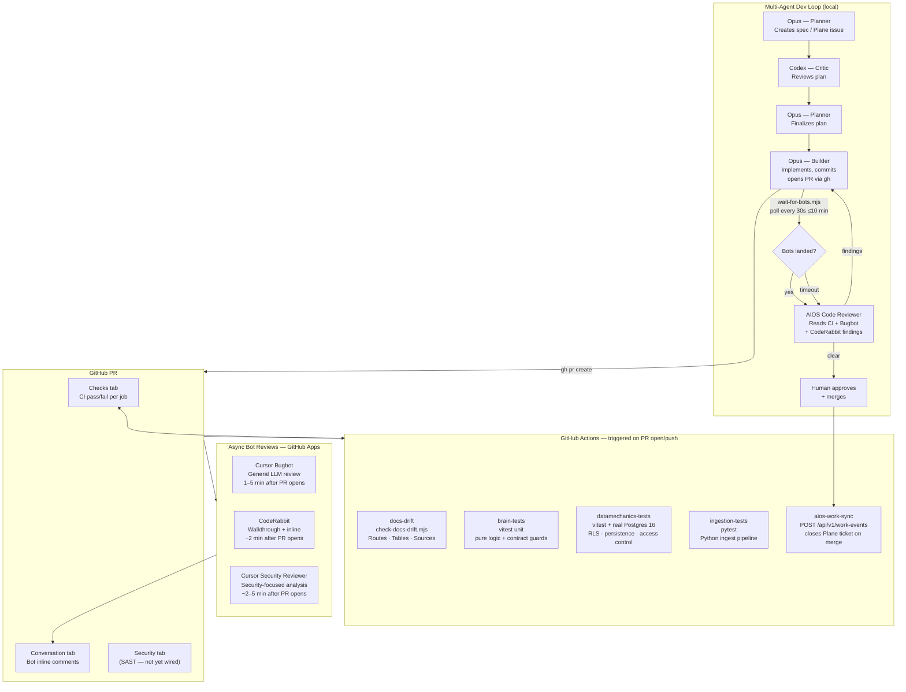

# CI/CD Architecture — AIOS Team Brain

## Overview

This document describes the full CI/CD pipeline for `aios-team-brain`, including automated tests, async bot reviews, and how the multi-agent dev loop integrates with GitHub.

---

## Pipeline Diagram



---

## GitHub Actions Workflows

### `ci.yml` — required gate on every PR and push to `main`

| Job | What it runs | Blocks merge? |
|---|---|---|
| `docs-drift` | `node scripts/check-docs-drift.mjs` — validates routes, tables, sources against `docs/ARCHITECTURE.md` markers | Yes |
| `brain-tests` | `npm test` — vitest unit tests (pure logic, parse/format, contract guards) | Yes |
| `datamechanics-tests` | `npm run test:datamechanics` against real Postgres 16 (port 5434) — RLS, persistence, access control | Yes |
| `ingestion-tests` | `pytest -q` inside `ingestion/` — Python ingest pipeline | Yes |

All four must pass for a PR to merge (enforced via branch protection).

### `aios-work-sync.yml` — fires on merge to `main`

Extracts `AIOS-Work: <KEY>` from the PR title/body and POSTs a merge event to `/api/v1/work-events`. This closes the matching Plane work item automatically.

**Required secrets:** `AIOS_BRAIN_URL`, `AIOS_API_KEY`, `AIOS_TEAM`

---

## Async Bot Reviews

These run outside GitHub Actions and post comments to the PR conversation. They are not required checks — they are signals for the Code Reviewer agent.

| Bot | GitHub user | Typical delay | What it covers |
|---|---|---|---|
| Cursor Bugbot | `cursor[bot]` | 1–5 min | General logic, naming, patterns |
| CodeRabbit | `coderabbitai[bot]` | ~2 min | Walkthrough summary + inline suggestions |
| Cursor Security Reviewer | `cursor[bot]` | 2–5 min | Auth, injection, secrets, access control |

**Polling:** The builder agent runs `wait-for-bots.mjs` from the `aios-workspace` repo, passing `--repo` explicitly to target any AIOS-alpha repo:

```bash
node /path/to/aios-workspace/scripts/wait-for-bots.mjs \
  --pr <n> --repo AIOS-alpha/aios-team-brain
```

The script lives only in `aios-workspace` (not duplicated here) — it is a shared cross-repo tool. It blocks until `cursor[bot]` and `coderabbitai[bot]` have both posted substantive feedback after the latest push (rate-limit stubs and pre-push comments are rejected), then prints a summary before the Code Reviewer agent runs.

---

## Local Development Hooks

| Hook | When | What |
|---|---|---|
| `.githooks/pre-push` | Every `git push` | Runs `check-docs-drift.mjs` — blocks push if docs are out of sync |

Installed automatically via `npm prepare` → `git config core.hooksPath .githooks`.

---

## Docs Drift Guard

Three surfaces are machine-validated to stay in sync with `docs/ARCHITECTURE.md`:

- **Routes** — derived from `app/api/**/route.ts` HTTP method exports
- **Tables** — derived from `postgres/schema.sql`
- **Sources** — derived from `ingestion/aios_ingest/sources/registry.py`

If you add an API route, table, or ingest source, update the corresponding `<!-- drift:* -->` block in `docs/ARCHITECTURE.md` in the same PR. The pre-push hook and CI both enforce this.

---

## Branch Protection (required — verify in GitHub Settings)

Repo: `AIOS-alpha/aios-team-brain` → Settings → Branches → `main`

- [x] Require status checks: `docs-drift`, `brain-tests`, `datamechanics-tests`, `ingestion-tests`
- [x] Require branches to be up to date before merging
- [x] Dismiss stale reviews on new pushes
- [x] Require review from code owners (CODEOWNERS)

---

## Optimized Agent Pipeline Sequencing

```
1. Opus (Planner)  → creates spec from Plane issue
2. Codex (Critic)  → reviews plan, requests changes
3. Opus (Planner)  → finalizes, hands off to builder
4. Opus (Builder)  → implements, commits, opens PR
5.                   GitHub Actions CI fires (parallel jobs)
6.                   Cursor Bugbot + CodeRabbit fire async
7. wait-for-bots   → polls every 30s until both bots have posted (≤10 min)
8. Code Reviewer   → reads CI status + all bot comments → structured findings
9. Opus (Builder)  → addresses findings, pushes fix commits if needed
10. Human          → approves + merges
11.                  aios-work-sync fires → Plane ticket closed
```
