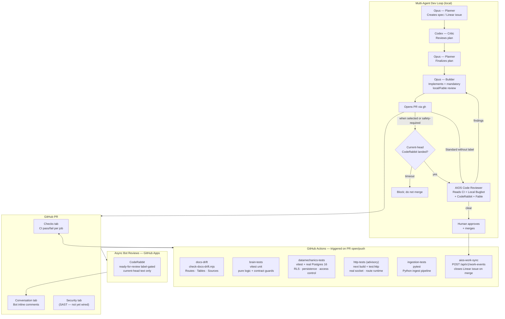

# CI/CD Architecture — AIOS Team Brain

## Overview

This document describes the full CI/CD pipeline for `aios-team-brain`, including automated tests, async bot reviews, and how the multi-agent dev loop integrates with GitHub.

---

## Pipeline Diagram



---

## GitHub Actions Workflows

### `ci.yml` — required gate on every PR and push to `main`

| Job                   | What it runs                                                                                                                                                     | Blocks merge? |
| --------------------- | ---------------------------------------------------------------------------------------------------------------------------------------------------------------- | ------------- |
| `docs-drift`          | `node scripts/check-docs-drift.mjs` — validates routes, tables, sources against `docs/ARCHITECTURE.md` markers                                                   | Yes           |
| `brain-tests`         | `npm test` — vitest unit tests (pure logic, parse/format, contract guards)                                                                                       | Yes           |
| `datamechanics-tests` | `npm run test:datamechanics` against real Postgres 16 (port 5434) — RLS, persistence, access control                                                             | Yes           |
| `http-tests`          | `npm run build` + `npm run test:http` — the API over a real socket against Postgres 16: TCP fetch, the Next.js route runtime (cookies/headers), JSON wire format | No (advisory) |
| `ingestion-tests`     | `pytest -q` inside `ingestion/` — Python ingest pipeline                                                                                                         | Yes           |

The four required jobs (`docs-drift`, `brain-tests`, `datamechanics-tests`, `ingestion-tests`) must pass for a PR to merge (enforced via branch protection). `http-tests` runs `continue-on-error` (advisory) until it proves stable — see Branch Protection below.

### `aios-work-sync.yml` — fires on merge to `main`

Extracts `AIOS-Work: <KEY>` from the PR title/body and POSTs a merge event to `/api/v1/work-events`. This closes the matching issue in the team's primary PM tool automatically — currently **Linear** (the brain projects the merge event to whichever provider `teams.primary_pm_provider` names; the sync path itself is provider-neutral).

**Required secrets:** `AIOS_BRAIN_URL`, `AIOS_API_KEY`, `AIOS_TEAM`

---

## Review evidence

Local Bugbot is the canonical automated review when the workspace ship tooling drives the change.
Its markdown artifact is valid only for the exact branch head and verified base SHA. This repository
also requires the independent Fable diff review before push, recorded in the PR body.

CodeRabbit runs outside GitHub Actions and posts to the PR conversation. `.coderabbit.yaml` disables
automatic review and incremental review; applying `ready-for-review` triggers the initial review.
CodeRabbit is optional for Standard PRs and mandatory for safety-sensitive PRs. After a fix push,
post `@coderabbitai review` to obtain fresh evidence.

The shared waiter lives in `aios-workspace` and accepts only substantive `coderabbitai[bot]` issue
comments, inline comments, or submitted reviews at or after the latest PR commit:

```bash
node /path/to/aios-workspace/scripts/wait-for-bots.mjs \
  --pr <n> --repo aiosbrain/aios-team-brain
```

A successful check run alone, a rate-limit stub, or pre-push text does not satisfy the gate. The
tool does not query or wait for `cursor[bot]`.

---

## Local Development Hooks

| Hook                 | When             | What                                                              |
| -------------------- | ---------------- | ----------------------------------------------------------------- |
| `.githooks/pre-push` | Every `git push` | Runs `check-docs-drift.mjs` — blocks push if docs are out of sync |

Installed automatically via `npm prepare` → `git config core.hooksPath .githooks`.

---

## Docs Drift Guard

Three surfaces are machine-validated to stay in sync with `docs/ARCHITECTURE.md`:

- **Routes** — derived from `app/api/**/route.ts` HTTP method exports
- **Tables** — derived from `postgres/schema.sql`
- **Sources** — derived from `ingestion/aios_ingest/sources/registry.py`

If you add an API route, table, or ingest source, update the corresponding `<!-- drift:* -->` block in `docs/ARCHITECTURE.md` in the same PR. The pre-push hook and CI both enforce this.

---

## Branch Protection (required — verify in GitHub Settings)

Repo: `aiosbrain/aios-team-brain` → Settings → Branches → `main`

- [x] Require status checks: `docs-drift`, `brain-tests`, `datamechanics-tests`, `ingestion-tests`
- [ ] `http-tests` — currently advisory (`continue-on-error`). Graduate to required after 5 consecutive green runs on `main`: drop `continue-on-error` in `ci.yml` and add it to this list.
- [x] Require branches to be up to date before merging
- [x] Dismiss stale reviews on new pushes
- [x] Require review from code owners (CODEOWNERS)

---

## Optimized Agent Pipeline Sequencing

```
1. Opus (Planner)  → creates spec from Linear issue
2. Codex (Critic)  → reviews plan, requests changes
3. Opus (Planner)  → finalizes, hands off to builder
4. Opus (Builder)  → implements, commits, opens PR
5.                   GitHub Actions CI fires (parallel jobs)
6. Fable           → reviews the exact branch diff before push; verdict recorded in PR
7. CodeRabbit      → label-triggered when selected/safety-required; current-head text required
8. Code Reviewer   → reads CI + Local Bugbot + current-head CodeRabbit + Fable evidence
9. Opus (Builder)  → addresses findings; a push invalidates prior review evidence
10. Human/operator → approves + merges (safety work cannot use `--auto-merge`)
11.                  aios-work-sync fires → Linear issue closed
```
