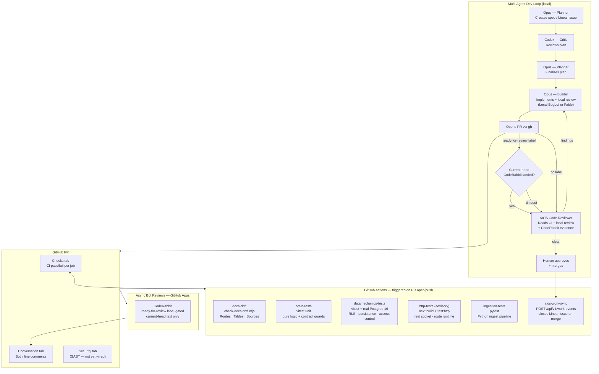

# CI/CD Architecture — AIOS Team Brain

## Overview

This document describes the full CI/CD pipeline for `aios-team-brain`, including automated tests, async bot reviews, and how the multi-agent dev loop integrates with GitHub.

---

## Pipeline Diagram



---

## GitHub Actions Workflows

### `ci.yml` — required gate on every PR and push to `main`

| Job                   | What it runs                                                                                                                                                     | Blocks merge? |
| --------------------- | ---------------------------------------------------------------------------------------------------------------------------------------------------------------- | ------------- |
| `docs-drift`          | `node scripts/check-docs-drift.mjs` — validates routes, tables, sources against `docs/ARCHITECTURE.md` markers                                                   | Yes           |
| `brain-tests`         | `npm test` — vitest unit tests (pure logic, parse/format, contract guards)                                                                                       | Yes           |
| `datamechanics-tests` | `npm run test:datamechanics` against real Postgres 16 (port 5434) — RLS, persistence, access control                                                             | Yes           |
| `http-tests`          | `npm run build` + `npm run test:http` — the API over a real socket against Postgres 16: TCP fetch, the Next.js route runtime (cookies/headers), JSON wire format | No (advisory) |
| `ingestion-tests`     | `pytest -q` inside `ingestion/` — Python ingest pipeline                                                                                                         | Yes           |

The four required jobs (`docs-drift`, `brain-tests`, `datamechanics-tests`, `ingestion-tests`) must pass for a PR to merge (enforced via branch protection). `http-tests` runs `continue-on-error` (advisory) until it proves stable — see Branch Protection below.

### `aios-work-sync.yml` — fires on merge to `main`

Extracts `AIOS-Work: <KEY>` from the PR title/body and POSTs a merge event to `/api/v1/work-events`. This closes the matching issue in the team's primary PM tool automatically — currently **Linear** (the brain projects the merge event to whichever provider `teams.primary_pm_provider` names; the sync path itself is provider-neutral).

**Required secrets:** `AIOS_BRAIN_URL`, `AIOS_API_KEY`, `AIOS_TEAM`

---

## Review evidence

The team is small and members use different local reviewers — **John runs Local Bugbot (Cursor)**,
**Chetan runs Fable** (`Agent(subagent_type: "code-reviewer", model: "fable")` from the
`aios-workspace` ship tooling). Whichever ran is the local evidence, recorded as one line in the
PR body. Local review evidence is scoped to the branch head it reviewed — treat it as stale after
a fix commit or base movement. **None of this blocks a push or merge; only the required CI checks
do.**

CodeRabbit runs outside GitHub Actions and posts to the PR conversation. `.coderabbit.yaml` keeps
`auto_review.enabled: true` but restricts it with `labels: [ready-for-review]` — auto-review fires
only on PRs carrying that label (`labels` filters automatic reviews; it is not a trigger on its
own). Incremental review is off, so after a fix push post `@coderabbitai review` for fresh
evidence. Apply the label when no local reviewer was available, or whenever you want the extra
pass.

To wait for CodeRabbit, use the shared waiter from `aios-workspace` **with the `--bots` flag** —
its default gates on `cursor[bot]` too (remote Bugbot is disabled here, so the default would just
time out), and a completed check run can satisfy it, so read the printed signal and prefer comment
or review text as evidence:

```bash
node /path/to/aios-workspace/scripts/wait-for-bots.mjs \
  --pr <n> --repo aiosbrain/aios-team-brain --bots 'coderabbitai[bot]'
```

Rate-limit stubs and pre-push text are rejected by the waiter automatically.

---

## Local Development Hooks

| Hook                 | When             | What                                                              |
| -------------------- | ---------------- | ----------------------------------------------------------------- |
| `.githooks/pre-push` | Every `git push` | Runs `check-docs-drift.mjs` — blocks push if docs are out of sync |

Installed automatically via `npm prepare` → `git config core.hooksPath .githooks`.

---

## Docs Drift Guard

Three surfaces are machine-validated to stay in sync with `docs/ARCHITECTURE.md`:

- **Routes** — derived from `app/api/**/route.ts` HTTP method exports
- **Tables** — derived from `postgres/schema.sql`
- **Sources** — derived from `ingestion/aios_ingest/sources/registry.py`

If you add an API route, table, or ingest source, update the corresponding `<!-- drift:* -->` block in `docs/ARCHITECTURE.md` in the same PR. The pre-push hook and CI both enforce this.

---

## Branch Protection (required — verify in GitHub Settings)

Repo: `aiosbrain/aios-team-brain` → Settings → Branches → `main`

- [x] Require status checks: `docs-drift`, `brain-tests`, `datamechanics-tests`, `ingestion-tests`
- [ ] `http-tests` — currently advisory (`continue-on-error`). Graduate to required after 5 consecutive green runs on `main`: drop `continue-on-error` in `ci.yml` and add it to this list.
- [x] Require branches to be up to date before merging
- [x] Dismiss stale reviews on new pushes
- [x] Require review from code owners (CODEOWNERS)

---

## Optimized Agent Pipeline Sequencing

```
1. Opus (Planner)  → creates spec from Linear issue
2. Codex (Critic)  → reviews plan, requests changes
3. Opus (Planner)  → finalizes, hands off to builder
4. Local review    → Local Bugbot (John) or Fable (Chetan) on the branch diff; recorded in PR body
5. Opus (Builder)  → commits, opens PR
6.                   GitHub Actions CI fires (parallel jobs)
7. CodeRabbit      → fires only on PRs labeled ready-for-review (auto_review label filter)
8. Code Reviewer   → reads CI + whatever local review ran + current-head CodeRabbit evidence
9. Opus (Builder)  → addresses findings; a push makes prior review evidence stale
10. Human          → approves + merges (only required CI checks block)
11.                  aios-work-sync fires → Linear issue closed
```
