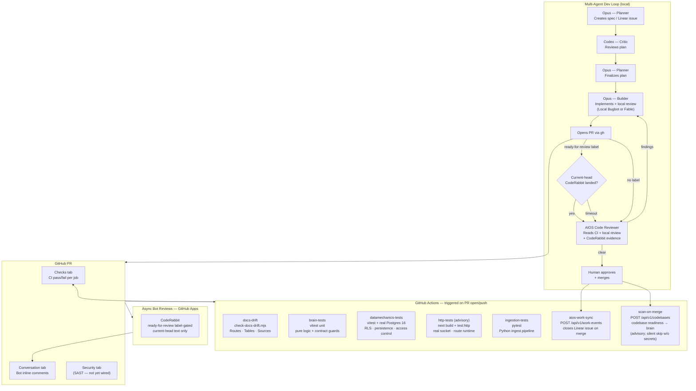

# CI/CD Architecture — AIOS Team Brain

## Overview

This document describes the full CI/CD pipeline for `aios-team-brain`, including automated tests, async bot reviews, and how the multi-agent dev loop integrates with GitHub.

---

## Pipeline Diagram


```mermaid
flowchart TD
    subgraph AgentLoop["Multi-Agent Dev Loop (local)"]
        A1[Opus — Planner\nCreates spec / Linear issue] --> A2[Codex — Critic\nReviews plan]
        A2 --> A3[Opus — Planner\nFinalizes plan]
        A3 --> A4["Opus — Builder\nImplements + local review\n(Local Bugbot or Fable)"]
        A4 --> A4P[Opens PR via gh]
        A4P -->|ready-for-review label| A4W{Current-head\nCodeRabbit landed?}
        A4W -->|yes| A5["AIOS Code Reviewer\nReads CI + local review\n+ CodeRabbit evidence"]
        A4W -->|timeout| A5
        A4P -->|no label| A5
        A5 -->|findings| A4
        A5 -->|clear| MERGE[Human approves\n+ merges]
    end

    subgraph GitHubActions["GitHub Actions — triggered on PR open/push"]
        B1["docs-drift\ncheck-docs-drift.mjs\nRoutes · Tables · Sources"]
        B2["brain-tests\nvitest unit\npure logic + contract guards"]
        B3["datamechanics-tests\nvitest + real Postgres 16\nRLS · persistence · access control"]
        B4["http-tests (advisory)\nnext build + test:http\nreal socket · route runtime"]
        B5["ingestion-tests\npytest\nPython ingest pipeline"]
        B6["aios-work-sync\nPOST /api/v1/work-events\ncloses Linear issue on merge"]
        B7["scan-on-merge\nPOST /api/v1/codebases\ncodebase readiness → brain\n(advisory; silent skip w/o secrets)"]
    end

    subgraph BotReviews["Async Bot Reviews — GitHub Apps"]
        C1["CodeRabbit\nready-for-review label-gated\ncurrent-head text only"]
    end

    subgraph GitHubPR["GitHub PR"]
        D1["Checks tab\nCI pass/fail per job"]
        D2["Conversation tab\nBot inline comments"]
        D3["Security tab\n(SAST — not yet wired)"]
    end

    A4P --> GitHubPR
    GitHubPR --> GitHubActions
    GitHubPR --> BotReviews
    GitHubActions --> D1
    BotReviews --> D2
    MERGE --> B6
    MERGE --> B7
```

---

## GitHub Actions Workflows

### `ci.yml` — required gate on every PR and push to `main`

| Job                   | What it runs                                                                                                                                                     | Blocks merge? |
| --------------------- | ---------------------------------------------------------------------------------------------------------------------------------------------------------------- | ------------- |
| `docs-drift`          | `node scripts/check-docs-drift.mjs` — validates routes, tables, sources against `docs/ARCHITECTURE.md` markers                                                   | Yes           |
| `brain-tests`         | `npm test` — vitest unit tests (pure logic, parse/format, contract guards)                                                                                       | Yes           |
| `datamechanics-tests` | `npm run test:migrate-from-existing` + `npm run test:datamechanics` against real Postgres 16 (port 5434) — schema upgrade-from-a-released-tag, RLS, persistence, access control | Yes           |
| `http-tests`          | `npm run build` + `npm run test:http` — the API over a real socket against Postgres 16: TCP fetch, the Next.js route runtime (cookies/headers), JSON wire format | No (advisory) |
| `ingestion-tests`     | `pytest -q` inside `ingestion/` — Python ingest pipeline                                                                                                         | Yes           |

The four required jobs (`docs-drift`, `brain-tests`, `datamechanics-tests`, `ingestion-tests`) must pass for a PR to merge (enforced via branch protection). `http-tests` runs `continue-on-error` (advisory) until it proves stable — see Branch Protection below.

### `migration-mirror-nightly.yml` — deletion-observability sweep (nightly, advisory)

`npm run test:migrate-from-existing:sweep` — rebuilds the schema from zero once per migration, each
time omitting exactly ONE migration, and asserts the catalog fingerprint never moves. That is the
machine-checkable form of the `postgres/migrations/README.md` rule *"mirror the change into
postgres/schema.sql"*. Scheduled (03:17 UTC) plus `workflow_dispatch`, not per-PR: it is ~76 full
schema loads. The cheap per-PR approximation (`--mirror-check`, in `datamechanics-tests`) compares
`schema.sql` alone against `schema.sql` + every migration and catches the same class in seconds.

Why the pair exists at all: `npm run pg:schema` on a FRESH database loads `schema.sql` first, which
already creates every object in its final shape, so every migration replayed after it is a no-op.
A from-zero build therefore cannot observe an additive migration — delete one and the suite stays
green. The migrate-from-existing lane loads a real released tag's schema state instead (straight out
of git; no fixture files), rolls the current deploy forward over it, and compares. Both jobs need
`fetch-depth: 0` on checkout, because the prior states are git tags.

### `pr-review-gate.yml` — the review gate (REQUIRED)

Fails a non-draft PR whose body records no `Reviewed by … — verdict …` line and which carries no
`ready-for-review` label. Drafts are skipped and it re-runs on `ready_for_review`, so a draft can be
pushed freely. The matcher is `scripts/pr-review-gate.mjs` (unit-tested in `test/pr-review-gate.test.ts`)
— deliberately permissive about FORM (heading level, emphasis, bare line, any dash, NBSP, CRLF) and
strict only about SUBSTANCE, because a gate that rejects honest attestations gets switched off. Text
inside fenced blocks and HTML comments is ignored, so quoting the template neither satisfies nor poisons
the check. Reads only the event payload — no secrets, no network. See CLAUDE.md §"Review gate".

### `aios-work-sync.yml` — fires on a merged PR into `main` or `staging`

Extracts work keys from the PR **title, body and branch ref** and POSTs a merge event to `/api/v1/work-events`. This closes the matching issue in the team's primary PM tool automatically — currently **Linear** (the brain projects the merge event to whichever provider `teams.primary_pm_provider` names; the sync path itself is provider-neutral).

**Required secrets:** `AIOS_BRAIN_URL`, `AIOS_API_KEY`, `AIOS_TEAM`

**⛔ It runs on `pull_request_target`, and every line of code it executes comes from the base branch** — the same shape, and for the same reason, as `pr-task-link.yml` below. The trigger used to be `pull_request: types: [closed]`, and on `pull_request` GitHub takes the **workflow file itself** from the PR head. So the `merged == true` guard was contributor-editable, and the attack needed no merge and no approval: push a branch, edit this file to delete the guard and print the three secrets, open a PR, then **close it unmerged** — `closed` fires on any close. Same class as `pr-task-link.yml`'s defect, one step worse, because the thing that was supposed to limit it lived inside the rewritable file.

What makes the current shape safe, in the order the properties matter:

- **Base-branch code only.** `actions/checkout` takes no `ref:` — on `pull_request_target` the default is the base branch — and nothing from the PR head is fetched, installed, built or executed. The PR contributes **data only**: title, body, branch ref, head SHA, merge-commit SHA, html URL, author and merger, each passed through the step's `env:` and read with `process.env`. No `github.event.*` expression appears in a `run:` body, because interpolation happens before the shell parses and a PR title is therefore a command-injection primitive next to a durable credential.
- **`branches: [main, staging]` is not decoration.** Under `pull_request_target` the "base" is whatever branch the PR targets, so without an explicit filter a collaborator pushes `evil`, opens `evil2 → evil`, and the trusted base-branch code **is their own tree**. The filter is what makes "base branch" mean a reviewed branch.
- **Same-repository condition.** `github.event.pull_request.head.repo.full_name == github.repository`, alongside `merged == true`. Under `pull_request` a fork run received no secrets and skipped harmlessly; `pull_request_target` would newly hand the brain credentials to a run an outside contributor can start, so the condition restores what the old trigger gave for free.
- **`permissions: contents: read` only**, and `environment: trusted-automation` — a blast-radius control, **not** a fork boundary; see the identical note under `pr-task-link.yml`.

`test/guards/pr-task-link-credential-isolation.test.ts` pins every one of those as parsed YAML, and its `KNOWN_GAPS` list is now **empty**: no PR-reachable workflow in this repo is excused from the rule.

**One cost, inert today and not at the RELPTR-4 cutover.** The environment's deployment branch policy allows `main` only, and on `pull_request_target` the run's ref is the PR's target branch. A merge into `staging` would be **refused the environment** and the job would go red having run zero steps — loud rather than silent, but with no work event posted. No PR targets `staging` today; at the cutover the branch policy and the trigger list move together. `docs/RELEASING.md` §3.1c carries the entry.

### Work-key extraction — `scripts/pr-work-keys.mjs` (ONE copy)

Both this workflow and `pr-task-link.yml` (advisory) read a PR for the ticket it cites, and both call the same module — guarded by `test/guards/work-key-single-matcher.test.ts`, which discovers workflows from disk so a new one can't inline its own copy. They used to have one each, so the advisory check could clear a PR whose keys the merge step then read differently.

Two behaviours worth knowing:

- **Quoted keys don't count.** HTML comments, fenced blocks and inline code are stripped from the body before matching, so prose like ``supersedes `AIO-100` `` is not a citation. That direction is deliberate: `/api/v1/work-events` sets `status='done'` on a key matching a task in the pushed project, so over-matching closes the **wrong** ticket silently, while under-matching only leaves the board stale — and the advisory check announces that at open time.
- **The existence check asks about the keys, not for the table.** It calls `GET /api/v1/tasks?mode=table&keys=A,B` (brain-api 1.14), which is bounded by the keys asked for, so absence is proof and the brain answers `unknown_keys` outright. That is what lets an invented key be *called* invented.

  The fallback matters as much: against a brain that predates 1.14 (400 on `keys`) it re-asks `?all=1`, which is capped at 500 rows ordered stalest-first. There a key found is confirmed, but a key absent from a **full** page reports `unverified`, never "invented" — the check is not allowed to accuse on data it never saw. That distinction exists because the check's first real run told us a real ticket didn't exist; on this team's data (677 tasks) `?all=1` could never have seen it.

### `pr-task-link.yml` — advisory work-key check on PRs into `main`

Warns (never fails) when a PR cites no brain work-key, and — when the brain credentials below are present — asks the brain whether the cited keys actually exist, using the shared matcher above. Without credentials it degrades to a FORMAT-only check and says so in the annotation. It is the open-time counterpart to `aios-work-sync.yml`'s merge-time close.

**⛔ It runs on `pull_request_target`, and every line of code it executes comes from the base branch.** This is the reverse of what this section used to say, and the old reasoning is worth recording because it was confidently wrong. It argued that `pull_request` was safe because GitHub withholds secrets from **fork** runs — true, and beside the point. A **same-repository branch PR** (how every maintainer and agent works here) receives the full secret set, and on `pull_request` `actions/checkout` hands the job the PR's own merge ref. The old shape therefore executed `scripts/pr-work-keys.mjs` **as edited by the pull request** with a TEAM-tier `AIOS_API_KEY`, `AIOS_BRAIN_URL` and `AIOS_TEAM` in the environment: one same-repo PR editing that file exfiltrated a durable brain credential.

What makes the current shape safe:

- **`pull_request_target` runs the base branch's workflow file and the base branch's code.** `actions/checkout` takes no `ref:`, so it checks out `main`. The PR contributes **data only** — title, body, branch name, number — read out of `GITHUB_EVENT_PATH` as JSON and fed to a regex. It is never interpolated into a `run:` block (interpolation happens before the shell parses, which is a command-injection primitive next to a durable credential), and never selects what to check out or fetch.
- **`environment: trusted-automation` is a blast-radius control, NOT a trust boundary — and the distinction is the whole point.** It limits **which workflows in this repo** can reach the credential. It does **not** keep the credential away from untrusted **authors**. Measured in a disposable repository rather than assumed: a `pull_request_target` run has `GITHUB_REF=refs/heads/main`, satisfies the `main`-only deployment branch policy, and receives the environment's secrets — and **a fork PR receives them too**, because on `pull_request_target` the ref is always the base branch, so every author satisfies the policy regardless of who they are. Anyone reading the environment as fork protection would be repeating this workflow's original mistake in a new place.

  So the only thing protecting this key is the rule above: **base-branch code only, no PR-head checkout/fetch/import/execute, no attacker-controlled value interpolated into a `run:` body.** Treat it as load-bearing, because it is the entire defence.

  The environment is also **not connected yet**: `AIOS_API_KEY`, `AIOS_BRAIN_URL` and `AIOS_TEAM` still exist as plain repository secrets, and GitHub gives those to every job whether or not it names an environment — an environment secret only *shadows* a same-named repository secret, it does not revoke access to one. Connecting it means entering the values there **and deleting the repository-level copies**. That deletion used to be blocked on `aios-work-sync.yml`, whose `pull_request: closed` runs had ref `refs/pull/N/merge` that a `main`-only policy would refuse; it no longer is. **All three `AIOS_*` consumers — this file, `aios-work-sync.yml` and `scan-on-merge.yml` — now name the environment**, which `test/guards/pr-task-link-credential-isolation.test.ts` asserts by enumerating every job with one of the three secrets in scope rather than by naming the three files. So the deletion is unblocked and is a **repository-admin action**, not a code change. The trigger here is pinned to `branches: [main]` so the run's ref always matches the policy; if the contribution base moves (RELPTR-4) the trigger list and the branch policy move together — `docs/RELEASING.md` §3.1c carries that entry.

  **A mismatched branch policy fails loudly**, not silently: `Branch "x" is not allowed to deploy to trusted-automation`, job failed, zero steps run. It never arrives as an empty secret.
- **`permissions: contents: read` only.** No `statuses: write` / `checks: write` — a PR-reachable workflow with either can mint a required context on an arbitrary SHA (`test/guards/workflow-permissions.test.ts`).
- **Never a PR-head checkout, fetch, install, or artifact download.** `test/guards/pr-task-link-credential-isolation.test.ts` parses the workflow YAML as data and fails the build on each of those shapes, for this file and for every other PR-reachable workflow that holds a secret.

One thing nothing pins: **"advisory" also depends on this job's context never being added to `main`'s required checks.** `continue-on-error: true` stops the workflow run from failing and the check is not required today (verified against the branch-protection API), but the job's own check-run conclusion is still `failure`, so making it required would turn a nudge into a blocker. Don't.

The soft-skip path — `brain credentials not configured (missing: …) — only the FORMAT was checked`, green — covers exactly one window: the repository copies have been deleted and the environment has not been populated. It is **not** what happens today (the repository secrets still resolve), and it is **not** a guard against a branch-policy mismatch, which fails loudly instead. It names the missing variables — names only, never values — so that window is distinguishable in the log from any other quiet outcome.

### `scan-on-merge.yml` — fires on push to `main` (advisory; nothing blocks on it)

Runs the Python codebase scanner over this repo and POSTs the result to `/api/v1/codebases`, so the Codebases dashboard's agent-readiness figures for `aios-team-brain` stay fresh. It runs `npm run coverage` first purely as a **metrics source** for the scanner's `_read_coverage()` (`|| true` — the coverage _gate_ stays in `ci.yml`), then `python -m aios_ingest.cli scan`. Concurrency group `scan-on-merge` with `cancel-in-progress: true`, and the job is pinned to `if: github.repository == 'aiosbrain/aios-team-brain'` so a fork never scans into someone else's brain.

**Required secrets — the SAME three as `aios-work-sync.yml`:** `AIOS_BRAIN_URL`, `AIOS_TEAM`, `AIOS_API_KEY`. The job names `environment: trusted-automation` for the same reason the other two do — enrolment, so the repository-level copies can be deleted; it is not a boundary of any kind here, since this workflow is not PR-reachable at all. Its trigger is `push`, so the run's ref is the pushed branch: `main` satisfies the `main`-only branch policy, and a push to `staging` would be refused it and fail with zero steps run. Nothing has pushed `staging` since 2026-07-25.

Three things about them are easy to get wrong, and each fails in a way that does not look like a failure:

- **`AIOS_BRAIN_URL` is handed to the scanner as `BRAIN_URL`, not under its own name.** The Python side reads `BRAIN_URL` / `AIOS_API_KEY` / `AIOS_TEAM` (`ingestion/aios_ingest/config.py`), so the step's `env:` block does the rename. Copying the `env:` from `aios-work-sync.yml` verbatim — which passes `AIOS_BRAIN_URL` straight through — leaves the scanner with no brain URL at all.
- **The key must be TEAM tier.** `POST /api/v1/codebases` rejects anything else with `403 forbidden_tier` ("codebase metrics are team-tier only"). There is no admin key tier to reach for instead: `authenticateApiKey` only ever yields `"team" | "external"` (`lib/api/auth.ts`), so `external` is the only other thing a key can be, and it fails outright rather than degrading.
- **A missing secret is a SILENT SKIP, not a failure.** The scan step guards on `[ -z "$AIOS_API_KEY" ] || [ -z "$BRAIN_URL" ] || [ -z "$AIOS_TEAM" ]` and then `exit 0`, so the job is **green** and the repo simply stops appearing in the brain. That fail-open is exactly how a repo goes invisible to the brain for days without anything turning red — it is what happened to the repos the multi-repo split created. **Read the step log, not the check mark:** a real scan prints `scanned <slug>: N commits (M AI-assisted), … coverage=…, readiness=…` and then spends most of its wall-clock uploading; a skip prints `scan secrets not configured (BRAIN_URL/AIOS_TEAM/AIOS_API_KEY) — skipping` and the step ends immediately.

**A configured scan can still go red** — the workflow's "never red" comment covers only the missing-secret path. `/api/v1/codebases` is rate-limited at 60 POSTs per minute per key and the scanner gives up with `BrainError: 429 rate_limited: gave up after 5 retries`, which fails the job (e.g. run `31999692276`, 2026-08-17). Nothing downstream blocks on that, but the readiness figure for that head SHA never lands — so a red scan is a real gap in the dashboard, not noise to mute.

---

## Review evidence

The team is small and members use different local reviewers — **John runs Local Bugbot (Cursor)**,
**Chetan runs Fable** (`Agent(subagent_type: "code-reviewer", model: "fable")` from the
`aios-workspace` ship tooling). Whichever ran is the local evidence, recorded as one line in the
PR body. Local review evidence is scoped to the branch head it reviewed — treat it as stale after
a fix commit or base movement. **Recording it is required**: `pr-review-gate.yml` fails a non-draft
PR that carries neither an attestation line nor the `ready-for-review` label. Which reviewer ran is
flexible; recording one is not.

CodeRabbit runs outside GitHub Actions and posts to the PR conversation. `.coderabbit.yaml` keeps
`auto_review.enabled: true` but restricts it with `labels: [ready-for-review]` — auto-review fires
only on PRs carrying that label (`labels` filters automatic reviews; it is not a trigger on its
own). Incremental review is off, so after a fix push post `@coderabbitai review` for fresh
evidence. Apply the label when no local reviewer was available, or whenever you want the extra
pass.

To wait for CodeRabbit, use the shared waiter from `aios-workspace` **with the `--bots` flag** —
its default gates on `cursor[bot]` too (remote Bugbot is disabled here, so the default would just
time out), and a completed check run can satisfy it, so read the printed signal and prefer comment
or review text as evidence:

```bash
node /path/to/aios-workspace/scripts/wait-for-bots.mjs \
  --pr <n> --repo aiosbrain/aios-team-brain --bots 'coderabbitai[bot]'
```

Rate-limit stubs and pre-push text are rejected by the waiter automatically.

---

## Local Development Hooks

| Hook                 | When             | What                                                              |
| -------------------- | ---------------- | ----------------------------------------------------------------- |
| `.githooks/pre-push` | Every `git push` | Runs `check-docs-drift.mjs` — blocks push if docs are out of sync |

Installed automatically via `npm prepare` → `git config core.hooksPath .githooks`.

---

## Docs Drift Guard

Three surfaces are machine-validated to stay in sync with `docs/ARCHITECTURE.md`:

- **Routes** — derived from `app/api/**/route.ts` HTTP method exports
- **Tables** — derived from `postgres/schema.sql`
- **Sources** — derived from `ingestion/aios_ingest/sources/registry.py`

If you add an API route, table, or ingest source, update the corresponding `<!-- drift:* -->` block in `docs/ARCHITECTURE.md` in the same PR. The pre-push hook and CI both enforce this.

---

## Branch Protection (required — verify in GitHub Settings)

Repo: `aiosbrain/aios-team-brain` → Settings → Branches → `main`

> **Every box below was verified against the live protection API on 2026-07-31** (`gh api
> repos/aiosbrain/aios-team-brain/branches/main/protection`). Four of them claimed settings that were
> not on. A checklist that asserts protection the repo does not have is worse than no checklist — it
> is read as assurance. Re-verify against the API, not against this file, before trusting it.

- [x] Require status checks — **TEN** REQUIRED contexts as of a live API read on 2026-08-25 (this
      list said eight, which is precisely the drift the warning above tells you to expect). They are
      the job `name:`s, not the job ids: `Docs drift guard`, `Static checks (lint + typecheck)`,
      `Secret scan (gitleaks)`, `Brain unit tests (vitest)`, `Data-mechanics tests (real Postgres)`,
      `Integration tests (HTTP)`, `Ingestion tests (pytest)`, `PR records a diff review`,
      `NDA confidentiality gate`, `Graph Neo4j tier (real Neo4j)`.
- [x] `PR records a diff review` (`pr-review-gate.yml`) — enabled 2026-07-31. This box is the whole
      enforcement: without it the job goes red on an unattested PR but the PR stays mergeable.
      **Ordering, if it is ever re-added:** the workflow must be on `main` FIRST. A required context
      that no PR reports leaves every open PR stuck on "Expected — waiting for status", which is what
      happened to the seven PRs open when it was switched on — each needed one triggering event
      (a push, a body edit, or a label) before the check reported and they could merge.
- [x] `Integration tests (HTTP)` — **already graduated.** `ci.yml` dropped `continue-on-error` ("Now a
      blocking gate") and the context is required. This line used to prescribe a promotion that had
      already happened.
- [x] Require branches to be up to date before merging — **now ON** (`required_status_checks.strict
      = true`, live read 2026-08-25). This line recorded it as off, verified 2026-07-31; it was turned
      on since. The cost this line used to warn about is real and now paid: a PR must rebase whenever
      `main` moves, on this repo's merge rate. Left as-is
      rather than silently flipped: turning it on forces a rebase-and-re-run on every PR whenever `main`
      moves, which on this repo's merge rate is a real cost the team should choose deliberately.
- [ ] Dismiss stale reviews on new pushes — **documented as on, actually off**
      (`dismiss_stale_reviews: false`).
- [ ] Require review from code owners (CODEOWNERS) — **documented as on, actually off**
      (`require_code_owner_reviews: false`, `required_approving_review_count: 0`). Worth knowing when
      reasoning about the review gate: CODEOWNERS is NOT a backstop today, so the CI checks and the
      attestation are the only things standing between a diff and `main`.

---

## Environments — `production` and `staging` (AIO-483)

Railway project **AIOS** holds **two environments**, each with its **own Postgres, own volumes,
and own variables**. Nothing is shared between them.

| | `production` | `staging` |
| --- | --- | --- |
| Deploy trigger branch | `main` | `staging` |
| App URL | `aios-team-brain-production.up.railway.app` | `aios-team-brain-staging.up.railway.app` |
| Postgres | own instance | **separate** instance (empty at creation) |
| Services | `aios-team-brain`, `graphiti`, `neo4j`, `Postgres` | same four, duplicated |

**How a deploy happens (unchanged model): only by pushing/merging to the branch.** Railway's GitHub
integration auto-deploys `main` → `production` and `staging` → `staging`. There is no GitHub Actions
deploy job, and the Railway CLI stays read-only in this repo (see `CLAUDE.md` §6).

`ci.yml` runs on PRs and pushes to **both** `main` and `staging`, so `staging` carries the same
required-check bar. This paragraph used to say `aios-work-sync.yml` "stays scoped to `main` only —
a staging merge must not close Linear issues"; **RELPTR-4 reversed that decision** and widened both
`aios-work-sync.yml` and `scan-on-merge.yml` to `[main, staging]` ahead of the cutover, with the
accepted cost written into each workflow's header. See `docs/RELEASING.md` §3.1b for the
ticket-closing decision and §3.1c for what still moves on cutover day.

### Staging variable boundary

`DATABASE_URL` is a Railway **reference** (`${{Postgres.DATABASE_URL}}`), so each environment
resolves it to its own database — staging can never write to the production DB. Staging overrides
`APP_URL` and `SLACK_OAUTH_REDIRECT` to the staging domain and carries **its own freshly generated
`AUTH_SECRET` and `SECRETS_KEY`** (never production's). The `SLACK_*` credentials are **deleted**
from staging so it cannot act on the real Slack workspace.

### Staging membership is the access gate

Staging is invite-only through the app's existing membership system — the staging DB is seeded with
only the repo's collaborators. Seeding uses the existing admin CLI (no bespoke script), pointed at
the staging database:

```bash
# DATABASE_URL = the staging Postgres DATABASE_PUBLIC_URL (Railway → staging → Postgres)
npx tsx --conditions react-server scripts/admin.ts create-team aios --name AIOS
npx tsx --conditions react-server scripts/admin.ts create-member <email> \
  --name "<Name>" --handle <handle> --role <admin|lead|member> --team aios --upsert
npx tsx --conditions react-server scripts/admin.ts login-link <email> --team aios \
  --base-url https://aios-team-brain-staging.up.railway.app
```

A seeded member is `status=invited` and **cannot authenticate until first login flips it to
`active`** (`lib/api/auth.ts` requires `active`) — that is the invite gate, and it applies to API
keys too.

### Branch protection on `staging`

Settings → Branches → `staging` mirrors `main`'s required status checks and PR requirement, and
additionally **restricts who can push** to the named repo collaborators. Note GitHub silently drops
any user without write access from that restriction list, so a read-only collaborator must be
granted write before they appear.

---

## Optimized Agent Pipeline Sequencing

```
1. Opus (Planner)  → creates spec from Linear issue
2. Codex (Critic)  → reviews plan, requests changes
3. Opus (Planner)  → finalizes, hands off to builder
4. Local review    → Local Bugbot (John) or Fable (Chetan) on the branch diff; recorded in PR body
5. Opus (Builder)  → commits, opens PR
6.                   GitHub Actions CI fires (parallel jobs)
7. CodeRabbit      → fires only on PRs labeled ready-for-review (auto_review label filter)
8. Code Reviewer   → reads CI + whatever local review ran + current-head CodeRabbit evidence
9. Opus (Builder)  → addresses findings; a push makes prior review evidence stale
10. Human          → approves + merges (only required CI checks block)
11.                  aios-work-sync fires → Linear issue closed
```
