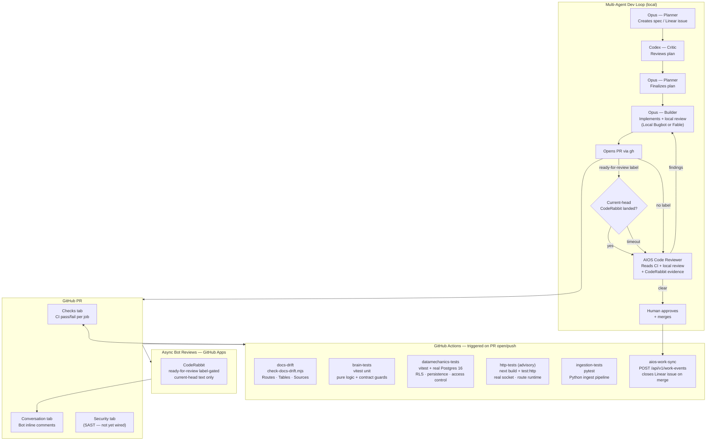

# CI/CD Architecture — AIOS Team Brain

## Overview

This document describes the full CI/CD pipeline for `aios-team-brain`, including automated tests, async bot reviews, and how the multi-agent dev loop integrates with GitHub.

---

## Pipeline Diagram


```mermaid
flowchart TD
    subgraph AgentLoop["Multi-Agent Dev Loop (local)"]
        A1[Opus — Planner\nCreates spec / Linear issue] --> A2[Codex — Critic\nReviews plan]
        A2 --> A3[Opus — Planner\nFinalizes plan]
        A3 --> A4["Opus — Builder\nImplements + local review\n(Local Bugbot or Fable)"]
        A4 --> A4P[Opens PR via gh]
        A4P -->|ready-for-review label| A4W{Current-head\nCodeRabbit landed?}
        A4W -->|yes| A5["AIOS Code Reviewer\nReads CI + local review\n+ CodeRabbit evidence"]
        A4W -->|timeout| A5
        A4P -->|no label| A5
        A5 -->|findings| A4
        A5 -->|clear| MERGE[Human approves\n+ merges]
    end

    subgraph GitHubActions["GitHub Actions — triggered on PR open/push"]
        B1["docs-drift\ncheck-docs-drift.mjs\nRoutes · Tables · Sources"]
        B2["brain-tests\nvitest unit\npure logic + contract guards"]
        B3["datamechanics-tests\nvitest + real Postgres 16\nRLS · persistence · access control"]
        B4["http-tests (advisory)\nnext build + test:http\nreal socket · route runtime"]
        B5["ingestion-tests\npytest\nPython ingest pipeline"]
        B6["aios-work-sync\nPOST /api/v1/work-events\ncloses Linear issue on merge"]
    end

    subgraph BotReviews["Async Bot Reviews — GitHub Apps"]
        C1["CodeRabbit\nready-for-review label-gated\ncurrent-head text only"]
    end

    subgraph GitHubPR["GitHub PR"]
        D1["Checks tab\nCI pass/fail per job"]
        D2["Conversation tab\nBot inline comments"]
        D3["Security tab\n(SAST — not yet wired)"]
    end

    A4P --> GitHubPR
    GitHubPR --> GitHubActions
    GitHubPR --> BotReviews
    GitHubActions --> D1
    BotReviews --> D2
    MERGE --> B6
```

---

## GitHub Actions Workflows

### `ci.yml` — required gate on every PR and push to `main`

| Job                   | What it runs                                                                                                                                                     | Blocks merge? |
| --------------------- | ---------------------------------------------------------------------------------------------------------------------------------------------------------------- | ------------- |
| `docs-drift`          | `node scripts/check-docs-drift.mjs` — validates routes, tables, sources against `docs/ARCHITECTURE.md` markers                                                   | Yes           |
| `brain-tests`         | `npm test` — vitest unit tests (pure logic, parse/format, contract guards)                                                                                       | Yes           |
| `datamechanics-tests` | `npm run test:datamechanics` against real Postgres 16 (port 5434) — RLS, persistence, access control                                                             | Yes           |
| `http-tests`          | `npm run build` + `npm run test:http` — the API over a real socket against Postgres 16: TCP fetch, the Next.js route runtime (cookies/headers), JSON wire format | No (advisory) |
| `ingestion-tests`     | `pytest -q` inside `ingestion/` — Python ingest pipeline                                                                                                         | Yes           |

The four required jobs (`docs-drift`, `brain-tests`, `datamechanics-tests`, `ingestion-tests`) must pass for a PR to merge (enforced via branch protection). `http-tests` runs `continue-on-error` (advisory) until it proves stable — see Branch Protection below.

### `pr-review-gate.yml` — the review gate (REQUIRED)

Fails a non-draft PR whose body records no `Reviewed by … — verdict …` line and which carries no
`ready-for-review` label. Drafts are skipped and it re-runs on `ready_for_review`, so a draft can be
pushed freely. The matcher is `scripts/pr-review-gate.mjs` (unit-tested in `test/pr-review-gate.test.ts`)
— deliberately permissive about FORM (heading level, emphasis, bare line, any dash, NBSP, CRLF) and
strict only about SUBSTANCE, because a gate that rejects honest attestations gets switched off. Text
inside fenced blocks and HTML comments is ignored, so quoting the template neither satisfies nor poisons
the check. Reads only the event payload — no secrets, no network. See CLAUDE.md §"Review gate".

### `aios-work-sync.yml` — fires on merge to `main`

Extracts work keys from the PR **title, body and branch ref** and POSTs a merge event to `/api/v1/work-events`. This closes the matching issue in the team's primary PM tool automatically — currently **Linear** (the brain projects the merge event to whichever provider `teams.primary_pm_provider` names; the sync path itself is provider-neutral).

**Required secrets:** `AIOS_BRAIN_URL`, `AIOS_API_KEY`, `AIOS_TEAM`

### Work-key extraction — `scripts/pr-work-keys.mjs` (ONE copy)

Both this workflow and `pr-task-link.yml` (advisory) read a PR for the ticket it cites, and both call the same module — guarded by `test/guards/work-key-single-matcher.test.ts`, which discovers workflows from disk so a new one can't inline its own copy. They used to have one each, so the advisory check could clear a PR whose keys the merge step then read differently.

Two behaviours worth knowing:

- **Quoted keys don't count.** HTML comments, fenced blocks and inline code are stripped from the body before matching, so prose like ``supersedes `AIO-100` `` is not a citation. That direction is deliberate: `/api/v1/work-events` sets `status='done'` on a key matching a task in the pushed project, so over-matching closes the **wrong** ticket silently, while under-matching only leaves the board stale — and the advisory check announces that at open time.
- **The existence check asks about the keys, not for the table.** It calls `GET /api/v1/tasks?mode=table&keys=A,B` (brain-api 1.14), which is bounded by the keys asked for, so absence is proof and the brain answers `unknown_keys` outright. That is what lets an invented key be *called* invented.

  The fallback matters as much: against a brain that predates 1.14 (400 on `keys`) it re-asks `?all=1`, which is capped at 500 rows ordered stalest-first. There a key found is confirmed, but a key absent from a **full** page reports `unverified`, never "invented" — the check is not allowed to accuse on data it never saw. That distinction exists because the check's first real run told us a real ticket didn't exist; on this team's data (677 tasks) `?all=1` could never have seen it.

---

## Review evidence

The team is small and members use different local reviewers — **John runs Local Bugbot (Cursor)**,
**Chetan runs Fable** (`Agent(subagent_type: "code-reviewer", model: "fable")` from the
`aios-workspace` ship tooling). Whichever ran is the local evidence, recorded as one line in the
PR body. Local review evidence is scoped to the branch head it reviewed — treat it as stale after
a fix commit or base movement. **Recording it is required**: `pr-review-gate.yml` fails a non-draft
PR that carries neither an attestation line nor the `ready-for-review` label. Which reviewer ran is
flexible; recording one is not.

CodeRabbit runs outside GitHub Actions and posts to the PR conversation. `.coderabbit.yaml` keeps
`auto_review.enabled: true` but restricts it with `labels: [ready-for-review]` — auto-review fires
only on PRs carrying that label (`labels` filters automatic reviews; it is not a trigger on its
own). Incremental review is off, so after a fix push post `@coderabbitai review` for fresh
evidence. Apply the label when no local reviewer was available, or whenever you want the extra
pass.

To wait for CodeRabbit, use the shared waiter from `aios-workspace` **with the `--bots` flag** —
its default gates on `cursor[bot]` too (remote Bugbot is disabled here, so the default would just
time out), and a completed check run can satisfy it, so read the printed signal and prefer comment
or review text as evidence:

```bash
node /path/to/aios-workspace/scripts/wait-for-bots.mjs \
  --pr <n> --repo aiosbrain/aios-team-brain --bots 'coderabbitai[bot]'
```

Rate-limit stubs and pre-push text are rejected by the waiter automatically.

---

## Local Development Hooks

| Hook                 | When             | What                                                              |
| -------------------- | ---------------- | ----------------------------------------------------------------- |
| `.githooks/pre-push` | Every `git push` | Runs `check-docs-drift.mjs` — blocks push if docs are out of sync |

Installed automatically via `npm prepare` → `git config core.hooksPath .githooks`.

---

## Docs Drift Guard

Three surfaces are machine-validated to stay in sync with `docs/ARCHITECTURE.md`:

- **Routes** — derived from `app/api/**/route.ts` HTTP method exports
- **Tables** — derived from `postgres/schema.sql`
- **Sources** — derived from `ingestion/aios_ingest/sources/registry.py`

If you add an API route, table, or ingest source, update the corresponding `<!-- drift:* -->` block in `docs/ARCHITECTURE.md` in the same PR. The pre-push hook and CI both enforce this.

---

## Branch Protection (required — verify in GitHub Settings)

Repo: `aiosbrain/aios-team-brain` → Settings → Branches → `main`

- [x] Require status checks: `docs-drift`, `brain-tests`, `datamechanics-tests`, `ingestion-tests`
- [ ] `PR records a diff review` (`pr-review-gate.yml`) — **add this to required status checks.** Until
      it is, the job goes red on an unattested PR but the PR stays mergeable, and the gate is a
      convention again. This box is the whole enforcement.
- [ ] `http-tests` — currently advisory (`continue-on-error`). Graduate to required after 5 consecutive green runs on `main`: drop `continue-on-error` in `ci.yml` and add it to this list.
- [x] Require branches to be up to date before merging
- [x] Dismiss stale reviews on new pushes
- [x] Require review from code owners (CODEOWNERS)

---

## Environments — `production` and `staging` (AIO-483)

Railway project **AIOS** holds **two environments**, each with its **own Postgres, own volumes,
and own variables**. Nothing is shared between them.

| | `production` | `staging` |
| --- | --- | --- |
| Deploy trigger branch | `main` | `staging` |
| App URL | `aios-team-brain-production.up.railway.app` | `aios-team-brain-staging.up.railway.app` |
| Postgres | own instance | **separate** instance (empty at creation) |
| Services | `aios-team-brain`, `graphiti`, `neo4j`, `Postgres` | same four, duplicated |

**How a deploy happens (unchanged model): only by pushing/merging to the branch.** Railway's GitHub
integration auto-deploys `main` → `production` and `staging` → `staging`. There is no GitHub Actions
deploy job, and the Railway CLI stays read-only in this repo (see `CLAUDE.md` §6).

`ci.yml` runs on PRs and pushes to **both** `main` and `staging`, so `staging` carries the same
required-check bar. `aios-work-sync.yml` stays scoped to `main` only — a staging merge must not
close Linear issues.

### Staging variable boundary

`DATABASE_URL` is a Railway **reference** (`${{Postgres.DATABASE_URL}}`), so each environment
resolves it to its own database — staging can never write to the production DB. Staging overrides
`APP_URL` and `SLACK_OAUTH_REDIRECT` to the staging domain and carries **its own freshly generated
`AUTH_SECRET` and `SECRETS_KEY`** (never production's). The `SLACK_*` credentials are **deleted**
from staging so it cannot act on the real Slack workspace.

### Staging membership is the access gate

Staging is invite-only through the app's existing membership system — the staging DB is seeded with
only the repo's collaborators. Seeding uses the existing admin CLI (no bespoke script), pointed at
the staging database:

```bash
# DATABASE_URL = the staging Postgres DATABASE_PUBLIC_URL (Railway → staging → Postgres)
npx tsx --conditions react-server scripts/admin.ts create-team aios --name AIOS
npx tsx --conditions react-server scripts/admin.ts create-member <email> \
  --name "<Name>" --handle <handle> --role <admin|lead|member> --team aios --upsert
npx tsx --conditions react-server scripts/admin.ts login-link <email> --team aios \
  --base-url https://aios-team-brain-staging.up.railway.app
```

A seeded member is `status=invited` and **cannot authenticate until first login flips it to
`active`** (`lib/api/auth.ts` requires `active`) — that is the invite gate, and it applies to API
keys too.

### Branch protection on `staging`

Settings → Branches → `staging` mirrors `main`'s required status checks and PR requirement, and
additionally **restricts who can push** to the named repo collaborators. Note GitHub silently drops
any user without write access from that restriction list, so a read-only collaborator must be
granted write before they appear.

---

## Optimized Agent Pipeline Sequencing

```
1. Opus (Planner)  → creates spec from Linear issue
2. Codex (Critic)  → reviews plan, requests changes
3. Opus (Planner)  → finalizes, hands off to builder
4. Local review    → Local Bugbot (John) or Fable (Chetan) on the branch diff; recorded in PR body
5. Opus (Builder)  → commits, opens PR
6.                   GitHub Actions CI fires (parallel jobs)
7. CodeRabbit      → fires only on PRs labeled ready-for-review (auto_review label filter)
8. Code Reviewer   → reads CI + whatever local review ran + current-head CodeRabbit evidence
9. Opus (Builder)  → addresses findings; a push makes prior review evidence stale
10. Human          → approves + merges (only required CI checks block)
11.                  aios-work-sync fires → Linear issue closed
```
