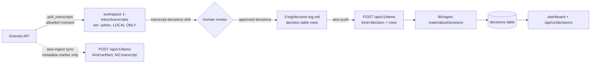

# Granola → decisions (sanitized, consented)

**The hard rule: Granola meetings ingest as DECISION ROWS ONLY. No verbatim transcript is
ever synced team-tier. Privacy is the point.**

Granola records meeting transcripts. We want the *decisions* a meeting produced in the
team brain — never the raw audio/text. This is enforced by separating the connector's two
paths (one automatic + privacy-safe, one local-only) and by keeping the decision
extraction step **human-reviewed**, not automatic.

## The two connector paths (`ingestion/aios_ingest/sources/granola.py`)

| Path | Trigger | Tier | Body content |
|------|---------|------|--------------|
| `fetch()` | `aios-ingest sync` (team-push) | **team** | metadata-only **meeting marker** (title, date, participants, Granola link) — **no transcript text** |
| `pull_transcripts(dest)` | local workspace tooling | **admin (local file only)** | full transcript, written to the workspace, **never pushed** |

`fetch()` items use `kind = artifact` (deliberately **not** `transcript`) so nothing in the
team-push payload can carry verbatim speech. The marker frontmatter records
`transcript_synced: false`.

### The privacy gate (both paths)

A meeting is processed only if **both** hold:

1. **Allowlist** — its title mentions an allowlist topic (default `AIOS`) **or** a
   participant matches the allowlist (default John / Chetan, by name or email).
2. **Per-note consent** — the note carries a consent marker: a `consent: true` field, a
   tag/label in `{aios-consent, consent, share-decisions}`, or a title token `[aios]` /
   `[consent]`.

Without consent the meeting is dropped **entirely** — not even a metadata marker leaves the
machine. Topics/participants/consent-requirement are configurable per connection
(`topics`, `participants`, `require_consent`).

## Official API (mocked in tests; never hit live in CI)

```
GET https://public-api.granola.ai/v1/notes?limit=&cursor=&created_after=
GET https://public-api.granola.ai/v1/notes/{id}?include=transcript
Authorization: Bearer grn_…            rate limit ~300 req/min (429 → Retry-After honored)
```

The key is supplied as `${GRANOLA_API_KEY}` via `connections.yaml` options and is never
logged. Cursor pagination + 429 backoff are handled in the adapter.

## End-to-end flow: transcript → reviewed decisions → brain

The decision extraction is **human/skill-driven**, not automatic. The connector never
writes a decision row on its own; that would defeat the consent model.



Step by step:

1. **Pull (local, admin-tier).** `pull_transcripts()` writes allowlisted + consented
   transcripts into the workspace (`1-inbox/transcripts/`, frontmatter `access: admin`).
   These files **never** enter the team-push path; the brain's `/api/v1/items` rejects
   `admin`/`private` tier with 422 anyway, so even an accidental push is blocked at the
   boundary.
2. **Extract + HUMAN review.** The workspace `transcript-decisions` skill proposes
   candidate decisions from the local transcript. A human reviews/edits them — this is the
   consent checkpoint for *what specifically* becomes shared knowledge.
3. **Record.** Approved decisions are appended as rows to `3-log/decision-log.md`
   (the decision table: `row_key, title, decided_at, rationale, decided_by, impact,
   tier, audience` — see `ItemPayload.DecisionRow`).
4. **Push.** `aios push` sends `decision-log.md` as an `ItemPayload` (`kind = decision`,
   `rows = [...]`) to `POST /api/v1/items`.
5. **Materialize.** `lib/ingest` `materializeDecisions` diff-syncs those rows into the
   `decisions` table (by `row_key`; UI-authored rows survive). They then appear on the
   dashboard and via `GET /api/v1/decisions` (tier-scoped by `audience`).

The optional `aios-ingest sync` of the Granola connection (step shown dashed) only adds a
privacy-safe **meeting marker** to the brain so the meeting is discoverable — it carries no
transcript and is independent of the decision-row flow.

## Configure a connection

```yaml
# ingestion/connections.yaml
connections:
  - name: granola-aios
    source: granola
    access: team             # markers only; transcripts are admin-tier and local
    project: aios
    actor: granola-sync
    options:
      api_key: ${GRANOLA_API_KEY}
      topics: AIOS            # comma-separated allowed
      participants: john,chetan
      require_consent: true   # NEVER set false for shared/team runs
```

## Why this is safe

- Team-push path emits `kind=artifact` with `transcript_synced: false` — **structurally
  cannot** carry verbatim transcript (guarded by `test_fetch_yields_marker_without_transcript_text`).
- Transcripts are `access: admin` and only ever written to a local file; the brain 422s
  admin-tier at `/api/v1/items`.
- Un-consented meetings are dropped before any I/O leaves the machine (guarded by
  `test_fetch_drops_unconsented_meetings`).
- Decision rows are human-reviewed before they exist — the connector never authors them.
