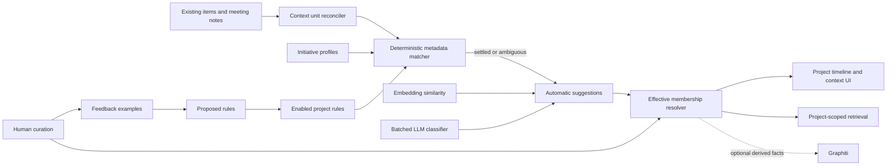

# Project context classification and curation V1

## Status

Proposed parent specification. This document defines the target architecture and an incremental
delivery sequence; it is not a claim that every phase belongs in one pull request. Each phase below
must be implemented as its own reviewed, deployable increment with the stated migration and test
gates.

## Why

Team Brain ingests Slack threads, GitHub activity, tasks, decisions, documents, meeting transcripts,
and other knowledge into a team-wide timeline and retrieval layer. The same evidence also needs to be
organized around the projects and initiatives the team is actually pursuing.

The current `projects` relationship cannot express that product:

- `postgres/schema.sql` gives every `items` row exactly one non-null `project_id`, and item identity is
  unique on `(team_id, project_id, path)`.
- `lib/ingest/index.ts` resolves or creates that project before item identity, versioning, materialized
  task/decision/fact rows, and source diff-sync. Changing this relationship after ingest would alter
  provenance and can break connector reconciliation.
- Connectors deliberately create source-oriented projects. `docs/ARCHITECTURE.md` documents dedicated
  Plane, Linear, GitHub, meeting-note, and meeting-task projects because project-wide diff deletion
  must stay isolated to the source that owns the rows.
- `app/t/[team]/projects/[project]/page.tsx` currently reads `items.project_id` and
  `decisions.project_id` directly. It is an ingestion-container view, not a cross-source initiative
  view.
- `lib/dashboard/work-timeline.ts` builds the team timeline from independent item, task, Slack, and
  decision queries. Project context is not a first-class timeline facet.
- `meeting_notes` points to one full transcript item. `lib/meetings/llm-extract.ts` extracts a summary
  and attendees from a bounded prefix, but there is no durable topic-segment model that can assign
  different parts of one meeting to different projects.

The required model is many-to-many and sometimes segment-level: a pull request may support two
initiatives, a Slack thread may move from one initiative to another, and separate parts of one meeting
may belong to different projects. Automatic classification must coexist with durable human curation,
editable future rules, source deletion, tier isolation, and a clear explanation of every assignment.

## Product outcome

An active initiative has a continuously maintained context space containing:

- a project-scoped timeline across all supported sources;
- whole items and topic-level meeting segments assigned to zero, one, or multiple initiatives;
- automatic assignments with confidence, evidence, method, and rule provenance;
- a review queue for uncertain or conflicting suggestions;
- direct human include, exclude, move, copy, split, merge, and importance controls;
- editable rules that classify future data and can preview an optional historical backfill;
- project-scoped retrieval and cited answers using only effective, visible memberships;
- assignment and rule history that explains how the current state was reached.

## Goals

1. Preserve connector ownership and item identity while adding cross-source initiative membership.
2. Make one semantic context unit assignable to several initiatives.
3. Split meetings into stable topic segments and classify each segment independently.
4. Treat human curation as durable authority without making it a one-way lock.
5. Learn from corrections by proposing editable rules, never by silently turning one correction into
   an active rule.
6. Use deterministic metadata and existing embeddings before paying for an LLM.
7. Keep Postgres canonical. Graphiti is an optional derived consumer, never the owner of assignments,
   rules, segments, or corrections.
8. Preserve app-code tier isolation and source deletion guarantees on every read and write.

## Non-goals

- Replacing `items.project_id` or changing connector diff-sync ownership.
- Using Graphiti entity extraction to decide project membership.
- Automatically creating canonical projects from arbitrary model output.
- Building a general-purpose policy language or exposing raw SQL/JSON rule editing in the UI.
- Segmenting every source in V1. Whole-item units plus meeting topic segments are sufficient for the
  first complete product.
- Making project context available to external-tier viewers in V1. Project taxonomy and curation are
  team-tier metadata, matching `app/api/v1/projects/route.ts` today.
- Re-embedding unchanged items or reclassifying the whole corpus on every scheduler tick.

## Terminology

- **Ingestion project:** the existing `projects` row referenced by `items.project_id`; it establishes
  source identity and diff-sync scope.
- **Initiative:** a human-facing project whose context is assembled across ingestion projects.
- **Context unit:** the smallest stable assignable object. V1 supports a whole item or a meeting topic
  segment.
- **Suggestion:** a replaceable automatic classifier result that has not become effective context.
- **Membership:** the effective include/exclude decision for one context unit and initiative.
- **Override mode:** `auto`, `force_include`, or `force_exclude`. Returning to `auto` is explicit.
- **Rule:** a versioned, user-editable condition tree that includes or excludes future units.

## Non-negotiable invariants

1. `items.project_id` remains the ingestion owner. Context operations never mutate it.
2. A membership never widens visibility. The source item's live `access` is authoritative; every
   materialized unit also inherits `audience` and is healed by the existing reclassification path.
3. Manual include/exclude decisions are never overwritten by an automatic run. A user must choose
   `Return to automatic` before automation can decide that pair again.
4. Automatic runs are idempotent on content fingerprint plus project-profile, ruleset, classifier,
   and prompt versions.
5. Source removal or retraction removes served segment text and effective memberships. Audit rows may
   retain ids and action metadata, never deleted source prose.
6. A model can suggest membership only among existing active initiatives supplied in the prompt. It
   cannot mint a project id, member id, rule, or access tier.
7. Every effective automatic assignment has an inspectable explanation and its exact rule/classifier
   version.
8. Project-scoped retrieval returns the selected segment text for a segmented meeting, not unrelated
   portions of the parent transcript.

## Architecture



The write path is asynchronous. `lib/ingest/index.ts` remains responsible only for canonical item
ingestion. The existing `lib/ingest/scheduler.ts` invokes bounded context reconciliation and
classification after connector imports, meeting-note backfill, deterministic task linking, and dense
indexing prerequisites. Interactive user edits write synchronously through the membership single
writer and invalidate only affected project views.

## Existing project model changes

Extend `projects` additively in `postgres/schema.sql` and a timestamped migration:

| Column | Contract |
|---|---|
| `project_kind` | `initiative`, `source`, or `system`; new dashboard-created projects default to `initiative` |
| `description` | Human-owned classifier and UI description, bounded text |
| `aliases` | Normalized text array of names, abbreviations, product/system names, and issue prefixes |
| `lifecycle` | `proposed`, `active`, `paused`, `completed`, or `archived` |
| `audience` | `access_tier`, V1 initiative default `team` |
| `starts_at`, `ends_at` | Optional activity window used as a classifier signal, not a hard visibility filter |
| `classification_mode` | `off`, `suggest`, or `auto`; new initiatives start in `suggest` |
| `context_version` | Monotonic integer bumped by the project-profile single writer whenever classifier inputs change |
| `updated_at` | Required for profile/ruleset freshness and audit views |

Migration behavior must be conservative:

- existing rows default to `source`;
- known internal containers (`meeting-notes`, `extracted-from-meetings`, and any other enumerated
  constants) become `system` through explicit slug matches, never heuristics;
- no historical row is guessed to be an initiative from `last_synced_at is null`;
- an admin conversion action promotes a legacy row to `initiative` after review;
- `app/api/v1/projects/route.ts` retains its existing fields and adds new fields compatibly;
- `app/actions/projects.ts` creates `initiative` rows and must audit creation and profile changes.

`app/t/[team]/projects/page.tsx` shows active initiatives by default and places source/system containers
behind a separate filter. The route and count queries must not imply that `items.project_id` is the new
context count.

## Persistence contracts

### `project_context_units`

Canonical assignable grains. Sole writer: proposed `lib/projects/context/units.ts`.

Required columns:

- `id`, `team_id`, timestamps;
- nullable `source_item_id`, `source_task_id`, and `source_decision_id`, with a kind-aware check
  that exactly one canonical source is selected;
- `unit_key`: stable within the canonical source (`item`, a task/decision row key, or a meeting
  segment lineage key);
- `unit_kind`: `item`, `task`, `decision`, or `meeting_segment`;
- `ordinal`: presentation order for segmented sources;
- `title`: bounded generated/user-editable label;
- `content`: empty for whole-item units (dereference live `items.body`), segment text for meeting units;
- `content_sha256` and `source_content_sha256`;
- `locator jsonb`: strict kind-specific locator (`start_char`, `end_char`, optional source timestamps);
- `occurred_at`: uses the persisted source work time or meeting occurrence time;
- `audience`: inherited from the canonical source (`items.access`, `tasks.audience`, or
  `decisions.audience`), never accepted from a classifier;
- `state`: `active` or `retracted`;
- `segmentation_version` and optional `predecessor_unit_id` for lineage diagnostics.

Constraints and indexes:

- partial unique indexes for each source kind and `unit_key`;
- source-entity, active-work-time, kind, and audience indexes;
- source item/task/decision foreign keys cascade when their canonical source is deleted;
- every writer verifies that the unit, canonical source, membership, and initiative share one
  `team_id`; migrations should add composite `(team_id, id)` references where PostgreSQL can enforce
  this without replacing existing primary keys, with the domain writer remaining the required guard;
- a generated FTS vector over `title + content` for meeting-segment retrieval;
- `locator` is parsed through a strict Zod discriminated union before persistence.

Ordinary projectable items get one `unit_kind='item'` unit. Materialized task and decision rows get
their own units so a multi-row task/decision item can be classified at the actual row grain and so
dashboard-created rows with `source_item_id is null` remain representable. The unit writer does not
also expose the containing task/decision item when materialized rows exist. A meeting that has settled
topic segments uses the segment units for classification and does not also expose its whole-item unit;
the whole unit remains as a fallback while materialization or segmentation is pending or failed.

### `project_context_memberships`

The effective decision for one `(unit, initiative)` pair. Sole writer: proposed
`lib/projects/context/memberships.ts`.

Required columns:

- `team_id`, `project_id`, `context_unit_id`;
- `decision`: `include` or `exclude`;
- `mode`: `auto`, `force_include`, or `force_exclude`;
- `importance`: `core`, `supporting`, or `incidental`;
- `method`: `ingestion_project`, `explicit_ref`, `rule`, `embedding`, `llm`, or `manual`;
- nullable `rule_id`, `suggestion_id`, and `decided_by`;
- nullable calibrated `confidence` in `[0,1]`;
- bounded `explanation` plus non-secret structured `evidence jsonb`;
- `valid_from`, nullable `valid_to`, `created_at`, and `updated_at`.

There is at most one current row per `(team_id, project_id, context_unit_id)` where `valid_to is null`.
Moving a unit closes the old membership and opens the new one; copying leaves both active. Excluded
rows exist only when a rule or human explicitly needs to suppress an otherwise plausible assignment.
Absence is not materialized across every project, avoiding an `units x projects` table explosion.

Automatic writes may update only current rows with `mode='auto'`. Manual include/exclude sets the
corresponding force mode. `Return to automatic` closes the force row and immediately re-runs the pure
resolver against current deterministic/rule/suggestion inputs.

### `project_context_events`

Append-only domain history, separate from the generic audit log because the product needs to render
assignment history efficiently. Rows contain ids, prior/next decision and mode, action, actor, method,
rule/suggestion references, and timestamps. They never contain source text.

Every domain write also calls existing `lib/api/audit.audit` with actions such as:

- `project_context.included`, `project_context.excluded`, `project_context.moved`;
- `project_context.returned_to_auto`;
- `project_context.segment_split`, `project_context.segment_merged`;
- `project_rule.created`, `project_rule.updated`, `project_rule.enabled`, `project_rule.disabled`.

### `project_context_suggestions`

Replaceable automatic outputs for review and observability. Sole writer: proposed
`lib/projects/context/suggestions.ts`; classifier workers and review actions call this module rather
than writing the table directly.

- unit/project, method, confidence, explanation, evidence;
- content, project-context, ruleset, classifier, and prompt fingerprints;
- `status`: `pending`, `accepted`, `rejected`, `superseded`, or `settled_auto`;
- model/provider/cost references where applicable;
- unique idempotency key over all classifier inputs.

Suggestions below the review threshold never become effective. A rejected suggestion records a
negative feedback example and remains diagnosable without blocking a future materially different
classifier/ruleset version.

### `project_context_rules` and `project_context_rule_versions`

Rules belong to one initiative and have `include` or `exclude` action, priority, enabled state,
future-only/backfill scope, creator, and current version. Every save writes an immutable version row
containing the complete validated condition tree and action. The generic audit log alone is
insufficient because it may omit the old executable condition.

The condition language is a strict JSON AST parsed by proposed
`lib/projects/context/rule-schema.ts`, not SQL:

- boolean nodes: `all`, `any`, `not`;
- exact/set fields: source, item kind, ingestion project, repository, Slack channel id/name, author,
  participant, task key, label, path prefix, and URL host;
- bounded text operators: contains token, starts with, and regex from an explicitly safe subset;
- temporal fields: occurred after/before and project active window;
- semantic predicate: similarity to the initiative profile above an explicit threshold.

The evaluator in proposed `lib/projects/context/rules.ts` operates over a normalized feature object.
It never interpolates AST values into SQL. Authority order is: manual force decision, enabled rules,
deterministic source/reference match, embedding, then LLM. Within rules, higher priority wins, then
greater predicate specificity, then newest version. A still-equal include/exclude conflict fails to
the review queue rather than making either action an undocumented default.

### `project_context_feedback`

Human-labeled examples used to evaluate and propose rules:

- unit/project, positive or negative label, action source, actor, and timestamp;
- normalized feature snapshot and relevant fingerprints;
- no duplicated source body;
- optional `proposed_rule_id` once consumed by a rule proposal.

A manual action always records feedback, but it never creates or enables a rule synchronously.

## Context unit reconciliation

### Whole items and structured rows

Proposed `lib/projects/context/units.ts` scans changed items by `content_sha256`, creates or updates the
stable `unit_key='item'` row, and marks it active. It reuses:

- `items.work_at` rather than deriving time again (`lib/ingest/work-time.ts` owns the policy);
- `lib/ingest/source-rules.ts` to distinguish retaining and retractable sources;
- `lib/auth/visibility.ts` conventions for audience reads;
- `lib/ingest/purge.ts` for item-removal integration;
- `lib/ingest/reclassify.ts` to heal inherited audience before source access is committed.

The item body is not copied into the context-unit row. Classifiers load it only for bounded pending
units, preserving the existing wide-read discipline used by `lib/dashboard/doc-task-infer-run.ts`.

The same reconciler scans changed `tasks` and `decisions` and creates row-grained units through their
existing read contracts. It never writes those source tables. A task unit uses title/body, labels,
row key, status, sprint, assignee, and persisted work timestamps as features. A decision unit uses
title/rationale/impact, row key, validity, decider, and decision date. Where a task or decision came
from an item, the source row's own `source_item_id` remains provenance; the context unit's canonical
foreign key is the task/decision id so source diff deletion cascades correctly. UI-created rows with no
source item follow the same path.

### Meeting segments

Proposed `lib/meetings/project-segments.ts` is the sole meeting-segment producer. It reads the full
transcript behind `meeting_notes.source_item_id` and emits 3-15 coherent topic segments with title,
summary, exact source offsets, and optional timestamps. The model response uses strict structured JSON
and may reference only supplied segment ids/offsets.

Segmentation follows these rules:

1. Prefer source speaker/time boundaries when present; otherwise use paragraph boundaries.
2. Never split inside a source line or invent text. Segment content is sliced from the canonical
   transcript by validated offsets, not trusted from model output.
3. Reconcile a changed transcript against prior active segments using exact fingerprint first, then a
   bounded text-overlap/adjacency matcher.
4. Preserve the segment id and manual memberships on an unambiguous lineage match.
5. Put ambiguous lineage in the review queue. Never transfer a force decision to unrelated text.
6. Mark removed segments retracted and close their memberships. For Slack-style source retraction,
   retain ids/events but clear served segment content, matching the deletion intent in
   `lib/ingest/forget-bodies.ts` and `lib/graph/project.ts`.
7. User split/merge operations create a new segmentation generation, close superseded units, and copy
   memberships only according to explicit UI semantics.

When a meeting moves from the fallback whole-item unit to settled segments, automation re-evaluates
each segment independently. An existing automatic whole-meeting membership may seed suggestions but
does not blindly include every segment. A force-included whole meeting is presented once for a human
choice: apply to all current segments, select segments, or return them to automatic. The retired whole
unit and its decision remain in history but are not served beside the segments.

`lib/meetings/llm-extract.ts` remains the summary/attendee path. Its shared `callMeetingsLLM`, provider
resolution, timeout, JSON recovery, and usage metering patterns should be reused, but segmentation gets
its own prompt/parser and `llm_usage` source so its cost is visible separately.

## Initiative profile and normalized features

Proposed `lib/projects/context/profile.ts` builds the classifier profile from human-owned project
fields plus enabled rules. It may summarize, but never mutate, linked metadata:

- name, description, aliases, issue prefixes;
- associated ingestion projects, repositories, paths, Slack channels, task labels, and URL hosts;
- positive and negative feedback examples;
- lifecycle and optional active dates.

Explicit source associations configured in Settings are stored as high-priority, system-authored rule
versions through the same rule writer and remain visible and editable in the rule UI. There is no
second hidden source-mapping table. This is the stage reported as method `ingestion_project` below.

Proposed `lib/projects/context/features.ts` produces one normalized feature object per unit. Source
parsing reuses `frontmatter.source`, `lib/dashboard/timeline-group.normalizeSource`, persisted project
slug, item kind/path/title, task evidence, and meeting metadata. Deterministic task/issue references
reuse the pure matching concepts in `lib/dashboard/issue-ref.ts` and persisted links in
`task_evidence`; they must not create a third incompatible issue-key parser.

## Automatic classification pipeline

Proposed pure core: `lib/projects/context/classify.ts`.
Proposed background orchestration: `lib/projects/context/classifier-run.ts`.

Run stages in precedence order:

1. **Existing relationship:** when a high-priority source-association rule links an ingestion project
   to an initiative, classify at confidence 1.0 and report method `ingestion_project`.
2. **Explicit references:** issue keys, repository/path mappings, URLs, and already-persisted
   `task_evidence` links.
3. **Enabled rules:** evaluate the strict AST and settle non-conflicting include/exclude outcomes.
4. **Embedding similarity:** compare the unit to active initiative profile embeddings.
5. **Batched LLM:** only ambiguous units within a bounded score band; one request includes multiple
   units and all eligible initiatives, returning zero or more initiative ids per unit plus confidence
   and cited supplied signals.

Cost controls are mandatory:

- no LLM when deterministic/rules settle the unit;
- no LLM or embedding work for inactive/retracted units, archived initiatives, or force-decided pairs;
- one profile embedding per `projects.context_version`, not per unit;
- reuse the team's backend selection from `lib/query/embedding-key.ts` and transport from
  `lib/query/embeddings.ts`;
- use existing `item_chunks` for whole-item semantic evidence where possible;
- add polymorphic `project_context_embeddings` to `postgres/optional/pgvector.sql` only for meeting
  segments and initiative profiles, keyed by `target_kind`, `target_id`, content fingerprint, model,
  and dimensions, through a new single writer `lib/projects/context/embeddings.ts`;
- batch and cap model inputs following `lib/dashboard/doc-task-infer-run.ts`;
- persist per-unit settled fingerprints so a model `no match` drains the queue rather than being paid
  for every cycle;
- do not mark a unit settled when its worker/model call failed;
- meter calls through `lib/llm/complete.ts` with a distinct `project-classify` source;
- record each run through `lib/ingest/runs.ts` with scanned, deterministic, rule, semantic, LLM,
  suggested, auto-settled, reviewed, failed, and cost metadata.

Initial thresholds are configuration, not magic constants hidden in UI code:

- high confidence: may settle automatically unless a rule/override conflicts;
- medium confidence: review queue;
- low confidence: no suggestion;
- exclude rules and negative semantic examples can force review but semantic/LLM output alone cannot
  create a durable force exclusion.

Threshold calibration requires a held-out set from human feedback. Confidence displayed to users is
method-specific and must not imply that a rule match and an LLM score are statistically equivalent.

## Learning and editable rule proposals

Proposed `lib/projects/context/rule-proposals.ts` periodically groups repeated positive/negative
feedback patterns and generates candidate rules. The first implementation should be deterministic:
common source/channel/repo/path/label/issue-prefix combinations with measured precision and coverage.
An LLM may later describe or simplify a candidate, but it does not activate it.

Each proposal includes:

- the editable condition tree and include/exclude action;
- supporting and contradicting examples;
- historical match count, expected precision, and coverage;
- conflicts with enabled rules;
- estimated number of automatic memberships changed by historical application;
- `future only` as the default scope.

An admin or lead can edit, preview, enable, disable, and reorder rules. Members can curate individual
context and generate feedback but cannot enable team-wide automation. This follows the existing
admin/lead mutation precedent in `app/actions/decisions.ts` and centralized admin guard in
`lib/auth/guard.ts`. Extend that guard with one shared admin-or-lead authorization helper; project
actions and API routes must not reproduce role checks locally.

## Read model and GUI

### Project list

Replace counts based solely on `projects.items(count)` in `app/t/[team]/projects/page.tsx` with a read
module `lib/projects/context/queries.ts` that returns initiative counts for effective included units,
pending review, source mix, last context activity, and rule health. Source/system projects remain
available through a filter for provenance and connector diagnostics.

### Initiative workspace

Refactor `app/t/[team]/projects/[project]/page.tsx` into an initiative shell with tabs:

- **Overview:** profile, lifecycle, recent activity, source mix, unresolved decisions, and review count.
- **Timeline:** chronological effective context with source, actor, importance, and segment-aware links.
- **Context:** paginated/filterable units with project chips, method, confidence, explanation, and bulk
  include/exclude/move/copy/importance actions.
- **Review:** pending/conflicting suggestions with accept, reject, edit assignment, and bulk actions.
- **Rules:** visual condition builder, ordering, enable toggle, version history, examples, and preview.
- **Activity:** membership, segmentation, profile, and rule events.
- **Settings:** name, description, aliases, lifecycle, and initiative/source links.

Proposed components:

- `components/projects/project-context-table.tsx`;
- `components/projects/project-context-filters.tsx`;
- `components/projects/project-membership-editor.tsx`;
- `components/projects/project-review-queue.tsx`;
- `components/projects/project-rule-builder.tsx`;
- `components/projects/project-rule-preview.tsx`;
- `components/projects/project-profile-editor.tsx`;
- `components/projects/project-timeline.tsx`.

Use project chips for membership, source/kind icons from existing component patterns, checkboxes for
bulk selection, segmented controls for include/exclude/auto, and dialogs only for destructive or
historical reclassification actions. Every automatic badge opens an explanation panel; no assignment
may be represented as unexplained model certainty.

### Item and meeting editing

Extend `app/t/[team]/library/[itemId]/page.tsx` with the shared membership editor so a user can curate
context at the evidence source. Extend `components/meetings/meeting-detail-tabs.tsx` with a Projects
tab backed by proposed `components/meetings/meeting-project-segments.tsx`:

- transcript sections with project chips and assignment provenance;
- add/remove/copy project;
- split at paragraph/timestamp boundary;
- merge adjacent segments;
- edit segment topic title;
- return a membership to automatic;
- show re-segmentation conflicts without hiding the previous human decision.

## Project timeline

Proposed `lib/projects/context/timeline.ts` builds a flat project-first chronology from effective
memberships rather than filtering the final person-first cache. Filtering the cached team payload
would lose segment-level units and can misrepresent counts after per-source caps.

The module reuses:

- persisted `items.work_at` and meeting `occurred_at`;
- `lib/dashboard/timeline-group.dayLabel` and `normalizeSource`;
- `lib/attribution/contributor-credit.ts` as the single attribution oracle for whole items;
- `task_evidence` for task grouping/link explanation;
- existing source URLs and item detail routes;
- `lib/auth/visibility.ts` tier rules even though V1 project context is team-only, so the read remains
  fail-closed if audience support expands later.

Meeting segments are context signals, not duplicated work credit for every attendee. They appear once
at meeting time with attendees and submitters as metadata. Whole items retain the existing work/signal
classification from `lib/dashboard/work-classification.ts`.

Project timeline caching, if required after measurement, gets a separate project/version/tier key. It
must not reuse `work_timeline_cache`, whose payload and invalidation are team-window based. Membership,
segment, rule-backfill, item purge, and audience changes invalidate only affected initiative keys.

## Project-scoped retrieval

The existing `retrieve(..., projectSlug)` path scopes primarily through the ingestion project's slug:
`lib/query/dense-search.ts` joins `items.project_id`, while `lib/query/retrieve.ts` filters merged hits
against that slug. That behavior must not be silently reinterpreted for old callers.

Refactor the positional retrieval signature to an options object with separate fields:

```ts
type RetrievalScope = {
  ingestionProjectSlug?: string | null;
  contextProjectSlug?: string | null;
};
```

Keep the old ingestion scope until all callers migrate. The new context scope:

- resolves the active initiative team-safely;
- joins only current `decision='include'` memberships;
- dereferences live item access and unit audience;
- searches whole-item memberships through existing FTS and `item_chunks` dense retrieval;
- searches meeting segments through `project_context_units.search` and optional
  `project_context_embeddings`;
- returns selected segment text and source offsets for meeting citations;
- includes effective project tasks/decisions only through their context units or explicit initiative
  link, not merely their ingestion project;
- leaves Graphiti global expansion out of context-scoped queries until graph facts can be filtered by
  settled membership provenance. Including the current tier-only Graphiti search would leak unrelated
  projects into a project answer.

Proposed adapters:

- `lib/projects/context/retrieval.ts` for membership-aware candidates;
- extensions to `lib/query/provider.ts` source metadata for `contextUnitId`, segment locator, and
  initiative provenance;
- a context-scope branch in `lib/query/retrieve.ts` that still uses existing RRF, budget, citation,
  grounding, and answering modules.

## Actions and API surfaces

Browser writes live in proposed `app/t/[team]/projects/[project]/actions.ts` and call only the domain
single writers:

- update initiative profile/lifecycle;
- include, exclude, move, copy, change importance, return to auto;
- accept/reject suggestions in bulk;
- create/update/preview/enable/disable rules;
- split/merge/rename meeting segments;
- request targeted reclassification.

Every action resolves the session member and verifies team/project/unit ownership. Admin/lead is
required for profile, lifecycle, rule activation, historical backfill, and project merge. Any team
member may curate individual memberships. Server actions revalidate the affected project, item, and
meeting routes after the durable write.

Read pagination should use a session-authenticated route such as
`app/api/dashboard/projects/[project]/context/route.ts`, with strict filters and cursor pagination.
Do not expose raw rule ASTs or classifier evidence to external-tier/API-key callers in V1.

`app/api/v1/projects/route.ts` remains backward compatible. A future CLI context contract requires a
separate Brain API versioned specification rather than expanding this dashboard feature implicitly.

## Source-specific behavior

| Source | V1 unit | Strong deterministic signals | Update/removal behavior |
|---|---|---|---|
| GitHub PR/commit/repo doc | Whole item | repo, path, issue/task refs, labels, URLs | Fingerprint re-evaluation; source purge closes memberships |
| Slack | Whole thread | channel id/name, participants, explicit refs, rule terms | Current re-render replaces classification inputs; deletion clears/retire context through existing retractable-source policy |
| Meeting | Topic segment | segment text, title, attendees, explicit refs | Re-segment with lineage; ambiguous transfer requires review |
| Task/decision | Materialized task/decision row | existing ingestion project, row key, task evidence, labels | Preserve source diff-sync; source-row deletion cascades its unit |
| Extracted fact/stakeholder evidence | Whole containing item in V1 | source project/path/quote metadata | Row-grained evidence units are a later additive kind if product use proves it necessary |
| Notion/Drive/local docs | Whole item | path, title, aliases, explicit refs, semantic profile | Reclassify only when content/profile/rules fingerprint changes |

Slack topic segmentation is deferred until meeting segmentation and lineage have production evidence.
Its deletion contract is stricter because a thread is re-rendered source-owned content; whole-thread
classification preserves the existing `retainSupersededBodies: false` behavior in
`lib/ingest/source-rules.ts`.

## Tier safety and deletion

There is no RLS backstop, so all new raw-SQL and query-builder reads must be visibly tier-scoped.

- `project_context_units.audience` inherits `items.access` and is not user/model writable.
- `lib/ingest/reclassify.ts` must cascade audience narrowing to context units before committing the
  item access change, following the current fail-closed ordering for tasks/facts/stakeholder mentions.
- Effective membership is metadata, not a visibility grant. Reads join the live item and apply
  `visibleItems`/`isRestrictedTier` semantics.
- `lib/ingest/purge.ts` must include context units, suggestions, memberships, and embeddings in its
  source-removal contract. Foreign-key cascades should perform deletion; the purge tests prove no
  served context remains.
- Retracted segment content is cleared before any background classifier can read it again.
- Project descriptions, aliases, rules, feedback, and review queues are team-tier only in V1.
- Add guard tests ensuring every project-context dashboard read uses the visibility/domain read
  module and every table has one sanctioned writer.

## Failure handling and convergence

- Unit reconciliation and deterministic rules may throw per team; the scheduler records the failure
  and continues other teams.
- Embedding/LLM failure leaves the prior effective automatic membership intact and does not settle the
  new fingerprint.
- A valid model response with no matches is settled and fingerprinted so it does not repeat forever.
- Rule preview is read-only. Historical application is a bounded background job with progress,
  cancel-after-batch semantics, and an audit record; it never runs inline in a request.
- Profile/rule edits bump only the affected initiative version, so classification can target
  `(initiative, stale units)` rather than rescore every project pair.
- Segment reconciliation is transactional per meeting where the DB adapter permits it. If not, use a
  generation marker: readers expose only the last complete generation, and a later pass can abandon an
  incomplete generation without hiding the prior one.
- Automatic membership resolution is deterministic and pure; persistence applies its result after
  checking that the source and input fingerprints are still current.

## Observability and product metrics

Add `ingest_runs.source` values for `project_units`, `project_classify`, and `project_rules_backfill`.
Run metadata includes:

- units scanned/created/updated/retracted;
- deterministic, rule, embedding, and LLM decisions;
- suggestions pending/accepted/rejected and automatic memberships settled;
- segmentation created/preserved/ambiguous/retracted;
- calls, input units, token/cost totals, cost per classified unit;
- stale fingerprints, failed workers, and first error sample;
- rule conflicts and force overrides skipped.

Project health UI should show unassigned rate, review backlog, correction rate by method, rule
precision/coverage from feedback, median classification age, and classification cost per settled unit.
The success metric is not raw auto-coverage: it is high accepted auto-coverage with a falling
correction rate and bounded cost.

## Delivery sequence

### Phase 0 - project taxonomy and contracts

- additive `projects` fields and conservative migration;
- strict enums/Zod types and project profile single writer;
- initiative/source/system filters in the existing project list;
- architecture documentation and schema replay tests.

### Phase 1 - whole-item units and manual curation

- context units, memberships, events, feedback, and single writers;
- asynchronous whole-item reconciler;
- project Context tab, item membership editor, bulk actions, history, and audit;
- source deletion and access-reclassification integration;
- no automatic LLM classification yet.

This phase proves the cardinality, UI, and authority semantics with humans before automation learns
from them.

### Phase 2 - deterministic rules and project timeline

- rule AST, versions, pure evaluator, visual builder, preview, and future-only application;
- explicit source/reference matching;
- project-first timeline and overview metrics;
- targeted cache invalidation if measurement shows it is needed.

### Phase 3 - semantic and LLM suggestions

- profile embeddings and segment-ready optional vector schema;
- fingerprinted classifier queue, batched ambiguity-only model pass, suggestions/review UI;
- confidence calibration, usage metering, run health, and held-out evaluation;
- high-confidence auto-settlement behind the initiative's `classification_mode='auto'` after review
  precision qualifies; every initiative starts in `suggest` mode.

### Phase 4 - meeting topic segments

- strict segmentation parser, lineage reconciler, segment FTS/embeddings;
- meeting Projects tab, split/merge/boundary controls, ambiguous-lineage review;
- segment-aware timeline and retrieval citations.

### Phase 5 - project-scoped retrieval and learned rule proposals

- explicit context retrieval scope and query UI;
- deterministic feedback clustering and proposed-rule workflow;
- historical backfill jobs with preview/progress;
- optional settled-membership projection to Graphiti only after provenance filtering is proven.

## Test strategy

### Unit tests

- strict project profile, rule AST, locator, model response, and action schemas;
- rule precedence, specificity, conflict-to-review, and force override behavior;
- classification fingerprint changes for every meaningful input and stays stable otherwise;
- multi-project, move, copy, include, exclude, and return-to-auto state transitions;
- segment offset validation, exact slicing, lineage matching, split/merge semantics;
- confidence threshold routing and no-match settlement;
- project timeline ordering and meeting-signal non-duplication;
- retrieval scope keeps ingestion and context project semantics distinct.

### Data-mechanics tests with real Postgres

- fresh schema, populated migration, and migration replay;
- ingestion project remains unchanged through every context operation;
- unique current membership and immutable closed history;
- automatic writes cannot overwrite force rows;
- access narrowing is fail-closed and source purge leaves no served unit/membership/embedding;
- whole item to segmented meeting transition does not duplicate effective context;
- ambiguous re-segmentation preserves prior human state for review;
- rule update targets only the affected initiative version;
- team isolation on every table and index-backed pagination queries;
- optional pgvector schema supports profile/segment embeddings without writing `item_chunks` from a
  second module.

### HTTP/server-action tests

- session, team ownership, role, malformed payload, and cross-team id rejection;
- member individual curation versus admin/lead rule/profile permissions;
- bulk writes are atomic for validated input and bounded in size;
- project context pagination/filtering and no external-tier access;
- stale fingerprint race refuses to persist an obsolete classifier result;
- revalidation covers project, item, and meeting surfaces.

### Retrieval and timeline tests

- project A cannot retrieve project B's whole item or meeting segment;
- a meeting with A and B segments returns only the selected project's text and citation locator;
- an item in two projects appears once in each and once per project timeline;
- force exclusion suppresses FTS, dense, recency, structured, and future Graphiti augmentation;
- source deletion removes context from retrieval immediately;
- existing ingestion-project query behavior remains compatible until explicitly migrated.

### Guard tests

- one sanctioned writer for units, memberships/events, rules/versions, feedback, and context embeddings;
- every project-context item read passes through the domain visibility module;
- no classifier imports Graphiti as a write authority;
- no model response can write project ids outside the supplied candidate set;
- no second issue-key parser or attribution oracle is introduced;
- docs/schema/source maps stay synchronized.

## Acceptance criteria

- A user can create or promote an initiative without changing existing connector project ownership.
- A whole item can be included in multiple initiatives, moved, excluded, and returned to automatic;
  every state is audited and survives source re-sync.
- Automatic runs never overwrite a manual force decision.
- Enabled rules classify future matching units, expose exact provenance, and can be previewed before a
  bounded historical backfill.
- Ambiguous automatic results enter a review queue; low-confidence results do not pollute context.
- A meeting is split into source-grounded topic segments that can belong to different initiatives;
  users can split/merge/relabel without losing unambiguous manual assignments.
- Project timeline and project-scoped retrieval use effective memberships rather than
  `items.project_id` and return only selected meeting segment text.
- Source access narrowing and deletion remove project context with the same fail-closed guarantees as
  existing item/task/graph paths.
- Classification skips unchanged inputs, uses deterministic/rule/embedding stages before LLM, batches
  paid calls, meters cost, and records honest failures.
- Existing ingest, tasks, decisions, meetings, team timeline, ingestion-project retrieval, and Brain
  API contracts remain compatible throughout staged rollout.

## Existing modules to reuse or extend

| Existing module | Required use/change |
|---|---|
| `lib/ingest/index.ts` | Preserve item ownership; do not classify inline |
| `lib/ingest/scheduler.ts` | Invoke bounded unit/classifier/rule-backfill runners and record health |
| `lib/ingest/source-rules.ts` | Retaining/retractable source semantics |
| `lib/ingest/reclassify.ts` | Cascade inherited context-unit audience before item access commit |
| `lib/ingest/purge.ts` | Remove/retract context units and derived state on source deletion |
| `lib/ingest/work-time.ts` | Sole work-time policy; no project-specific re-derivation |
| `lib/ingest/runs.ts` | Background run observability |
| `lib/auth/guard.ts` | Add shared admin-or-lead authorization; keep mutation role policy centralized |
| `lib/auth/visibility.ts` | Fail-closed audience reads |
| `lib/api/audit.ts` | Generic audit trail alongside domain events |
| `lib/dashboard/issue-ref.ts` and `timeline-evidence.ts` | Deterministic task/reference signals |
| `lib/dashboard/doc-task-infer-run.ts` | Paid-pass batching, fingerprints, settled/no-match, and failure patterns |
| `lib/dashboard/timeline-group.ts` | Date/source display helpers, not final person-first cache filtering |
| `lib/dashboard/work-classification.ts` | Work versus context signal semantics |
| `lib/attribution/contributor-credit.ts` | Sole whole-item attribution oracle |
| `lib/query/dense-index.ts`, `embedding-key.ts`, `embeddings.ts` | Existing embedding backend and idempotency patterns |
| `lib/query/retrieve.ts`, `dense-search.ts`, `fts-search.ts`, `provider.ts` | Explicit context scope, segment candidates, RRF/budget/citations |
| `lib/meetings/notes.ts`, `llm-extract.ts` | Meeting provenance, provider/metering patterns; add separate segment writer |
| `app/t/[team]/projects/*` | Initiative list and workspace replacement |
| `app/t/[team]/library/[itemId]/page.tsx` | Shared membership editor |
| `components/meetings/meeting-detail-tabs.tsx` | Segment-level Projects tab |
| `postgres/schema.sql`, `postgres/migrations/`, `postgres/optional/pgvector.sql` | Canonical, additive, replayable persistence |

## Proposed modules

```text
lib/projects/context/
  types.ts                 # Domain types only
  schemas.ts               # Input/model response schemas
  profile.ts               # Initiative profile single writer/read model
  features.ts              # Normalized unit features
  units.ts                 # Context-unit single writer and reconciliation
  memberships.ts           # Effective state + event single writer
  suggestions.ts           # Replaceable classifier output single writer
  rules.ts                 # Pure rule evaluator and persistence facade
  rule-schema.ts           # Strict condition AST
  rule-proposals.ts        # Feedback clustering and proposals
  classify.ts              # Pure staged classification decisions
  classifier-run.ts        # Bounded background orchestration
  embeddings.ts            # Profile/segment embedding single writer
  queries.ts               # Team-safe project read model
  timeline.ts              # Project-first chronology
  retrieval.ts             # Membership-aware FTS/dense candidates

lib/meetings/
  project-segments.ts      # Meeting segment single writer and lineage reconciliation
  project-segment-prompt.ts

components/projects/
  project-context-table.tsx
  project-context-filters.tsx
  project-membership-editor.tsx
  project-review-queue.tsx
  project-rule-builder.tsx
  project-rule-preview.tsx
  project-profile-editor.tsx
  project-timeline.tsx

components/meetings/
  meeting-project-segments.tsx
```

## Documentation and verification gates

Each phase updates `docs/ARCHITECTURE.md`, `docs/context-management-system.md`, schema/table/source
drift blocks, and the affected API documentation. Any new `llm_usage` source and `ingest_runs.source`
must be enumerated wherever those unions are closed.

Minimum verification for every implementation phase:

```bash
npm run typecheck
npm run lint
npm test
npm run check:docs
npm run check:skills
npm run db:test:up
npm run test:datamechanics
npm run test:http
npm run build
```

Schema phases additionally prove fresh schema load, migration from a populated pre-feature database,
and a second idempotent application. Retrieval phases run the existing grounding/RRF tests plus new
cross-project and segment-isolation cases. UI phases require desktop and mobile Playwright screenshots
for the project workspace, review queue, rule builder, and meeting segment editor, including long names,
empty states, loading/error states, and bulk-selection layouts.

## Decisions carried by this spec

1. Existing `projects` stays canonical, gains an explicit kind, and separates initiatives from
   ingestion/system containers without a second competing project table.
2. `items.project_id` remains provenance; project context is a separate many-to-many layer.
3. Context units are semantic assignment grains, not aliases for retrieval chunks.
4. Postgres owns effective state and human corrections; Graphiti is derived and optional.
5. Manual authority is reversible through `Return to automatic`, avoiding the current attribution
   lock's documented one-way-door limitation.
6. Rules are proposed from repeated feedback and require human activation.
7. Classification is deterministic-first, embedding-second, ambiguity-only LLM, fingerprinted, and
   metered.
8. Meeting segmentation is source-grounded and lineage-aware; ambiguous edits never silently inherit
   a human decision.
9. Project-scoped retrieval is an explicit new scope and does not silently redefine the existing
   ingestion-project slug filter.
