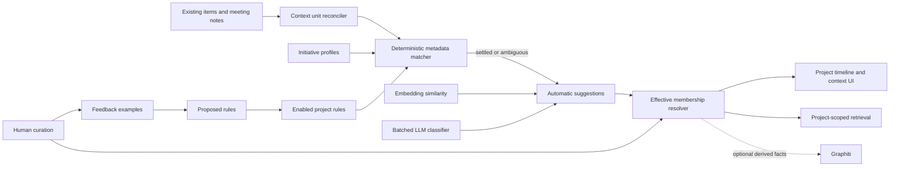

# Project partitioning and permissioning — V2

> Filename note: this file keeps its V1 path (`project-context-classification-v1.md`) so existing
> links survive; the document it contains is the V2 parent specification. V1's classification and
> curation machinery is retained in Part II as the tagging engine; where V2 contradicts V1, V2 wins,
> and every such flip is listed explicitly in §2.

## Status

Draft for review round 1 — spec only, no implementation. This revision reorients the V1 spec around
the two primitives the vision brief names: **project partitioning** and **permissioning**. It is a
re-architecture, not a feature: it touches the data model, ingestion, all three retrieval modalities,
the graph layer, the API contract, the agent surface, and the UI, and it makes the graph a required
dependency. Content ingested under a model that cannot express access must be reclassified later by
hand — permission models are load-bearing from the first row, which is why this document front-loads
the schema and enforcement decisions and defers everything decorative.

Process: the vision brief mandates phased delivery with stop-and-check-in gates. This document is the
Phase 0 audit plus the full target design; the build phases at the end each end at a checkpoint.

---

# Part I — the access architecture

## 1. Phase 0 audit — the briefing, verified line by line

The vision brief says "assume parts of the next section are wrong; your first job is to find out
which parts." Verified against `origin/main` (commit `1693d9e`):

| Briefing claim | Verdict | Evidence |
|---|---|---|
| ~75 tables, 56 migrations, ~600 commits, two contributors | ✅ almost exact | 75 `create table` in `postgres/schema.sql`; **55** migrations; 610 commits; 2 human contributors + dependabot |
| ~27 `/api/v1/*` routes, brain-api v1.17 | ✅ | **26** route files under `app/api/v1/`; v1.17 in `lib/api/schemas.ts:55` |
| API keys `aios_<key_id>_<secret>`, Bearer + `X-AIOS-Team` | ✅ | `lib/api/auth.ts:40,76` |
| Only access model is two-tier `team`/`external`, `admin` → 422, app-code only, no RLS | ✅ | `lib/graph/group.ts:8`, `app/api/v1/items/route.ts:54-60`, CLAUDE.md §5 |
| Projects partition nothing — not an access or retrieval boundary | ✅ (with nuance) | `projects` = `slug/name/last_synced_at` only. Nuance: `retrieve(..., projectSlug)` already narrows to one ingestion project (`lib/query/retrieve.ts:496,667`) — a *scope*, not an access boundary |
| Single audited write path, zod, SHA-dedupe, versions, diff-sync, audit log | ✅ | `lib/ingest/index.ts`, `lib/api/audit.ts` |
| Scheduler is in-process `setInterval`, single-instance, ingest ~30m, graph ~60m | ✅ | `instrumentation.ts` → `lib/ingest/scheduler.ts:24` (`INGEST_POLL_MINUTES ?? 30`) |
| Retrieval: FTS + optional pgvector HNSW cosine + RRF + graph expansion + optional cross-encoder rerank; SSE, citations, abstain | ✅ | `lib/query/{fts-search,dense-search,retrieve}.ts`; HNSW cosine at `postgres/optional/pgvector.sql:42`; reranker at `lib/query/retrieve.ts:45-47` |
| Graphiti 0.29.3 over Neo4j 5.26.2, optional; tier in `group_id` as `<teamSlug>_team/_external`; direct bolt reads | ✅ | `docs/ARCHITECTURE.md:768`, `docs/RAILWAY-TEMPLATE.md:19`, `lib/graph/group.ts:20`, `lib/graph/neo4j.ts` |
| Derived/cached: `graph_entities`, `graph_relationships`, `arc_cache`, `work_timeline_cache`, `item_chunks` | ✅ | `schema.sql:1301,1316`; plus `graph_episodes` (`schema.sql:2211`) — the item→episode ledger that matters most for provenance, absent from the briefing |
| Policy engine exists (engine + schema, no UI, no enforcement) | ✅ mostly | `lib/actions/` (engine, handlers, sandbox), `policies` (`schema.sql:1348`), `gateway_*` (`schema.sql:400+`). Partially wrong: the gateway identity path has live DB-level preflight enforcement (`gateway_service_identity_legacy_preflight` trigger) |
| Retrieval quality CI-gated, 6/9 keyword-only → 9/9 with graph | ✅ | `test/query-recall.test.ts` + live eval in `scripts/e2e.sh` step 9 |
| MCP read-only stdio server in `aios-workspace` | ✅ | `aios-workspace/scripts/brain-mcp.mjs` |
| Postgres 16 required | ✅ | `compose.test.yml`, `pgvector/pgvector:pg16` |

**Corrections that change the design:**

1. **`graph_episodes` already is the extraction cache the brief asks for.** It maps
   `(team, group_id, item, content)` → episode UUID with dedupe (the dedupe-pollution alarm of
   AIO-693 guards it). Per-project extraction reuses this table with a widened key rather than
   inventing a cache.
2. **Identity infrastructure exists and is deterministic** — `member_emails` (`schema.sql:218`),
   `member_identities` (`schema.sql:234`, provider user-ids for slack/linear/plane), and
   `members.github_login`, consumed by `lib/attribution/resolve-authors.ts` and
   `lib/attribution/contributor-credit.ts`. It was built for *attribution*, where an error mislabels
   a timeline row. V2 makes it compute *access*, where an error is a vulnerability. The gap is not
   resolution capability; it is audit, confidence, and fail-closed handling (§8).
3. **A FalkorDB-vs-Neo4j evaluation already ran** (2026-08, under global-graph assumptions) and
   recommended **no**: the win was RAM, not LLM spend; the cost was a server swap plus rewriting the
   app's direct bolt reads; SSPL was noted. Per-project graphs and the single-container self-host
   requirement reopen the question with different weights (§7).
4. **The graph cost catastrophe is already fixed and measured** — 0.29.3 killed a 198× amplification
   (27.2 LLM calls / 123,809 billed input tokens per 2,500-char episode on 0.13.2, one
   `extract_attributes_from_node` call per resolved entity). Every cost number in §6 builds on the
   post-fix baseline, metered per call in `llm_usage` (`source=graph`) with failures in
   `llm_failures` (`docs/ARCHITECTURE.md:933`).
5. **The recall eval has two layers**, not one: a deterministic FTS baseline in
   `test/query-recall.test.ts` and the live 9/9 graph eval in `scripts/e2e.sh` step 9. The principal
   axis (§12) must extend both.

## 2. What V2 changes about V1 — the explicit flip list

V1 was built on "membership is metadata, not a visibility grant." V2 inverts that posture. Every
flip, stated once so no one discovers them mid-build:

| V1 said | V2 says | Why |
|---|---|---|
| Invariant 2: "A membership never widens visibility"; membership is metadata over an item whose `access` tier is authoritative | Membership **is** the visibility path: person → group → project → content. The two-tier `access` flag survives only as a migration input and a legacy API compat shim | The access chain is the product |
| Non-goal: "Making project context available to external-tier viewers… project taxonomy is team-tier metadata" | Projects/groups ARE the access model for every principal, external included. The `external` tier becomes a built-in group with visibility into designated projects | One access model, not two |
| `projects.audience access_tier` column (V1 §model changes) | **Dropped.** Project visibility is the `project_groups` join, not a scalar | A scalar can't express 1+ groups |
| Graphiti "optional derived consumer, never the owner" | Graph **required**; still never the owner of assignments/rules — but per-project graphs are the enforcement mechanism for derived knowledge | An optional graph means two permission implementations, and the second is the one nobody tests |
| Tier safety via `visibleItems`/tier checks per surface | One visibility oracle (§5.4) + Postgres RLS as backstop (§9) | Agents are now in the loop; app-layer-only was the accepted risk being retired |
| Auto-classification gated by `classification_mode` for *quality* | Additionally gated by the **no-widening invariant** (§5.6): an automatic tag may never increase the set of principals who can see content | An LLM mis-tag was noise in V1; in V2 it is a leak |

**What survives from V1 intact** (Part II): context units and their merge contract, meeting topic
segments, memberships/events/feedback tables, the rule AST and evaluator, the staged
deterministic→embedding→LLM classifier, suggestions/review, curation semantics
(force-include/exclude, return-to-auto), the initiative profile, and the amended duplicate-meeting
merge handling. V1's machinery becomes the **tagging engine** that populates the access model.

## 3. The access chain — target model

```
Person ──► Identity bindings ──► { Slack ID, GitHub login, email, Linear ID, … }
   │
   ├──► Group          (person ∈ 1+ groups; "Everyone" is built-in)
            │
            └──► Project    (project visible to 1+ groups, via project_groups)
                     │
                     └──► Content   (content tagged into 1+ projects, via memberships)
```

**One rule:** a person can see content iff they are in a group that can see a project that the
content is effectively tagged into. No additional hops. Two candidate extra hops were considered and
rejected to protect the rule's simplicity:

- *Roles on groups* (viewer/editor per group-project edge): deferred. Curation authority stays on
  the existing `members.role` (admin/lead/member) exactly as today (`lib/auth/guard.ts`); the
  group-project edge answers only "can see."
- *Per-item ACL exceptions*: rejected outright. An item needing different visibility from every
  project it is in belongs in a different project. Exceptions are what made every enterprise
  permission model unauditable.

### Units of content — containers and atoms

| Container | Atom(s) | Existing representation |
|---|---|---|
| Slack channel | thread item | `items` at `slack/<channelId>/<ts>.md`, channel id in `frontmatter` (`lib/ingest/sources/slack-normalize.ts`) |
| GitHub repo | PR / commit / file item | `github`/`github-files` connectors, repo in path/frontmatter |
| Meeting series | meeting note; topic segment (Part II) | `meeting_notes` + transcript item; segments are V1 units |
| Linear/Plane team | issue (task row), update | materialized `tasks` rows via diff-sync |
| Docs (Notion/Drive/local) | whole item | `items` by path |

Containers carry **default tags**; atoms inherit and may override, and tagging is many-to-many at
both levels. This maps onto V1 machinery directly: a container default is a **system-authored
source-association rule** (V1 already stores Settings associations as high-priority rule versions,
and the rule AST already has fields for Slack channel id/name, repository, path prefix — Part II
§rules). An atom override is an ordinary membership with `mode='force_include'|'force_exclude'`.
No new mechanism is required — this is the strongest continuity between V1 and V2.

## 4. Data model — DDL

All new tables are additive (`postgres/schema.sql` + timestamped migration, replay-tested per the
`migrations-numbering` and schema-replay guards). Every table carries `team_id` and follows the
single-writer rule (CLAUDE.md §2) with a named owner module.

```sql
-- Groups of people. "Everyone" and "External" are built-in rows (is_builtin), created per team by
-- migration; built-ins cannot be deleted, only have membership edited.
create table if not exists groups (
  id uuid primary key default gen_random_uuid(),
  team_id uuid not null references teams(id) on delete cascade,
  slug text not null,
  name text not null,
  is_builtin boolean not null default false,
  created_at timestamptz not null default now(),
  updated_at timestamptz not null default now(),
  unique (team_id, slug)
);

create table if not exists group_members (
  team_id uuid not null references teams(id) on delete cascade,
  group_id uuid not null references groups(id) on delete cascade,
  member_id uuid not null references members(id) on delete cascade,
  added_by uuid references members(id) on delete set null,
  created_at timestamptz not null default now(),
  primary key (group_id, member_id)
);
create index if not exists group_members_member_idx on group_members (team_id, member_id);

-- Which groups can see a project. THE access edge.
create table if not exists project_groups (
  team_id uuid not null references teams(id) on delete cascade,
  project_id uuid not null references projects(id) on delete cascade,
  group_id uuid not null references groups(id) on delete cascade,
  added_by uuid references members(id) on delete set null,
  created_at timestamptz not null default now(),
  primary key (project_id, group_id)
);
create index if not exists project_groups_group_idx on project_groups (team_id, group_id);
```

Content↔project is **`project_context_memberships`** exactly as specified in Part II (V1), now
access-bearing. `context_unit_id` remains the grain (whole item, task/decision row, meeting
segment), which is what lets a Slack channel be visible to Everyone while one thread in it is
force-excluded into a restricted project only.

Identity hardening (§8) adds columns to `member_identities` / `member_emails` rather than new
tables: `verified_by uuid`, `verified_at`, `confidence text check (confidence in
('deterministic','confirmed','suggested'))`, `evidence jsonb`. Delegation adds `agent_tokens` (§10).
Signal seams add `intent_records` (§13, design-only).

**Effective visibility is a pure function**, computed in one place (§5.4):

```
visibleProjects(principal) =
  { p | ∃ g : (principal.member ∈ g) ∧ ((p,g) ∈ project_groups) }
  ∩ attenuation(principal)            -- token project-scope, §10; identity fail-closed, §8
canSee(principal, unit) =
  ∃ m current effective include membership of unit into some p ∈ visibleProjects(principal)
```

## 5. Enforcement — every read path, one oracle

### 5.1 The oracle

One module — proposed `lib/access/oracle.ts`, superseding ad-hoc tier checks the way
`lib/auth/visibility.ts` centralized dashboard reads — computes `visibleProjectIds(principal)` once
per request and hands an immutable set to every downstream read. No surface re-derives it (guard
test, mirroring `test/guards/dashboard-tier-filter.test.ts`). The existing two-tier world maps onto
the oracle during migration: tier `team` ≙ membership of built-in Everyone; tier `external` ≙
membership of built-in External only (§11).

### 5.2 Postgres FTS

Straightforward, as the brief presumes — confirmed: `lib/query/fts-search.ts` queries `items.search`
scoped by `team_id` + tier. V2: join through current effective memberships against the oracle's
project set (`exists (select 1 from project_context_memberships m where m.context_unit_id … and
m.project_id = any($projects) and m.decision='include' and m.valid_to is null)`). Index support:
memberships already carry `(team_id, project_id, context_unit_id)` uniqueness (Part II); add a
covering index on `(context_unit_id) where valid_to is null`.

### 5.3 pgvector — the hard case, priced

Post-filtering leaks through counts and can return empty pages; naive pre-filtering degrades HNSW
recall badly when the filter is selective — and one project inside a company corpus is exactly a
selective filter. Options, priced:

1. **Iterative index scans** (`hnsw.iterative_scan = relaxed_order`, pgvector ≥ 0.8.0): the index
   keeps scanning until enough rows pass the WHERE clause. Preferred mechanism. **Unverified
   assumption to close before build:** the deployed pgvector version on Railway and in
   `pgvector/pgvector:pg16` (tag floats). Gate: `pg:schema:vector` fails loudly below 0.8.0.
2. **Over-fetch + filter fallback** (works on any version): fetch `k × max(4, 40/selectivity%)`
   candidates, filter by membership, degrade to FTS-only for that partition if starved — never an
   empty page with a "results exist" shape (that is the §5.7 disclosure rule).
3. **Per-partition indexes** (partial index per project): recall-perfect but priced out at realistic
   counts — 40 projects × HNSW build memory × write amplification on every item update; rejected as
   the default, reserved for a future hot-project optimization behind measurement.

Dense search currently joins `items.project_id` → slug (`lib/query/dense-search.ts:70-74`); V2 joins
memberships instead — same join point, different edge.

### 5.4–5.5 Graph: structural isolation + the bolt exception list

Per-project graphs (§6) make traversal isolation structural — a query fanning out inside
`group_id = team_<teamId>_p_<projectId>` cannot reach another project's subgraph, which is the
answer to "filtering a path is not filtering a result set." **The residual risk is the app's direct
bolt reads** (`lib/graph/neo4j.ts` consumers: arcs fact reads in `lib/graph/arcs.ts`/`learning.ts`,
reconcile, health probes). Ruling: every bolt query must take `group_ids` from the oracle as a
required parameter — enforced by a guard test that scans `lib/graph/` for cypher strings lacking a
`group_id` predicate (same discovery-based pattern as `test/guards/llm-single-caller.test.ts`), plus
a datamechanics leak test (§14) that plants a fact in project B and proves an A-scoped principal
cannot retrieve it through any read, including bolt.

### 5.6 The tagging engine under access semantics

The no-widening invariant, stated once and guarded: **an automatic process may create or settle a
membership only when doing so does not increase the set of principals who can see the content.**
Formally: auto-tag of unit u into project p is allowed iff `audience(p) ⊆ audience_now(u)` where
`audience(p)` = union of members of p's groups. Any widening tag — including container-default
inheritance into a broader project — enters the review queue and requires a human with curation
rights over the destination project. This subsumes V1's quality gating (`classification_mode`,
Part II) and is enforced in the membership single writer, not in each classifier.

### 5.7 Citations, abstention, counts

- **Citations are the same filter, not a second pass:** citation candidates are drawn from the
  already-oracle-filtered hit set (`lib/query/retrieve.ts` builds citations from merged hits;
  the merge is where the filter lives). A citation to an invisible source is a leak even when the
  prose is clean — pinned by an http-tier test.
- **Abstention does not disclose existence.** "No results" is byte-identical whether content is
  absent or invisible; result counts, pagination totals, and the SSE abstain path never reflect
  filtered-out rows. Defense: existence disclosure is a real product need ("something is in flight
  here") but it is the *signal layer's* job (§13), where it is opt-in, coarse, rate-limited, and
  audited — not an ambient side channel of search.

### 5.8 Derived and cached surfaces

Every cache keyed today by team or tier gets a project/visibility axis or dies:
`arc_cache.group_key` (already tier-scoped) becomes per-project (§6); `work_timeline_cache` gains a
visibility variant keyed by **sorted visible-project-set hash** (bounded by distinct group
combinations, not by principal count — 2 people with identical groups share a cache row);
`item_chunks` carries no access data (content only) and is filtered at query time. The permission
inspector (§15.6) is the runtime check that a cached surface never leaked: it recomputes the access
path live.

## 6. Per-project graphs and the extraction cost model

### group_id scheme

`lib/graph/group.ts` becomes the single authority (it already validates charset
`[A-Za-z0-9_-]`): `g_<teamId>_p_<projectId>` with UUIDs stripped of hyphens if length limits bite —
verified against Graphiti's group-id charset gotcha (memory: charset constraint is real). Tier
suffixes disappear; the External group + project edges express what `_external` did.

### Projection

`graph_episodes` (schema.sql:2211) widens its identity to `(team_id, group_id, item, content_sha)`
— i.e. **the (content_hash, project_id) extraction cache the brief asks for already exists modulo
the key**. Projection fans an item's episode into each project the item is effectively tagged into.
Re-tagging into a project that already saw this content SHA is a cache hit: zero LLM calls.

### Cost model — with numbers

Post-0.29.3 measured baseline (ARCHITECTURE:768+, `llm_usage source=graph`): extraction is batched,
node-attribute amplification is gone, small-call routing sends `node_attributes`/`dedupe_edges` to
`teams.extraction_small_model`. Let E = episodes/day (~50–150 on the live team), P̄ = mean projects
per item. Naive cost multiplier = P̄. Mitigations, in force order:

1. **Content-hash cache** (above): re-tags and re-syncs of unchanged content are free.
2. **Laziness for cold projects:** extraction into a project graph is deferred until the project has
   a reader (first query/view arms it; `classification_mode='off'` projects never extract). A tag
   into a cold project records a pending projection row, not an LLM call.
3. **Batching:** the projector already batches per tick; per-project queues share the tick budget.
4. **The structural fact:** most content will live in exactly one project + General. The
   no-widening invariant means auto-tagging doesn't proliferate copies; P̄ stays near 1–2 unless
   humans deliberately fan content out. Model: cost ≈ baseline × (1 + share_multi × (P̄multi − 1)).
5. **Visibility:** per-project spend surfaces in the existing cost dashboard by extending
   `llm_usage` metering with `meta.group_id` (the proxy already tags calls; `lib/llm/graph-proxy.ts`)
   — the dashboard's graph row gains a per-project breakdown. Budget ceiling: the existing graph
   proxy ceiling applies per team; a per-project soft cap is configuration.

**General-project ruling:** the General partition (everything, Everyone-visible) is the one graph
that would double all extraction if naively separate. Ruling: General IS the migration target graph
(the current single team graph, renamed), and content tagged into a specific project is extracted
*additionally* into that project's graph. Cross-project synthesis is never computed (the
permission-laundering answer); General-partition synthesis is computed over General-visible content
only — which is exactly today's behavior, so the eval baseline survives.

## 7. FalkorDB vs Neo4j — recommendation

Prior evaluation (2026-08, global-graph assumptions): **no** — a server swap plus rewriting the
app's direct bolt reads, for RAM savings that don't touch the real cost (LLM extraction), plus SSPL
licensing to weigh. What V2 changes: (a) per-project graphs make **multi-graph** a first-class need
— FalkorDB treats many graphs in one process as native and cheap, while Neo4j community expresses
them as group_id partitions inside one database (workable — Graphiti group_ids — but logical, not
physical); (b) **graph becomes required**, so the JVM footprint now sits inside the minimum
self-host, and the single-container distribution story ends with mandatory Neo4j.

**Recommendation:** keep Neo4j through the alpha (isolation via disjoint group_ids + the §14 leak
suite proving it), and run a **time-boxed FalkorDB spike as the exit gate of Phase C** with three
decision facts to produce: (1) Graphiti 0.29.x FalkorDB-driver parity for the calls we use, (2) a
port cost for the ~5 bolt-read modules (they'd move to the driver or an equivalent), (3) memory/
latency at 50 project-graphs on a 2 GB container. If all three pass, FalkorDB becomes the default
self-host backend and Neo4j stays a supported alternative; SSPL is acceptable for a
user-pulled-image dependency (same posture as Neo4j's GPL community edition — we distribute neither).
This honors "answer it early" with the honest caveat that the deciding facts are empirical, and the
alpha is not blocked on them.

## 8. Identity resolution as a security surface

Today: deterministic provider-ID bindings (`member_identities`), email/git aliases
(`member_emails`), GitHub login on `members` — consumed by `lib/attribution/resolve-authors.ts` at
ingest and `lib/attribution/contributor-credit.ts` (the single attribution oracle). Assessment: the
*mechanism* is already deterministic-first and never infers from message prose; what's missing for a
security bar is provenance and ceremony, not capability.

Required changes:

1. **Every binding carries evidence and an author**: `confidence
   ('deterministic'|'confirmed'|'suggested')`, `verified_by/at`, `evidence jsonb` (e.g. "Slack
   profile email matched member email", "admin bound manually"). Every create/update/delete audits
   through `lib/api/audit.ts`.
2. **Fail closed:** an unresolved or `suggested` identity grants **nothing** — a principal's
   visible-project set is computed only from `deterministic`/`confirmed` bindings. Suggested
   bindings queue for human confirmation in the identity manager (§15.2) and affect attribution
   display at most, never access.
3. **Identity is never inferred from content.** A name in a message body is not an identity claim —
   invariant + guard test asserting no access-path code imports content-derived attribution.
4. **Unbinding cascades** are read-time: access is recomputed per request from live bindings via the
   oracle, so revoking a binding takes effect on the next request with no cache to chase (caches key
   on group-set, which changes when membership does — §5.8).

## 9. RLS — the backstop and its pooling trap

Design (defence-in-depth under the oracle, not a replacement):

- **Roles:** the app connects as a dedicated `aios_app` role with RLS enforced (no `BYPASSRLS`);
  `npm run pg:schema` / migrations run as the owner role. Today the app uses a single privileged
  connection (`lib/db/pg/pool.ts`) — this split is the enabling migration.
- **Session mechanism:** every request executes inside a transaction that first runs
  `select set_config('aios.team_id', $1, true), set_config('aios.member_id', $2, true)` —
  `set_config(..., true)` is **transaction-local** (`SET LOCAL` semantics), which is the entire
  answer to the pooling trap: pool checkout order cannot leak one principal into another because the
  variables die at COMMIT/ROLLBACK. Session-level `SET` is forbidden by a guard grep. `runSql` and
  the query-builder adapter gain a `withPrincipal(tx)` entry so a bare pool query without principal
  context hits policies that see NULL and return nothing — fail closed. (If external pooling is ever
  added, transaction mode is required; statement mode would break `SET LOCAL` — documented in
  `docs/OPS.md`.)
- **Policies:** phase one covers the content-bearing tables (`items`, `item_versions`,
  `item_chunks`, `tasks`, `decisions`, `meeting_notes`, `project_context_*`), expressed as
  membership-join policies mirroring the oracle. Derived caches (`arc_cache`,
  `work_timeline_cache`) are covered by their key discipline (§5.8) plus team_id policies.
- **The backstop is tested as a backstop:** a datamechanics test deliberately calls the data layer
  *wrongly* (no principal context / forged member id) and asserts the database returns zero rows —
  i.e. RLS catches an application bug by construction (§14).

Perf note (honest): membership-join policies on every row-read add a join per table; the phase gate
includes a before/after latency measurement on the three hottest reads (timeline, retrieve, items
list) with a stated budget (+15% p95 ceiling) before RLS graduates from staging to default.

## 10. Principals, delegation, and the QM slice

- **Principal model:** `member` (today's API key → member binding, unchanged) or `agent_token`.
  New table `agent_tokens`: `id, team_id, member_id (the launching principal), on_behalf_of
  (member_id, nullable = self), project_scope uuid[] (attenuation set), expires_at, revoked_at,
  created_by, last_used_at`, hashed secret, audited on mint/use/revoke.
- **Attenuation, never expansion, enforced at the token layer:**
  `effective = visibleProjects(on_behalf_of ?? member) ∩ project_scope` — computed in
  `lib/api/auth.ts` where the Bearer key already resolves (`auth.ts:40`), so every route and the
  oracle see only the attenuated set. A token whose `project_scope` names a project its principal
  cannot see contributes nothing (intersection, not union) — expansion is structurally impossible,
  not policy-forbidden.
- **Agents never read out-of-scope content — no summaries, no gist:** agent context assembly draws
  exclusively from oracle-filtered reads; the MCP server (`aios-workspace/scripts/brain-mcp.mjs`)
  authenticates with a key/token and inherits the same attenuation because it speaks the same API.
- **v1.17 compatibility:** existing `aios_*` member keys behave identically (full principal, no
  attenuation). `agent_tokens` ship as additive brain-api v1.18; the CLI needs no change until it
  wants delegation.
- **QM unblock slice** (minimum, shippable first): principal resolution + `on_behalf_of` +
  project-scope intersection in `lib/api/auth.ts`, the `agent_tokens` table, and mint/revoke admin
  actions — **before** any UI or graph work. Alpha restriction: read-only routes
  (`GET /api/v1/items`, `query`) for delegated tokens, single team, no external-tier delegation.

## 11. Migration of live production data

Ruling and its direction, argued:

1. **Built-ins:** per team, migration creates group `everyone` (all active members), group
   `external` (members with `tier='external'`), project `general` (kind `system`), project
   `external-shared` (kind `system`); `project_groups`: general↔everyone, external-shared↔external
   **and** external-shared↔everyone (external content is team-visible today — verified:
   `visibleItems` lets team-tier read external rows, not vice versa).
2. **Backfill:** every existing item's unit gets a membership into `general` if `access='team'`,
   into `external-shared` if `access='external'` — batched, online (the backfill is a scheduler job
   writing through the membership single writer, resumable by fingerprint, exactly the Part II
   reconciler pattern). Result: **byte-identical visibility to today** for every principal. The
   recall eval must pass unchanged after backfill — that is the migration's acceptance test.
3. **Why fail-open-to-today rather than fail-closed-to-invisible:** "unclassifiable" content is
   today *visible to the whole team by contract* — the current product promise. Making it invisible
   would break every existing customer query on migration day and would be indistinguishable from
   data loss. The fail-closed posture V2 adds applies to *new* restriction claims (unresolved
   identity grants nothing; RLS default-deny without principal context), not to retroactively
   un-sharing what teams already shared. A team that wants restriction-by-default flips a team
   setting: new content with no container rule then lands in a `triage` project visible to admins
   only.
4. **Graph:** the existing `<teamSlug>_team` graph is renamed/aliased as General's graph (no
   re-extraction); `_external` becomes external-shared's. New per-project graphs build lazily (§6).
   Nothing is re-extracted during migration — cost ≈ 0.
5. **Ordering:** three additive migrations (groups/edges, identity columns, agent_tokens) appended
   after the current 55, plus the backfill job; replay-tested from zero AND from a populated
   pre-V2 database per the schema-phase gates (the #251/#495 replay lessons are the reason this is
   stated).

## 12. The recall eval gains a principal axis

Both eval layers (§1 correction 5) become matrices over principals:

- `test/query-recall.test.ts` (deterministic): fixtures gain a restricted principal whose
  visible-project set excludes planted content; assertions per principal: unrestricted keeps the
  existing baseline (regression gate), restricted must (a) never retrieve planted out-of-scope
  content — a leak probe, not a recall score — and (b) meet a stated floor on in-scope recall so
  enforcement cost is measured, not assumed.
- `scripts/e2e.sh` step 9 (live 9/9): runs twice, unrestricted (must stay 9/9) and restricted
  (expected N/9 where N counts in-scope answers; the delta is *documented recall cost of
  restriction*, reported not hidden).
- The seed dataset (§15) is the fixture source, so CI and the demo exercise the same shapes.

## 13. The signal layer — seams only, not built

`intent_records` (design-only DDL): `id, team_id, actor_member_id, project_id, coarse_scope text
(e.g. path prefix or component label), status, created_at, expires_at` — plus its own access
semantics: `intent_visibility` edges naming which groups may see *existence* (default: none;
opt-in per project; the interesting case — visible existence with invisible content — is expressed
by granting a group intent-visibility on a project it cannot see, which is legal precisely because
intent rows carry no content). Rate-limited reads, every read audited, coarse_scope validated
against an allowlist of granularities so it cannot become a filename side channel. Nothing else in
V2 depends on this table existing.

## 14. Adversarial leak test suite — first-class deliverable

Tiered per CLAUDE.md §4; every test plants content a principal must NOT see and asserts absence
through the *outcome*, not the code path:

| Path | Tier | Probe |
|---|---|---|
| FTS | datamechanics | planted term in project B; A-principal search returns nothing, count = 0 |
| Dense | datamechanics (vector compose) | same, via embedding similarity; also empty-filter starvation ≠ error shape |
| Graph traversal | datamechanics (neo4j compose) | fact in B's graph; A-scoped group_ids can't reach it, including via `lib/graph/neo4j.ts` direct read |
| Citations | http | answer citing B-content never reaches an A-principal — citation ids checked, not just prose |
| Abstention/counts | http | byte-identical "no results" for absent vs invisible; pagination totals equal |
| Arcs / timeline / caches | datamechanics | B-only evidence never appears in A's arc evidence or timeline payloads; cache keyed per §5.8 |
| Re-tag cascade | datamechanics | untag from B → B's graph facts revised (§Part II cascade), B-principal loses retrieval of the derived fact |
| Delegation | http | token with `project_scope=[B]` for an A-only principal reads nothing (intersection), and cannot mint wider |
| Unresolved identity | datamechanics | `suggested` binding grants no project; oracle returns builtin-Everyone only if the member row itself is confirmed |
| RLS backstop | datamechanics | deliberate data-layer misuse (no principal context) returns zero rows — the app-bypass test |
| MCP / agent context | http | tool responses for an attenuated token contain no out-of-scope item ids |

Probing tests are explicitly adversarial: timing-insensitive, but shape-sensitive (result counts,
empty-page shapes, citation numbering gaps) — the places post-filtering leaks.

## 15. GUI — verification instrument, in scope

Eight screens; each states the invariant it makes visible. All reuse the admin surface conventions
under `app/t/[team]/admin/*` and the guard that pages read through the oracle.

1. **People, groups & projects admin** — CRUD + membership matrices. *Invariant visible:* the whole
   access model on one screen; if a human can't read it, it isn't trustworthy.
2. **Identity manager** — bindings with confidence, evidence, audit trail, confirm/unbind. Designed
   as a security surface (destructive-action ceremony, audit inline), not a settings page.
3. **Content tagging** — the Part II curation UI (chips, bulk, review queue) + **cascade preview**:
   before an untag commits, show what derived knowledge will be revised in the losing project
   (counts of facts/arcs affected, from the provenance ledger) and progress while the cascade runs.
4. **Per-person brain view** — the existing brain, oracle-scoped. *The demo that proves the model:*
   two people, same team, different brains.
5. **View-as** — admin impersonation of any principal: gated admin-only, every session audited
   (`audit` action `access.view_as`), visually unmistakable (persistent banner + distinct chrome),
   read-only while active. The single most valuable permission-testing tool.
6. **Permission inspector — "why can I see this?"** — for any item/unit: person → group → project →
   membership chain, with each edge's provenance (who added, when, which rule). Agreed: highest
   value per effort — it is also the support tool for every future access bug report, and it doubles
   as the runtime cache-leak check (§5.8). Build early, not last.
7. **Agent launcher** — scope (project set) shown explicitly pre-launch; launching mints the
   attenuated token (§10).
8. **Signal view** — placeholder rendering `intent_records` at the viewer's disclosure level; ships
   dark until §13 is built.

**Seed dataset:** extend `scripts/seed-demo.ts` (Northwind Robotics) with: 5 people, 3 groups
(Everyone, Firmware, Leadership), 4 projects (general, firmware-x, supplier-negotiation ← Leadership
only, external-shared), overlapping content including one meeting whose segments split across
firmware-x and supplier-negotiation — the two-brains demo and every §14 fixture come from this.

## 16. Runtime assessment — does this force a job runner?

Honest answer: **not for the alpha, yes before broad per-project backfill.** The in-process
scheduler (`instrumentation.ts` → `lib/ingest/scheduler.ts`, single-instance, single-flight
in-process) already runs bounded per-tick work (doc-task-infer batching is the template). Per-
project extraction with the §6 cache and laziness stays within that envelope at alpha scale (≤ ~10
active projects). It breaks when: cascade recomputation of a large project, historical rule
backfills, and cold-project arming collide in one tick — the tick either overruns or starves legs.
Graduation path (named now, built then): a Postgres-backed queue (graphile-worker or pg-boss) in the
same container — no new infrastructure, self-host story intact — with the scheduler ticks becoming
enqueuers. Trigger to build it: sustained tick overrun or the first >50k-item backfill, whichever
comes first; measured via the existing `ingest_runs` duration metadata.

## 17. Phasing — two engineers, checkpoints, QM early

Each phase ends at a **stop-and-review checkpoint** (spec round, then build). Ships in this order
precisely so the access chain exists before anything depends on it:

- **A — Principals & access skeleton** *(unblocks QM)*: groups/edges DDL + built-ins, oracle,
  `agent_tokens` + attenuation in auth, migration §11 (backfill + built-ins), identity columns +
  fail-closed rule. Alpha restriction: delegated tokens read-only, single team. Eval: unchanged
  baseline must pass post-backfill.
- **B — Enforced reads**: FTS/dense/timeline/arcs through the oracle; citation/abstention rules;
  RLS on content tables + the backstop test; permission inspector + admin screens 1–2; leak suite
  paths 1–2, 4–6, 9–10.
- **C — Per-project graphs**: group_id scheme, projector fan-out + cache, per-project arcs, bolt
  guard, cost surfacing; FalkorDB spike = exit gate; leak suite graph paths; eval principal axis.
- **D — Tagging at scale** (Part II engine under V2 invariants): container defaults, review queue,
  rules UI, cascade + provenance ledger + cascade preview; view-as; seed dataset; remaining screens.
- **E — Signal layer** (deferred; seams already in place).

Explicitly out of reach for two engineers in this horizon, stated per the brief's instruction:
Slack topic segmentation (Part II defers it), per-partition HNSW indexes, the full policy-engine UI
(`lib/actions` stays as-is), FalkorDB migration execution (spike only).

## 18. Open questions, ranked

1. **pgvector version in deployment** (gates §5.3 mechanism) — resolve by checking
   `select extversion from pg_extension` on Railway + pinning the compose image; one hour.
2. **Graphiti 0.29.3 revision semantics on episode removal** (gates cascade §Part II) — resolve by
   a datamechanics-style probe against the test Neo4j: remove an episode, observe edge invalidation
   vs dangling; half a day. The provenance ledger is designed to not depend on the answer, but
   incremental-vs-rebuild cost does.
3. **FalkorDB spike facts** (§7) — Phase C gate.
4. **RLS latency budget** (§9) — measured at Phase B on the three hottest reads.
5. **Cache-key cardinality** for visibility-keyed caches (§5.8) — bounded by distinct group
   combinations; verify the bound holds on real team shapes before Phase B ships.

---

# Part II — provenance, cascade, and the tagging engine

Part II carries the machinery that assigns content to projects — V1's classification and curation
design, revised where V2's access semantics touch it. Sections here are normative and self-contained;
"unchanged from V1" always means the amended V1 (merge contract, classification_mode gating, row
heal paths — merged in #502).

## 19. Provenance and cascade — the highest-leverage schema decision

The brief asks to be convinced this is or isn't the highest-leverage decision. **It is — with one
sharpening.** The schema is small; the leverage is in (a) the *revision* semantics — facts are
revised, never merely deleted — and (b) a structural consequence of "never synthesise across
projects": a derived fact exists in exactly **one** project's graph, so provenance rows never span
partitions and a cascade never crosses an access boundary. That single property is what keeps
cascade tractable AND what makes it impossible for revision to become a laundering channel.

### What already exists (verified)

- `graph_episodes` (`schema.sql:2211`) — the item→episode ledger per `(team, group_id)`, deduped by
  content (AIO-693's pollution alarm guards it). This is the anchor: which items produced which
  episodes is already durable, per partition.
- Arcs carry per-evidence provenance (`NarrativeArc.evidence[].itemId`,
  `lib/graph/arc-continuity.ts`) — the arc side of the cascade is already reconciliation-based.
- Graphiti's temporal model invalidates edges (`valid_at`/`invalid_at`) rather than deleting them.
  **Marked inference (open question 2):** that 0.29.3's episode-removal path invalidates derived
  edges cleanly for our usage; resolved by a half-day probe against the test Neo4j before Phase C.

### The ledger

```sql
create table if not exists graph_provenance (
  team_id uuid not null references teams(id) on delete cascade,
  group_id text not null,                    -- the partition; never spans projects
  target_kind text not null check (target_kind in ('fact','entity')),
  target_uuid text not null,                 -- Graphiti uuid
  source_item_id uuid not null references items(id) on delete cascade,
  added_at timestamptz not null default now(),
  removed_at timestamptz,
  primary key (group_id, target_kind, target_uuid, source_item_id)
);
create index if not exists graph_provenance_item_idx on graph_provenance (team_id, source_item_id)
  where removed_at is null;
```

Sole writer: the graph projector (`lib/graph/project.ts` extended), which learns each fact's source
episodes from the extraction round-trip it already performs. Arcs need no new rows — their evidence
IS the ledger.

### Revision semantics

On **untag** of item i from project P (membership closed):

1. Resolve i's episodes in P's `group_id` via `graph_episodes`.
2. Facts whose ONLY live provenance is those episodes → **invalidate** (Graphiti temporal
   invalidation; ledger rows get `removed_at`). Last-source removal is therefore invalidation plus a
   tombstoned ledger row — the fact's history remains inspectable, its content stops being served
   (same posture as `lib/ingest/forget-bodies.ts`: ids stay, prose goes).
3. Facts with remaining sources → **recompute from the remainder**: re-run extraction over the
   remaining source episodes only (bounded, incremental). If recomputation changes a fact's meaning,
   that is a NEW fact uuid with fresh provenance; the old one is invalidated — never mutated in
   place, so the ledger never lies about what produced what.
4. Arcs: no synchronous work. The next synthesis reads only live facts; arc identity survives via
   evidence-overlap reconciliation (`reconcileArcIdentity`), and a force-included arc whose evidence
   died goes to review rather than silently vanishing (Part II curation rules).
5. Entities: orphaned entities (no live facts) are swept by the existing reconcile pass.

**Incremental vs rebuild:** incremental by default with cost
`O(episodes(i,P) + facts_citing × re-extract)` — for the live team, episodes(i,P) is almost always
1 and facts-per-episode averages single digits (measurable from `graph_entities` counts; the Phase C
gate records the constant before enabling cascade at scale). Full project rebuild is the correctness
escape hatch: an explicit admin action costing `items(P) × per-episode extraction` at the
post-0.29.3 rate, surfaced with a cost estimate in the cascade-preview UI (§15.3) before it runs.
**Retag into P** is the cheap direction by construction: `graph_episodes`' content-hash key makes
previously-seen content a cache hit (§6).

## 20. The tagging engine — retained V1 design under V2 invariants

The remainder of Part II is the V1 specification (as amended in #502) with the V2 deltas applied
INLINE — the full normative text follows in §20.2, so this document is self-contained; §20.1 is the
ledger of every delta so reviewers of V1 can see exactly what moved.

### 20.1 Deltas to V1 sections

- **V1 "Why" / "Product outcome" / "Goals":** stand, with one reframe — the outcome is no longer
  only "a continuously maintained context space" but *the access boundary itself*. Goal 8 ("preserve
  app-code tier isolation") is superseded by Part I §5/§9 (oracle + RLS).
- **V1 "Non-goals":** two removed — "Making project context available to external-tier viewers"
  (superseded: the access chain covers every principal) and the implication that project metadata is
  team-tier-only (project *existence* visibility follows `project_groups`; a principal never sees
  the name of a project no group of theirs can see — this now matters because project names leak
  strategy). The rest stand, including "no second competing project table" and "no arbitrary model-
  minted projects."
- **V1 "Non-negotiable invariants":** invariant 2 is REPLACED by Part I §5.6's no-widening invariant
  plus the oracle rule; invariant 6 gains teeth — a model cannot mint a project id *and* a model
  suggestion can never confer visibility (only settle within it). Invariants 1, 3, 4, 5, 7, 8 stand
  verbatim.
- **V1 "Existing project model changes":** the `audience access_tier` column is **dropped** from the
  proposal (replaced by `project_groups`, Part I §4). `project_kind` gains no new values; built-ins
  from Part I §11 use kind `system`. Everything else (kind, description, aliases, lifecycle,
  activity window, classification_mode, context_version, updated_at, conservative migration rules)
  stands.
- **V1 "Persistence contracts"** (`project_context_units`, `memberships`, `events`, `suggestions`,
  `rules` + versions, `feedback`): stand in full, including the meeting-note anchoring, the
  exactly-one-source check, the merge contract, and single writers — with one addition:
  `project_context_memberships` writes now pass through the no-widening check (Part I §5.6) inside
  the single writer, and every effective-membership change emits an access-relevant audit action
  (`project_context.access_widened` when a human approves a widening tag).
- **V1 "Context unit reconciliation"** (whole items + structured rows, meeting segments, merge):
  stands in full as amended.
- **V1 "Initiative profile and normalized features," "Automatic classification pipeline," "Learning
  and editable rule proposals":** stand, with the classification_mode contract now COMPOSED with
  no-widening: configuration-backed settlement (source associations, enabled rules) still settles in
  `suggest` mode *only when non-widening*; a widening rule outcome queues for review even in `auto`.
  Container default tags (Part I §3) are exactly these source-association rules, extended with
  channel/repo/series/PM-team granularity the rule AST already carries.
- **V1 "Read model and GUI":** stands as the tagging surfaces; composes with Part I §15 (screens
  1–3, 6). The Context tab's project chips become access-aware: a chip for a project the viewer
  cannot see renders as a count placeholder, never a name (see non-goal delta above).
- **V1 "Project timeline":** stands; the timeline read joins the oracle's project set.
- **V1 "Project-scoped retrieval":** stands, with `RetrievalScope.contextProjectSlug` now REQUIRED
  to be within the oracle's visible set (403 semantics identical to today's team mismatch in
  `lib/api/auth.ts:76`), and the Graphiti-expansion carve-out replaced by Part I §6 per-project
  graphs (the V1 leak it guarded against is now structurally impossible).
- **V1 "Source-specific behavior," "Failure handling," "Observability":** stand; observability adds
  the per-project spend breakdown (Part I §6) and cascade-run metadata (`ingest_runs.source =
  'graph_cascade'`).
- **V1 "Tier safety and deletion":** superseded by Part I §5/§8/§9 EXCEPT the purge and heal
  contracts, which stand as amended (purge covers units/memberships/suggestions/embeddings;
  row-audience heal points; stored audience as index hint) — with `audience`'s meaning updated: it
  is the *legacy tier* hint used during migration and for the two built-in projects, not the access
  authority.
- **V1 "Delivery sequence" (Phases 0–5):** REPLACED by Part I §17 (A–E). Mapping: V1 Phase 0→A,
  1→B/D, 2→D, 3→D, 4→D, 5→C/D. Nothing from V1's sequence is lost; it is re-ordered so access
  exists before tagging ships.
- **V1 "Test strategy" and "Acceptance criteria":** stand, plus the Part I §14 leak suite and these
  V2 acceptance criteria:
  - Two principals in the seed dataset open the same brain and see different, correct content on
    every surface (timeline, arcs, search, citations, projects list).
  - A delegated token can never read beyond `visibleProjects(principal) ∩ scope`.
  - The migration backfill produces byte-identical visibility to pre-migration behavior, proven by
    the unchanged recall eval and a before/after visibility diff on the seed team.
  - An untag cascade removes derived knowledge from the losing project's graph within one projector
    cycle, and the permission inspector shows the revised state.
- **V1 "Existing modules" / "Proposed modules":** stand, plus: `lib/access/oracle.ts` (visibility
  oracle, single reader), `lib/access/groups.ts` (groups/edges single writer), extensions to
  `lib/api/auth.ts` (principal + attenuation), `lib/graph/group.ts` (per-project group ids),
  `lib/graph/provenance.ts` (ledger single writer), `agent_tokens` admin actions, and the Part I
  §15 screens.

### 20.2 Normative tagging-engine specification (V1 as amended, V2 edits inline)

## Why

Team Brain ingests Slack threads, GitHub activity, tasks, decisions, documents, meeting transcripts,
and other knowledge into a team-wide timeline and retrieval layer. The same evidence also needs to be
organized around the projects and initiatives the team is actually pursuing.

The current `projects` relationship cannot express that product:

- `postgres/schema.sql` gives every `items` row exactly one non-null `project_id`, and item identity is
  unique on `(team_id, project_id, path)`.
- `lib/ingest/index.ts` resolves or creates that project before item identity, versioning, materialized
  task/decision/fact rows, and source diff-sync. Changing this relationship after ingest would alter
  provenance and can break connector reconciliation.
- Connectors deliberately create source-oriented projects. `docs/ARCHITECTURE.md` documents dedicated
  Plane, Linear, GitHub, meeting-note, and meeting-task projects because project-wide diff deletion
  must stay isolated to the source that owns the rows.
- `app/t/[team]/projects/[project]/page.tsx` currently reads `items.project_id` and
  `decisions.project_id` directly. It is an ingestion-container view, not a cross-source initiative
  view.
- `lib/dashboard/work-timeline.ts` builds the team timeline from independent item, task, Slack, and
  decision queries. Project context is not a first-class timeline facet.
- `meeting_notes` points to one full transcript item. `lib/meetings/llm-extract.ts` extracts a summary
  and attendees from a bounded prefix, but there is no durable topic-segment model that can assign
  different parts of one meeting to different projects.

The required model is many-to-many and sometimes segment-level: a pull request may support two
initiatives, a Slack thread may move from one initiative to another, and separate parts of one meeting
may belong to different projects. Automatic classification must coexist with durable human curation,
editable future rules, source deletion, tier isolation, and a clear explanation of every assignment.

## Product outcome

An active initiative has a continuously maintained context space containing:

- a project-scoped timeline across all supported sources;
- whole items and topic-level meeting segments assigned to zero, one, or multiple initiatives;
- automatic assignments with confidence, evidence, method, and rule provenance;
- a review queue for uncertain or conflicting suggestions;
- direct human include, exclude, move, copy, split, merge, and importance controls;
- editable rules that classify future data and can preview an optional historical backfill;
- project-scoped retrieval and cited answers using only effective, visible memberships;
- assignment and rule history that explains how the current state was reached.

## Goals

1. Preserve connector ownership and item identity while adding cross-source initiative membership.
2. Make one semantic context unit assignable to several initiatives.
3. Split meetings into stable topic segments and classify each segment independently.
4. Treat human curation as durable authority without making it a one-way lock.
5. Learn from corrections by proposing editable rules, never by silently turning one correction into
   an active rule.
6. Use deterministic metadata and existing embeddings before paying for an LLM.
7. Keep Postgres canonical. Graphiti is an optional derived consumer, never the owner of assignments,
   rules, segments, or corrections.
8. *(Superseded in V2 — Part I §5/§9)* Enforcement is the oracle + RLS backstop; source deletion
   guarantees stand unchanged.

## Non-goals

- Replacing `items.project_id` or changing connector diff-sync ownership.
- Using Graphiti entity extraction to decide project membership.
- Automatically creating canonical projects from arbitrary model output.
- Building a general-purpose policy language or exposing raw SQL/JSON rule editing in the UI.
- Segmenting every source in V1. Whole-item units plus meeting topic segments are sufficient for the
  first complete product.
- *(Removed in V2)* — the access chain covers every principal, external included; and project
  EXISTENCE visibility follows `project_groups` (a principal never sees the name of a project no
  group of theirs can see — project names leak strategy).
- Re-embedding unchanged items or reclassifying the whole corpus on every scheduler tick.

## Terminology

- **Ingestion project:** the existing `projects` row referenced by `items.project_id`; it establishes
  source identity and diff-sync scope.
- **Initiative:** a human-facing project whose context is assembled across ingestion projects.
- **Context unit:** the smallest stable assignable object. V1 supports a whole item or a meeting topic
  segment.
- **Suggestion:** a replaceable automatic classifier result that has not become effective context.
- **Membership:** the effective include/exclude decision for one context unit and initiative.
- **Override mode:** `auto`, `force_include`, or `force_exclude`. Returning to `auto` is explicit.
- **Rule:** a versioned, user-editable condition tree that includes or excludes future units.

## Non-negotiable invariants

1. `items.project_id` remains the ingestion owner. Context operations never mutate it.
2. *(Replaced in V2 — Part I §5.6)* Visibility is the access chain (person → group → project →
   membership), computed only by the oracle. An automatic process may never create or settle a
   membership that increases the set of principals who can see the content; only a human with
   curation rights on the destination project widens. The stored unit `audience` is a legacy-tier
   index hint (Part II §20.1), never the authority.
3. Manual include/exclude decisions are never overwritten by an automatic run. A user must choose
   `Return to automatic` before automation can decide that pair again.
4. Automatic runs are idempotent on content fingerprint plus project-profile, ruleset, classifier,
   and prompt versions.
5. Source removal or retraction removes served segment text and effective memberships. Audit rows may
   retain ids and action metadata, never deleted source prose.
6. A model can suggest membership only among existing active initiatives supplied in the prompt. It
   cannot mint a project id, member id, rule, or access tier — and a model suggestion can never
   confer visibility: settlement happens strictly within the no-widening rule above.
7. Every effective automatic assignment has an inspectable explanation and its exact rule/classifier
   version.
8. Project-scoped retrieval returns the selected segment text for a segmented meeting, not unrelated
   portions of the parent transcript.

## Architecture



The write path is asynchronous. `lib/ingest/index.ts` remains responsible only for canonical item
ingestion. The existing `lib/ingest/scheduler.ts` invokes bounded context reconciliation and
classification after connector imports, meeting-note backfill, deterministic task linking, and dense
indexing prerequisites. Interactive user edits write synchronously through the membership single
writer and invalidate only affected project views.

## Existing project model changes

Extend `projects` additively in `postgres/schema.sql` and a timestamped migration:

| Column | Contract |
|---|---|
| `project_kind` | `initiative`, `source`, or `system`; new dashboard-created projects default to `initiative` |
| `description` | Human-owned classifier and UI description, bounded text |
| `aliases` | Normalized text array of names, abbreviations, product/system names, and issue prefixes |
| `lifecycle` | `proposed`, `active`, `paused`, `completed`, or `archived` |
| `starts_at`, `ends_at` | Optional activity window used as a classifier signal, not a hard visibility filter |
| `classification_mode` | `off`, `suggest`, or `auto`; new initiatives start in `suggest` |
| `context_version` | Monotonic integer bumped by the project-profile single writer whenever classifier inputs change |
| `updated_at` | Required for profile/ruleset freshness and audit views |

Migration behavior must be conservative:

- existing rows default to `source`;
- known internal containers (`meeting-notes`, `extracted-from-meetings`, and any other enumerated
  constants) become `system` through explicit slug matches, never heuristics;
- no historical row is guessed to be an initiative from `last_synced_at is null`;
- an admin conversion action promotes a legacy row to `initiative` after review;
- `app/api/v1/projects/route.ts` retains its existing fields and adds new fields compatibly;
- `app/actions/projects.ts` creates `initiative` rows and must audit creation and profile changes.

`app/t/[team]/projects/page.tsx` shows active initiatives by default and places source/system containers
behind a separate filter. The route and count queries must not imply that `items.project_id` is the new
context count.

## Persistence contracts

### `project_context_units`

Canonical assignable grains. Sole writer: proposed `lib/projects/context/units.ts`.

Required columns:

- `id`, `team_id`, timestamps;
- nullable `source_item_id`, `source_task_id`, `source_decision_id`, and `source_meeting_note_id`,
  with a kind-aware check that exactly one canonical source is selected. `meeting_segment` units anchor
  to the **meeting note**, not the transcript item: `meeting_notes.id` is the stable meeting identity,
  while the duplicate-meeting merge re-points `meeting_notes.source_item_id` to a new merge-owned item
  (see "Duplicate-meeting merge" below), so an item-anchored segment would lose its meeting on every
  auto-merge;
- `unit_key`: stable within the canonical source (`item`, a task/decision row key, or a meeting
  segment lineage key);
- `unit_kind`: `item`, `task`, `decision`, or `meeting_segment`;
- `ordinal`: presentation order for segmented sources;
- `title`: bounded generated/user-editable label;
- `content`: empty for whole-item units (dereference live `items.body`), segment text for meeting units;
- `content_sha256` and `source_content_sha256`;
- `locator jsonb`: strict kind-specific locator (`start_char`, `end_char`, optional source timestamps);
- `occurred_at`: uses the persisted source work time or meeting occurrence time;
- `audience`: inherited from the canonical source (`items.access`, `tasks.audience`,
  `decisions.audience`; for meeting-note-anchored units, the note's CURRENT transcript item's live
  `access` — `meeting_notes` itself has no audience column), never accepted from a classifier;
- `state`: `active` or `retracted`;
- `segmentation_version` and optional `predecessor_unit_id` for lineage diagnostics.

Constraints and indexes:

- partial unique indexes for each source kind and `unit_key`;
- source-entity, active-work-time, kind, and audience indexes;
- source item/task/decision/meeting-note foreign keys cascade when their canonical source is deleted
  (`meeting_notes` itself cascades from its transcript item, so the chain stays closed);
- every writer verifies that the unit, canonical source, membership, and initiative share one
  `team_id`; migrations should add composite `(team_id, id)` references where PostgreSQL can enforce
  this without replacing existing primary keys, with the domain writer remaining the required guard;
- a generated FTS vector over `title + content` for meeting-segment retrieval;
- `locator` is parsed through a strict Zod discriminated union before persistence.

Ordinary projectable items get one `unit_kind='item'` unit. Materialized task and decision rows get
their own units so a multi-row task/decision item can be classified at the actual row grain and so
dashboard-created rows with `source_item_id is null` remain representable. The unit writer does not
also expose the containing task/decision item when materialized rows exist. Whole-item and
structured-row units ship together in Phase 1, so no interim state ever exposes the containing item
first and re-grains it later — there is no membership migration between grains to specify. A meeting that has settled
topic segments uses the segment units for classification and does not also expose its whole-item unit;
the whole unit remains as a fallback while materialization or segmentation is pending or failed.

### `project_context_memberships`

The effective decision for one `(unit, initiative)` pair. Sole writer: proposed
`lib/projects/context/memberships.ts`.

Required columns:

- `team_id`, `project_id`, `context_unit_id`;
- `decision`: `include` or `exclude`;
- `mode`: `auto`, `force_include`, or `force_exclude`;
- `importance`: `core`, `supporting`, or `incidental`;
- `method`: `ingestion_project`, `explicit_ref`, `rule`, `embedding`, `llm`, or `manual`;
- nullable `rule_id`, `suggestion_id`, and `decided_by`;
- nullable calibrated `confidence` in `[0,1]`;
- bounded `explanation` plus non-secret structured `evidence jsonb`;
- `valid_from`, nullable `valid_to`, `created_at`, and `updated_at`.

There is at most one current row per `(team_id, project_id, context_unit_id)` where `valid_to is null`.
Moving a unit closes the old membership and opens the new one; copying leaves both active. Excluded
rows exist only when a rule or human explicitly needs to suppress an otherwise plausible assignment.
Absence is not materialized across every project, avoiding an `units x projects` table explosion.

Automatic writes may update only current rows with `mode='auto'`. Manual include/exclude sets the
corresponding force mode. `Return to automatic` closes the force row and immediately re-runs the pure
resolver against current deterministic/rule/suggestion inputs.

### `project_context_events`

Append-only domain history, separate from the generic audit log because the product needs to render
assignment history efficiently. Rows contain ids, prior/next decision and mode, action, actor, method,
rule/suggestion references, and timestamps. They never contain source text.

Every domain write also calls existing `lib/api/audit.audit` with actions such as:

- `project_context.included`, `project_context.excluded`, `project_context.moved`;
- `project_context.returned_to_auto`;
- `project_context.segment_split`, `project_context.segment_merged`;
- `project_rule.created`, `project_rule.updated`, `project_rule.enabled`, `project_rule.disabled`.

### `project_context_suggestions`

Replaceable automatic outputs for review and observability. Sole writer: proposed
`lib/projects/context/suggestions.ts`; classifier workers and review actions call this module rather
than writing the table directly.

- unit/project, method, confidence, explanation, evidence;
- content, project-context, ruleset, classifier, and prompt fingerprints;
- `status`: `pending`, `accepted`, `rejected`, `superseded`, or `settled_auto`;
- model/provider/cost references where applicable;
- unique idempotency key over all classifier inputs.

Suggestions below the review threshold never become effective. A rejected suggestion records a
negative feedback example and remains diagnosable without blocking a future materially different
classifier/ruleset version.

### `project_context_rules` and `project_context_rule_versions`

Rules belong to one initiative and have `include` or `exclude` action, priority, enabled state,
future-only/backfill scope, creator, and current version. Every save writes an immutable version row
containing the complete validated condition tree and action. The generic audit log alone is
insufficient because it may omit the old executable condition.

The condition language is a strict JSON AST parsed by proposed
`lib/projects/context/rule-schema.ts`, not SQL:

- boolean nodes: `all`, `any`, `not`;
- exact/set fields: source, item kind, ingestion project, repository, Slack channel id/name, author,
  participant, task key, label, path prefix, and URL host;
- bounded text operators: contains token, starts with, and regex from an explicitly safe subset;
- temporal fields: occurred after/before and project active window;
- semantic predicate: similarity to the initiative profile above an explicit threshold.

The evaluator in proposed `lib/projects/context/rules.ts` operates over a normalized feature object.
It never interpolates AST values into SQL. Authority order is: manual force decision, enabled rules,
deterministic source/reference match, embedding, then LLM. Within rules, higher priority wins, then
greater predicate specificity, then newest version. A still-equal include/exclude conflict fails to
the review queue rather than making either action an undocumented default.

### `project_context_feedback`

Human-labeled examples used to evaluate and propose rules:

- unit/project, positive or negative label, action source, actor, and timestamp;
- normalized feature snapshot and relevant fingerprints;
- no duplicated source body;
- optional `proposed_rule_id` once consumed by a rule proposal.

A manual action always records feedback, but it never creates or enables a rule synchronously.

## Context unit reconciliation

### Whole items and structured rows

Proposed `lib/projects/context/units.ts` scans changed items by `content_sha256`, creates or updates the
stable `unit_key='item'` row, and marks it active. It reuses:

- `items.work_at` rather than deriving time again (`lib/ingest/work-time.ts` owns the policy);
- `lib/ingest/source-rules.ts` to distinguish retaining and retractable sources;
- `lib/auth/visibility.ts` conventions for audience reads;
- `lib/ingest/purge.ts` for item-removal integration;
- `lib/ingest/reclassify.ts` to heal inherited audience before source access is committed.

The item body is not copied into the context-unit row. Classifiers load it only for bounded pending
units, preserving the existing wide-read discipline used by `lib/dashboard/doc-task-infer-run.ts`.

The same reconciler scans changed `tasks` and `decisions` and creates row-grained units through their
existing read contracts. It never writes those source tables. A task unit uses title/body, labels,
row key, status, sprint, assignee, and persisted work timestamps as features. A decision unit uses
title/rationale/impact, row key, validity, decider, and decision date. Where a task or decision came
from an item, the source row's own `source_item_id` remains provenance; the context unit's canonical
foreign key is the task/decision id so source diff deletion cascades correctly. UI-created rows with no
source item follow the same path.

### Meeting segments

Proposed `lib/meetings/project-segments.ts` is the sole meeting-segment producer. It reads the full
transcript behind `meeting_notes.source_item_id` and emits 3-15 coherent topic segments with title,
summary, exact source offsets, and optional timestamps. The model response uses strict structured JSON
and may reference only supplied segment ids/offsets.

Segmentation follows these rules:

1. Prefer source speaker/time boundaries when present; otherwise use paragraph boundaries.
2. Never split inside a source line or invent text. Segment content is sliced from the canonical
   transcript by validated offsets, not trusted from model output.
3. Reconcile a changed transcript against prior active segments using exact fingerprint first, then a
   bounded text-overlap/adjacency matcher.
4. Preserve the segment id and manual memberships on an unambiguous lineage match.
5. Put ambiguous lineage in the review queue. Never transfer a force decision to unrelated text.
6. Mark removed segments retracted and close their memberships. For Slack-style source retraction,
   retain ids/events but clear served segment content, matching the deletion intent in
   `lib/ingest/forget-bodies.ts` and `lib/graph/project.ts`.
7. User split/merge operations create a new segmentation generation, close superseded units, and copy
   memberships only according to explicit UI semantics.

When a meeting moves from the fallback whole-item unit to settled segments, automation re-evaluates
each segment independently. An existing automatic whole-meeting membership may seed suggestions but
does not blindly include every segment. A force-included whole meeting is presented once for a human
choice: apply to all current segments, select segments, or return them to automatic. The retired whole
unit and its decision remain in history but are not served beside the segments.

### Duplicate-meeting merge and transcript re-pointing

`lib/meetings/merge.ts` runs automatically on every ingest tick. On a duplicate meeting it writes the
merged transcript to a NEW merge-owned item (`meetings/<noteId>.md`), re-points the surviving note's
`source_item_id` at it, and retires the replaced item behind a `merged_into` tombstone note — the
replaced item row itself is NOT deleted (it may be connector-owned). Context must survive this from
Phase 1 onward; without a contract, every auto-merged duplicate leaves an active whole-item unit
serving stale context beside the merged meeting.

1. Because segment units anchor to `meeting_notes.id`, a re-point is exactly the already-specified
   changed-transcript event: lineage rules above run against the note's new transcript (fingerprint
   first, then bounded overlap), manual memberships transfer on an unambiguous match, and ambiguity
   goes to review. Segment offsets always index into the note's CURRENT transcript item, and segment
   visibility derives from that item's live `access`.
2. When merge folds note B into survivor note A, B's active units are retracted and their memberships
   become lineage candidates for A's reconciliation under the same unambiguous/review split. The
   segment producer and the unit reconciler skip notes with `merged_into is not null`.
3. Whole-item units: an item replaced by a merge (its note re-pointed away, or backing a tombstoned
   note) has its unit retracted in the same reconciliation pass, and its memberships transfer to the
   unit of the note's current item. The merged transcript textually contains the retired one, so the
   transfer is treated as unambiguous lineage; if the fingerprint/overlap check disagrees, the pair
   goes to review — a force decision is never dropped silently.

`lib/meetings/llm-extract.ts` remains the summary/attendee path. Its shared `callMeetingsLLM`, provider
resolution, timeout, JSON recovery, and usage metering patterns should be reused, but segmentation gets
its own prompt/parser and `llm_usage` source so its cost is visible separately.

## Initiative profile and normalized features

Proposed `lib/projects/context/profile.ts` builds the classifier profile from human-owned project
fields plus enabled rules. It may summarize, but never mutate, linked metadata:

- name, description, aliases, issue prefixes;
- associated ingestion projects, repositories, paths, Slack channels, task labels, and URL hosts;
- positive and negative feedback examples;
- lifecycle and optional active dates.

Explicit source associations configured in Settings are stored as high-priority, system-authored rule
versions through the same rule writer and remain visible and editable in the rule UI. There is no
second hidden source-mapping table. This is the stage reported as method `ingestion_project` below.

Proposed `lib/projects/context/features.ts` produces one normalized feature object per unit. Source
parsing reuses `frontmatter.source`, `lib/dashboard/timeline-group.normalizeSource`, persisted project
slug, item kind/path/title, task evidence, and meeting metadata. Deterministic task/issue references
reuse the pure matching concepts in `lib/dashboard/issue-ref.ts` and persisted links in
`task_evidence`; they must not create a third incompatible issue-key parser.

## Automatic classification pipeline

Proposed pure core: `lib/projects/context/classify.ts`.
Proposed background orchestration: `lib/projects/context/classifier-run.ts`.

Run stages in precedence order:

1. **Existing relationship:** when a high-priority source-association rule links an ingestion project
   to an initiative, classify at confidence 1.0 and report method `ingestion_project`.
2. **Explicit references:** issue keys, repository/path mappings, URLs, and already-persisted
   `task_evidence` links.
3. **Enabled rules:** evaluate the strict AST and settle non-conflicting include/exclude outcomes.
4. **Embedding similarity:** compare the unit to active initiative profile embeddings.
5. **Batched LLM:** only ambiguous units within a bounded score band; one request includes multiple
   units and all eligible initiatives, returning zero or more initiative ids per unit plus confidence
   and cited supplied signals.

Cost controls are mandatory:

- no LLM when deterministic/rules settle the unit;
- no LLM or embedding work for inactive/retracted units, archived initiatives, or force-decided pairs;
- one profile embedding per `projects.context_version`, not per unit;
- reuse the team's backend selection from `lib/query/embedding-key.ts` and transport from
  `lib/query/embeddings.ts`;
- use existing `item_chunks` for whole-item semantic evidence where possible;
- add polymorphic `project_context_embeddings` to `postgres/optional/pgvector.sql` only for meeting
  segments and initiative profiles, keyed by `target_kind`, `target_id`, content fingerprint, model,
  and dimensions, through a new single writer `lib/projects/context/embeddings.ts`;
- batch and cap model inputs following `lib/dashboard/doc-task-infer-run.ts`;
- persist per-unit settled fingerprints so a model `no match` drains the queue rather than being paid
  for every cycle;
- do not mark a unit settled when its worker/model call failed;
- meter calls through `lib/llm/complete.ts` with a distinct `project-classify` source;
- record each run through `lib/ingest/runs.ts` with scanned, deterministic, rule, semantic, LLM,
  suggested, auto-settled, reviewed, failed, and cost metadata.

Initial thresholds are configuration, not magic constants hidden in UI code:

- high confidence: classifier methods may settle automatically ONLY in `classification_mode='auto'`
  (see the gating contract below), and never past a rule/override conflict;
- medium confidence: review queue;
- low confidence: no suggestion;
- exclude rules and negative semantic examples can force review but semantic/LLM output alone cannot
  create a durable force exclusion.

`classification_mode` gates CLASSIFIER-originated settlement only, and the distinction is what makes
the phase plan coherent:

- `off`: no automatic evaluation of any kind for the initiative — no suggestions, no settlement.
- `suggest`: every stage runs, but only the deterministic stages backed by explicit human
  configuration — method `ingestion_project` (a Settings source association, stored as a
  system-authored rule) and enabled rules — settle effective memberships. Embedding and LLM results
  are suggestions only, regardless of confidence.
- `auto`: additionally, high-confidence embedding/LLM results may settle automatically.

Configuration-backed stages settle in both `suggest` and `auto` because a human explicitly authored
the association or enabled the rule. Conflicts and medium-confidence results go to review in every
mode. **V2 composition (Part I §5.6):** every automatic settlement — configuration-backed included —
additionally passes the no-widening check inside the membership writer; a widening outcome queues
for review even in `auto`, and only a human approval commits it (audited as
`project_context.access_widened`).

Threshold calibration requires a held-out set from human feedback. Confidence displayed to users is
method-specific and must not imply that a rule match and an LLM score are statistically equivalent.

## Learning and editable rule proposals

Proposed `lib/projects/context/rule-proposals.ts` periodically groups repeated positive/negative
feedback patterns and generates candidate rules. The first implementation should be deterministic:
common source/channel/repo/path/label/issue-prefix combinations with measured precision and coverage.
An LLM may later describe or simplify a candidate, but it does not activate it.

Each proposal includes:

- the editable condition tree and include/exclude action;
- supporting and contradicting examples;
- historical match count, expected precision, and coverage;
- conflicts with enabled rules;
- estimated number of automatic memberships changed by historical application;
- `future only` as the default scope.

An admin or lead can edit, preview, enable, disable, and reorder rules. Members can curate individual
context and generate feedback but cannot enable team-wide automation. This follows the existing
admin/lead mutation precedent in `app/actions/decisions.ts` and centralized admin guard in
`lib/auth/guard.ts`. Extend that guard with one shared admin-or-lead authorization helper; project
actions and API routes must not reproduce role checks locally.

## Read model and GUI

### Project list

Replace counts based solely on `projects.items(count)` in `app/t/[team]/projects/page.tsx` with a read
module `lib/projects/context/queries.ts` that returns initiative counts for effective included units,
pending review, source mix, last context activity, and rule health. Source/system projects remain
available through a filter for provenance and connector diagnostics.

### Initiative workspace

Refactor `app/t/[team]/projects/[project]/page.tsx` into an initiative shell with tabs:

- **Overview:** profile, lifecycle, recent activity, source mix, unresolved decisions, and review count.
- **Timeline:** chronological effective context with source, actor, importance, and segment-aware links.
- **Context:** paginated/filterable units with project chips, method, confidence, explanation, and bulk
  include/exclude/move/copy/importance actions.
- **Review:** pending/conflicting suggestions with accept, reject, edit assignment, and bulk actions.
- **Rules:** visual condition builder, ordering, enable toggle, version history, examples, and preview.
- **Activity:** membership, segmentation, profile, and rule events.
- **Settings:** name, description, aliases, lifecycle, and initiative/source links.

Proposed components:

- `components/projects/project-context-table.tsx`;
- `components/projects/project-context-filters.tsx`;
- `components/projects/project-membership-editor.tsx`;
- `components/projects/project-review-queue.tsx`;
- `components/projects/project-rule-builder.tsx`;
- `components/projects/project-rule-preview.tsx`;
- `components/projects/project-profile-editor.tsx`;
- `components/projects/project-timeline.tsx`.

Use project chips for membership, source/kind icons from existing component patterns, checkboxes for
bulk selection, segmented controls for include/exclude/auto, and dialogs only for destructive or
historical reclassification actions. Every automatic badge opens an explanation panel; no assignment
may be represented as unexplained model certainty.

### Item and meeting editing

Extend `app/t/[team]/library/[itemId]/page.tsx` with the shared membership editor so a user can curate
context at the evidence source. Extend `components/meetings/meeting-detail-tabs.tsx` with a Projects
tab backed by proposed `components/meetings/meeting-project-segments.tsx`:

- transcript sections with project chips and assignment provenance;
- add/remove/copy project;
- split at paragraph/timestamp boundary;
- merge adjacent segments;
- edit segment topic title;
- return a membership to automatic;
- show re-segmentation conflicts without hiding the previous human decision.

## Project timeline

Proposed `lib/projects/context/timeline.ts` builds a flat project-first chronology from effective
memberships rather than filtering the final person-first cache. Filtering the cached team payload
would lose segment-level units and can misrepresent counts after per-source caps.

The module reuses:

- persisted `items.work_at` and meeting `occurred_at`;
- `lib/dashboard/timeline-group.dayLabel` and `normalizeSource`;
- `lib/attribution/contributor-credit.ts` as the single attribution oracle for whole items;
- `task_evidence` for task grouping/link explanation;
- existing source URLs and item detail routes;
- `lib/auth/visibility.ts` tier rules even though V1 project context is team-only, so the read remains
  fail-closed if audience support expands later.

Meeting segments are context signals, not duplicated work credit for every attendee. They appear once
at meeting time with attendees and submitters as metadata. Whole items retain the existing work/signal
classification from `lib/dashboard/work-classification.ts`.

Project timeline caching, if required after measurement, gets a separate project/version/tier key. It
must not reuse `work_timeline_cache`, whose payload and invalidation are team-window based. Membership,
segment, rule-backfill, item purge, and audience changes invalidate only affected initiative keys.

## Project-scoped retrieval

The existing `retrieve(..., projectSlug)` path scopes primarily through the ingestion project's slug:
`lib/query/dense-search.ts` joins `items.project_id`, while `lib/query/retrieve.ts` filters merged hits
against that slug. That behavior must not be silently reinterpreted for old callers.

Refactor the positional retrieval signature to an options object with separate fields:

```ts
type RetrievalScope = {
  ingestionProjectSlug?: string | null;
  contextProjectSlug?: string | null;
};
```

Keep the old ingestion scope until all callers migrate. The new context scope:

- resolves the active initiative team-safely;
- joins only current `decision='include'` memberships;
- dereferences live item access and unit audience;
- searches whole-item memberships through existing FTS and `item_chunks` dense retrieval;
- searches meeting segments through `project_context_units.search` and optional
  `project_context_embeddings`;
- returns selected segment text and source offsets for meeting citations;
- includes effective project tasks/decisions only through their context units or explicit initiative
  link, not merely their ingestion project;
- *(Superseded in V2 — Part I §6)* uses the project's own graph partition for expansion; the V1
  carve-out existed because tier-only Graphiti search would leak unrelated projects, which per-project
  `group_id` isolation makes structurally impossible. The context scope must lie within the oracle's
  visible set (403 otherwise, matching `lib/api/auth.ts:76` team-mismatch semantics).

Proposed adapters:

- `lib/projects/context/retrieval.ts` for membership-aware candidates;
- extensions to `lib/query/provider.ts` source metadata for `contextUnitId`, segment locator, and
  initiative provenance;
- a context-scope branch in `lib/query/retrieve.ts` that still uses existing RRF, budget, citation,
  grounding, and answering modules.

## Actions and API surfaces

Browser writes live in proposed `app/t/[team]/projects/[project]/actions.ts` and call only the domain
single writers:

- update initiative profile/lifecycle;
- include, exclude, move, copy, change importance, return to auto;
- accept/reject suggestions in bulk;
- create/update/preview/enable/disable rules;
- split/merge/rename meeting segments;
- request targeted reclassification.

Every action resolves the session member and verifies team/project/unit ownership. Admin/lead is
required for profile, lifecycle, rule activation, historical backfill, and project merge. Any team
member may curate individual memberships. Server actions revalidate the affected project, item, and
meeting routes after the durable write.

Read pagination should use a session-authenticated route such as
`app/api/dashboard/projects/[project]/context/route.ts`, with strict filters and cursor pagination.
Do not expose raw rule ASTs or classifier evidence to external-tier/API-key callers in V1.

`app/api/v1/projects/route.ts` remains backward compatible. A future CLI context contract requires a
separate Brain API versioned specification rather than expanding this dashboard feature implicitly.

## Source-specific behavior

| Source | V1 unit | Strong deterministic signals | Update/removal behavior |
|---|---|---|---|
| GitHub PR/commit/repo doc | Whole item | repo, path, issue/task refs, labels, URLs | Fingerprint re-evaluation; source purge closes memberships |
| Slack | Whole thread | channel id/name, participants, explicit refs, rule terms | Current re-render replaces classification inputs; deletion clears/retire context through existing retractable-source policy |
| Meeting | Topic segment | segment text, title, attendees, explicit refs | Re-segment with lineage; ambiguous transfer requires review; merge re-point follows the merge contract |
| Task/decision | Materialized task/decision row | existing ingestion project, row key, task evidence, labels | Preserve source diff-sync; source-row deletion cascades its unit |
| Extracted fact/stakeholder evidence | Whole containing item in V1 | source project/path/quote metadata | Row-grained evidence units are a later additive kind if product use proves it necessary |
| Notion/Drive/local docs | Whole item | path, title, aliases, explicit refs, semantic profile | Reclassify only when content/profile/rules fingerprint changes |

Slack topic segmentation is deferred until meeting segmentation and lineage have production evidence.
Its deletion contract is stricter because a thread is re-rendered source-owned content; whole-thread
classification preserves the existing `retainSupersededBodies: false` behavior in
`lib/ingest/source-rules.ts`.

## Tier safety and deletion *(V2: enforcement superseded by Part I §5/§8/§9 — purge and heal
contracts below remain normative)*

V2 adds RLS as a backstop (Part I §9); until it lands, and beneath it after, all new raw-SQL and
query-builder reads must be visibly oracle-scoped.

- `project_context_units.audience` inherits `items.access` and is not user/model writable.
- `lib/ingest/reclassify.ts` must cascade audience narrowing to ITEM-anchored context units before
  committing the item access change, following the current fail-closed ordering for
  tasks/facts/stakeholder mentions. That path cannot heal row-anchored units: `decisions` is
  deliberately absent from its `INHERITING_TABLES` because a decision row's audience is a per-row
  wire field, not item-inherited.
- Row-anchored (task/decision) units inherit the ROW's audience, and every writer of that row
  audience is a heal point. There are two today: the ingest materializers that write
  `tasks.audience` / `decisions.audience` on push, and `cascadeInheritedAudience` in
  `lib/ingest/reclassify.ts`, which also updates `tasks.audience` directly when an item's access
  changes. Both must update the affected units' stored audience in the same fail-closed pass, before
  the row's audience change is observable.
- Stored unit `audience` is an index/filter hint, never the authority: every read derives visibility
  from the live canonical source (`items.access`, `tasks.audience`, `decisions.audience`), exactly as
  invariant 2 requires — so a missed heal can cost filter freshness, never a leak. A guard test pins
  that no project-context read trusts stored unit audience without the live-source join.
- Effective membership is metadata, not a visibility grant. Reads join the live item and apply
  `visibleItems`/`isRestrictedTier` semantics.
- `lib/ingest/purge.ts` must include context units, suggestions, memberships, and embeddings in its
  source-removal contract. Foreign-key cascades should perform deletion; the purge tests prove no
  served context remains.
- Retracted segment content is cleared before any background classifier can read it again.
- Project descriptions, aliases, rules, feedback, and review queues are team-tier only in V1.
- Add guard tests ensuring every project-context dashboard read uses the visibility/domain read
  module and every table has one sanctioned writer.

## Failure handling and convergence

- Unit reconciliation and deterministic rules may throw per team; the scheduler records the failure
  and continues other teams.
- Embedding/LLM failure leaves the prior effective automatic membership intact and does not settle the
  new fingerprint.
- A valid model response with no matches is settled and fingerprinted so it does not repeat forever.
- Rule preview is read-only. Historical application is a bounded background job with progress,
  cancel-after-batch semantics, and an audit record; it never runs inline in a request.
- Profile/rule edits bump only the affected initiative version, so classification can target
  `(initiative, stale units)` rather than rescore every project pair.
- Segment reconciliation is transactional per meeting where the DB adapter permits it. If not, use a
  generation marker: readers expose only the last complete generation, and a later pass can abandon an
  incomplete generation without hiding the prior one.
- Automatic membership resolution is deterministic and pure; persistence applies its result after
  checking that the source and input fingerprints are still current.

## Observability and product metrics

Add `ingest_runs.source` values for `project_units`, `project_classify`, and `project_rules_backfill`.
Run metadata includes:

- units scanned/created/updated/retracted;
- deterministic, rule, embedding, and LLM decisions;
- suggestions pending/accepted/rejected and automatic memberships settled;
- segmentation created/preserved/ambiguous/retracted;
- calls, input units, token/cost totals, cost per classified unit;
- stale fingerprints, failed workers, and first error sample;
- rule conflicts and force overrides skipped.

Project health UI should show unassigned rate, review backlog, correction rate by method, rule
precision/coverage from feedback, median classification age, and classification cost per settled unit.
The success metric is not raw auto-coverage: it is high accepted auto-coverage with a falling
correction rate and bounded cost.

## Test strategy

### Unit tests

- strict project profile, rule AST, locator, model response, and action schemas;
- rule precedence, specificity, conflict-to-review, and force override behavior;
- classification fingerprint changes for every meaningful input and stays stable otherwise;
- multi-project, move, copy, include, exclude, and return-to-auto state transitions;
- segment offset validation, exact slicing, lineage matching, split/merge semantics;
- confidence threshold routing and no-match settlement;
- project timeline ordering and meeting-signal non-duplication;
- retrieval scope keeps ingestion and context project semantics distinct.

### Data-mechanics tests with real Postgres

- fresh schema, populated migration, and migration replay;
- ingestion project remains unchanged through every context operation;
- unique current membership and immutable closed history;
- automatic writes cannot overwrite force rows;
- access narrowing is fail-closed and source purge leaves no served unit/membership/embedding;
- whole item to segmented meeting transition does not duplicate effective context;
- a duplicate-meeting merge retracts the replaced item's units, transfers unambiguous manual
  memberships across the re-point (queueing ambiguous ones), and leaves no served context anchored to
  the retired item;
- narrowing a task/decision ROW's audience heals its unit before the row change is observable;
- ambiguous re-segmentation preserves prior human state for review;
- rule update targets only the affected initiative version;
- team isolation on every table and index-backed pagination queries;
- optional pgvector schema supports profile/segment embeddings without writing `item_chunks` from a
  second module.

### HTTP/server-action tests

- session, team ownership, role, malformed payload, and cross-team id rejection;
- member individual curation versus admin/lead rule/profile permissions;
- bulk writes are atomic for validated input and bounded in size;
- project context pagination/filtering and no external-tier access;
- stale fingerprint race refuses to persist an obsolete classifier result;
- revalidation covers project, item, and meeting surfaces.

### Retrieval and timeline tests

- project A cannot retrieve project B's whole item or meeting segment;
- a meeting with A and B segments returns only the selected project's text and citation locator;
- an item in two projects appears once in each and once per project timeline;
- force exclusion suppresses FTS, dense, recency, structured, and future Graphiti augmentation;
- source deletion removes context from retrieval immediately;
- existing ingestion-project query behavior remains compatible until explicitly migrated.

### Guard tests

- one sanctioned writer for units, memberships/events, rules/versions, feedback, and context embeddings;
- every project-context item read passes through the domain visibility module;
- no classifier imports Graphiti as a write authority;
- no model response can write project ids outside the supplied candidate set;
- no second issue-key parser or attribution oracle is introduced;
- docs/schema/source maps stay synchronized.

## Acceptance criteria

- A user can create or promote an initiative without changing existing connector project ownership.
- A whole item can be included in multiple initiatives, moved, excluded, and returned to automatic;
  every state is audited and survives source re-sync AND the duplicate-meeting merge re-point.
- Automatic runs never overwrite a manual force decision.
- Enabled rules classify future matching units, expose exact provenance, and can be previewed before a
  bounded historical backfill.
- Ambiguous automatic results enter a review queue; low-confidence results do not pollute context.
- A meeting is split into source-grounded topic segments that can belong to different initiatives;
  users can split/merge/relabel without losing unambiguous manual assignments.
- Project timeline and project-scoped retrieval use effective memberships rather than
  `items.project_id` and return only selected meeting segment text.
- Source access narrowing and deletion remove project context with the same fail-closed guarantees as
  existing item/task/graph paths.
- Classification skips unchanged inputs, uses deterministic/rule/embedding stages before LLM, batches
  paid calls, meters cost, and records honest failures.
- Existing ingest, tasks, decisions, meetings, team timeline, ingestion-project retrieval, and Brain
  API contracts remain compatible throughout staged rollout.

## Existing modules to reuse or extend

| Existing module | Required use/change |
|---|---|
| `lib/ingest/index.ts` | Preserve item ownership; do not classify inline |
| `lib/ingest/scheduler.ts` | Invoke bounded unit/classifier/rule-backfill runners and record health |
| `lib/ingest/source-rules.ts` | Retaining/retractable source semantics |
| `lib/ingest/reclassify.ts` | Cascade inherited context-unit audience before item access commit |
| `lib/ingest/purge.ts` | Remove/retract context units and derived state on source deletion |
| `lib/ingest/work-time.ts` | Sole work-time policy; no project-specific re-derivation |
| `lib/ingest/runs.ts` | Background run observability |
| `lib/auth/guard.ts` | Add shared admin-or-lead authorization; keep mutation role policy centralized |
| `lib/auth/visibility.ts` | Fail-closed audience reads |
| `lib/api/audit.ts` | Generic audit trail alongside domain events |
| `lib/dashboard/issue-ref.ts` and `timeline-evidence.ts` | Deterministic task/reference signals |
| `lib/dashboard/doc-task-infer-run.ts` | Paid-pass batching, fingerprints, settled/no-match, and failure patterns |
| `lib/dashboard/timeline-group.ts` | Date/source display helpers, not final person-first cache filtering |
| `lib/dashboard/work-classification.ts` | Work versus context signal semantics |
| `lib/attribution/contributor-credit.ts` | Sole whole-item attribution oracle |
| `lib/query/dense-index.ts`, `embedding-key.ts`, `embeddings.ts` | Existing embedding backend and idempotency patterns |
| `lib/query/retrieve.ts`, `dense-search.ts`, `fts-search.ts`, `provider.ts` | Explicit context scope, segment candidates, RRF/budget/citations |
| `lib/meetings/notes.ts`, `llm-extract.ts` | Meeting provenance, provider/metering patterns; add separate segment writer |
| `lib/meetings/merge.ts` | Auto-merge re-points `meeting_notes.source_item_id` on every tick; the unit reconciler must apply the merge contract (retire replaced units, lineage-transfer memberships) |
| `app/t/[team]/projects/*` | Initiative list and workspace replacement |
| `app/t/[team]/library/[itemId]/page.tsx` | Shared membership editor |
| `components/meetings/meeting-detail-tabs.tsx` | Segment-level Projects tab |
| `postgres/schema.sql`, `postgres/migrations/`, `postgres/optional/pgvector.sql` | Canonical, additive, replayable persistence |

## Proposed modules

```text
lib/projects/context/
  types.ts                 # Domain types only
  schemas.ts               # Input/model response schemas
  profile.ts               # Initiative profile single writer/read model
  features.ts              # Normalized unit features
  units.ts                 # Context-unit single writer and reconciliation
  memberships.ts           # Effective state + event single writer
  suggestions.ts           # Replaceable classifier output single writer
  rules.ts                 # Pure rule evaluator and persistence facade
  rule-schema.ts           # Strict condition AST
  rule-proposals.ts        # Feedback clustering and proposals
  classify.ts              # Pure staged classification decisions
  classifier-run.ts        # Bounded background orchestration
  embeddings.ts            # Profile/segment embedding single writer
  queries.ts               # Team-safe project read model
  timeline.ts              # Project-first chronology
  retrieval.ts             # Membership-aware FTS/dense candidates

lib/meetings/
  project-segments.ts      # Meeting segment single writer and lineage reconciliation
  project-segment-prompt.ts

components/projects/
  project-context-table.tsx
  project-context-filters.tsx
  project-membership-editor.tsx
  project-review-queue.tsx
  project-rule-builder.tsx
  project-rule-preview.tsx
  project-profile-editor.tsx
  project-timeline.tsx

components/meetings/
  meeting-project-segments.tsx
```

---

## 21. Documentation and verification gates

Unchanged from V1 (typecheck, lint, unit, check:docs, check:skills, db:test:up, datamechanics,
http, build — all verified to exist in `package.json`), plus per phase: the §14 leak-suite subset
for that phase's paths, the §12 eval matrix, and for schema phases the replay-from-populated gate.
Every phase updates `docs/ARCHITECTURE.md` sources-of-truth rows for the new tables and the
`drift:tables` block, and enumerates any new `llm_usage` source / `ingest_runs.source` where those
unions are closed.

## 22. Decisions carried by this revision

1. Partitioning and permissioning are the primitives; the access chain is four hops and stays four.
2. The V1 tagging machinery is the mechanism that populates the access model — retained, not
   rebuilt.
3. Automatic tagging can never widen visibility; only humans widen.
4. The graph is required; derived knowledge is computed per project and never across; a fact lives
   in exactly one partition, which is what makes both cascade and enforcement tractable.
5. Provenance is a small ledger plus revision-not-deletion semantics; incremental cascade by
   default, rebuild as an explicit priced escape hatch.
6. RLS is a transaction-scoped backstop beneath one application oracle — tested by deliberate
   bypass, not assumed.
7. Delegation is intersection, structurally incapable of expansion; v1.17 clients are untouched.
8. Migration preserves today's visibility exactly (built-in Everyone/General), and fail-closed
   applies to new restriction claims, not to retroactive un-sharing.
9. Neo4j through alpha; FalkorDB decided by a priced spike at the Phase C gate.
10. The signal layer gets seams (own access semantics for existence), not an implementation.
